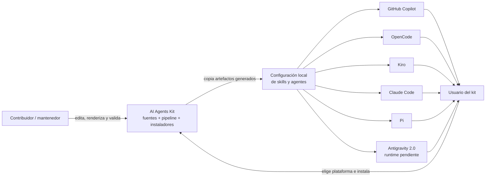

# 2. Contexto del sistema — C4 nivel 1

AI Agents Kit transforma fuentes compartidas y adapters declarativos en archivos
de agente/skill para herramientas host. El contribuidor mantiene el repo; el
usuario instala la salida en su entorno y opera desde el cliente correspondiente.
El sistema declara seis hosts en el manifiesto (`../canonical/manifest.json:22-29`).

## Actores y sistemas externos

| Elemento | Relación con el límite del kit |
|---|---|
| Contribuidor | Mantiene `canonical/`, `adapters/`, herramientas, scripts y documentación; ejecuta el pipeline. |
| Usuario del kit | Selecciona e instala uno o más destinos y luego invoca los agentes/skills en el host. |
| GitHub Copilot, OpenCode, Kiro, Claude Code, Pi y Antigravity | Sistemas externos destinatarios de artefactos instalados; runtime Antigravity pendiente de smoke. |
| Configuración local del usuario | Destino fuera del repo; puede contener elementos propios que el kit no debe borrar automáticamente. |

## Límites de confianza y responsabilidad

- El repositorio controla los archivos que genera; no controla el runtime,
  permisos de sesión ni el descubrimiento de agentes de cada host.
- Los instaladores actúan sobre el `HOME`/directorio de configuración del
  usuario. Backup, dry-run y preflight reducen el riesgo de sobrescritura
  incompleta, pero la configuración local continúa siendo externa al repo
  (`../docs/instalacion.md:53-60, 99-138`).
- Importar personalizaciones crea una copia de revisión; la promoción a las
  fuentes canónicas es manual (`../docs/instalacion.md:170-189`).

## Evidencia

- Propósito y plataformas: `../README.md:5-15`.
- Inventario de plataformas: `../canonical/manifest.json:24-30`.
- Separación entre repo y host: `../docs/instalacion.md:3-12`.
