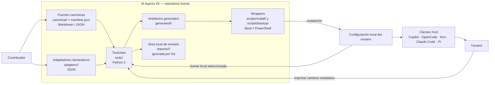

# 3. Contenedores — C4 nivel 2

Los contenedores son límites lógicos del pipeline; no son contenedores Docker ni
servicios desplegados. La arquitectura documentada es un flujo local de archivos
(`../docs/arquitectura-del-kit.md:7-32`).

## Responsabilidades y dependencias

| Contenedor | Responsabilidad | Depende de / produce |
|---|---|---|
| Fuentes canónicas | Inventario, prompts y referencias compartidos. | `canonical/manifest.json`, `canonical/skills/`, `canonical/agents/`. |
| Adaptadores | Nombres, frontmatter, sustituciones y variaciones de plataforma. | `adapters/<plataforma>/`; consumidos por renderer, validador e instalador preflight. |
| Toolchain | Render, validación, medición de contexto, preflight e importación. | Consume fuentes y adapters; escribe `generated/` o el área local `imports/` según la herramienta invocada. |
| Artefactos generados | Árbol por plataforma listo para instalación. | Producido por `tools/render.py`; no editar manualmente. |
| Wrappers de instalación/backup | Adaptan operaciones y rutas del host; coordinan preflight, copia y backups. | `scripts/install/`, `scripts/backup/`; utilizan herramientas Python comunes. |
| Configuración local | Skills y agentes instalados en el entorno de usuario. | Fuera del repo; consumida por el cliente host. |

El manifest declara los inventarios de skills, agentes y plataformas
(`../canonical/manifest.json:1-31`). El renderer combina el manifest, contenido
canónico y adapters para producir la salida por plataforma
(`../tools/render.py:74-116`).

## Datos persistentes

- Fuentes versionadas: `canonical/`, `adapters/`, `tools/`, `scripts/`, `docs/`.
- Salida del pipeline: `generated/`, derivable desde las fuentes.
- Contexto documental: `.navigator/` y `.architecture/`; no son entradas del
  renderer ni artefactos que se instalen en los hosts.
- Las carpetas raíz `copilot/` y `opencode/` son snapshots legados y no forman
  parte del flujo oficial (`../docs/desarrollo.md:15-17`).
- Datos de usuario: configuración en el directorio local del host; puede incluir
  personalizaciones.
- Importaciones para revisión: `imports/`, ignorada por Git por posible contenido
  local (`../.gitignore:21-23`; `../docs/instalacion.md:262-265`).

No se identifica base de datos ni almacenamiento remoto propio en este flujo.
