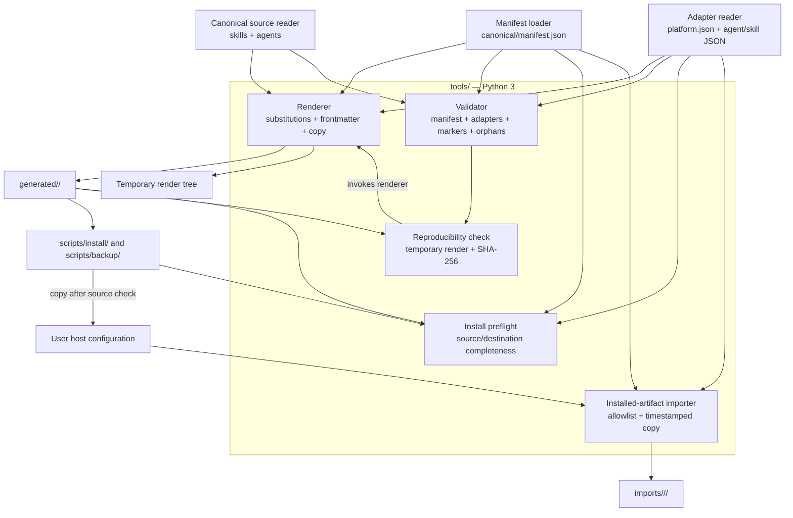

# 4. Componentes clave — C4 nivel 3

El contenedor central es la toolchain Python. Sus componentes implementan
contratos de inventario, transformación, consistencia y distribución.

## Responsabilidades

1. **Manifest loader:** el JSON enumera IDs de skills, agentes y plataformas;
   la validación exige listas válidas y sin duplicados
   (`../canonical/manifest.json:1-31`; `../tools/validate.py:45-56`).
2. **Canonical source reader / adapter reader:** carga contenido compartido y
   configuración por host. El renderer permite override de sustituciones de
   skill/agente y compone frontmatter de agente
   (`../tools/render.py:74-108`).
3. **Renderer:** sustituye tokens, copia el árbol de skill, escribe el
   `SKILL.md` transformado y emite el agente con nombre y frontmatter del adapter.
   Los nombres se validan para impedir rutas absolutas o traversal
    (`../tools/render.py:24-35, 82-108`).
4. **Validator:** comprueba manifest, adapters, archivos huérfanos, cobertura de
   tokens y restricciones por plataforma (`../tools/validate.py:45-197`).
5. **Reproducibility check:** renderiza en directorio temporal y compara hashes
   con `generated/`, sin reemplazar ese árbol durante la validación
   (`../tools/validate.py:200-216`).
6. **Install preflight:** verifica que la salida y el destino contengan el
   inventario esperado; informa de artefactos no declarados sin borrarlos
    (`../tools/install_preflight.py:74-96, 99-137`).
7. **Wrappers e importer:** los scripts resuelven rutas/opciones de host; el
   importer copia solo elementos declarados a una carpeta timestamped para
   revisión manual (`../tools/import_installed.py:16-55`).
8. **Support tools:** utilidades de contexto, enlaces e integridad; son auxiliares
   y no forman una capa runtime del kit (inventario visible en `../tools/`).

## Reglas de dependencia

- `canonical/manifest.json` es la lista de trabajo para renderer, validator,
  preflight e importer.
- `generated/` depende de `canonical/` + `adapters/` + renderer; nunca es fuente
  para reconstruir contenido canónico automáticamente.
- Los wrappers delegan las comprobaciones de contenido a la herramienta
  preflight compartida; no deben declarar éxito con contenido incompleto.
- El importer solo prepara material de revisión; un humano decide si promoverlo
  a `canonical/` o `adapters/` (`../docs/instalacion.md:184-189`).
