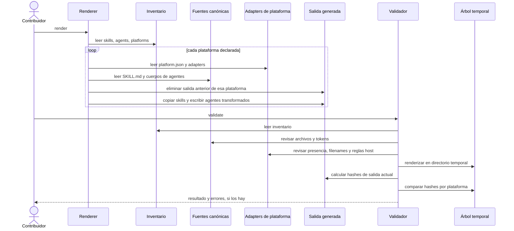
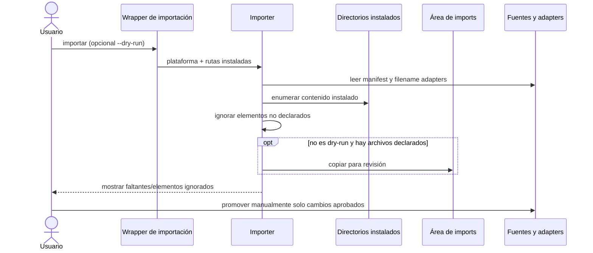

# 5. Flujos y secuencias

## 5.1 Render y validación de reproducibilidad

El render normal escribe en `generated/`. Para cada plataforma, el renderer
retira el subárbol de salida existente antes de copiar skills y emitir agentes;
este comportamiento es una fuente del riesgo registrado como `ARQ-001`
(`../tools/render.py:74-116`).



El validador ejecuta primero controles del manifest/adapters/tokens/orfandad y
solo si no hay errores compara la salida generada contra un render temporal
(`../tools/validate.py:219-245`). La comparación temporal protege `generated/`
durante la validación, pero no cambia el comportamiento destructivo del render
normal.

## 5.2 Instalación en un host

```mermaid
sequenceDiagram
  actor User as Usuario
  participant Installer as Instalador de plataforma
  participant Preflight as Preflight
  participant Generated as Salida generada
  participant Dest as Configuración del usuario
  participant Backup as Backup local

  User->>Installer: ejecutar instalación
  Installer->>Preflight: --check-source
  alt artefactos requeridos ausentes
    Preflight-->>Installer: error
    Installer-->>User: abortar antes de copiar
  else origen completo
    alt --dry-run
      Installer-->>User: listar operaciones; no copiar ni verificar destino
    else instalación normal
      opt destino con contenido y sin --force
        Installer->>Backup: copiar contenido previo, salvo --force
      end
      Installer->>Generated: leer skills/agentes generados
      Installer->>Dest: copiar archivos
      Installer->>Preflight: --check-installed
      alt destino incompleto
        Preflight-->>Installer: error; no declarar éxito
        Installer-->>User: informar instalación incompleta
      else destino verificado
        Installer-->>User: confirmar y recomendar reiniciar el host
      end
    end
  end
```

Las opciones dry-run, force, backup y preflight se describen en
`../docs/instalacion.md:53-60, 99-127`; el wrapper Copilot muestra el
orden concreto en `../scripts/install/copilot.sh:56-70, 90-101, 113-135`.

## 5.3 Importación de una instalación modificada

El flujo de backup/import lee directorios instalados, filtra por el manifest y
los adapters, y copia los elementos declarados a `imports/<plataforma>/<fecha>/`.
El resultado se revisa y promociona manualmente; no se escribe de vuelta en las
fuentes canónicas automáticamente (`../tools/import_installed.py:16-55`,
`../docs/instalacion.md:170-189`).


