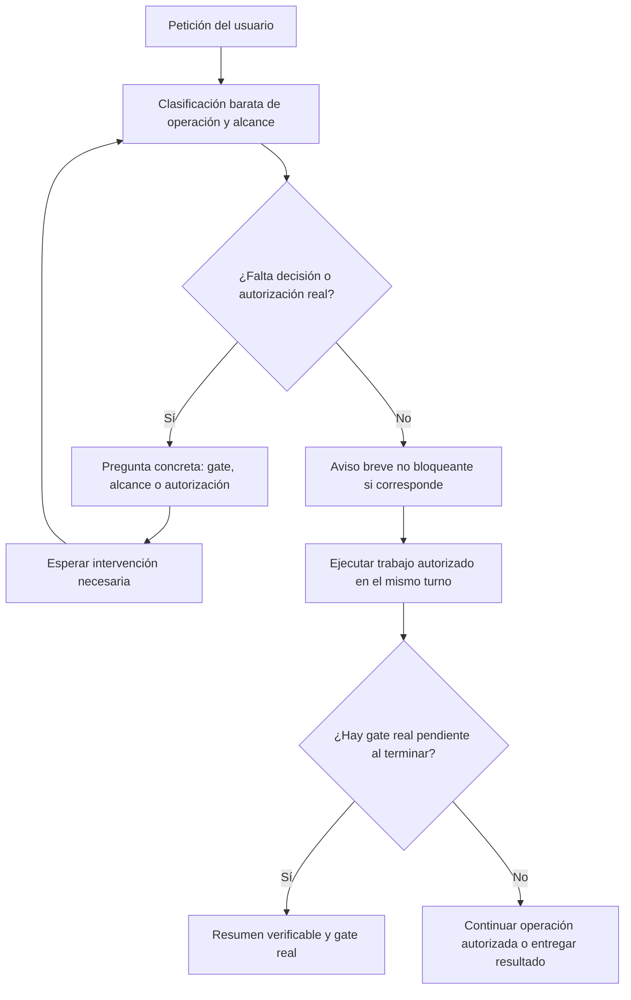

# Diseño — Avisos de modelo sin pausas redundantes

- Modo SDD: standard
- Fase: Design
- Estado: aprobado
- Gate aprobado: Gate 1 — usuario: «procede»
- Gate aprobado: Gate 2 — usuario: «procede» tras presentar Design
- Requisitos: `requirements.md` (R1–R5)
- Alcance de fuentes: `inventory.md`

## 1. Decisión y límites

Separar **comunicación informativa** de **decisión/autorización pendiente**.
El preflight se conserva como clasificación barata, pero deja de ser un gate
humano de modelo. Un aviso no agota el turno ni condiciona el uso de herramientas.

Se mantiene la arquitectura del kit: fuentes canónicas → adapters → renderer →
generated → instalación por host. No se modifica lógica de render, validación de
handoff, instaladores ni permisos. No se añade un nuevo documento global que cada
skill deba cargar: el contrato breve se mantiene en las fuentes que ya lo gobiernan.

### Invariantes (R1–R5)

1. Una recomendación/anuncio por sí solo nunca exige una respuesta para continuar.
2. Ningún aviso, nivel o `gate_state` acredita autorización de escritura.
3. Gates reales, decisiones esenciales y permisos vigentes permanecen intactos.
4. Una comunicación ya realizada para el mismo alcance no necesita confirmación
   para deduplicarse; autorización efectiva y comunicación son estados distintos.
5. Las cinco distribuciones se obtienen determinísticamente de fuentes y adapters.

## 2. Flujo conversacional (R1–R4)



«Mismo turno» no garantiza finalizar una operación arbitrariamente larga ni evita
límites técnicos: impide detenerse *exclusivamente* por el aviso. Una limitación
real debe informarse con su motivo, sin disfrazarla de recomendación de modelo.

## 3. Cambios en componentes

### Especialistas (R1, R2, R4)

- Sustituir secciones «Gate obligatorio de modelo» por preflight/aviso informativo
  en Architecture, Data, UI y Code Review. Permitir cargar la skill y realizar
  inspección proporcional después de clasificar, sin una reanudación del usuario.
- Ajustar los cinco `SKILL.md` y sus matrices `model-selection.md`: conservar
  niveles, motivos, riesgos y lectura selectiva; retirar columna `Hard stop` y
  mandatos de terminar turno/esperar. No reemplazar toda espera del documento.
- Deduplicar cuando el orquestador ya comunicó el nivel para el mismo alcance,
  no cuando el usuario «confirmó» el nivel. Mantener la selección de dominio.
- Conservar gates de propuestas, ruta directa/SDD, documentación y remediación.
  La autorización de una auditoría no habilita micro-correcciones de código.

### Documentation Orchestrator (R1, R2, R4)

- Renombrar Gate 0 de modelo como preflight informativo y «Flujo tras Gate 0» como
  «Flujo de ejecución», actualizando referencias/selector de test dependiente.
- `status` y `release-check` continúan con inspección e informe. Operaciones con
  escritura conservan el plan global y su aprobación antes de escribir.
- Recomendación global/especialista ya comunicada evita avisos duplicados sin
  introducir «nivel confirmado» como nuevo estado.
- Conservar espera por resultados de handoff, selección de una sola vía,
  decisiones pendientes y gestión de ramas bloqueadas. G4 de evidencia sigue
  siendo una validación técnica, no una pregunta humana adicional automática.
- No cambiar `requires_confirmation` ni parser de handoff: la autorización efectiva
  del mismo alcance ya puede reutilizarse según el contrato actual.

### SDD (R3, R4)

- Actualizar agente, skill, `model-selection.md` e `integrity-gate.md` juntos.
  Gate 0 deja de representar una pausa humana por modelo; conservar clasificación
  de profundidad, siguiente fase, riesgo e intención.
- Inicio de `direct`, `lite` y `standard`: aviso breve y operación, salvo decisión
  esencial pendiente. Quick Plan no añade aprobación de modelo ni Gates 1–3.
- Transición con gate: resumen y recomendación condicionada en el mismo mensaje;
  esperar únicamente Gate 1/2/3/4 según corresponda.
- Implementación → Verification: resumen/aviso breve y ejecución de la suite sin
  esperar «continúa». Integridad y evidencia preceden al Gate 4 de cierre.
- Cambio exclusivo de nivel: actualización no bloqueante. Reclasificación o
  alcance no autorizado: pregunta explícita por el cambio de flujo/alcance.
- Mantener aceptación de sustituciones retiradas, marcadores y rutas ambiguas,
  intención de solo planificación y políticas de pruebas/integridad.

### Navigator (R1, R2, R4)

- Actualizar agente, skill y `bootstrap.md`: recomendación antes del proceso
  pesado sin «responde continúa» ni pausa; conservar aviso final no bloqueante.
- Invocación orquestada deduplica por comunicación, no por reanudación.
- Conservar autorizaciones de creación/update/export, ubicación ambigua,
  restricciones de contenido y gate técnico post-bootstrap.

### Adapters, documentación y salida (R5)

- Cambiar exclusivamente el contenido de las descripciones del Orchestrator en
  OpenCode, Copilot, Claude y Pi que anuncian espera obligatoria. No añadir campos
  ni modificar permisos/schema; el adapter Kiro no necesita ese cambio.
- Actualizar documentos y smokes activos del inventario. Distinguir pausa por
  decisión de aviso no bloqueante; armonizar la contradicción en `docs/uso.md`.
- Conservar evidencias históricas como históricas; no migrar specs ni changelog.
- Renderizar los cinco hosts con el renderer existente, sin edición manual de
  generated ni instalación global. Revisar que la regeneración solo altere los
  artefactos derivados esperados.

## 4. Verificación y estrategia de pruebas

**TDD focalizado** para el contrato textual modificado (R1–R5). Baseline de tests
vigentes antes del cambio. Después, assertions nuevas deben fallar contra la
política bloqueante por la razón esperada; conservar comando, retorno y causa RED.
Aplicar el cambio mínimo correcto, renderizar y observar GREEN.

Cambios focalizados:

- `test_model_recommendations.py`: continuidad por agente/skill/referencia,
  comunicación sin confirmación, manualidad, deduplicación y paridad.
- `test_sdd_contract.py`: inicio/Quick Plan/pre-Verification sin pausa por modelo;
  Gates 1–4, reclasificación y planificación sola preservados.
- `test_code_review_contract.py`: eliminar dependencia de `Hard stop`; comprobar
  continuidad y conservación de autorización de remediación/micro-pasos.
- `test_handoff_contract.py`: adaptar selector del encabezado renombrado sin
  alterar pruebas semánticas de scopes, permisos, escritura o resultados.

Assertions positivas de continuidad + negativas de mandatos antiguos en secciones
de modelo. No prohibir globalmente palabras como «espera» o «confirmación»: siguen
siendo válidas para los controles reales. Verificar archivos individualmente para
que una regla correcta no oculte otra bloqueante al concatenar documentos.

Comandos desde raíz (los tests pueden crear fixtures temporales):

```bash
python3 -B tools/test_model_recommendations.py
python3 -B tools/test_sdd_contract.py
python3 -B tools/test_code_review_contract.py
python3 -B tools/test_handoff_contract.py
python3 -B tools/validate.py
```

Regeneración controlada tras cambios de fuentes:

```bash
python3 -B tools/render.py
```

Suite final: scripts `tools/test_integrity.py`, `test_links.py`,
`test_model_recommendations.py`, `test_sdd_contract.py`, `test_handoff_contract.py`,
`test_code_review_contract.py`, `test_validate.py`, `test_install.py` y
`test_mas_identity.py`, ejecutados individualmente con `python3 -B`.
Completar con `python3 -B tools/validate.py`, `python3 -B tools/check_links.py` y
`git diff --check`. No usar exclusivamente discovery: algunos tests tienen runner
propio. No regenerar antes del baseline para ocultar posibles derivas preexistentes.

**Límites:** tests textuales prueban instrucciones, no conducta de LLM. Tests de
handoff prueban el parser Python, no la autorización conversacional real. Smokes
actualizados documentarán los escenarios de Requirements; solo declarar ejecución
en host si se observó y registró. No automatizar una instalación global para
fabricar evidencia. PBT no aplica: no hay invariante algebraico nuevo ni se añade
dependencia de pruebas. Las pruebas existentes preservadas son regresión.

## 5. RNF y quality bar

- **Coherencia:** ausencia de mandatos activos de pausa exclusivamente por modelo
  en las fuentes identificadas; búsqueda dirigida con revisión semántica.
- **Seguridad:** diff de permisos sin cambios, controles Git/release intactos y
  suite semántica de handoff verde.
- **Reproducibilidad:** generated coincide con render de las cinco plataformas.
- **Contexto proporcional:** mantener carga selectiva y presupuestos actuales de
  prompts; no insertar infraestructura ni referencias obligatorias nuevas.

Quality bar: separación canonical/adapters/generated conservada; cambios de
contenido y tests, sin nueva UI, DI, persistencia, red, singletons ni manejo de
errores runtime. Esos puntos no requieren implementación nueva. No cambiar el
parser para solucionar una pausa de prompt ni relajar fallos por integridad.

## 6. Riesgos y preservación

Riesgo principal: quitar una espera legítima junto a un aviso de modelo. Mitigar
con cambios por sección y pruebas de salvaguardas. Otro riesgo: tests demasiado
literales; complementar con assertions por fuente, revisión y escenarios smoke.

Preservar los tres cambios locales ajenos registrados en `inventory.md`.
No editar docs canónicas de dominio como parte de este diseño. No commit/push,
release ni reinstalación. Tras eventual instalación, reiniciar el host para cargar
el contrato nuevo: esta sesión mantiene sus instrucciones ya cargadas.
