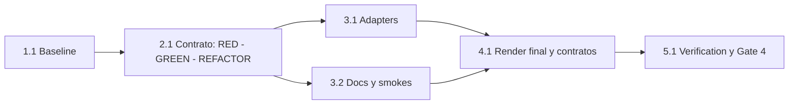

# Tareas — Avisos de modelo sin pausas redundantes

- Modo SDD: standard
- Fase: Verification
- Estado: verificado en fuentes y distribución; pendiente de Gate 4
- Gate aprobado: Gate 1 — usuario: «procede» tras Requirements
- Gate aprobado: Gate 2 — usuario: «procede» tras Design
- Gate aprobado: Gate 3 — usuario: «procede» tras Tasks
- Gate pendiente: Gate 4
- Intención: implementación
- Estrategia: TDD focalizado del contrato textual; regresión de salvaguardas

## Wave 1 — Baseline y preparación

- [x] 1.1 Registrar baseline contractual y de paridad sin regenerar primero
  (Req R4, R5).
  - Inspeccionar `git status --short` y diffs; preservar los tres cambios ajenos
    inventariados. No incluirlos en ninguna operación de escritura.
  - Ejecutar individualmente `python3 -B tools/test_model_recommendations.py`,
    `python3 -B tools/test_sdd_contract.py`,
    `python3 -B tools/test_code_review_contract.py`,
    `python3 -B tools/test_handoff_contract.py` y
    `python3 -B tools/validate.py`.
  - Registrar retornos y causas de fallos previos si los hay; no atribuirlos al ajuste.

## Wave 2 — Contrato no bloqueante (TDD focalizado integrado)

- [x] 2.1 Aplicar RED → GREEN mínimo correcto → REFACTOR solo si aporta valor
  al contrato compartido de continuidad, conservando decisiones/autorizaciones
  (Req R1, R2, R3, R4, R5).
  - **RED:** actualizar las assertions de `test_model_recommendations.py`,
    `test_sdd_contract.py` y `test_code_review_contract.py` para exigir continuidad
    en cada agente/skill/referencia afectado, deduplicación por comunicación y
    ausencia de pausas exclusivamente por modelo.
  - Conservar/complementar assertions de Gates 1–4, reclasificación, planificación
    sola, micro-pasos, autorización documental versus remediación y permisos host.
  - Ejecutar contra fuentes aún bloqueantes y registrar al menos un fallo por el
    mandato vigente que se elimina. Errores de selector o paridad no cuentan como
    RED del comportamiento.
  - **GREEN, especialistas:** actualizar agentes Architecture, Data, UI y Code
    Review; skills Architecture, Data, UI, Quality y Security; sus cinco matrices.
    Retirar hard stops y esperas por modelo, manteniendo niveles y carga selectiva.
  - **GREEN, SDD:** actualizar agente, skill, `model-selection.md` e
    `integrity-gate.md`; inicio y Quick Plan no bloqueantes, Verification continua,
    cambios de nivel no bloqueantes y gates reales intactos.
  - **GREEN, Orchestrator/Navigator:** actualizar agentes, skills, workflows y
    bootstrap; retirar reanudación por modelo y preservar autorizaciones,
    decisiones pendientes y resultados de handoff.
  - Adaptar en `test_handoff_contract.py` el selector de sección renombrada sin
    modificar parser, esquema ni pruebas semánticas de permisos/scopes.
  - Regenerar con `python3 -B tools/render.py` y ejecutar los cuatro tests
    focalizados para observar GREEN. El render solo reconstruye los derivados.
  - **REFACTOR:** únicamente legibilidad o duplicación real de assertions; no
    crear infraestructura global ni dependencias para este cambio de contenido.
  - Guardar comandos/resultados como evidencia de implementación. No declarar
    conducta real de un LLM a partir de estas pruebas textuales.

## Wave 3 — Descripciones y documentación activa

- [x] 3.1 [P] Actualizar descripciones bloqueantes de adapters sin cambiar campos
  ni permisos (Req R1, R4, R5).
  - Modificar solo descripciones de Documentation Orchestrator en OpenCode,
    Copilot, Claude y Pi. Kiro conserva su descripción no bloqueante.
  - Comprobar que `ask`/`deny` y capacidades quedan iguales.

- [x] 3.2 [P] Actualizar documentación y escenarios smoke del inventario
  (Req R1, R2, R3, R4, R5).
  - Armonizar docs de agentes, uso, visión, catálogo, arquitectura del kit,
    referencia README y los cinco documentos smoke afectados.
  - Explicar que el aviso informa y no detiene; la pausa identifica una decisión
    real. Conservar ejemplos de gates, escritura, remediación y Git/release.
  - Conservar evidencia histórica identificada como tal y specs antiguas intactas.
  - Documentar escenario como la captura, consultas puntuales/pesadas, modos
    de solo lectura, Quick Plan, transición a Verification y cambio de nivel.
  - No registrar smokes como ejecutados si no se observaron en un host.

## Wave 4 — Integración de implementación

- [x] 4.1 Regenerar la salida final de los cinco hosts y comprobar contratos
  focalizados tras adapters/docs (Req R4, R5).
  - Ejecutar `python3 -B tools/render.py` desde raíz; no editar generated a mano.
  - Repetir los cuatro tests focalizados y `python3 -B tools/validate.py`.
  - Revisar diff por fuentes/derivados y `git diff --check`; confirmar ausencia
    de modificaciones de permisos, parser, instaladores y cambios ajenos.
  - Marcar tareas completadas solo con artefactos y comandos observados.

## Wave 5 — Verification y cierre

- [x] 5.1 Ejecutar suite final, revisión de política y matriz de evidencia
  (Req R1, R2, R3, R4, R5).
  - Ejecutar individualmente con `python3 -B`: `tools/test_integrity.py`,
    `tools/test_links.py`, `tools/test_model_recommendations.py`,
    `tools/test_sdd_contract.py`, `tools/test_handoff_contract.py`,
    `tools/test_code_review_contract.py`, `tools/test_validate.py`,
    `tools/test_install.py` y `tools/test_mas_identity.py`.
  - Completar con `python3 -B tools/validate.py`,
    `python3 -B tools/check_links.py` y `git diff --check`.
  - Buscar y revisar semánticamente las pausas activas en fuentes/adapters/docs;
    separar coincidencias legítimas e históricas de mandatos redundantes.
  - Auditar RNF de Design: coherencia, seguridad, reproducibilidad y presupuesto
    de contexto; registrar resultado de cada uno, sin fabricar evidencias.
  - Crear `verification.md` con baseline, RED, GREEN, suite, matriz Req → tarea →
    check → evidencia y limitaciones de los smokes en hosts no ejecutados.
  - Revisar cada `[x]` frente a evidencia; presentar Gate 4 sin cerrar por cuenta
    propia. No commit, push, release ni instalación global.

## Grafo de waves

Las tareas `[P]` no comparten archivos. Wave 2 es un ciclo integrado porque los
scripts contractuales revisan varias fuentes y su distribución conjuntamente;
no se falsea GREEN por completar solo una familia mientras otra sigue bloqueante.

## Evidencia y excepciones

Ejecución de implementación registrada en `implementation-evidence.md`: baseline,
RED y GREEN observados, artefactos por tarea y límites. Verification ejecutada y
registrada en `verification.md`: suite completa, integridad, RNF y limitaciones.
Todas las tareas tienen evidencia; el cierre continúa pendiente de Gate 4.

- [omitido: PBT no aplica; sin invariante algebraico nuevo]
- Smokes conversacionales: escenarios documentados; ejecución real en hosts no
  autorizada ni observada aún. No bloquea las comprobaciones de contrato textual,
  pero limita la afirmación de comportamiento efectivo del LLM.
- Esta sesión conserva las instrucciones cargadas al inicio; actualizar fuentes no
  cambia retroactivamente sus gates ni sus pausas obligatorias. La nueva política
  se aplicará al cargar el kit actualizado, no por auto-reemplazo del prompt activo.
