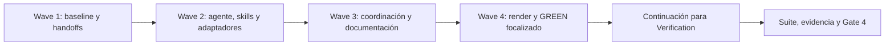

# Tareas — Consolidación de agentes en Code Review

Modo SDD: standard
Fase: Verification
Estado: cerrada con límites de evidencia aceptados
Gate 2: aprobado
Gate 3: aprobado por el usuario («procede»)
Gate 4: aprobado por el usuario («adel»)
Nivel recomendado para Tasks: BAJO

## Reglas de ejecución y evidencia

- No iniciar implementación hasta aprobar Gate 3.
- Cada tarea empieza como `[ ]`, pasa a en progreso al ejecutarse y solo queda
  `[x]` con artefactos y resultados verificables. Registrar comandos y resultados
  del ciclo RED/GREEN; no llamar TDD a una prueba añadida después del cambio.
- Tests textuales verifican contratos de prompts, no garantizan que un LLM los
  cumpla. Los smoke no ejecutados en host real se declaran pendientes.
- La aprobación de este plan cubre retirar los dos agentes y sus adaptadores del
  kit y regenerar `generated/`; no cubre borrar prompts en instalaciones personales.
- `[P]` indica independencia de archivos dentro de la misma wave, no obligación
  de delegar trabajo a otros agentes ni de ejecutar tareas simultáneamente.

## Wave 1 — Baseline y contrato de handoff

- [x] 1.1 Capturar baseline del contrato actual y estado del repositorio. Ejecutar
  las pruebas de handoff y recomendaciones de modelo antes de modificar sus
  contratos; registrar fallos previos si los hubiera. Confirmar los cuatro targets
  conservados y el catálogo actual. (Req 4.5, 6.3, 6.4)
- [x] 1.2 [TDD focalizado] Extender casos de emisión para `code-review` con calidad,
  seguridad y ambas: RED por target/scopes aún no admitidos → GREEN del mapa de
  targets y normalización mínima → REFACTOR solo por duplicación real. Incluir
  listas vacías, duplicados, tipos arbitrarios, campos desconocidos, targets
  retirados, scope ajeno y discrepancias de escritura. Conservar el formato escalar
  y casos existentes de los cuatro receptores restantes. (Req 1.1, 4.1–4.5)
- [x] 1.3 [TDD focalizado] Extender validación de resultados: RED para evidencia de
  uno/dos scopes → GREEN de pertenencia a raíces seleccionadas y cobertura de ambos
  dominios en una escritura conjunta → REFACTOR si aporta valor. Cubrir symlinks,
  traversal, evidencia fuera del scope, correlación, bootstrap ausente/bloqueado,
  archivos obligatorios e inspección sin simular actualización. (Req 4.2–4.5, 6.3)

## Wave 2 — Agente, skills y distribución canónica

- [x] 2.1 [TDD focalizado] Crear `tools/test_code_review_contract.py`: RED de catálogo
  y reglas esperadas → GREEN de `canonical/agents/code-review.md` y manifest →
  REFACTOR proporcional. Retirar los dos prompts de agente. Verificar selección
  por dominio/ID, revisión completa, límites puntuales, resumen conjunto, estándares
  y severidades independientes y exclusión de dominios no autorizados.
  (Req 1.1–1.4, 2.1–2.4, 5.1, 5.2, 6.1, 6.3)
- [x] 2.2 [TDD focalizado] Añadir contratos de flujo documental: RED para preguntas
  redundantes y escrituras en consultas → GREEN de ambas skills y referencias →
  REFACTOR de instrucciones contradictorias. Documentar findings verificados de
  todas las severidades, agrupar ocurrencias, preservar IDs/estados y autorización
  acotada; sin cachés/marcas en solo lectura. Cubrir excepciones de alcance y
  aprobación antes del primer/siguiente micro-paso, recomendación SDD y reauditoría
  antes de resolver. (Req 2.2, 2.3, 3.1–3.5, 5.2–5.5)
- [x] 2.3 [P] [TDD focalizado] Adaptar contratos de modelo separando agente y skill:
  RED de reutilización del preflight común → GREEN de matrices y prueba existente
  → REFACTOR si procede. Conservar las pausas actuales; el paso a la segunda skill
  no repite el aviso para el mismo alcance ya satisfecho.
  (Req 1.3, 2.1, 3.5, 6.3)
- [x] 2.4 [P] Crear los cinco adaptadores `code-review`, retirar los diez adaptadores
  de agentes anteriores y mantener sus herramientas/restricciones por plataforma.
  Conservar formato Copilot, visibilidad Claude, restricciones OpenCode/Kiro y
  `$ARGUMENTS` de Pi; habilitar carga selectiva de skills donde el host lo permita.
  Comprobar estructura y permisos con los contratos de distribución.
  (Req 1.1, 2.1, 6.1, 6.3)

## Wave 3 — Coordinación y documentación

- [x] 3.1 [TDD focalizado] Añadir casos de contrato de orquestación: RED de receptor
  y selección conjunta → GREEN del orquestador, workflows y handoff.md → REFACTOR
  mínimo. Mapear ambos dominios a `code-review`; combinar solo cuando acción,
  proyecto y vía coincidan. Conservar la alternativa ejecución local/handoff,
  autorización efectiva de sesión, `inspect` sin escritura y límites de
  `sync-existing`, `bootstrap-core`, `status` y `release-check`.
  (Req 3.3, 3.5, 4.1–4.5, 6.3)
- [x] 3.2 [P] Actualizar catálogo, README, guía de uso, fichas vigentes y referencias
  de otros especialistas para dirigir las revisiones a `code-review`, distinguiendo
  las skills que permanecen. Añadir guía de actualización de instalaciones con
  backup/retiro manual de prompts antiguos; no modificar instaladores para borrar
  archivos del usuario ni reescribir specs históricas cerradas.
  (Req 1.1, 2.1, 6.1, 6.2)
- [x] 3.3 [P] Documentar smoke de calidad, seguridad, ambas, consulta sin escritura,
  auditoría documental autorizada, handoffs y remediación; actualizar los smoke
  existentes afectados sin declarar ejecución manual no realizada.
  (Req 1.2–1.4, 2.3, 3.1–3.5, 4.1–4.5, 5.1–5.5, 6.3, 6.4)

## Wave 4 — Generación y preparación de Verification

- [x] 4.1 Regenerar las cinco plataformas con `python3 tools/render.py` y confirmar
  ocho agentes/diez skills, ausencia de agentes antiguos y paridad de contratos.
  Ejecutar los GREEN focalizados dependientes de artefactos generados. Registrar
  tareas/evidencia y presentar el preflight de Verification; no iniciar la suite
  de cierre hasta que el usuario reanude. (Req 1.1, 2.1, 6.1, 6.3, 6.4)

## Verification — después de la continuación del usuario

- [x] 5.1 Ejecutar suite final y checks: `tools/test_code_review_contract.py`,
  `tools/test_handoff_contract.py`, `tools/test_model_recommendations.py`,
  `tools/test_sdd_contract.py`, `tools/test_integrity.py`, `tools/test_validate.py`,
  `tools/test_install.py`, `tools/test_mas_identity.py`, `tools/test_links.py`,
  `tools/validate.py`, `tools/check_links.py` y `tools/measure_context.py`, mediante
  Python 3. Las pruebas de instalación usan fixtures, no el home real del usuario.
  Revisar diff y permisos; cualquier regresión se corrige y vuelve a verificarse.
  (Req 4.3–4.5, 6.1–6.4)
- [x] 5.2 Crear `verification.md` con trazabilidad de todos los requisitos, RNF-1–4,
  evidencia de artefactos, RED/baseline, GREEN, suite y límites de smoke manual.
  Auditar cada `[x]` y presentar Gate 4 con huecos explícitos si los hubiera.
  (Req 1.1–1.4, 2.1–2.4, 3.1–3.5, 4.1–4.5, 5.1–5.5, 6.1–6.4)
- [omitido: PBT no añade cobertura necesaria a la matriz cerrada de scopes/acciones;
  no se incorpora una dependencia nueva]

## Grafo de dependencias

## Gate actual

Verification automática terminada. Evidencia y límites en `verification.md`.
Gate 4 aprobado por el usuario («adel»). Spec cerrada; smoke conversacional
pendiente registrado como límite aceptado en `verification.md`.
