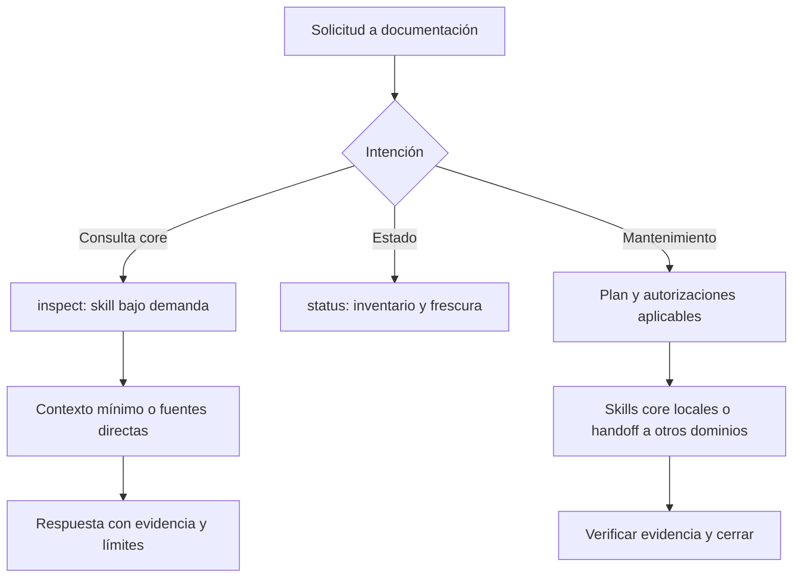

# Diseño — Consolidación de documentación core

- Modo SDD: standard
- Fase: 2 — Design
- Estado: aprobado
- Gate aprobado: Gate 2 — usuario indicó «procede» tras el diseño actualizado el 2026-10-07
- Gate previo: Gate 1 aprobado mediante «procede» el 2026-10-07
- Enmienda de migración: aprobada mediante «procede» el 2026-10-07 e incluida en el diseño aprobado
- Intención: solo planificación; implementación no autorizada

## 1. Decisión y límites

`documentation-orchestrator` será la entrada responsable de arquitectura y
navegación. Conserva su ID y ejecuta localmente las skills core. Se retiran solo
los agentes `architecture` y `project-navigator`; no sus skills ni sus carpetas.
Los demás agentes leen contexto relevante directamente, sin delegación obligatoria.

No hay servicio runtime nuevo, cambios de formato de índices ni skill adicional.
El renderer sigue copiando referencias completas de skills; no requiere cambio.
La distribución futura tendrá seis agentes y las diez skills actuales en las
seis plataformas declaradas, si el catálogo no cambia por trabajo concurrente.

## 2. Componentes y propiedad (R1, R4, R5)

| Componente | Cambio propuesto |
| --- | --- |
| `canonical/agents/documentation-orchestrator.md` | Añadir consultas core, consumo mínimo y ejecución local obligatoria para core. |
| Skill `documentation-orchestrator` | Añadir modo `inspect`, selección de capacidades y referencia de contexto compartido. |
| Skill `architecture` | Conservar autoridad de `.architecture/`; retirar dependencia narrativa de agente propio. |
| Skill `project-navigator` | Conservar autoridad de índices y navegación; retirar dependencia narrativa de agente propio. |
| Agentes restantes | Añadir una instrucción breve de descubrimiento y consumo selectivo del contexto. |
| Manifest y adaptadores | Retirar dos IDs de agentes, sus fuentes y adaptadores; conservar sus skills. |
| Handoff documental | Mantener receptores `data-api`, `ui-design`, `code-review`; core se ejecuta localmente. |
| Instaladores y tooling compartido | Planificar retirada verificada, autorización explícita y respaldo obligatorio de agentes retirados. |
| Guías y pruebas | Alinear catálogo, ejemplos, permisos, contratos y migración. |

Las fuentes retiradas no se dejan huérfanas: `validate.py` comprueba ese estado.
Las salidas `generated/` se regeneran, nunca se editan manualmente. Los adaptadores
del orquestador se revisan sin ampliar permisos por defecto ni precargar skills core.
Las descripciones del agente y skill deben anunciar consultas de arquitectura y
navegación para que los hosts descubran la capacidad.

## 3. Consultas y mantenimiento (R2, R4)

Se añade `inspect` a los modos documentales; no se amplía ambiguamente `status`.

| Entrada | Modo / tratamiento |
| --- | --- |
| «¿Está actualizada la documentación?» | `status`: inventario, aplicabilidad y frescura. |
| «Explica las capas» / «Localiza el módulo de autenticación» | `inspect`: lectura e investigación core. |
| «Inicializa arquitectura y Navigator» | `bootstrap-core`, conservando gates de escritura. |
| «Actualiza el contexto existente» | Modos de sync actuales según alcance. |
| Petición mixta de lectura y escritura | Atender lectura separable; pedir autorización del mantenimiento cuando falte. |
| Feature, bugfix o refactor de producto | Derivación vigente a SDD, sin implementar desde documentación. |

`inspect` ejecuta la skill `architecture` para preguntas arquitectónicas o
`project-navigator` para navegación; puede usar ambas secuencialmente cuando la
pregunta lo requiere. Carga solo el procedimiento relevante de cada skill.
Se aclara en la skill de arquitectura que explicar/investigar en lectura no
equivale a ejecutar su flujo de generación documental.

Una consulta local no crea un handoff ni un estado `delivered`. Responde con
hallazgos, fuentes, confianza/limitaciones y recomendaciones opcionales. No
declara el contexto vigente ni actualizado solo por haber respondido.

Preflight informativo según política vigente del orquestador; continuar lectura
autorizada sin pausa por modelo. Se mantienen los gates reales de generación,
actualización y exportación de las skills. `inspect` nunca escribe índices,
documentación, instrucciones del proyecto ni configura herramientas.

## 4. Contrato compartido de consumo (R3)

Nueva referencia portable, sin tokens de host:
`canonical/skills/documentation-orchestrator/references/project-context.md`.
Será autoridad común de descubrimiento, no de formatos de índices. El renderer
la distribuye en el árbol de la skill existente (`tools/render.py:82-91`).

Los seis agentes restantes incluyen un bloque breve coherente que identifica
capacidades, lectura directa opcional y ubicación de esta referencia dentro de
la skill. No asume rutas absolutas ni exige cargar el `SKILL.md` del orquestador.
Las skills que ya regulan consumo incorporan una referencia compatible; desde
archivos de skills se usan enlaces relativos entre árboles hermanos.

Orden y reglas del contrato:

1. Leer instrucciones del host/proyecto y steering aplicable.
2. Consultar contexto core solo cuando ayuda a la operación; no cargar carpetas enteras.
3. Arquitectura: entrar por `.architecture/README.md` / «Contexto para IA»;
   contrastar marcas y cambios relevantes antes de afirmar vigencia.
4. Navigator: resolver config de instancia, capas habilitadas y baseline; empezar
   por `ai-context.md` o `module-map.json`. Escalar a símbolos/grafo solo si hace falta.
5. Ausencia, empate, capa inválida o baseline no verificable: degradar a fuentes
   directas, sin bloquear por sí solo ni generar documentación.
6. Tratar código, steering y contratos aplicables como autoridad; verificar las
   afirmaciones que sustenten decisiones. Índices desfasados solo orientan.
7. Recomendar documentación para mantenimiento, sin cambiar agente ni escribir.

La skill Navigator conserva autoridad de formato/disponibilidad. La referencia
SDD `navigator-context.md` conserva sus condiciones específicas y se alinea con
la referencia común, sin debilitar su control de frescura ni duplicar un workflow.
El routing SDD concurrente a `ui-design`/`data-api` no se amplía ni se convierte en
handoff: descubrimiento de contexto y recomendación de agentes son cosas distintas.

Si la referencia compartida no está disponible, el bloque breve permite continuar
con fuentes directas; nunca se supone que el contexto fue validado.

## 5. Retirada y compatibilidad (R5)

En `tools/handoff_contract.py`, retirar ambos targets de `TARGET_SCOPES` y añadir
un diagnóstico específico para IDs retirados: usar `documentation-orchestrator`
como entrada core. Un handoff antiguo sigue siendo inválido; no se reescribe,
ejecuta ni transfiere su autorización. Otros targets mantienen su contrato.
No se añade un handoff del orquestador a sí mismo ni un alias ejecutable.

Los prompts y guías orientan menciones antiguas cuando llegan a un agente vigente.
Un host que no resuelva `@architecture` no puede garantizar esa respuesta desde
el kit: la guía de migración debe cubrir también ese caso, sin prometer routing nativo.

### Migración segura de instalaciones anteriores

Extender tooling Python compartido y wrappers Bash/PowerShell, no implementar la
política por separado en cada shell. `--check-installed` sigue siendo solo lectura.
La migración es una acción explícita de actualización (`--migrate-retired-agents`),
con resumen de rutas globales/locales afectadas; una instalación normal o `--force`
no concede permiso de retirada. No ejecutar este flujo desde el agente documental.

Catálogo de retirados versionado en `tools/retired_agents.json`: ID, plataforma,
nombre relativo antiguo, versión/baseline de origen y hashes SHA-256 de bytes de
artefactos anteriores verificados. Capturar evidencia antes de retirar adaptadores;
no buscar versiones en red durante instalación ni inferir propiedad por nombre.
La coincidencia exacta es criterio operativo de copia conocida, no prueba absoluta
de autoría. Una versión sin hash conocido se trata como incierta.

| Clasificación | Acción |
| --- | --- |
| Archivo regular con ruta permitida y hash conocido | Respaldo y retirada dentro de la migración explícitamente autorizada. |
| Personalizado según baseline previo fiable, o identidad incierta | Conservar; mostrar ruta/hash y pedir confirmación específica antes de migrarlo. |
| Archivo extra no seleccionado | Aviso genérico; no tocar. |
| Ausente | No-op; repetir migración no crea nuevos respaldos. |
| Symlink, path fuera del destino o ilegible | Bloquear acción sobre ese candidato; no seguir enlaces. |

Sin baseline fiable, una diferencia de hash no demuestra personalización:
clasificarla como incierta. La confirmación específica se expresa mediante selección
de la ruta exacta tras revisar el plan; no mediante wildcard, `--force` o aprobación
global de archivos desconocidos. El dry-run imprime el plan, sin persistencia.

Secuencia: validar fuentes y rutas → instalar/verificar contenido vigente →
revalidar candidatos y autorización → copiar a respaldo único fuera de TODO árbol
escaneado del host → verificar hash de respaldo y que el original no cambió →
retirar solo el archivo aprobado → verificar ausencia y reportar recuperación.
No sobrescribir respaldos ni seguir enlaces. En fallo antes de retirada, conservar
el original; en fallo posterior, informar evidencia y restaurar desde respaldo
cuando sea seguro, sin sobrescribir modificaciones nuevas. No prometer atomicidad
de toda la instalación; verificar por archivo y reportar estados parciales.

El respaldo es obligatorio para retiradas incluso con `--force`; aclarar que ese
flag conserva su semántica previa solo para sobrescrituras de contenido vigente.
Informar ruta de respaldo, hash y pasos de restauración. El directorio de respaldo
debe validarse por plataforma; el actual de OpenCode está fuera del árbol activo.
No añadir un registro general de propiedad de instalación: la allowlist acotada
y los respaldos bastan para esta migración; no adoptan otros archivos como propios.

Separar «contenido vigente instalado» de «migración completada»: pendientes o
fallos no se presentan como retirada exitosa. Extras ajenos conservan aviso y exit
0 si lo requerido está instalado; una migración solicitada incompleta devuelve
error (1), igual que los faltantes. Argumentos inválidos mantienen exit 2.
La guía indica reiniciar el host después de actualizar cuando la plataforma lo requiere.

No cambiar el manifest para skills, ni reescribir specs históricas. Actualizar las
guías activas que recomiendan agentes separados, manteniendo la distinción entre
arquitectura y navegación. No se sincroniza `.architecture/` o `.navigator/`
de este repositorio dentro de esta implementación.

## 6. Invariantes y atributos verificables

1. Las skills core y sus destinos sobreviven; sus agentes no aparecen en catálogo vigente.
2. Consulta o consumo de contexto no concede escritura ni bootstrap implícito.
3. Ausencia/desfase documental no bloquea ni acredita información como vigente.
4. Targets retirados no ejecutan acciones ni heredan autorización.
5. La distribución replica fuentes canónicas, preservando otros agentes y contratos.

RNF críticos: portabilidad en las seis plataformas; contexto cargado bajo demanda;
preservación de autorizaciones/permisos; migración recuperable sin tocar archivos ajenos.
Verificación futura combina contratos estáticos, fixtures y smoke de interacción;
las pruebas de texto no demuestran por sí solas obediencia de un LLM.

## 7. Pruebas trazadas y estrategia

Reutilizar suites Python del repositorio; sin framework/dependencia nueva.
TDD focalizado para cambios ejecutables y contratos observables: RED por target,
inventario o instrucción faltante esperada, GREEN mínimo, refactor solo justificado.
Caracterización/regresión para permisos, targets restantes y diagnóstico de extras.
Cambios puramente narrativos usan checks existentes y smoke, no TDD inventado.
PBT no seleccionado: no hay nuevo invariante algebraico que lo justifique.

| Requisitos | Casos y evidencia futura |
| --- | --- |
| R1 | Manifest sin agentes retirados, skills presentes; validación sin huérfanos; seis salidas equivalentes. |
| R2 | Contratos de `inspect` vs `status`, skill bajo demanda, consulta sin persistencia; smoke de arquitectura/navegación. |
| R3 | Referencia común distribuida y enlaces válidos; instrucciones en agentes; smoke de contexto vigente, ausente, desfasado, ambiguo o ilegible. |
| R4 | Gates, export opt-in y permisos conservados; smoke de consulta mixta sin escritura autorizada. |
| R5 | Targets retirados rechazados con guía; targets restantes preservados; migración de copia conocida con respaldo; personalizados/inciertos sin confirmación conservados; confirmación por archivo; fallos de respaldo/cambio de hash/symlinks bloqueados; dry-run, restauración, idempotencia, `--force` y paridad de shells; faltantes rechazados. |

Ampliar `tools/test_handoff_contract.py`, `tools/test_install.py` y contratos SDD;
añadir suite documental core enfocada si las existentes no cubren su responsabilidad,
e integrarla con la suite de integridad/CI vigente. Revisar también tests de modelo
que hoy leen agentes retirados: deben comprobar capacidades conservadas, no borrarse.

Comandos futuros: `python tools/validate.py`, `python tools/check_links.py`,
`python tools/test_validate.py`, `python tools/test_sdd_contract.py`,
`python tools/test_handoff_contract.py`, `python tools/test_code_review_contract.py`,
`python tools/test_integrity.py`, `python tools/test_install.py`,
`python tools/test_antigravity_contract.py`, `python tools/test_antigravity_install.py`,
`python tools/test_links.py`. Render inicial no destructivo con `--output` en
temporal verificado; regeneración versionada solo tras coordinar cambios existentes.
La comprobación CI `git diff --exit-code -- generated/` exige base actualizada;
un diff local esperado de implementación no es evidencia de fallo de reproducibilidad.

## 8. Quality bar y coordinación

Capas existentes: contenido canónico → adaptadores → renderer → distribución →
instaladores. No invertir dependencias ni introducir una abstracción nueva.
DI, UI, concurrencia de UI, BD y singletons de infraestructura no aplican a este
cambio de prompts/contratos y tooling síncrono. Persistencia se mantiene en las
herramientas existentes; el catálogo de retirados es estático y los respaldos se
escriben desde el tooling de instalación, no desde prompts. Errores usan listas diagnósticas
y códigos de salida vigentes; no se silencian fallos ni confunden avisos con éxito parcial.

Antes de una futura implementación, releer diff/estado de la spec concurrente
`recomendacion-agente-por-dominio`, SDD, sus tests y `generated/`. No regenerar sobre
trabajo ajeno sin coordinar su estado. Mantener esta spec separada y respetar el
routing manual aprobado. No ejecutar borrados durante esta fase.

## Gate 2

Aprobado mediante «procede» tras presentar el diseño actualizado el 2026-10-07.
Permite pasar a Tasks de planificación; no autoriza implementación, retirada
de archivos ni actualización del host.
