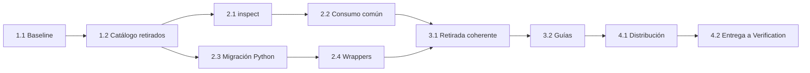

# Tareas — Consolidación de documentación core

- Modo SDD: standard
- Fase: Implementación
- Estado: cerrada tras Verification y Gate 4 el 2026-10-07
- Gate aprobado: Gate 3 — usuario indicó «procede» el 2026-10-07
- Gate previo: Gate 2 aprobado mediante «procede» el 2026-10-07
- Intención: implementación del kit; autorizada por «procede» tras pregunta explícita de implementación el 2026-10-07
- Alcance: `consolidacion-documentacion-core`

## Reglas de ejecución futura

La planificación no ejecutó estas tareas. Tras aprobar Gate 3, el usuario autorizó
implementar en respuesta a una pregunta explícita. Instalar/migrar archivos del host
es otra operación y no queda autorizada por implementar el kit.

Antes de `[x]`, comprobar artefactos, trazabilidad y evidencia según integrity-gate.
Guardar comando, resultado y razón del RED/baseline; nunca afirmar TDD por un test
escrito después. GREEN mínimo correcto; REFACTOR solo con motivo demostrado.
No modificar cambios ajenos ni specs históricas; no editar `generated/` manualmente.
No hay PBT previsto: no existe nuevo invariante algebraico que lo justifique.

## Wave 1 — Preparación y evidencia de versiones anteriores

- [x] **1.1 Coordinar baseline y superficies compartidas.** Releer estado/diff de
  SDD, sus tests, guías y distribuciones; comprobar el estado de la spec concurrente
  `recomendacion-agente-por-dominio`. Registrar qué cambios se preservan y resolver
  conflictos antes de regenerar. Capturar baseline de catálogo, permisos y targets
  vigentes con caracterización en un entorno aislado, sin congelar como deseados
  los agentes a retirar. Si el baseline falla, distinguir fallos previos del cambio.
  (Req R1.1–R1.2, R4.4, R5.1, R5.4)
  - Evidencia: lista de superficies y resultados baseline; ninguna escritura en el host.
  - Baseline observado: `python3 -B tools/test_handoff_contract.py` (33 tests),
    `python3 -B tools/test_sdd_contract.py` (444 checks) y
    `python3 -B tools/test_install.py` (148 checks), todos verdes antes del cambio.
    Spec concurrente ahora en Verification con smoke pendiente/fallido; se preservan
    su routing, agentes/skill SDD, referencia agent-routing y artefactos generados.

- [x] **1.2 Capturar y validar catálogo de agentes retirados.** Antes de retirar
  fuentes/adaptadores, identificar versiones anteriores verificables y artefactos
  generados por plataforma; conservar ID, nombre relativo, origen y hash de bytes
  en `tools/retired_agents.json`. Versiones no verificables quedan fuera de la
  allowlist, no se inventan hashes ni se confía en snapshots locales por nombre.
  TDD focalizado: RED de catálogo inválido/ruta insegura o entrada requerida ausente
  → GREEN de validación mínima y catálogo real → REFACTOR justificado.
  (Req R5.1, R5.3, R5.5, R5.8)
  - Evidencia: catálogo trazable a fuentes previas, tests de hashes/rutas/plataformas.

## Wave 2 — Capacidades y migración (ramas independientes)

- [x] **2.1 [P] Incorporar `inspect` y ejecución core local.** Ajustar agente,
  descripciones/adaptadores y skill `documentation-orchestrator`, sus workflows y
  skills core: separar consulta arquitectónica/navegación del mantenimiento;
  preservar `status`, gates, permisos y carga bajo demanda. TDD focalizado de
  contratos: RED de modo/selección y prohibición de persistencia faltantes → GREEN
  de instrucciones mínimas → REFACTOR justificado. Caracterizar permisos/gates.
  Smoke futuro: consulta core no genera handoff ni acredita sincronización.
  (Req R1.3, R2.1–R2.4, R4.1–R4.3)
  - Evidencia: contratos automatizados, revisión de permisos y guía smoke.

- [x] **2.2 Incorporar consumo compartido en agentes y skills.** Crear
  `documentation-orchestrator/references/project-context.md` y bloques breves de
  descubrimiento en agentes restantes. Alinear consumidores existentes, incluida
  referencia SDD Navigator, sin ampliar su routing manual a especialistas.
  Depende de 2.1 para fijar la entrada documental. TDD focalizado de contratos:
  RED de referencia/instrucciones faltantes → GREEN de consumo mínimo, frescura y
  degradación → REFACTOR solo por duplicación real. Smoke de contexto ausente,
  desfasado, ambiguo, ilegible y vigente; no escribir índices.
  (Req R3.1–R3.4, R4.4)
  - Evidencia: referencia portable, enlaces resolubles y escenarios documentados.

- [x] **2.3 [P] Implementar migración Python compartida.** Usar catálogo de 1.2
  para planificar/clasificar candidatos; exigir opt-in de migración y selección
  exacta adicional para personalizados/inciertos. Rechazar symlinks y escapes;
  respaldar fuera de árboles activos, verificar copia/original antes de retirar;
  informar fallos y recuperación sin sobrescribir modificaciones nuevas.
  Mantener `--check-installed` solo lectura y distinguir instalación/migración.
  TDD focalizado: RED por clasificación, autorización, respaldo, dry-run y fallo
  relevantes → GREEN por comportamiento → REFACTOR justificado. Incluir fixtures
  de cambio entre inspección/retirada, copia fallida, respaldo inválido y reintento.
  (Req R5.3, R5.5–R5.8)
  - Evidencia: tests con destinos temporales; ningún archivo real del usuario tocado.

- [x] **2.4 Integrar wrappers de instalación.** Tras 2.3, añadir opciones de
  migración/confirmación específica y dry-run a instaladores de las plataformas
  soportadas, incluidos Bash/PowerShell donde existan; invocar política Python
  única después de verificar contenido vigente. `--force` no elimina respaldo de
  retirada ni autoriza desconocidos. TDD focalizado: RED de flags/orden/exit codes
  y efectos previstos → GREEN de wrappers → REFACTOR justificado; regresión de
  instalación normal y paridad de shells. No ejecutar instaladores sobre HOME real.
  (Req R5.1, R5.3, R5.5–R5.8)
  - Evidencia: integración de wrappers en destinos aislados y sintaxis shell válida.

## Wave 3 — Retirada coherente y guías

- [x] **3.1 Retirar agentes del catálogo y contratos.** Después de capturar 1.2
  y completar Wave 2, retirar dos IDs del manifest, fuentes de agente y adaptadores;
  conservar skills. Actualizar handoff, diagnósticos de IDs retirados, tests de
  modelo/identidad y mappings que dependan de agentes anteriores. TDD focalizado:
  RED de inventario/targets retirados → GREEN de retirada y diagnóstico → REFACTOR
  justificado. Regresión de targets restantes, evidencia y scopes. No cambiar
  históricos ni convertir handoffs antiguos en autorizaciones nuevas.
  (Req R1.1–R1.3, R4.4, R5.1–R5.2, R5.4)
  - Evidencia: catálogo sin huérfanos, skills presentes, targets vigentes preservados.

- [x] **3.2 Actualizar guías activas y recuperación.** Tras 3.1, actualizar
  catálogo, selección de agentes, ejemplos y smoke: documentación es entrada core;
  explicar `inspect` y consumo directo; migración explícita, pendientes, respaldos,
  restauración segura y reinicio de host. Corregir recomendaciones activas de no
  consolidar agentes, manteniendo la separación conceptual de sus skills.
  Cambios narrativos: checks de enlaces y coherencia; no declarar TDD de prosa.
  (Req R1.1–R1.3, R2.1–R2.4, R3.1–R3.4, R4.1–R4.4, R5.1–R5.8)
  - Evidencia: instrucciones que permiten revisar plan y restaurar sin perder personalizaciones.

## Wave 4 — Distribución y evidencia de implementación

- [x] **4.1 Integrar suites y regenerar distribuciones.** Con las waves anteriores
  terminadas, conectar contratos core/migración a integridad y CI; revisar primero
  output temporal del renderer. Comparar referencias, agentes y skills por plataforma;
  coordinar cambios existentes antes de regenerar `generated/` versionado.
  Ejecutar suites focalizadas como GREEN de implementación y checks de render/enlaces,
  preservando los cambios de otras specs. No atribuir a esta spec su verificación.
  (Req R1.1–R1.3, R3.1, R4.4, R5.1)
  - Evidencia: salidas generadas reproducibles, referencias iguales y permisos conservados.

- [x] **4.2 Preparar entrega a Verification.** Relacionar artefactos y pruebas con
  todos los criterios; registrar RED/baseline, GREEN, excepciones y limitaciones de
  pruebas estáticas. Inventariar pendientes de smoke nativo, Windows/macOS o shells
  no disponibles, sin declararlos aprobados. Tras implementación, mostrar preflight
  de Verification y pausar hasta continuación del usuario; no crear un gate extra.
  (Req R1.1–R5.8, según matriz inferior)
  - Evidencia: resumen verificable de implementación; aún no cierre de la spec.

## Grafo de dependencias

`[P]` marca ramas con archivos propios. Dentro de cada rama, ejecutar secuencialmente.
Cada wave espera a la anterior; el grafo detalla dependencias internas.

## Cobertura de criterios

| Criterios | Tareas principales |
| --- | --- |
| R1.1–R1.3 | 2.1, 3.1, 3.2, 4.1 |
| R2.1–R2.4 | 2.1, 3.2 |
| R3.1–R3.4 | 2.2, 3.2, 4.1 |
| R4.1–R4.3 | 2.1, 3.2 |
| R4.4 | 1.1, 2.2, 3.1, 4.1 |
| R5.1 | 1.1, 1.2, 2.4, 3.1, 3.2, 4.1 |
| R5.2 | 3.1, 3.2 |
| R5.3 | 1.2, 2.3, 2.4, 3.2 |
| R5.4 | 1.1, 3.1, 3.2 |
| R5.5–R5.8 | 1.2, 2.3, 2.4, 3.2 |

## Evidencia de implementación — 2026-10-07

Estos resultados son GREEN/checks de implementación, no la Fase 4 ni smoke LLM.

| Tarea | Artefactos y evidencia observada |
| --- | --- |
| 1.1 | Baseline 33 tests handoff, 444 checks SDD y 148 checks instalación; cambios concurrentes preservados. |
| 1.2 | `tools/retired_agents.json`; 12 entradas de artefactos/adaptadores del commit `d206ae811b14c44699c7040bdb59742eac1f122d`, contrastadas con `git show` por tests. |
| 2.1 | Agente/skill/workflows documentales y skills core; RED contractual previo: 22 fallos/subcasos; GREEN `tools/test_documentation_core.py`. |
| 2.2 | `references/project-context.md`, bloques en seis agentes y `sdd-spec/references/navigator-context.md`; contratos y enlaces pasan. |
| 2.3 | `tools/retired_agents.py`, `tools/install_preflight.py`; RED de módulo/flags antes del GREEN; suite `tools/test_retired_agents.py`: 26/26. |
| 2.4 | Doce wrappers Bash/PowerShell; wrappers Bash ejecutados con HOME temporal, sintaxis Bash correcta; paridad PowerShell estática. `tools/test_install.py`: 196/196. |
| 3.1 | Manifest 10 skills/6 agentes; fuentes y 12 adaptadores retirados; `tools/handoff_contract.py` y sus tests. RED inventario y target antes de retirarlos; GREEN handoff 34/34. |
| 3.2 | README, guías de agentes, `docs/migracion-agentes.md` y escenarios smoke; check de enlaces: 71 archivos correctos. |
| 4.1 | Render temporal previo y `python3 -B tools/render.py`; RED de inventario generado (8 != 6 en seis plataformas), GREEN core 12/12 y `tools/validate.py`; CI integra suites core/migración, historial pinned y suite integridad integra core. |
| 4.2 | Esta evidencia y pendientes inferiores; preparación completa, no ejecución de Verification. |

Comandos GREEN observados después de integración:

- `python3 -B tools/test_documentation_core.py`: 12 tests, exit 0.
- `python3 -B tools/test_retired_agents.py`: 26 tests, exit 0.
- `python3 -B tools/test_install.py`: 196 checks, exit 0 (destinos temporales).
- `python3 -B tools/test_handoff_contract.py`: 34 tests, exit 0.
- `python3 -B tools/test_sdd_contract.py`: 465 checks, exit 0; incluye cambios
  concurrentes del routing/R01, cuyo comportamiento runtime no se acredita aquí.
- `python3 -B tools/test_model_recommendations.py`: 437 checks, exit 0.
- `python3 -B tools/validate.py`: 10 skills/6 agentes/seis plataformas, exit 0.
- `python3 -B tools/check_links.py` y `git diff --check`: exit 0.

Revisión adicional encontró y corrigió validación tardía de destinos de skills,
backup que era archivo y quoting de aprobación. Regresiones añadidas antes de
corregir: 38 fallos/subcasos y un error; después GREEN. Los tests cubren 42 escenarios
de wrappers de validación previa sin escritura exterior y hints POSIX con quoting.

Personalizados/inciertos exigen ruta exacta y SHA-256 revisado por pares repetibles;
los hints muestran una invocación Python portable. El respaldo es obligatorio aun
con `--force`. El catálogo contempla un baseline conocido: versiones no catalogadas
son inciertas, no se infiere procedencia. No hay atomicidad global ni garantía de
comparación+unlink atómicos; hay revalidación y recuperación sin overwrite.

## Verification pendiente

No se ha ejecutado la Fase 4. Permanecen pendientes la suite global y spot-check de
RNF, smoke conversacional en host real y migración/recuperación nativas Windows/
PowerShell (`pwsh` no disponible). Los tests de texto no prueban obediencia LLM y la
paridad estática no acredita comportamiento Windows. Escenarios están en guías.
No se instaló el kit en el perfil real, no se limpiaron agentes del usuario ni se
hicieron commit/push/release. No se alteraron `.architecture/` ni `.navigator/`.

## Verification futura

Tras reanudación posterior a implementación: integrity-gate de cada `[x]`, suite
completa descrita en `design.md`, smoke core y migración con fixtures, spot-check
quality-bar y los cuatro RNF del diseño. Crear `verification.md` con evidencia por
criterio y limitaciones reales. Tests textuales no prueban obediencia del LLM.
No confundir código implementado con migración de instalaciones reales completada.
Cierre mediante Gate 4 solo después de Verification.

## Gate 3

Aprobado mediante «procede» el 2026-10-07. Posteriormente el usuario respondió
«procede» a la pregunta explícita de implementar el kit. No incluye actualizar ni
limpiar la instalación local, commit, push o release.
