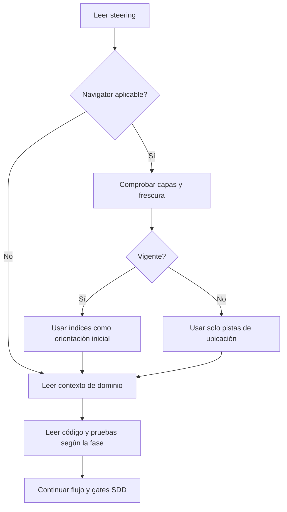
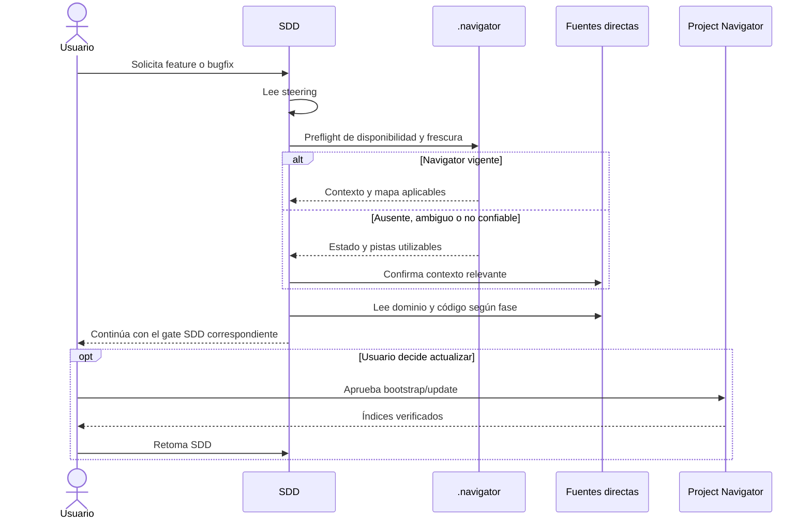

# Diseño — Integración SDD con Project Navigator

## 1. Resumen

La integración será **por artefactos**, no por invocación obligatoria entre
agentes. SDD consultará `.navigator/` como una capa auxiliar de orientación y
mantendrá su autonomía cuando Navigator no exista o no sea confiable.

La skill `sdd-spec` incorporará un contrato breve y autocontenido para:

1. resolver una instancia aplicable;
2. comprobar capas y frescura;
3. decidir cuánto confiar en ella;
4. ordenar las fuentes posteriores;
5. degradar sin bloquear ni escribir `.navigator/`.

Project Navigator conservará la autoridad sobre bootstrap/update y sobre la
estructura de sus índices. SDD no cargará ni invocará obligatoriamente su skill,
lo que evita depender de capacidades distintas entre plataformas.

## 2. Orden de fuentes

SDD aplicará este orden en cada fase que necesite contexto nuevo:

1. **Steering** de la plataforma y `.sdd/steering/`.
2. **Preflight de Navigator**: instancia, configuración, capas y frescura.
3. **Navigator mínimo**: solo `ai-context.md` y/o `module-map.json` necesarios.
4. **README canónico del dominio** aplicable.
5. **Documentación adicional** estrictamente necesaria.
6. **Código y pruebas puntuales**.

Si Navigator está desfasado o no es verificable, el paso 3 solo produce pistas de
ubicación. Toda afirmación relevante se confirma desde los pasos 4–6.

El código puntual será:

- condicional durante requisitos, cuando haga falta conocer comportamiento actual;
- obligatorio durante diseño para decisiones sobre implementación existente;
- obligatorio durante implementación y verificación para artefactos y evidencia.

## 3. Resolución y disponibilidad

El preflight seguirá una versión acotada del contrato de Project Navigator:

- localizar candidatos con nombre exacto `.navigator/config.yaml` desde la raíz
  del repositorio y subproyectos conocidos;
- seleccionar la instancia única o el alcance más específico que contenga el path
  de la solicitud;
- si varias instancias empatan, clasificar como `ambiguo` y no adivinar;
- resolver todos los índices junto al `config.yaml` seleccionado;
- considerar disponible una capa solo si está habilitada, existe y es legible;
- no leer capas deshabilitadas ni inventar índices ausentes.

SDD no necesita `symbols.json` ni grafo para funcionar. Puede utilizarlos como
pistas si la pregunta lo requiere y están disponibles, pero las capas 0–1 son el
camino normal.

## 4. Estados de confianza

| Estado | Criterio | Uso por SDD |
|---|---|---|
| `vigente` | Baseline común verificable y sin cambios relevantes posteriores o locales | Orientación inicial confiable; confirmar código según la fase |
| `desfasado` | Existen cambios relevantes posteriores al baseline | Solo rutas/candidatos; confirmar afirmaciones en fuentes directas |
| `no_verificable` | Faltan marcas, Git no permite contraste o los baselines no coinciden | Igual que desfasado; no afirmar vigencia |
| `ambiguo` | No puede resolverse una única instancia aplicable | Omitir Navigator y continuar; preguntar solo si el usuario exige usarlo |
| `ausente` | No hay instancia aplicable | Continuar con documentación y código directo |

Para declarar `vigente`:

- los artefactos consumidos que admitan baseline deben representar el mismo
  `source_commit` verificable;
- se contrastarán cambios posteriores y cambios locales relevantes al alcance;
- `generated_at` será únicamente informativo;
- ante relevancia incierta, no se elevará la confianza artificialmente.

El alcance relevante incluye el módulo o rutas objeto de la spec, sus contratos y
manifiestos estructurales aplicables. Una modificación ajena no vuelve obsoleto el
índice por sí sola; si no puede separarse con seguridad, el estado será
`no_verificable`.

## 5. Degradación y comunicación

El preflight no será un gate adicional de SDD. Si falla:

- SDD continuará con su lectura selectiva actual;
- comunicará una línea breve con estado, fuentes usadas y limitación relevante;
- podrá recomendar `Project Navigator bootstrap` o `update`;
- no escribirá `.navigator/` ni cambiará de agente automáticamente;
- si el usuario acepta una actualización, se aplicarán fuera del flujo SDD los
  avisos, permisos y gates propios de Project Navigator, y después se retomará SDD.

## 6. Cambios canónicos

1. `canonical/agents/sdd.md`
   - declarar el preflight opcional y que no sustituye fuentes directas;
   - mantener el texto corto, delegando el procedimiento a la skill.
2. `canonical/skills/sdd-spec/SKILL.md`
   - integrar el preflight en contexto selectivo, Fase 1 y Fase 2;
   - cargar la nueva referencia bajo demanda.
3. `canonical/skills/sdd-spec/references/navigator-context.md`
   - contener el algoritmo descrito en las secciones 2–5.
4. `tools/test_sdd_contract.py`
   - proteger el contrato canónico, su referencia y propagación multiplataforma.
5. `docs/agentes/sdd.md`, `docs/uso.md` y `docs/sdd-smoke.md`
   - documentar el comportamiento y escenarios manuales.
6. `generated/<plataforma>/...`
   - regenerar exclusivamente mediante `tools/render.py`.

No se modificarán adapters ni el renderer: la integración es común a las cuatro
plataformas y las referencias ya se copian de forma automática.

## 7. Estrategia de pruebas

Se aplicará **TDD focalizado** porque cambia comportamiento observable del agente:

1. **RED:** ampliar `tools/test_sdd_contract.py` para exigir:
   - referencia `navigator-context.md` y sus estados;
   - orden steering → Navigator → dominio → código;
   - degradación sin bloqueo y ausencia de escritura automática;
   - presencia del contrato en agente/skill canónicos y salidas generadas.
2. **GREEN:** modificar los prompts y documentación mínimos para satisfacerlo.
3. **REFACTOR:** compactar duplicación textual sin ocultar el contrato normativo.
4. Ejecutar render, validación, contrato SDD, handoff, enlaces e integridad.

No aplica PBT: no hay invariantes algebraicos ni lógica ejecutable de dominio. Los
escenarios de interacción se cubrirán manualmente en `docs/sdd-smoke.md`.

## 8. Requisitos no funcionales

- **RNF-1 — Portabilidad:** el mismo contrato material deberá generarse y validarse
  para Copilot, OpenCode, Kiro y Claude.
- **RNF-2 — Resiliencia:** un Navigator ausente o no confiable no deberá bloquear
  SDD ni habilitar escrituras automáticas en `.navigator/`.
- **RNF-3 — Eficiencia de contexto:** el preflight deberá empezar por configuración
  y capa mínima, sin volcar índices completos.
- **RNF-4 — Mantenibilidad:** el procedimiento detallado deberá vivir en una única
  referencia SDD; no deberán modificarse adapters ni renderer sin necesidad.
- **RNF-5 — Compatibilidad:** los modos, gates, testing adaptativo e integración con
  especialistas existentes deberán conservar sus contratos automatizados.

## 9. Calidad y riesgos

- **Capas/DI/persistencia/I/O:** no aplican; no cambia código de producto.
- **Errores:** todos los fallos de Navigator degradan explícitamente; no se ocultan.
- **Código mínimo:** no se alterará el pipeline ni se creará una abstracción común
  hasta que exista reutilización ejecutable real.
- **Riesgo de duplicación contractual:** la referencia SDD será deliberadamente
  acotada y reconocerá a Project Navigator como autoridad de sus índices.
- **Riesgo de índices engañosos:** ningún estado distinto de `vigente` habilita
  afirmaciones técnicas sin confirmación directa.
- **Riesgo multiplataforma:** mitigado mediante render canónico y checks sobre las
  cuatro salidas.

No se identifican excepciones a `quality-bar.md`.
