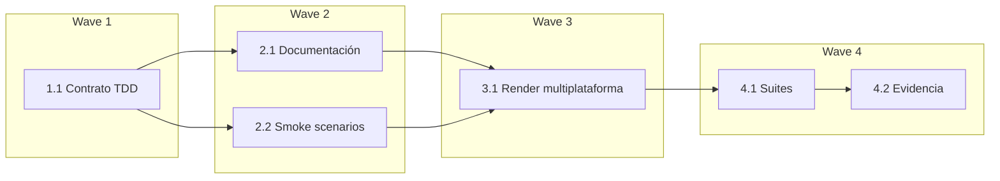

# Tareas — Integración SDD con Project Navigator

## Wave 1 — Contrato canónico con TDD focalizado

- [x] 1.1 [TDD focalizado] Proteger e implementar el consumo opcional de
  `.navigator/` por SDD (Req 1, Req 2, Req 3, Req 4, Req 5)
  - **RED:** ampliar `tools/test_sdd_contract.py` para exigir la referencia
    `navigator-context.md`, el orden de fuentes, los estados de confianza, la
    degradación sin bloqueo, la ausencia de escritura automática y la presencia
    del contrato en agente/skill y salidas generadas; ejecutar el test y observar
    que falla por faltar el comportamiento nuevo.
  - **GREEN:** crear
    `canonical/skills/sdd-spec/references/navigator-context.md` y actualizar
    `canonical/agents/sdd.md` y `canonical/skills/sdd-spec/SKILL.md` con el mínimo
    necesario para satisfacer el contrato.
  - **REFACTOR:** eliminar duplicación innecesaria entre agente, skill y
    referencia, manteniendo a la referencia como procedimiento detallado y la
    autoridad de Project Navigator sobre sus índices.

## Wave 2 — Documentación de uso y validación manual

- [x] 2.1 [P] Documentar en `docs/agentes/sdd.md` y `docs/uso.md` la integración
  opcional, el orden de fuentes y la degradación segura (Req 1, Req 2, Req 3,
  Req 5).
- [x] 2.2 [P] Añadir a `docs/sdd-smoke.md` escenarios reproducibles para Navigator
  vigente, ausente, incompleto, desfasado/no verificable y actualización
  explícita (Req 1, Req 2, Req 3, Req 4, Req 5).

## Wave 3 — Propagación multiplataforma

- [x] 3.1 Regenerar desde `canonical/` los agentes, skills y referencias para
  Copilot, OpenCode, Kiro y Claude; no editar `generated/` manualmente (Req 5).

## Wave 4 — Verificación integral

- [x] 4.1 Ejecutar contrato SDD, validación de render, handoff, enlaces e
  integridad; comprobar que todas las salidas generadas contienen el mismo
  contrato material (Req 1, Req 2, Req 3, Req 4, Req 5).
- [x] 4.2 Revisar el diff final y registrar en `verification.md` la evidencia de
  RED, GREEN, comandos, resultados, trazabilidad y self-check de calidad
  (Req 1, Req 2, Req 3, Req 4, Req 5).

- [omitido: PBT no aplica; no existe un invariante algebraico ni lógica de dominio]

## Grafo de waves

## Evidencia esperada por tarea

| Tarea | Evidencia mínima |
|---|---|
| 1.1 | Test RED observado, archivos canónicos y test GREEN |
| 2.1 | Paths y diff de documentación pública |
| 2.2 | Escenarios y expectativas verificables en el smoke test |
| 3.1 | `tools/render.py` y paridad de las cuatro plataformas |
| 4.1 | Comandos ejecutados con código de salida correcto |
| 4.2 | Matriz requisito–tarea–test–evidencia sin huérfanos |
