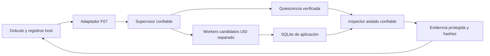
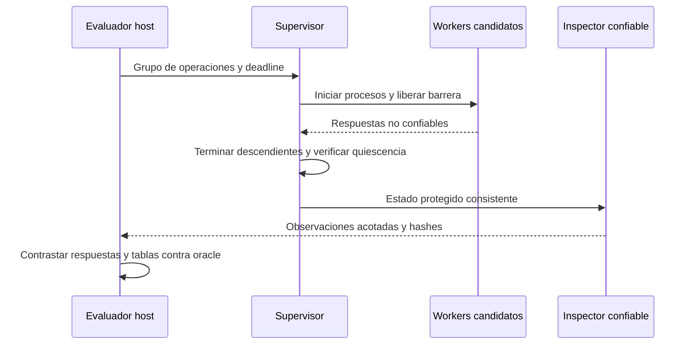

# Diseño — Evaluación independiente F07

- Modo SDD: standard
- Fase: 2 — Design
- Estado: aprobado para Tasks
- Gate 1: aprobado por el usuario («procede»)
- Gate 2: aprobado explícitamente por el usuario («procede»), incluida la excepción acotada del perfil evaluador, sujeta a viabilidad y revisión final
- Intención: implementar tras Gate 3; ningún launch autorizado por este documento
- Nivel recomendado para Design: ALTO

## 1. Decisión principal y alcance de confianza

Se mantiene el contrato `StockStore(path)`, los métodos `reserve/cancel`, el schema
público y F07-01–F07-06. El candidato implementa las transacciones y modifica su DB
de aplicación. El supervisor no implementa reservas ni serializa llamadas para
garantizar atomicidad artificialmente.

El oráculo, expected, agenda, veredictos y evidencia oficial permanecen en host.
SQLite candidata se inspecciona con código confiable en un entorno aislado; nunca
se abre una DB candidata ni se importa su Python en host. La DB es entrada no
confiable, incluso después de detener sus escritores.

SEC-0001 se revalida: acceso del candidato a su DB es legítimo. Los defectos que
se deben demostrar y corregir son la confianza exclusiva en `get_stock`, el control
del proceso que produce respuestas y la alterabilidad de evidencia tras capturarla.
SEC-0002 se refiere a aperturas del supervisor/inspector, no a prohibir que el
candidato implemente su propio acceso SQLite.

## 2. Componentes y responsabilidades

1. **Orquestador F07 host:** llama el evaluador confiable, conserva agenda/resultados,
   deadline, IDs y hashes; composition root en `pilot.py`.
2. **Adaptador de evaluación F07:** reemplaza el worker inline compartido de
   `storage_rpc.py`; valida mensajes acotados, coordina procesos y captura de estado.
3. **Supervisor confiable del evaluador:** arranca workers candidatos con UID separado,
   recibe respuestas como datos no confiables y controla su ciclo de vida. Código
   y canal de administración no son modificables por el candidato.
4. **Workers candidatos:** importan únicamente la entrega congelada; llamadas en
   procesos distintos comparten DB de aplicación por criterio. No leen oracle ni
   escriben el canal de administración o evidencia oficial.
5. **Inspector confiable:** después de quiescencia verificada lee tablas con SQLite
   aislado, límites y schema validado; devuelve observaciones, no un veredicto.
6. **Collector/evidencia:** copia acotada bajo namespace protegido, hashes y registro
   host exclusivo; incluye archivos auxiliares necesarios para consistencia.

No se crea un framework ni singleton. Supervisor, executor y clock son seams
inyectables para pruebas; solo el adaptador de almacenamiento conoce Docker/SQLite.

## 3. Perfil de aislamiento propuesto y excepción explícita

El perfil de generación conserva el aislamiento actual. El perfil evaluador F07
necesita separación efectiva de identidades, control de descendientes y protección
del supervisor. No se extenderá el waiver ni se relajará silenciosamente `docker.py`.

Se propone un **perfil evaluador dedicado**, imagen confiable fijada por digest,
con supervisor protegido y workers no root. Aprovisionamiento y lanzamiento de
workers requieren una autoridad capaz de preparar ownership y cambiar UID; parar
descendientes de otra identidad requiere control de procesos. El diseño permite
únicamente esas operaciones mediante supervisor fijo, nunca comandos privilegiados
seleccionados por el candidato.

Esto es una excepción respecto al perfil actual `cap-drop ALL` / único UID non-root:
la implementación deberá demostrar cuáles de SETUID/SETGID/CHOWN/KILL o mecanismos
equivalentes necesita y retirar las demás. No se presupone que `no-new-privileges`
o seccomp actuales permitan todos esos mecanismos. El supervisor puede necesitar
identidad administrativa dentro del contenedor; **los workers candidatos nunca root**.

Se mantienen red none, root filesystem read-only, sin Docker socket/host mounts,
sin modo privileged, 1 CPU, 256 MB y 64 pids; almacenamiento temporal acotado.
El supervisor y dependencias deben venir de imagen read-only; ejecutar Python
con imports aislados (`-I`, sin PYTHONPATH candidato ni imports desde `/tmp/work`).
La entrega ejecutable se instala read-only fuera de un directorio modificable por
los workers; solo la DB y scratch de aplicación son escribibles por ellos.

**Gate de viabilidad previo a integración:** probar UID/permisos, procesos,
denegaciones y compatibilidad Docker/seccomp con fixtures confiables. Si no puede
demostrarse el boundary bajo las cuotas o exige más privilegios, detenerse y
presentar ajuste de diseño; no continuar con el worker inline como fallback.
Gate 2 debe aceptar explícitamente esta excepción de perfil, sujeta a prueba y
revisión formal final. No representa aceptación de cualquier lista de capabilities.

## 4. Ejecución y captura consistente

Cada criterio usa un almacén y namespace de aplicación nuevo. El supervisor conoce
IDs opacos, no rutas arbitrarias del host. Su estado de control vive en directorio
inaccesible al UID candidato; respuestas candidatas usan canales distintos.

Las barreras liberan workers de procesos distintos sobre la misma DB. Registrar
intervalos y comprobar que el harness permite solapamiento; no interpretar orden
de salida como orden de commit. Se conservan outcomes seriales permitidos de F07.

Después de una llamada secuencial o grupo de carreras:

1. Terminar los workers de ese grupo y todos sus descendientes, incluso si intentan
   separarse de su process group. Mantener un supervisor vivo distinto del candidato.
2. Verificar que no quedan escritores candidatos; impedir nuevas llamadas durante
   captura. Si falla la verificación, invalidar la evaluación, no adjudicar éxito.
3. Proteger el namespace de almacenamiento frente al UID candidato antes de abrirlo.
4. Capturar estado SQLite completo/consistente, incluyendo WAL/journal cuando aplique.
   No copiar solo el archivo principal ni confiar en checkpoint candidato.
5. Inspeccionar con lector confiable aislado; no ejecutar scripts, extensiones ni
   código de la entrega. Consultas fijas a tablas públicas, sin interpolación SQL.
6. Guardar hashes/observaciones host. Rehabilitar el estado de aplicación para el
   siguiente grupo solo después de completar captura e inspección.

La quiescencia es entre grupos, no entre workers de una carrera. Reabrir nuevas
instancias conserva la DB y sigue probando persistencia/reinicialización real.

## 5. Validación de rutas, respuestas y estado

- Supervisor elige paths locales a partir de IDs; entradas candidatas nunca eligen
  paths de inspección, canales, collector ni destinos host.
- Abrir directorios anclados por FD, sin seguir symlinks; validar archivo abierto,
  regularidad, nlink y límites. Prohibir symlinks/hard links a destinos no autorizados.
- `lstat` previo no basta. La quiescencia y ownership impiden sustitución durante
  apertura; añadir prueba adversarial de sustitución antes/durante ese boundary.
- Verificar archivos SQLite auxiliares y namespace padre, no solo DB principal.
- JSON limitado a 64 KiB por respuesta, nodos/profundidad explícitos, sin claves
  duplicadas, NaN/Infinity, pickle, eval ni nombres de clases proporcionados por código.
- Errores públicos por enum; validar tipos exactos e identidad del grupo/llamada.
  Una respuesta es declarada por el candidato, nunca prueba de persistencia sola.
- Inspector devuelve columnas exactas `stock`/`holds`, cardinalidad/tamaño acotados;
  rechaza schema inesperado que impida inspección. No tratar constraint/trigger
  válido del contrato como fallo por mera existencia.

Comparar por criterio reservas, cancelaciones, IDs y stock observado; conservar
observaciones antes/después relevantes. Detectar respuestas sin efectos, efectos
duplicados, negativos y discrepancias entre `get_stock` y tablas. Inyección de
fallos usa SQL fijo del supervisor durante quiescencia; no se delega al candidato.

## 6. Errores, límites y evidencia

Errores tipados: candidato/import/resultado, dominio público, protocolo,
infraestructura, evidencia inválida, timeout/output y cleanup no verificable.
Los mensajes host son fijos; nunca propagar texto libre de excepciones candidatas.
Decisión funcional y resultado de proceso siguen ejes separados.

`max_reported_tokens=None` significa sin corte por cantidad; ausencia de telemetría
de tokens se conserva N/A y no bloquea por sí sola. USD reportado blando permanece
obligatorio: falta de costo disponible impide acreditar el control económico.
Tiempo/pasos/salida y cuotas de contenedor siguen declarados. No se garantiza tope
monetario duro durante una respuesta ni cleanup después de muerte del host.

Evidencia por run: hashes de imagen/entrega/criterios/supervisor/inspector, configuración
del perfil y permisos, agenda e intervalos de carreras, RPC saneado, observaciones
persistentes, capturas y resultados por criterio, límites y cleanup.
Invalidar copias inconsistentes, writers supervivientes, cambios de identidad o
protocolo roto; no contar infraestructura como inferioridad del modelo.

## 7. Pruebas y cinco invariantes

1. Candidato no accede al oracle ni modifica evidencia oficial.
2. Ninguna observación aceptada como congelada conserva escritores candidatos activos.
3. El host no importa Python candidato ni abre SQLite candidata.
4. El harness no implementa ni serializa artificialmente las transacciones F07.
5. F07 nunca inicia modelos sin revisión formal vigente y límites autorizados.

Estrategia: regresión del worker actual, caracterización de contrato/base y TDD
focalizado para supervisor, quiescencia, inspección, clasificación y gates. Observar
RED específico antes de GREEN; no llamar TDD a tests que ya pasan.

- RED: `get_stock` fabricado, reserva sin persistir y descendiente escritor después
  del retorno; probar qué defecto actual reproduce cada fixture sin prometerlo.
- GREEN: referencia 6/6, skeleton 0/6 por NotImplementedError; mutaciones sobreventa,
  doble cancelación, falso estado y alteración de evidencia rechazadas.
- Negativas: supervisor/channel/entrega read-only, rutas escapadas, enlaces, renombrado,
  SQLite auxiliares, respuesta forjada, salida excesiva, timeout, workers supervivientes.
- Carreras: barreras multiproceso, intervalos observados, agenda fijada; sin modelo.
- Regresión: F01–F04, selección MAX/recibos, tokens None, USD y salida/tiempo.
- PBT no se añade en esta wave: boundary/cleanup requieren escenarios OS y agenda
  controlada, no se identifica una propiedad algebraica adicional para este cambio.
  PBT F04/F09 de la spec principal permanece pendiente.

## 8. Trazabilidad, calidad y gates

| Criterios | Diseño |
|---|---|
| B01–B05 | §1–2,4–6: oracle host, quiescencia e inspección independiente |
| B06–B09 | §3–5: identidades/ownership, FD y sustituciones de rutas |
| B10–B14 | §1,4–5: contrato original, concurrencia y etiqueta experimental |
| B15–B19 | §5–6: transporte, límites, errores y lifecycle |
| B20–B24 | §3,6–7: viabilidad, calibración, revisión y autorización |
| I01–I06 | §1,3,6–7: aislamiento y regresiones |

Quality bar: composición e inyección en runner, almacenamiento encapsulado,
errores tipados, sin singletons ni UI; auditoría RNF de aislamiento, integridad,
reproducibilidad, límites y cleanup. La autoridad administrativa del supervisor
es la excepción propuesta de seguridad, no un permiso del candidato.

Gate 2 aprobado: se autorizan Tasks y la excepción acotada del perfil evaluador,
sujeta a la prueba de viabilidad y revisión final descritas en §3. Gate 3 y launch
F07 siguen pendientes; no se implementa ni habilita F07 en esta fase.
