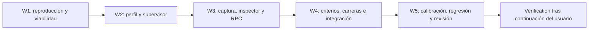

# Tareas — Integridad del evaluador F07

- Modo SDD: standard
- Fase: Implementación
- Estado: implementación y Verification aprobadas; sub-spec cerrada por Gate 4
- Gate 1: aprobado
- Gate 2: aprobado por el usuario («procede»), incluida la excepción acotada del perfil evaluador
- Gate 3: aprobado explícitamente por el usuario («procede»)
- Gate 4: aprobado explícitamente por el usuario («apruebo y autorizo»); kickoff real autorizado con límites de verification.md §6
- Intención: implementación tras Gate 3; este plan no autoriza llamadas al modelo
- Testing: regresión/caracterización para el prototipo; TDD focalizado para comportamiento nuevo
- Nivel recomendado para Tasks: ALTO

## Convenciones y límites

Una tarea a la vez; `[P]` indica independencia dentro de una wave, no autorización
para delegar a agentes. `[x]` requiere artefacto y evidencia observados. Ninguna
tarea se considera terminada por los tests o cambios previos a esta sub-spec.

Raíz de código: `.agent-lab/sdd-escalation/`; spec y hallazgos se mantienen en
`.sdd/` y `.security/`. No modificar `.gitignore`, skills canónicas ni reportes
históricos. Usar solo fixtures confiables en pruebas Docker de implementación.

La implementación no concede permisos privilegiados al candidato. La excepción
del evaluador está condicionada a demostrar permisos mínimos y pasar revisión
formal. Si se necesitan privilegios o cuotas fuera de Design, detener y pedir
ajuste. No existe fallback al worker compartido inseguro ni waiver F07 implícito.

## Wave 1 — Reproducción y viabilidad del boundary

- [x] 1.1 Caracterizar contrato y prototipo, congelar hashes y reproducir respuesta sin persistencia, descendiente escritor y sustitución de ruta. Evidencia: `f07_boundary_probe.py` y `results/f07-wave1-boundary.md`; fixtures confiables en Docker, cero modelos. Los hallazgos no se marcan resueltos. (B02–B04, B10–B13, B21–B22; I03)
- [x] 1.2 Probe de identidades/permisos con imagen confiable read-only, canal administrativo protegido, worker non-root y eliminación de descendiente `setsid`. Fallos negativos al retirar capacidades y probe positivo registrados en `runs/f07-boundary-probe-e2064e00f66e4e659f2f572d2691be6b/report.json`. No es supervisor final ni revisión formal. (B01, B03, B06–B09, B19; I01)
- [x] 1.3 Viabilidad del mecanismo demostrada: CHOWN/SETUID/SETGID/KILL, sin añadir FOWNER, cuotas/permisos efectivos y content ID verificados. Imagen de probe construida sin red desde base fijada; `F07Probe.Dockerfile` y allowlist de contexto evitan transferir runs/credenciales. Evidencia `results/f07-wave1-boundary.md`. El digest del evaluador definitivo deberá fijarse nuevamente en 2.1 y la revisión final. (B01, B03, B07–B09, B22–B23; I01, I04)

**Control interno de viabilidad:** no es aprobación humana ni revisión formal de
seguridad. El resultado habilita únicamente continuar la implementación ya
autorizada; nunca launch F07.

## Wave 2 — Supervisor y lifecycle del evaluador

- [x] 2.1 Perfil y lifecycle dedicados con imagen sellada, ownership y parámetros efectivos verificados, worker non-root y administración restringida. `F07EvaluationContainer`, Dockerfile y `f07_profile.py`; tests de drift/provisioning/cleanup y probe Docker real. Evidencia `results/f07-supervisor-progress.md`. No es aprobación formal del evaluador. (B01, B06–B09, B19; I01, I06)
- [x] 2.2 Supervisor y grupos implementados; regresión RED/GREEN de reentrada sin matar workers activos, replay rechazado y lock exclusivo de captura. Evidencia: `test_f07_supervisor.py`, reporte `f07-supervisor-check-b0c1b197fcce44a98d68168c312335c1` y `results/f07-implementation-complete.md`. (B01, B03, B06, B17–B19)
- [x] 2.3 PID handles/quiescencia/reaping; 40 writers, timeout/overflow y limpieza verificada. Fallo de quiescencia forzado impide inspección; checkpoint del fallo y clasificación final probados en `test_f07_supervisor.py`, `test_f07_rpc.py`, `test_pilot.py`. (B03, B05, B19; I01)

## Wave 3 — Inspección independiente y transporte

- [x] 3.1 Captura/FD/ownership implementados; reproducción de ruta vulnerable en Wave 1 y rechazo posterior, más negativas reales de enlaces, FIFO, reemplazo y recovery WAL/journal. Evidencia: `results/f07-implementation-complete.md`, tarea 3.1. (B02–B03, B05–B09, B22; I01)
- [x] 3.2 Inspector UID independiente, queries/tipos/límites, extensiones deshabilitadas y DB malformada rechazada. Evidencia: informe final tarea 3.2 y `evaluator/supervisor.py`; referencia y negativos reales en Docker. No se declara TDD nuevo para checks agregados después de implementación: son cobertura/regresión. (B02, B04–B05, B09, B17–B18; I01)
- [x] 3.3 RPC protegido con schema/identidades/bytes/nodos/depth/errores; RED/GREEN de validador administrativo y coverage negativa adicional. Evidencia: informe final tarea 3.3, `test_f07_supervisor.py`, `test_f07_rpc.py`. (B01, B05–B06, B09, B17–B18)
- [x] 3.4 Tokens None/N/A sin corte; RED/GREEN observado para actor/runner y regresiones de los demás límites. Evidencia: informe final tarea 3.4 y tests stream/actor/pilot/CLI. (B15–B16, B18, B24; I02)

## Wave 4 — Criterios, carreras e integración F07

- [x] 4.1 Proxy observado y seis criterios originales/probes SQL; falsas declaraciones y falta de persistencia reproducidas y rechazadas. Evidencia: informe final tarea 4.1, `f07_rpc.py`, calibración referencia 6/6 y mutaciones 0/6. (B02, B04–B05, B10, B12–B13, B18, B21)
- [x] 4.2 Grupos/barrier/intervalos, procesos distintos y mismo almacén; F07-05/06 y persistencia pasan con referencia en Docker. Evidencia: informe final tarea 4.2 y calibración final. No se afirma RED específico de cada carrera: su verificación es integración/caracterización. (B10–B13, B19–B21)
- [x] 4.3 Integración pilot/CLI/actor falso F07; E2E 3/5 fases 6/6, cero modelos y etiquetas experimentales correctas. Gates/límites probados con fixtures. Evidencia: informe final tarea 4.3 y summaries enlazados. (B05, B14–B19, B23–B24; I01–I05)
- [x] 4.4 Checkpoints incrementales de observaciones/fallos, IDs/hashes y clasificación independiente; tests de identidad, discrepancia y reporte final. Evidencia: informe final tarea 4.4 y `observations.json` de E2E final. (B02–B05, B09, B17–B19, B22; I03)

## Wave 5 — Calibración, regresiones y revisión formal

- [x] 5.1 Docker real: referencia 6/6, skeleton 0/6 por NotImplementedError, cinco mutaciones rechazadas con resultados/observaciones y cleanup. Evidencia: informe final tarea 5.1 y reporte `f07-observed-calibration-80d91d62d326454c8d6f13e4503a1574`. (B01–B05, B10–B12, B19–B22)
- [x] 5.2 Suite ampliada 861 passed, 1 deselected; compileall/diffcheck GREEN. Invariantes/RNF comprobados mediante pruebas y fuentes enlazadas en informe final; validación formal de matriz se hará en Verification. (B15–B19, B23–B24; I01–I06)
- [x] 5.3 Reauditoría técnica real de este asistente IA usando security, código y negativos/calibración reales: `.security/reviews/f07-2026-10-07.md`. Sin bloqueantes comprobados en el alcance; limitaciones explícitas. (B07–B09, B21–B23)
- [x] 5.4 Registro instalado `runtime/pilot-review.json` vinculado a informe/fingerprints/imagen. Tests de drift de config, scope y waiver pasan. No aprobación humana ni certificación ni gasto autorizado. (B22–B24; I04)
- [x] 5.5 Informe final y documentación de tareas/evidencia actualizados, fin de implementación presentado y Verification pendiente de continuación. La spec principal y el kickoff real siguen separados. (B22; I03–I06)

Checkpoint final: `results/f07-implementation-complete.md` vincula las tareas 3.1–5.5
a fuentes, pruebas, calibración y reauditoría final. Suite 861 passed, 1 deselected;
referencia 6/6, skeleton 0/6 y cinco mutaciones rechazadas. Dos E2E finales con actor
falso pasan 6/6, cero modelos. Registro de revisión técnica F07 instalado, no
certificación ni autorización de gasto. Verification pendiente de continuación.

PBT adicional omitido con justificación de Design §7: estos límites requieren
escenarios OS/concurrencia controlada; PBT F04/F09 continúa pendiente en la spec
principal. No se considera completado por este plan.

## Grafo de waves

Cada wave espera a la anterior. Dentro de W3, 3.1 → 3.2; 3.3 y 3.4 son
independientes de esa rama. Dentro de W5, 5.1/5.2 pueden ejecutarse de forma
independiente; ambas preceden 5.3 → 5.4 → 5.5.

## Matriz requisito → tareas

| Requisitos | Tareas |
|---|---|
| B01 | 1.2–1.3, 2.1–2.2, 3.3, 5.1 |
| B02–B05 | 1.1, 2.3, 3.1–3.3, 4.1, 4.3–4.4, 5.1 |
| B06–B09 | 1.2–1.3, 2.1–2.2, 3.1–3.3, 4.4, 5.3 |
| B10–B13 | 1.1, 4.1–4.2, 5.1 |
| B14 | 4.3 |
| B15–B16 | 3.4, 4.3, 5.2 |
| B17–B19 | 1.2, 2.1–2.3, 3.2–3.4, 4.2–4.4, 5.1–5.2 |
| B20–B21 | 1.1, 4.1–4.2, 5.1, 5.3 |
| B22 | 1.1, 1.3, 3.1, 4.4, 5.1, 5.3–5.5 |
| B23–B24 | 1.3, 3.4, 4.3, 5.2–5.4 |
| I01–I06 | 1.1–1.3, 2.1, 2.3, 3.1–3.2, 3.4, 4.3–4.4, 5.2–5.5 |

## Verification y prueba real posteriores

Tras implementar se presenta el preflight de Verification y se espera continuación.
Verification comprobará B01–B24/I01–I06 contra evidencia y presentará Gate 4 de esta
sub-spec; no cerrará la spec principal.

Una ejecución real F07 es un kickoff separado: modelo/variante explícitos, condición
experimental, USD blando autorizado, tiempo/pasos, ausencia de tope de tokens y
revisión final vigente. No se ejecutará por aprobación de Gates 2, 3 o 4.

Gate 3 aprobado: implementar las tareas en orden, comenzando por la viabilidad.
La aprobación no autoriza launch F07 ni sustituye revisión formal.
