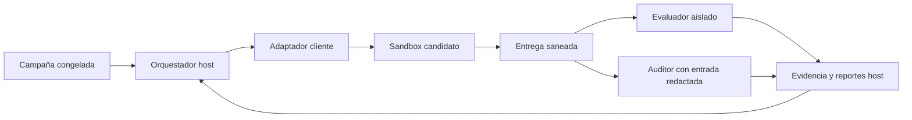
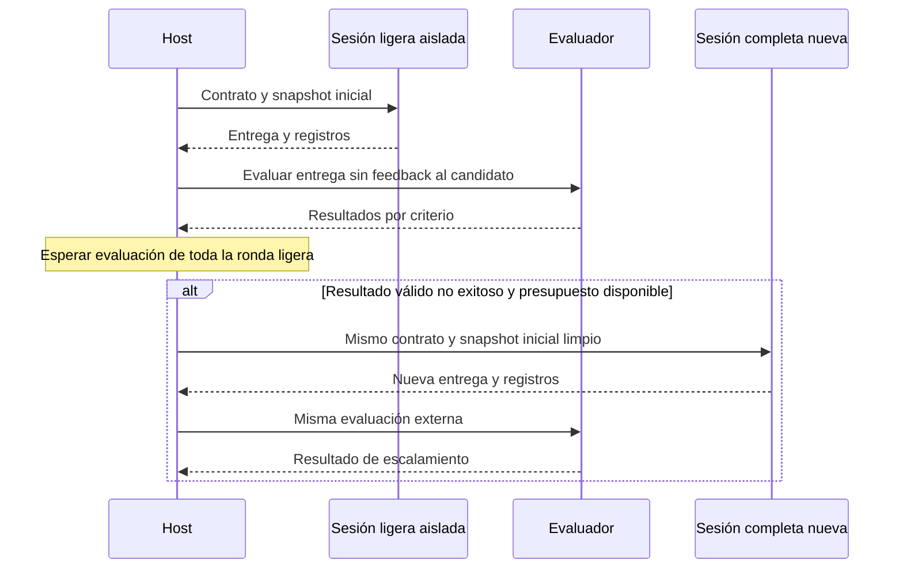

# Diseño — Laboratorio de escalamiento SDD

- Modo SDD: standard
- Fase: 2 — Design
- Estado: aprobado
- Gate 1: aprobado por el usuario («procede»)
- Gate 2: aprobado explícitamente por el usuario («procede», tras presentación del diseño)
- Gate 3: aprobado explícitamente por el usuario («procede», tras actualización de MAX en interfaz)
- Intención: construir el laboratorio; campañas reales siguen bloqueadas hasta kickoff autorizado
- Nivel de LLM recomendado para esta fase: ALTO

## 1. Decisiones propuestas y condiciones pendientes

Proyecto sintético: **ReserveLab**, motor de reservas e inventario sin UI, con reglas
monetarias, persistencia, concurrencia y recuperación. Diez ejercicios independientes;
cada uno recibe una base propia con dependencias previas correctas, no entregas de otro candidato.

Stack propuesto: Python 3.12, pytest, SQLite y contenedores Linux. Las integraciones
son servicios simulados deterministas, sin pagos reales. SQLite permite transacciones
y pruebas multiproceso sin infraestructura distribuida externa; F09–F10 simulan red y fallos.
Las versiones exactas y las imágenes se fijarán antes de construir los snapshots.

El runner será Python con un adaptador concreto para el cliente/API elegido. No se
asume que el cliente admite sesiones autónomas, métricas o llamadas a herramientas:
una comprobación de capacidades debe demostrarlo antes de autorizar una campaña.

El usuario seleccionará manualmente MAX (modo de pensamiento/razonamiento) en la
interfaz antes del kickoff. El runner no elegirá ni sustituirá esa opción: registrará
modelo y variante elegidos y propagará explícitamente los mismos valores a cada
ejecución con `--model` y `--variant`. No traducir MAX a una etiqueta interna sin
verificarla. Captura automática de la selección de la interfaz aún no implementada;
si no se expone, el usuario puede confirmarla una vez antes del kickoff.

Bloqueantes de ejecución: cliente/integración, identificador real del modelo,
propagación verificable del modo seleccionado, modelo auditor, límites económicos/
temporales, versiones y política aprobada de permisos.

## 2. Catálogo propuesto (R01–R05)

Las interfaces completas, fixtures y criterios numerados se congelarán en archivos
públicos antes de cualquier ejecución. Las pruebas reservadas no añadirán reglas secretas.
El número expresa dificultad prevista; los resultados no deben suponerse monotónicos.

| Feature | Meta | Factores de dificultad | Lite canónico |
|---|---|---|---|
| F01 | Etiqueta de reserva | Transformación local, validación mínima | Elegible si se confirma alcance local |
| F02 | Filtro estable de catálogo | Límites, composición de predicados | Elegible si se reutilizan patrones |
| F03 | Cotización monetaria | Orden de reglas y redondeo | Elegible: cálculo sintético, sin cobros |
| F04 | Normalización de carrito | Duplicados, orden y propiedad algebraica | Elegible: función local sin efectos |
| F05 | Persistencia de reservas | Storage, reinicio y atomicidad | No: cruce de capas/integridad |
| F06 | Comandos idempotentes | Claves, transacciones y repetición | No: integridad/concurrencia |
| F07 | Reserva concurrente | Procesos, carreras y cancelación | No: concurrencia |
| F08 | Outbox recuperable | Fallos entre commit y entrega | No: integración e integridad |
| F09 | Sincronización offline | Eventos reordenados, conflictos | No: arquitectura/integridad |
| F10 | Reserva multirrecurso recuperable | Planificación, saga, compensación y fallos | No: arquitectura/concurrencia |

### Contratos resumidos

- **F01:** función sobre una reserva validada: `R-000042 | Ada | confirmed`;
  ID 0–999999, nombre recortado no vacío y estado del enum público. Rechazar entradas
  inválidas con el error de dominio fijado; no alterar el objeto ni realizar I/O.
- **F02:** filtrar productos por disponibilidad, precio inclusivo mínimo/máximo y
  prefijo de categoría; combinar filtros con AND, conservar orden y no mutar entradas.
  Rango invertido produce error; catálogo vacío produce lista vacía.
- **F03:** calcular subtotal en centavos enteros, descuento porcentual entero 0–100
  y después impuesto en puntos básicos 0–10000. Redondear cada ajuste half-up; cantidades
  positivas, precios no negativos. Total = subtotal − descuento + impuesto; sin floats.
- **F04:** agrupar líneas válidas por SKU y sumar cantidades; ordenar por SKU,
  rechazar un SKU repetido con precios incompatibles y no modificar entradas.
  Normalizar una salida ya normalizada devuelve un valor equivalente.
- **F05:** crear y consultar reservas persistentes con identificador único, líneas
  y estado; una creación incompleta no deja filas parciales. Reiniciar conserva datos;
  ID duplicado y reserva inexistente tienen errores diferenciados. Esquema inicial provisto.
- **F06:** ejecutar un comando con clave de idempotencia: misma clave/payload produce
  mismo resultado y un solo efecto durable; clave reutilizada con payload diferente
  produce conflicto. Reinicio y solicitudes simultáneas conservan esa garantía.
- **F07:** reservar unidades por SKU sin sobreventa entre procesos; cancelar libera
  unidades una sola vez. Stock agotado produce rechazo de dominio. Una carrera entre
  reserva y cancelación debe ser compatible con algún orden serial válido.
- **F08:** persistir cambio de reserva y evento outbox en una transacción; un worker
  reintenta entregas tras fallos/reinicio. Entrega al menos una vez con ID estable;
  receptor simulado deduplica efectos. No se exige transporte exactamente una vez.
- **F09:** sincronizar eventos de edición de notas/etiquetas de reservas entre réplicas;
  deduplicar por ID, ordenar versiones por `(contador lógico, replica_id)` y resolver
  concurrentes con ese orden total. Borrados son tombstones versionados; no resucitar
  un valor con eventos anteriores. Stock y pagos quedan fuera del protocolo offline.
- **F10:** reservar conjuntamente inventario, capacidad de un turno y autorización
  de pago simulada. Elegir turno viable más temprano, con desempate por ID. Coordinar
  participantes idempotentes mediante saga durable; un fallo permanente antes de
  confirmar inicia compensación. Tras reinicio y recuperación de servicios, llegar a
  confirmado o compensado, sin doble cargo ni fugas de recursos en estado terminal.
  Prohibir confirmación y compensación concurrentes de la misma saga. El simulador
  limita fallos transitorios y ofrece recuperación eventual, no terminación bajo caída infinita.

F10 busca dificultad alta, no se garantiza que haga fallar a un modelo de frontera.
F05–F10 contienen bases correctas de capacidades auxiliares necesarias; el candidato
solo implementa el incremento definido. El manifiesto registra cuánto scaffolding recibe.

## 3. Arquitectura mínima y separación de confianza (R07–R12, R20–R28, R43–R44)

Componentes con responsabilidades distintas, sin framework propio de agentes:

- **Orquestador:** matriz congelada, presupuestos, estado y programación de rondas.
- **Adaptador de modelo/cliente:** sesión, eventos disponibles, herramientas limitadas y consumo.
- **Gestor de sandbox:** snapshots limpios, permisos, cuotas y destrucción del entorno efímero.
- **Evaluador:** pruebas externas y regresiones en entorno independiente sin credenciales.
- **Auditor:** revisión cualitativa y de proceso sobre copia redactada de artefactos.
- **Almacén de evidencia/reportes:** eventos y archivos por ID; solo el host puede escribir resultados oficiales.

Composition root del runner conecta componentes; usar inyección de dependencias donde
ya existen responsabilidades distintas. No introducir plugins genéricos o singletons.
Dominio de campañas no importa SDKs ni APIs de persistencia; un adaptador encapsula storage.
Errores tipados: dominio candidato, infraestructura, evaluación, presupuesto y adaptación.
No UI; I/O asíncrono o procesos supervisados, sin bloquear el supervisor de límites.

El sandbox candidato recibe solo contrato, snapshot, tests públicos y herramientas
permitidas. No montar el repo anfitrión, pruebas reservadas, runs ajenos, credenciales
ni socket Docker. Egress denegado salvo proxy del modelo gestionado fuera del sandbox.
El evaluador ejecuta código candidato como no confiable: sin red, con cuotas y sin
escritura en fixtures/pruebas oficiales. Rechazar symlinks externos, rutas escapadas y
artefactos excesivos al extraer la entrega. Contenedores no bastan si el cliente conserva
acceso al host: el adaptador debe demostrar la frontera de herramientas o fallar cerrado.
Revisión de seguridad especializada recomendada antes de ejecutar código autónomo.

## 4. Campaña y decisiones automáticas (R06, R13–R19, R37–R41, R46–R59)

Manifest: campaign_id, catálogo/snapshots/prompts versionados, modelo e identificación
de la selección MAX hecha por el usuario/configuración efectiva observada,
semilla de orden, repeticiones, límites por intento y globales, precios y política de feedback.
Congelar digests; una edición crea campaña nueva. Empezar secuencial para evitar ruido
de carga. Propuesta piloto: tres repeticiones ligeras por feature, escalando cada intento
válido no exitoso; el tamaño definitivo depende del presupuesto aprobado.

`lite-experimental`: Quick Plan + implementación + verificación compacta, sin pausas;
anotar exclusiones y override experimental F05–F10. `standard-autonomous`: requirements,
design, tasks, implementación y verification con decisiones automáticas explícitas.
Capturar hashes de la versión canónica de instrucciones/agente que actúa de baseline y
versionar el delta experimental (auto-transiciones y overrides) por separado; nunca
sobrescribir skills canónicas ni reportar resultados del delta como SDD canónico.

Política inicial de transiciones: comprobar artefacto esperado, esquema/metadatos,
referencias a requisitos y ausencia de bloqueos declarados. Un máximo propuesto de
una corrección documental por transición; si sigue inválida, terminar como fallo de
proceso. Esto valida consistencia estructural, **no sustituye aprobación semántica humana**.
No mostrar evaluaciones reservadas al candidato. El auditor analiza después, no ayuda a resolver.

Estados: pending → running → submitted → evaluating → terminal. Terminal incluye
success, partial, functional_failure, process_failure, budget_exhausted e invalid.
Usar ejes separados para resultado funcional y cumplimiento de proceso; un fallo de
proceso puede coexistir con código funcional. Cancelación y espera canónica se registran aparte.

Después de evaluar toda la ronda ligera, escalar intentos válidos sin éxito funcional
completo o con fallo de proceso. No escalar inválidos como si fueran fallos del modelo:
propuesta de un reintento desde snapshot limpio; persistir invalidez y excluir de tasas.
Intentos pendientes al agotar presupuesto quedan not_executed. Ningún reintento hereda
conversación, código, diagnósticos o tests reservados; el host solo transmite el contrato inicial.

Ronda de control propuesta: por feature con algún éxito ligero, seleccionar mediante
semilla congelada una repetición exitosa y ejecutar su contraparte completa desde cero.
Es diagnóstico de casos exitosos, no comparación general sin sesgo. Una comparación
confirmatoria posterior requiere matriz completa predefinida sobre tareas elegibles.
Tercera ronda opcional: mismo protocolo completo con otro modelo en casos fallidos;
solo autorizarla con modelo y presupuesto declarados. No cambiar de modelo silenciosamente.

## 5. Evidencia, métricas e incertidumbre (R19, R22–R36, R42, R45, R54–R55)

Run: IDs de campaña/feature/repetición/condición; hashes del snapshot, entrega y tests;
configuración real, prompts/eventos saneados, resultados por criterio, estado y motivo;
tiempos, consumo expuesto, reparaciones e intervenciones. Evento de inicio durable antes
de invocar al modelo; checkpoint al cambiar estado. Reanudar crea nuevos IDs para
intentos interrumpidos sin duplicar gasto a ciegas: conciliar sesiones remotas cuando sea posible.

Una primera entrega se evalúa una sola vez con suite reservada; no hay reparación
guiada por ella en el piloto. Correcciones por tests públicos y pasos internos se
registran, por lo que «primera entrega» no significa «una sola llamada al modelo».
Auditor cualitativo: corrección conceptual, mantenibilidad y omisiones según rúbrica
congelada. Para proceso necesita conocer el flujo; separar esa revisión de la revisión
ciega de código y anotar cualquier identidad deducible de artefactos.

Éxito funcional = todos los criterios obligatorios y regresiones pasan. Éxito de campaña
exige también cumplir su protocolo experimental. Parcial = algún criterio obligatorio
pasa y otros fallan; fallo funcional = ninguno pasa. Métricas N/A nunca se sustituyen por 0.
Reportar tokens de entrada/salida/cache/razonamiento cuando existan, costo con tarifa
versionada y origen medido/estimado, tiempos activos/espera y gastos del auditor por separado.

Tasa por condición = éxitos / intentos válidos; mostrar agotados como no éxitos,
inválidos/no ejecutados por separado. Intervalo Wilson 95% descriptivo; pocas repeticiones
y correlaciones limitan inferencias. No sumar features distintas como repeticiones equivalentes.
Costo por éxito = gasto de la condición / éxitos; sin éxitos, no definido.
Costo de política incluye todos los intentos ligeros, escalados, inválidos y auditoría;
reportar gasto observado y proyección de producción por separado. Umbral de confiabilidad
y margen de no inferioridad siguen pendientes; no producir un «nivel máximo» universal.

## 6. Pruebas y cinco invariantes críticos

Runner nuevo: TDD focalizado RED→GREEN→REFACTOR para aislamiento de estado, decisiones,
budgets, reanudación y clasificación; integración con adaptador falso antes de consumo real.
Snapshots: baseline verde de regresiones; test de aceptación falla por comportamiento
faltante, no por imports rotos. Validar evaluador con solución de referencia y mutaciones
incorrectas representativas. Si ambos pasan, bloquear la campaña y corregir evaluación.

Candidatos: pedir TDD focalizado, con comandos/evidencia; no declarar TDD solo por tener tests.
PBT real propuesto para idempotencia de F04 y convergencia de F09 con Hypothesis, junto
a ejemplos deterministas. Dependencia solo cuando se implementen esas pruebas.
Multiproceso y barreras para F07; inyección controlada de fallos para F08/F10; semillas
congeladas y agenda de fallos publicada como reglas, sin filtrar casos reservados.

1. Una ejecución no lee evaluación reservada ni resultados ajenos.
2. Una entrega evaluada y sus condiciones quedan identificadas sin sobrescritura.
3. Escalar siempre arranca desde el mismo snapshot inicial de la feature.
4. Ningún resultado exitoso carece de evidencia de todos sus criterios obligatorios.
5. Ningún intento nuevo comienza sin presupuesto autorizado disponible.

Auditar RNF: reproducibilidad, aislamiento, integridad de evidencia, límites y exclusión
de secretos. Consumir presupuesto reservado para llamadas concurrentes; si el proveedor
no expone tope duro, declarar el límite de costo estimado y no prometer corte exacto.

## 7. Ubicación y trazabilidad

Raíz `.agent-lab/sdd-escalation/`: `catalog/`, `snapshots/`, `campaigns/`, `runner/`,
`evaluation/`, `runs/`, `reports/` (estructura propuesta, no creada aún).
Separación lógica de carpetas no equivale a permisos; solo host/evaluador acceden a evaluation.
La carpeta está ignorada por Git: futuro plan debe decidir versionado selectivo de fuentes,
manifiestos y catálogo; runs y credenciales no se publican. Spec canónica en `.sdd/specs/`.

R01–R05: §2; R06–R12: §3–4; R13–R19: §4–5; R20–R28: §3,5–6;
R29–R36: §5; R37–R41: §4–6; R42–R45: §3,5,7; R46–R60: §1,4–5.
No código previo del lab que reutilizar. No README de arquitectura disponible en la
búsqueda; se recomienda especialista, sin crear documentación de dominio en esta fase.
Sin excepciones anticipadas al quality bar; no UI ni migración de producción.

Gate 2 aprobado: se autorizan Tasks para ReserveLab, Python 3.12, pytest y SQLite como
propuesta de diseño. Cliente, modelos y presupuesto permanecen decisiones abiertas:
bloquean implementación del adaptador real y cualquier campaña.
