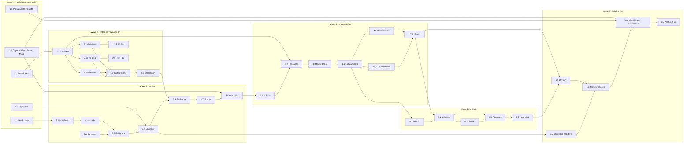

# Tareas — Laboratorio de escalamiento SDD

- Modo SDD: standard
- Fase: Tasks
- Estado: implementación en curso
- Gate 1: aprobado
- Gate 2: aprobado por el usuario («procede»)
- Gate 3: aprobado explícitamente por el usuario («procede»)
- Intención: implementar el laboratorio; no ejecutar campañas reales hasta autorización explícita del kickoff
- Testing: TDD focalizado para comportamiento nuevo del runner, el evaluador y los fixtures; tests de regresión para mantener el contrato del harness; PBT real para propiedades de F04 y F09.

## Convenciones de ejecución

- No marcar tarea `[x]` sin artefacto y evidencia verificable; RED → GREEN mínimo correcto → REFACTOR solo si aporta valor.
- `[P]` significa que puede correr en paralelo una vez satisfechas las dependencias indicadas por el grafo; tareas de ramas independientes no se bloquean entre sí.
- Los harnesses usan adaptadores falsos hasta autorizar explícitamente proveedor, modelo, límites y campaña. El plan no autoriza consumo de APIs ni ejecución autónoma real.
- `lite-experimental` y `standard-autonomous` son copias/condiciones del laboratorio; no cambiar la skill SDD canónica.
- La campaña puede automatizar transiciones después del kickoff autorizado, pero la construcción de este laboratorio conserva gates humanos SDD.
- Bloqueantes antes de una campaña: identificar modelo/variante reales seleccionados por el usuario, verificar su propagación en OpenCode sin sustituirlos, y cerrar operador, presupuestos, precios, permisos, política de fallos y revisión especializada de seguridad.

## Wave 1 — Cerrar condiciones de ejecución y custodia

- [x] 1.1 Congelar el alcance aprobado: ReserveLab, Python 3.12, pytest, SQLite y las diez metas con dificultad prevista (evidencia: `design.md` §1–2; Req R01–R05).
- [x] 1.2 Mantener explícita la política local mientras `.agent-lab/` esté ignorado: no cambiar `.gitignore` ni publicar runs; proponer versionado selectivo antes de cualquier distribución del laboratorio (evidencia: `.gitignore:24`, `design.md` §7; Req R10, R42–R45).
- [ ] 1.3 [P] Encargar revisión de seguridad del límite de confianza: cliente de herramientas, ejecución de código no confiable, acceso a pruebas reservadas, secretos, egress y sandbox; resolver hallazgos críticos antes de ejecutar candidatos (Req R21, R43–R44).
  - Usuario decidió omitir revisión formal del piloto F01–F04. Registro `runtime/pilot-review-waiver.json`: no revisión ejecutada/certificado; sandbox, evaluación, límites y autorización de gasto intactos. El gate reconoce la excepción de scope limitado. No marcar revisión realizada.
- [ ] 1.4 [P] Verificar capacidades del cliente con una prueba no facturable o smoke autorizado: capturar ID real, confirmar que MAX seleccionado por el usuario en la interfaz se aplica a todas las sesiones nuevas, y verificar herramientas/restricciones y métricas disponibles; el runner nunca cambia MAX y bloquea campaña si no puede demostrar aislamiento/herencia (Req R07, R09, R19, R30–R31, R44, R59).
- [ ] 1.5 [P] Fijar modelo auditor/comparador, presupuesto y tarifas, tiempos, repeticiones, reparación y umbrales antes de congelar un manifiesto real (Req R06, R30–R38, R46–R58).
- [x] 1.6 Configurar entrada local `/lab-start`, plantilla de manifiesto y launcher/preflight offline que no invoca modelos ni concede autorización; evidencia: `.opencode/commands/lab-start.md`, `lab.py`, `campaigns/pilot.template.json`, `runner/src/lab_runner/preflight.py`, tests `test_preflight.py` y `test_cli.py` (Req R37, R46, R59–R60). No constituye kickoff ni prueba de aislamiento.

## Wave 2 — Congelar catálogo y snapshots independientes

- [x] 2.1 Definir esquema tipado/versionado del catálogo, IDs F01–F10, factores de dificultad, elegibilidad lite canónico y digests; validar exactamente diez IDs únicos y orden previstos (evidencia: `runner/src/lab_runner/catalog.py`, `runner/tests/test_catalog.py`, `python3 -m pytest -q` → 18 passed; Req R01, R03–R05, R10, R12).
- [x] 2.2 Crear contrato público, snapshot limpio, fixtures y baseline de F01–F04: `catalog/contracts.md` (24 criterios), `snapshots/F01–F04/feature.py` y `test_public.py`, `evaluation/references.py`, `runner/tests/test_feature_harness.py`. Referencias 24/24, skeletons 0/24; baseline público 4 passed (Req R02–R04, R07–R08, R20, R22–R23). El snapshot no contiene soluciones/evaluación reservada; la frontera OS aún está pendiente.
- [x] 2.3 Crear contrato público, snapshot limpio, fixtures y baseline de F05–F07: `catalog/contracts-f05-f07.md` (18 criterios), `snapshots/F05–F07/`, `evaluation/references_f05_f07.py` y `test_storage_harness.py` (25 passed). Referencias 18/18, skeletons fallan con NotImplementedError; concurrencia por procesos y barreras (Req R02–R04, R07–R08, R20–R23).
- [x] 2.4 Contratos `catalog/contracts-f08-f09.md` y `contracts-f10.md` (18 criterios), `snapshots/F08–F10/`, referencias/criterios host-only `evaluation/*f08_f09.py` y `*f10.py`. Reinicios, fallos finitos, eventos reordenados, participantes con commits independientes y carreras por procesos; test de aceptación público F10 inicia RED deliberadamente (Req R02–R04, R07–R08, R20–R23).
- [🔵] 2.5 Suite externa F01–F10 en `evaluation/criteria*.py`, ligada a 60 IDs públicos. Pendiente integrar ejecución aislada/límites y extracción de resultados; no ejecutar candidatos no confiables mediante graders host de calibración (Req R20–R23, R27–R28, R44).
- [x] 2.6 Calibración de ejemplos F01–F10: referencias 60/60, skeletons fallan por comportamiento ausente y 27 mutaciones incorrectas son rechazadas. Evidencia: cuatro `test_*_harness.py` y consistencia `test_catalog_index.py`; runner 226 passed, suite ampliada 236 passed, 1 deselected (aceptación del candidato F10, no baseline) (Req R20–R28). No prueba exhaustiva ni PBT; tareas 2.7–2.8 siguen pendientes.
- [ ] 2.7 [P] Añadir propiedad idempotente de normalización para F04 con Hypothesis real y ejemplos deterministas; observar RED antes de la solución de referencia del harness (Req R02, R22–R23; design §6).
- [ ] 2.8 [P] Añadir propiedad de convergencia determinista ante permutaciones/duplicados de eventos para F09, con Hypothesis real y ejemplos de tombstones; fijar la semántica de orden total (Req R02, R22–R23; design §6).

## Wave 3 — Núcleo del runner y evidencia durable

- [🔵] 3.1 Implementar parser/validador del manifiesto de campaña congelado (modelo, modo MAX seleccionado por el usuario, evidencia de herencia, versiones, semilla, repeticiones, límites, precios y feedback); RED/GREEN para rechazo de campos ausentes o cambios no versionados (Req R06, R09–R12, R37, R59).
- [ ] 3.2 Definir estados y errores tipados del run; RED/GREEN para transiciones válidas, inválidas, terminales y reanudación sin sobrescribir IDs ni artefactos (Req R12, R38–R42).
- [🔵] 3.3 Checkpoints JSON atómicos con fsync y rechazo de campaña duplicada implementados solo para escenarios sintéticos en `simulation.py`; no sobrescribir registros de campañas existentes. Pendiente almacén de evidencia real, recuperación, composición e I/O supervisado (Req R19, R30–R32, R41–R45).
- [🔵] 3.4 Empaquetado público y `ManagedContainer` con identidad/etiqueta propias, carga en bloques (sin host mounts) y hashes verificados, ejecución acotada y cleanup verificado. Evidencia: 19 tests de empaquetado, 76 de lifecycle y `runtime/container-result.json` con prueba real confiable F10 y cleanup tras timeout/overflow. Pendiente frontera de herramientas/agente, exportación saneada, evaluación de entregas y reconciliación tras caída del host. No acredita sandbox completo ni revisión de seguridad (Req R07–R08, R21, R43–R44).
- [🔵] 3.5 Transporte F01–F04 por `function_rpc.py`: código y respuestas en Docker, evaluación/expected privados en host, tipos/identidades/mutación preservados. Calibración real: referencias 24/24, bases 0/24 y dos defectos rechazados (`runtime/function-evaluation-result.json`). JSON validado/acotado; 36 tests RPC. Pendiente F05–F10, exportación de entregas, clasificación infraestructura vs fallo funcional y revisión adversarial; no habilita código desconocido aún (Req R20–R28, R44).
- [ ] 3.6 Implementar política de secretos y sanitización de logs/reportes, con tests sobre tokens y credenciales sintéticas; eliminar o redactar antes de persistir/exportar (Req R42–R45).
- [🔵] 3.7 Supervisor POSIX y cleanup explícito de contenedor propio dentro de `ManagedContainer`; timeout/overflow reales probados. Pendiente cuotas monetarias/globales, reservas, repair cap real y reconciliación/cierre de sesiones remotas; no confundir kill del CLI con cierre de sesión remota ni garantizar cleanup tras muerte del host (Req R30–R31, R37–R40, R57).
- [🔵] 3.8 Adaptador OpenCode con executor inyectable: constructor/parser/errores probados con falsos (51 tests), `bounded_run` ya satisface protocolo sin activarse por defecto. Recibos efectivos validados en F01 y F02. Se corrigió stdout truncado del CLI con captura PTY cruda y regresión RED/GREEN (70 KB). Pendientes telemetría detallada por fase y validación en más condiciones (Req R07, R09, R19, R30–R31, R40–R42, R59–R60).

## Wave 4 — Orquestación experimental autónoma

- [ ] 4.1 Capturar con hashes la versión exacta de instrucciones/agente SDD canónicos usada como baseline y versionar aparte el delta de autonomía/override; implementar políticas para `lite-experimental` y `standard-autonomous` con decisiones registradas, sin atribuir aprobación humana ni mezclar resultados de variantes (Req R10, R13–R19, R48–R49).
- [ ] 4.2 [P] Implementar ejecución de la ronda ligera para las diez features, repetición/secuencia congeladas, captura completa de resultado y anotación de override lite forzado para F05–F10 (Req R01, R05–R06, R14–R19, R46–R47).
- [ ] 4.3 Implementar cierre/evaluación de la ronda ligera completa y clasificador independiente de resultado funcional y cumplimiento de proceso; no revelar suite ni diagnóstico reservado al candidato (Req R22–R29, R50).
- [ ] 4.4 Implementar escalamiento de los runs válidos parciales/fallidos o con fallo de proceso; crear run nuevo desde el mismo digest inicial sin código, conversación o feedback previo; aplicar política acotada a runs inválidos, sin contarlos como fallo del modelo (Req R07–R08, R16, R38–R41, R51–R53).
- [ ] 4.5 [P] Implementar política de pausa/reanudación para fallas de infraestructura y agotamiento de presupuesto; reanudar con IDs nuevos y conciliación cuando posible, sin duplicar llamadas a ciegas (Req R38–R41, R53, R57).
- [ ] 4.6 Implementar ronda de control seleccionada por semilla desde éxitos ligeros y tercera ronda opcional de otro modelo; validar mismo snapshot/protocolo, opt-in y advertencia contra inferir ventaja general de un muestreo sesgado (Req R08–R12, R35–R36, R55–R58).
- [🔵] 4.7 Flujo sintético de 10 intentos ligeros + escalamiento, descriptor de baseline idéntico y contexto vacío, límite de intentos y registros no sobrescritos: `simulation.py`, `test_simulation.py`, `test_cli.py`. No usa aún adaptador/evaluador reales, ni implementa recuperación/invalidación/validación efectiva MAX; no equivale al E2E completo (Req R37–R42, R44, R46–R60).

## Wave 5 — Auditoría, métricas y reportes

- [ ] 5.1 Congelar rúbrica y formato de auditoría cualitativa; ejecutar auditor después de candidato sobre copia redactada y separar revisión ciega de código de revisión de proceso (Req R24–R27, R36).
- [ ] 5.2 Implementar cálculo de éxito completo/parcial/fallo por criterios obligatorios, primera entrega frente a reparación, tasas por condición, Wilson 95%, N/A y causas de invalidez/no ejecución (Req R22–R36).
- [ ] 5.3 Implementar costos por run y por política escalonada, contabilizando intentos ligeros fallidos, escalados, auditoría y costo por éxito; etiquetar origen observado/estimado y tarifas/versiones (Req R30–R36, R54).
- [ ] 5.4 [P] Generar reportes legibles y exportación procesable con datos individuales, agregados, incertidumbre, exclusiones, límites, artefactos y advertencia sobre selección de standard solo en fallos (Req R32–R36, R42, R45, R55).
- [ ] 5.5 Verificar integridad del reporte: cada éxito enlaza evidencia para todo criterio obligatorio; comparar IDs y hashes con registro durable para detectar huérfanos o sobrescritura (Req R22, R32, R42, R45).

## Wave 6 — Dry-run, aceptación de seguridad y habilitación

- [🔵] 6.1 Demostración sintética guardada en `runs/offline-demo-001/report.json`: 16 intentos predefinidos, cero modelos, no benchmark. Pendiente conectar referencias/calibración, adaptador falso, MAX observado, métricas y demás ramas del E2E (Req R06–R12, R37–R60).
- [ ] 6.2 Ejecutar pruebas negativas de aislamiento: intentar leer evaluación reservada, modificar otros runs, escapar rutas, extraer credenciales y generar egress; verificar denegación y revisar evidencia con especialista de seguridad (Req R21, R43–R44).
- [ ] 6.3 Completar matriz requisito→tarea→test→evidencia, auditoría de calidad y decisión de Git selectivo; documentar limitaciones de cliente, métricas disponibles, población y confianza (Req R01–R59).
- [ ] 6.4 Preparar manifiesto de piloto real con modelo identificado, evidencia de MAX seleccionado por el usuario/heredado en sesiones nuevas, presupuesto total, límites, repeticiones, precios, modelos auditores y policy digest; solicitar autorización explícita de kickoff antes de cualquier consumo de API (Req R06, R09–R12, R30–R38, R46–R59).
  - Checkpoint de integración funcional (no campaña10): `PILOT.md`, `pilot_cli.py`, actor OpenCode aislado, MCP, exportación y evaluación F01–F04. Dry-runs F01 lite/standard pasan 6/6 cada uno, cero modelos; config/MCP real verificados. Faltan aprobación del review, IDs/budget reales y kickoff. No se marca todo el plan realizado.
- [ ] 6.5 Tras autorización explícita, iniciar el piloto autónomo monitorizado por límites; detener si capacidades, aislamiento o coste real contradicen el manifiesto, conservar todos los estados y emitir informe (Req R37–R45).
  - Primer piloto limitado F01 real ejecutado con autorización: success 6/6, Luna/max,
    162.064s, 16 pasos,125517 tokens reportados, costo cliente0 bajo cap200000.
    Historial preserva dos incidentes de instrumentation y un budget_exhausted
    cap100000. Evidencia `results/first-real-pilot.md`. Campaña10 pendiente;
    no se marca todo el hito ni cierre de la spec como realizado.
  - Seguimiento autorizado: segundo intento F01 `pilot-287d9509-eeef-4750-a33a-752cf7d86267`
    success 6/6; usó cap de 2147483647 tokens frente a 200000 en el éxito previo,
    por lo que no es repetición bajo condición idéntica. F02
    `pilot-88c55a6a-60f5-4214-9363-a587c1721cfa` terminó `process_failure` al agotar
    16 pasos antes de Verification, sin entrega evaluada (0/0 criterios). Evidencia:
    `.agent-lab/sdd-escalation/results/second-pilot-f01-f02.md`. No marca campaña10 ni
    éxito/fallo funcional de F02. Repeticiones, análisis comparativo y campaña siguen pendientes.
  - Repetición F02 autorizada con máximo 32 pasos: el actor reportó 10/10 tests locales
    y escribió Verification, pero el recibo de selección resultó `invalid_control_json`;
    runner `process_failure`, sin entrega exportada/evaluada (0/0 criterios). Evidencia
    en el mismo resultado. No clasificarlo como fallo funcional ni marcar la tarea completa.
  - F02 después del fix: `pilot-ef73a5e0-e290-4c73-8abf-ffa925229c23`, success 6/6,
    entrega y evaluación externa, 197330 tokens reportados, 183.301s, costo OpenCode
    USD0. Hash SDD `24bba98b…` en vez de `b086a829…` por cambios locales preexistentes
    de la skill; no comparable directamente con los intentos F02 anteriores (R12).
    Evidencia: `.agent-lab/sdd-escalation/results/second-pilot-f01-f02.md`. No equivale
    a completar campaña10 ni a estimar confiabilidad.

## Grafo de waves

F10 real autorizado y completado bajo implementación aprobada: Luna/max,
lite forzado experimental, un intento `pilot-03e56ba6-743c-4150-9db6-f9709c0ebd49`,
success 6/6, 984.724 s completos, 28 pasos, 839964 tokens reportados, USD0 cliente
no factura. Límites USD1 blando/1200s/32 pasos, tokens sin tope. Circuito aislado
cuatro DBs, calibración/E2E y revisión técnica F10 registrados; evidencia
`.agent-lab/sdd-escalation/results/f10-first-real-pilot.md` y `f10-preparation.md`.
No se marca completa la campaña10 ni se cierra esta spec; F05/F06/F08/F09 en el
circuito real, repeticiones y control siguen pendientes.

Primer resultado real F07 autorizado: `pilot-5f8c4d43-5448-4ae9-8430-8348d1103cc5`,
Luna/max, lite forzado experimental, success 6/6, 246.701 s, 23 pasos y 377026 tokens
reportados; costo cliente USD0, no factura. Límites USD1 blando/1200 s/32 pasos,
tokens sin tope. Evidencia `.agent-lab/sdd-escalation/results/f07-first-real-pilot.md`.
Un solo intento; no benchmark10, tasa de confiabilidad ni cierre de esta spec.

Checkpoint adicional F07: la sub-spec `aislamiento-evaluador-f07/` completó la
implementación del supervisor/inspector y E2E fake de 3/5 fases, cero modelos,
referencia 6/6 y cinco mutaciones rechazadas. Suite 861 passed, 1 deselected.
Reauditoría técnica IA documentada en `.security/reviews/f07-2026-10-07.md` y registro
F07 instalado sin autorización de gasto. Evidencia local:
`.agent-lab/sdd-escalation/results/f07-implementation-complete.md`.
Verification de esa sub-spec y primer intento real F07 siguen pendientes; esto
no completa campaña10, confiabilidad ni Verification de la spec principal.

## Mapeo requisito → tarea

| Requisitos | Tareas principales |
|---|---|
| R01–R05 | 2.1–2.4, 4.2 |
| R06–R12 | 1.1, 1.4, 3.1–3.3, 3.8, 4.2, 4.6, 6.1, 6.4 |
| R13–R19 | 1.1, 4.1–4.3, 5.1 |
| R20–R28 | 2.2–2.8, 3.5, 4.3, 5.1–5.2 |
| R29–R36 | 1.1, 4.6, 5.1–5.4 |
| R37–R45 | 1.2–1.4, 3.2–3.8, 4.4–4.7, 5.3–5.5, 6.1–6.5 |
| R46–R60 | 1.4–1.6, 3.1, 3.7–3.8, 4.1–4.7, 5.2–5.4, 6.1, 6.4–6.5 |

Gate 3 pendiente: aprobar este plan antes de implementar. Implementación abarcaría
