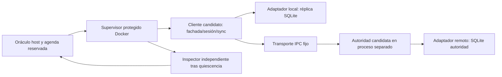
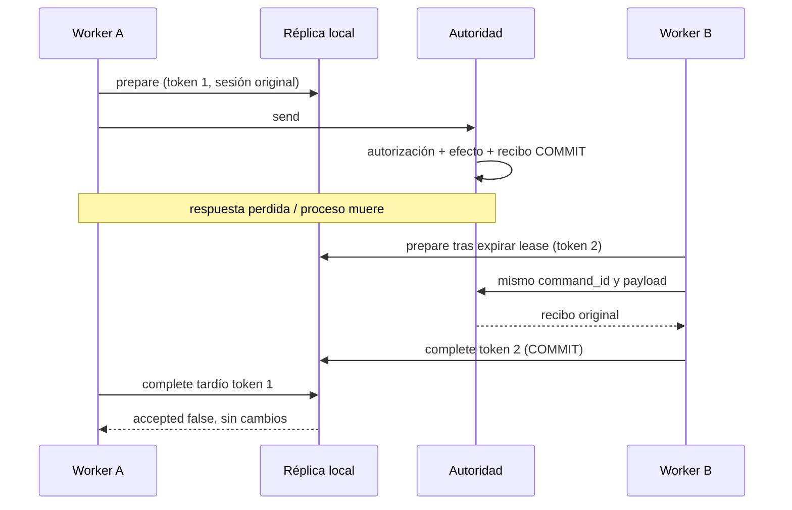

# Diseño — X13: ReserveLab offline multiusuario recuperable

- **Modo SDD:** standard
- **Fase:** 2 — Design
- **Estado:** propuesta para aprobación; sin implementación X13
- **Gate 1:** aprobado por el usuario («procede»)
- **Gate 2:** aprobado por el usuario («procede»)
- **Gate 3:** aprobado; implementación en curso
- **Dificultad:** 13 prevista, escala extendida original; no calibrada empíricamente

## 1. Decisiones y arquitectura

Proyecto Python stdlib + SQLite con fachada síncrona, sin UI ni red externa.
Dos réplicas locales comparten una autoridad remota simulada; transporte por IPC
fijo proporcionado. El candidato implementa la integración **y la lógica remota**.
Reloj lógico, fallos y barreras son públicos; su agenda de evaluación es reservada.
Serialización permitida, sin throughput exigido ni locks locales durante transporte.

Composition root `service.py` recibe LocalStore, AuthorityPort y ClockPort; no globals
de infraestructura. Validación/transiciones puras en domain, SQLite exclusivamente
en storage. El transporte no implementa deduplicación, permisos ni estados por ellos.

### Superficie de snapshot y entrega

| Archivo bajo `snapshots/X13/` | Estado base / responsabilidad candidata |
|---|---|
| `reservelab/domain.py` | DTOs/errores protegidos; validar comandos y resolver transiciones editables |
| `reservelab/storage.py` | Lecturas v1 operativas; implementar migración, atomicidad, claims y proyecciones |
| `reservelab/session.py` | Implementar generaciones durables, autorización local y aislamiento |
| `reservelab/sync.py` | Implementar claim/envío/ack, fencing y recuperación |
| `reservelab/authority.py` | Implementar apply, dedup, autorización, consultas y capacidad remota |
| `reservelab/service.py` | Queries/formato legado operativos; integrar captura y sincronización |
| `reservelab/__init__.py`, `ports.py`, `transport.py`, `faults.py` | Protegidos: interfaces, IPC, reloj/hook; sin solución de negocio |
| `test_public.py`, `fixtures/v1/*.json`, `CONTRACT.md` | Protegidos; fixtures sintéticos de entrada, no soluciones |

Son seis archivos editables con responsabilidades distintas, no una cuota de líneas.
Firmas/DTOs públicas fijadas por AST y allowlist; helpers privados permitidos dentro
de esos archivos. Tests propios bajo `candidate_tests/` editables pero no son oráculo.
Entrega multifichero valida paths, symlinks, tamaño, hashes y cambios fuera de scope;
no se aplica el ensamblado de tres métodos que usa `f10_support.reference_source`.

## 2. Contrato público v1 del ejercicio

El contrato se materializará como `catalog/contracts-x13.md` antes de calibración.
Las siguientes decisiones son su baseline; cambiar semántica requiere reabrir el gate.

### Valores y errores

IDs: str built-in no vacía, exacta, case-sensitive, sin normalización. Enteros exactos
(no bool): 0..2^63-1, quantity >=1; overflow ContractError sin cambios. Dict/list exactos,
sin campos extra, no mutar inputs; salidas nuevas JSON-compatible. JSON canónico ordena
claves; no compara serializaciones arbitrarias. Generaciones/versiones inician en 1.
Errores: ContractError, ConflictError, NotFoundError, AuthorizationError, SchemaError,
OfflineError, TransientError, InjectedCrash; errores SQLite se propagan con categoría.
Validación estructural precede autorización; autorización precede consulta/conflicto
de objetos ajenos para evitar revelar existencia. Ningún rechazo local cambia tablas.

### Identidades, comandos, recibos y vistas

`Principal={tenant,user,role}`; role reader/writer/admin o revoked (este último no inicia
sesión). El contexto local puede estar desactualizado; remoto verifica tabla members.
`Command={tenant,command_id,author,kind,reservation_id,owner,resource,quantity}`.
kind create: owner == author; resource/quantity presentes. kind cancel: owner del
objetivo declarado; resource/quantity null. Writer exige owner == author; admin puede
cancelar por otro owner. Si hay reserva, owner declarado debe coincidir con su dueño.
Cancelación anticipada autoriza por owner declarado y fija ese owner en el tombstone.
La creación retrasada debe coincidir con ese dueño; no puede sustituirlo.

Recibo: `{tenant,command_id,author,outcome,reservation}`; outcome confirmed/cancelled/
rejected, reservation vista autoritativa o null (denegado/sin objetivo creado).
`Reservation={tenant,id,owner,resource,quantity,state,version}`: state pending solo
local, confirmed/rejected/cancelled remoto; tombstone sin creación tiene resource/
quantity null. No se devuelve rol, contenido de otros usuarios ni payload de error.
Los recibos históricos son inmutables aunque su vista sea más antigua que la actual.

Identidad de comando `(tenant,command_id)` y de reserva `(tenant,id)`.
Crear con nueva command_id una reserva ya existente: recibo rejected, sin nuevo efecto,
incluida reserva previamente rechazada; no equivale a un reintento del comando original.
Crear tras tombstone devuelve rejected con vista cancelled, sin resucitar.
Cancelar una reserva rechazada/cancelada conserva estado terminal y no libera nada;
cancelar confirmed produce cancelled. Cancelar ausencia produce tombstone cancelled.
Versión global por tenant aumenta solo por transición efectiva de reserva; rechazos
sin cambio mantienen su versión o reservation null. Recibo y efecto remoto son atómicos.
Estado rejected por escasez queda retenido sin capacidad; nuevos IDs permiten reintento
de negocio. Rol revocado de un autor no cancela sus reservas ya confirmadas.

### APIs del candidato

| API | Semántica |
|---|---|
| `LocalStore(path).initialize(replica_id)` | Crear v2 o migrar v1; identidad estable, distinto replica_id conflict |
| `Service(local,remote,clock).login(principal)` | Activar contexto de captura/lectura y aumentar generación durable |
| `logout()` | Incrementar generación y borrar contexto activo; preservar datos/pendientes |
| `capture(command)` | Validar contexto/autor/rol, guardar intención y overlay pending atómicos; retorna comando original |
| `list_reservations()` | Solo propias o tenant si admin; orden `(id)`; AuthorizationError sin sesión |
| `list_pending()` | Solo autor activo, incluso admin; orden command_id; excluye delivered |
| `get_receipt(command_id)` | Propio o admin tenant; sin sesión AuthorizationError; ausente NotFoundError |
| `prepare(worker_id,now)` | Claim del menor command_id del autor activo; ticket o null |
| `send(ticket)` | Revalidar generación/lease/token antes de entrar al puerto; receipt o error |
| `complete(ticket,receipt)` | Validar vínculo y token; guardar recibo, delivered y proyección atómicos |
| `sync_one(worker_id,now)` | prepare/send/complete; un pendiente, receipt o null; errores transitorios recuperables |
| `refresh()` | Snapshot remoto autorizado; merge monotónico; no destruye overlay de pendientes |
| `Authority.apply(principal,command)` | principal identifica al author; permisos actuales en members; recibo durable |
| `Authority.snapshot(principal)` | Consultar vistas propias o tenant admin con autorización vigente |

APIs síncronas separadas hacen observable cambio de sesión, claim y llegada tardía.
send consume ClockPort actual; now debe igualar clock.now() para impedir reloj inventado.
El envío se considera iniciado al admitirlo durablemente con contexto/token válidos,
en una transacción local serializada con logout; una admisión anterior al cambio puede
alcanzar transporte después. No mantener la transacción durante IPC ni bloquear logout
por una respuesta pausada. Una admisión posterior al cambio no puede usar generación vieja.
Claim={command,worker_id,token,generation,lease_until}; lease dura 5 ticks; token entero
monotónico por pendiente. Expira si now >= lease_until; prepare incrementa token al reclamar
trabajo expirado. No retoma lease viva, ni usa wall clock. Un send ya entrado al puerto
puede completar tras logout: complete permite guardar en el contexto original únicamente
si token sigue vigente; jamás usa principal activo como destino. Token obsoleto retorna
`{accepted:false}` sin cambios; token vigente acepta `{accepted:true}` incluso con nueva
generación activa. El ack no revive sesión ni cambia su generación. Permisos reader
permiten recuperar recibos propios de comandos ya resueltos; revoked no recibe datos.

Duplicado remoto: tras comprobar pertenencia/autor o admin tenant, recuperar recibo
antes de exigir permiso de escritura vigente; payload distinto ConflictError. Un nuevo
comando de writer ahora reader/revoked obtiene recibo rejected, cero efecto. La denegación
revoked de snapshot/lectura es AuthorizationError. Un principal de otro tenant no se
convierte en identidad válida por incluir ese tenant en un payload.

## 3. Persistencia y migración

Regresión pública: `format_reservation(view)` retorna exactamente
`"{id} | {state} | {quantity}"` (quantity null se representa `-`); consultas legacy
filtran tenant/owner y ordenan por id, sin alterar objetos. En v1 solo hay confirmed,
rejected/cancelled o pending y las mismas reglas de formato; salidas contienen todos
los campos Reservation definidos arriba, sin claves nuevas por la migración.

Tablas v2 por réplica: metadata(replica_id,schema_version), session(singleton,tenant,
user,role,generation), local_reservations(tenant,id,owner,resource,quantity,state,version),
outbox(tenant,command_id,author,payload,state,token,worker,generation,lease_until),
receipts(tenant,command_id,author,payload); claves compuestas y FK tenant-aware.
Estado outbox pending/claimed/delivered; delivered y recibos se retienen. Overlay pending
se deriva de comandos no delivered, no reemplaza la versión autoritativa ni borra cancel
pendiente al llegar receipt antiguo. Si cancel es rechazado se retira solo su overlay.

Autoridad: members(tenant,user,role), resources(tenant,id,total,available), reservations
con vista v2, command_receipts, tenant_versions. DB remota separada: no ATTACH ni transacción
compartida con réplica. Writes BEGIN IMMEDIATE; conexiones por operación, FK/busy timeout
5000ms, cierre/rollback garantizados. Reads y schema encapsulados en storage.

v1 local: mismo metadata con schema_version=1; session sin generation; outbox sin token,
worker,generation,lease_until; mismas claves compuestas/vistas y recibos. Fixtures contienen
pending/delivered, sesiones o null y efecto remoto cuyo ack está perdido. No existe claimed
v1. Migración valida primero la estructura, tipos, FK, payloads y consistencia de recibos;
en una transacción convierte v2, genera session.generation=1, token=0 y campos claim null.
Solo después fija schema_version=2. Reapertura v2 idempotente; lectores legado adaptan
ambas versiones. Schema inválido/futuro: SchemaError antes de DDL y contenido intacto
(comparación lógica; no afirmar hash físico idéntico tras rollback SQLite válido).
Fixtures de autoridad ya son v2; no se incluye migración remota ni migración entre DBs.

### Cinco invariantes críticos

1. **Capacidad:** available = total − suma quantity confirmed por recurso/tenant, >=0.
2. **Identidad:** cada command_id tiene un payload/recibo durable y como máximo un efecto.
3. **Aislamiento:** cada lectura/escritura/delivery pertenece al principal autorizado original.
4. **Monotonía:** versiones no retroceden, cancelled no resucita y ack viejo no vence token nuevo.
5. **Atomicidad:** captura, efecto+recibo, ack+proyección y migración no quedan a medio aplicar.

## 4. Evaluación externa y aislamiento

Adaptador X13 nuevo sobre lifecycle F07: supervisor root, cliente UID65532,
autoridad candidata UID65530 y DB remota inaccesible al cliente, inspector UID65531.
Ambos procesos candidatos sin capacidades efectivas; no acceso al oráculo/evidencia.
La autoridad recibe identidad desde el transporte fijo, no de un parámetro editable
del worker. Credenciales son handles sintéticos del harness, nunca secretos reales.
Separación prueba lógica de negocio; revisión técnica X13 debe comprobar sus permisos.
Inspector valida tablas independientemente tras parar/recolectar procesos; no importa
código candidato. Observaciones en archivo comprimido protegido por grupo y hashes.
Barreras FIFO fijas permiten interleavings y continuidad de una llamada pausada; agenda
y estado del oráculo solo en host. No confundir scheduling confiable con lógica candidata.

Perfil inicial: red none, root read-only, sin mounts host/privileged, 1 CPU, 256MB,
64 pids, tmpfs 32MB, máximo 4 workers. Límites iniciales a calibrar: 2 tenants,
2 réplicas, 4 usuarios, 32 reservas, 96 comandos, 12 interrupciones/schedule, 256
pasos de recuperación, 48 schedules generados. Semillas fijadas antes de modelo.
Deadline de evaluación 600s independiente de generación, operación 15s, barrera 15s.
Si referencia no cabe: ajustar perfil/agenda y recalibrar antes de congelar; no elevar
cuotas silenciosamente ni contar error del harness como fallo candidato.

## 5. Testing adaptativo y calibración

TDD focalizado para nuevos seams/circuito/referencia; caracterización del legado.
Registrar baseline, RED relevante y GREEN en implementación; no afirmar TDD ahora.
Dos PBT Hypothesis solo en entorno evaluador: invariancia de proyección al permutar/
duplicar snapshots compatibles, y dedup al repetir comandos resueltos. Ejemplos de
escasez/carreras usan agenda y oráculo por pasos: distintos ganadores válidos, no
convergencia inventada al permutar comandos conflictivos.

| Familia | Evidencia y control negativo mínimo |
|---|---|
| C01 / R01–03,32 | Baseline v1 verde, paquete completo; mutación altera orden/formato |
| C02 / R04–06 | SQL aborta enqueue; mutación reserva local sin intención atómica |
| C03 / R07,09 | Reinicios/reintentos/conflictos; mutación dedup solo en memoria |
| C04 / R08,10–11 | Lost reply y trigger aborta ack; mutación delivered antes de receipt |
| C05 / R12–13 | Procesos escasos/cancel repetido; mutación restaura capacidad dos veces |
| C06 / R14–15 | Cancel primero/recibos permutados; mutación elimina tombstone |
| C07 / R16–19,27 | Logout en barrera, IDs repetidos; mutación publica ack en sesión nueva |
| C08 / R20–23 | Matriz roles/revocación/autor; mutación confía en rol capturado |
| C09 / R24–26 | Exit real 73, lease vencida/ack tardío; mutación ignora fencing token |
| C10 / R28–31 | Crash DDL/COMMIT, migración concurrente; mutación versión antes de datos |
| C11 / R33–34 | Mezcla v1/offline/revoke/switch/crash; mutación pierde cola al relogin |
| C12 / R35–40 | Fake E2E, hashes/quiescencia, aislamiento; control adulteración de observación |

Referencia debe pasar 11/11 funcionales y circuito válido; skeleton conserva baseline
pero no pasa feature completa. Cada mutación debe fallar su familia por la causa esperada.
C12 se prueba con fallos de harness deliberados; nunca se puntúa como capacidad del modelo.
Probes de escape/observaciones falsas invalidan integridad de entrega si son atribuibles
al candidato; fallos del supervisor invalidan ejecución. Reportar familias parciales sin
inventar 0/11 ante evaluación interrumpida. Éxito requiere todas las obligatorias.

## 6. Integración, quality bar y siguiente gate

Nuevos snapshot/evaluator/RPC/reference/calibration soportan X13 separadamente; extender
materialización, exportación, prompts multiarchivo y feature registry del piloto sin
cambiar CATALOG F01–F10. Review scope `pilot-X13` con hashes e imagen propias.
Código consultado: pilot.py (whitelist, 32 pasos, feature.py único), f10_support.py,
f10_rpc.py, f10_supervisor.py, review_gate.py y Dockerfile; no hay soporte X13 actual.
No ampliar el límite 32 en esta fase: presupuesto de generación pendiente de manifiesto
y kickoff explícitos, separado del límite de operaciones del evaluador.

Quality bar: capas/DI/tipos/errores/storage encapsulado, sin singletons ni catch vacío.
Excepción de I/O: CLI síncrona sin loop UI; paralelismo solo workers. RNF a verificar:
aislamiento, recuperación determinista, integridad de migración, regresión y metadatos.
Git diff check es verificación documental, no prueba funcional. Tasks mapea R01–R40
a waves y checks. Gate 2 aprobado; Tasks queda sujeto a Gate 3. Nivel recomendado BAJO.
