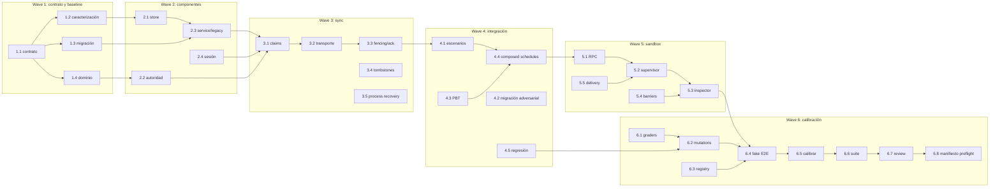

# Tareas — X13: ReserveLab offline multiusuario recuperable

- **Modo SDD:** standard
- **Fase:** Tasks
- **Estado:** implementación en curso
- **Gate 1:** aprobado
- **Gate 2:** aprobado
- **Gate 3:** aprobado por el usuario («procede»)
- **Intención:** implementar, calibrar y dejar preparado; no invocar modelos sin manifiesto/kickoff separado
- **Testing:** TDD focalizado para comportamiento nuevo y circuito; caracterización del legado; dos PBT reales solo en el evaluador

## Convenciones

### Resultado de aceptación suplementaria v2

Se implementaron y calibraron los seams que faltaban: carreras reales, respuestas
perdidas, muerte de procesos, migración interrumpida/concurrente y C12 dinámico.
36 casos, incluyendo 48 schedules; referencia positiva y 12 negativos Docker
calibrados; pilot E2E real con FakeActor 12/12, sin modelos.
La entrega guardada conserva sus hashes: **10/11 funcionales y C12 pass**, fallo
admin_create. Evidencia `.agent-lab/sdd-escalation/results/x13-level13-verdict.md`.
Suite 990 passed, 2 skipped, 1 deselected. Este resultado suplementario no cierra
automáticamente Gate 4 ni autoriza otra inferencia; no cambiar estados históricos.

### Checkpoint correctivo — 2026-10-08

Prevalece sobre el checkpoint «final» histórico: preparación X13 incompleta, Gate 4
pendiente. Se reprodujo/corrigió TypeError de entrega-objeto/Path; grading ya usa
contenedor real en vez de TrustedAdapter. Reevaluación suplementaria sin modelos
de `pilot-58532f40-2c65-4cf6-b8f1-5cb17ade823d`: fallo admin_create (R04/R20),
diez familias con casos parciales verdes, no 10/11 aprobado.
Referencia pasa los mismos testigos. Evidencia
`.agent-lab/sdd-escalation/results/x13-saved-delivery-verdict.md`.
985 tests de suite + 12 focalizados tras último ajuste; no se invocó modelo en esta
corrección. Runtime calibrated/operational false; revalidar cobertura, E2E real,
controles dinámicos C12 y revisión antes de nuevas inferencias.

- No marcar `[x]` sin archivo/evidencia real y checks observados. Para comportamiento nuevo: RED → GREEN mínimo correcto → refactor si justificado.
- La implementación X13 no altera catálogo, contratos ni resultados F01–F10. Todo estado, reporte y review de X13 usa namespace y hashes propios.
- Las entregas tienen varios archivos; no ampliar `PILOT_FEATURES`, usar F10 `feature.py` export o sus límites por conveniencia.
- Nunca importar/ejecutar candidato ni abrir sus SQLite en host. Host conserva oráculo y secretos; candidatos, autoridad y proceso de prueba corren en Docker separado con perfiles/UID explícitos.
- No usar red externa de negocio, tokens o modelo para snapshot, referencia, mutaciones, pruebas, revisión ni simulación. Instalar dependencia de testing fijada no es una llamada a modelo. Un intento real exige Gate 4 del preparatorio, review X13 vigente, manifiesto X13 completo y kickoff explícito distinto de Gate 3.
- No elevar presupuestos de generación; validar cuotas de evaluación por calibración antes de congelar contrato/imagen.

## Wave 1 — Congelar el contrato y baseline

- [ ] **1.1 [TDD focalizado]** RED: pruebas de estructura/fingerprints de `contracts-x13.md`, IDs R/C y allowlist; GREEN: congelar contrato X13 v1, errores, DTOs, tablas, ordenación, matriz reader/writer/admin/revoked y fixture de datos/autoridad; rechazar firmas/campos desconocidos (R01–R03, R07, R09, R20–R23, R28, R32, R35).
- [ ] **1.2 [Caracterización]** Capturar baseline de lectura/formato v1 verde, orden lexical, tenant/owner y claves compuestas antes de cambios; fijar fixtures públicos sintéticos y fixtures reservados separados (R02–R03, R32, R35).
- [ ] **1.3 [TDD focalizado]** RED: migración de cada fixture v1 y reinicialización; GREEN: esquemas locales/remotos, foreign keys, validación de datos y migración atómica idempotente v1→v2 con rollback lógico (R28–R31).
- [ ] **1.4 [TDD focalizado]** RED: contratos unitarios de validación y transiciones, sin SQLite; GREEN: estado/recibos/comandos y errores públicos según contrato, sin I/O en domain (R04–R07, R09, R12–R15, R20–R23).

## Wave 2 — Componentes locales, autoridad y legado

- [ ] **2.1 [TDD focalizado]** RED: captura online/offline, inválidos y SQL abortado; GREEN: `LocalStore` encapsula conexiones, captura atómica, overlay pending, lecturas filtradas y recibos no filtrantes (R04–R07, R18–R19, R27, R32).
- [ ] **2.2 [TDD focalizado]** RED: dos tenants con IDs repetidos, escasez concurrente, rechazo/autor revocado y payload conflictivo; GREEN: `Authority.apply/snapshot` aplica autorización vigente y efecto+recibo/capacidad en transacción remota única (R09, R12–R15, R20–R23).
- [ ] **2.3 [Caracterización + TDD focalizado]** Proteger lector/formato v1; RED: servicios integrados y cambios de formato/orden; GREEN: `Service` conserva queries legadas y entrega DTOs exactamente especificados sin mezclar pendientes o datos entre principals (R01–R03, R18–R20, R32).
- [ ] **2.4 [TDD focalizado]** RED: login/logout/cambio tenant bajo respuestas pausadas; GREEN: generación durable, alcance del principal, políticas reader/writer/admin/revoked y fencing de contexto (R16–R19, R20, R23, R27).

## Wave 3 — Outbox, reintentos y coordinación

- [ ] **3.1 [TDD focalizado]** RED: orden, no-op, acuse abortado, lease viva/vencida; GREEN: claim por menor command_id, token monotónico, lease lógica, expiración y transacciones locales encapsuladas (R08, R10–R11, R24–R26).
- [ ] **3.2 [TDD focalizado]** RED: efecto remoto con respuesta perdida y reenvío; GREEN: transporte comunica cliente↔autoridad sin permisos/dedup/negocio ocultos, receipt durable idempotente y error de transporte tipado (R08–R11, R20–R23).
- [ ] **3.3 [TDD focalizado]** RED: ack token viejo, logout en barrier, mismo command simultáneo de dos workers; GREEN: complete valida token/payload/origen y hace receipt+delivered+proyección atómicos sin transacción durante IPC (R10–R11, R16–R17, R24–R27).
- [ ] **3.4 [TDD focalizado]** RED: cancel antes de create, doble cancel y snapshot antiguo tras tombstone; GREEN: versiones monotónicas, tombstone terminal y precedencia sin revivir recursos/reservas (R13–R15, R33).
- [ ] **3.5 [TDD focalizado]** RED: agenda finita de caída/reinicio en cada límite, incl. os._exit worker; GREEN: proceso nuevo recupera y converge dentro de pasos límite, sin duplicar efecto ni ocultar fallos permanentes (R10–R11, R24–R26, R34).

## Wave 4 — Interacciones, migración y propiedades

- [ ] **4.1 [TDD focalizado]** RED: combinar fixture v1 con ack perdido, login de otro usuario, permiso revocado y recuperación; GREEN: mantener sesión/pendiente original, rechazar acción remota revocada y nunca publicar en principal distinto (R16–R23, R28–R31, R33–R34).
- [ ] **4.2 [P] [TDD focalizado]** Crash de migración, datos corruptos, futuras versiones y dos procesos inicializando; GREEN: v1/v2 recuperables, sin versión adelantada, sin DDL o cambios ante rechazo; probar lector v1/legacy (R28–R32).
- [ ] **4.3 [P] [PBT]** Hypothesis: reordenar/duplicar snapshots compatibles no cambia vista proyectada; reintentar comandos resueltos preserva recibo/efecto. Ejecutar en suite confiable del evaluador, no en código host candidato (R09, R14–R15, R23, R33).
- [ ] **4.4 [TDD focalizado]** Armar schedules composicionales de offline + escasez + revoke + switch + ack tardío + migration + restart; GREEN solo si invariantes y convergencia acotada se mantienen simultáneamente (R12–R19, R22, R24–R34).
- [ ] **4.5 [Caracterización]** Suite completa de comportamiento legado y casos inválidos comprueba consultas, permisos, salidas exactas, no-mutación y errores propagados tras integración (R06–R07, R18–R23, R31–R32).

## Wave 5 — Supervisor, RPC e inspector protegido

- [ ] **5.1 [TDD focalizado]** RED: protocolo rechaza paths/args/bytes inválidos, identidad indebida y respuesta desatada; GREEN: RPC de forma estricta con timeout/caps, lista de llamadas y errores cerrada; nunca ejecutar código candidato en host (R35, R37–R39).
- [ ] **5.2 [TDD focalizado]** Basado en lifecycle F07: perfil y supervisor X13 con cliente, autoridad y inspector UID separados, root read-only, sin red/privileged/mounts host/capabilities; procesos limitados, grupos Docker propios, quiescencia, timeout y cleanup verificable (R38–R39).
- [ ] **5.3 [TDD focalizado]** RED: inspector detecta efectos/filas adulteradas; GREEN: reconstrucción de observaciones desde DBs locales/remotas independientes, comparación por actor/tenant/command, hash por snapshot y capturas comprimidas protegidas (R21–R27, R37–R40).
- [ ] **5.4 [TDD focalizado]** Barreras FIFO y replay de schedules fijos permiten sostener/reanudar llamada para races, logout y muerte abrupta sin filtrar agenda al candidato (R16–R17, R24–R26, R33–R36).
- [ ] **5.5 [TDD focalizado]** Entrega multifichero valida allowlist, firmas AST, tamaño, path traversal, symlink y digest; package de evaluación solo exporta archivos publicados y no expone criterios reservados (R03, R35, R37–R39).

## Wave 6 — Evaluación, calibración y estado X13

- [ ] **6.1 [TDD focalizado]** Implementar 11 graders de familias funcionales con evidencia por subcaso; C12 valida circuito aparte. Estados pass/fail/invalid/pending conservan partials y evidencia; no llenar cero a un proceso interrumpido (R35–R40).
- [ ] **6.2 [TDD focalizado]** Crear referencia confiable y mutaciones, al menos una por C01–C12; cada mutation test pasa solo si detecta el defecto inyectado y el expediente señala la observación causante (R36–R40).
- [ ] **6.3 [P] [TDD focalizado]** Integrar feature registry X13 aditivo, snapshot materializer, prompt multiarchivo, delivery export, run namespace `pilot-X13`, digests y review fingerprints, sin alterar compatibilidad F01–F10 (R01, R03, R35, R39–R40).
- [ ] **6.4 [TDD focalizado]** E2E fake de fases/entrega/evaluación para X13; candidato referencial 11/11+C12 válido; skeleton conserva baseline legacy pero no pasa feature completa; confirmar snapshots públicos y privados separados (R02, R35–R40).
- [ ] **6.5** Calibrar workers, interrupciones, bytes, DB/volumen, pasos de evaluación y deadline propuestos; si referencia o mutation no cabe, ajustar perfil y escenarios, guardar hash y recalibrar todo antes de congelar; no elevar cuota automáticamente (R35–R39).
- [ ] **6.6** Ejecutar suite runner existente + nueva, snapshots baseline no-acceptance, compileall, diff-check y self-check: aislamiento, recuperación, integridad migración, regresión, metadatos; guardar outputs compactos en evidencia local (R01–R03, R32, R35–R40).
- [ ] **6.7** Crear informe de preparación X13 con hash de spec/contrato/snapshot, digest de imagen, revisión técnica de seguridad scope X13 y cleanup probado. Dejar claro que no es certificación ni autorización de modelo/consumo (R35–R40).
- [ ] **6.8** Preparar manifiesto X13 independiente con modelo/variante real, permisos, timeout/pasos/costo/tokens y política de procesos inválidos; preflight offline y detenerse a la espera de kickoff explícito separado. Ninguna prueba de calibración invoca modelo (R35, R39–R40).

## Grafo de waves

Cada wave espera la anterior; `[P]` marca tareas paralelas sin editar el mismo archivo/capa.

**Gate 3 aprobado:** autoriza implementación del preparatorio, no piloto ni gasto.
Implementar una tarea/wave y cerrar checks antes de la siguiente;
Gate 4 requiere implementación real, revisión y evidencia de calibración.

## Checkpoint de implementación — 2026-10-07 (final)

- Contrato/registry/snapshot X13: `catalog/contracts-x13.md`, `catalog/x13.json`,
  `snapshots/X13/`. Registry independiente, `ready_for_model:false`.
- **Docker 11 familias: 11/11 pass** con referencia confiable.
- **Docker mutations: 3/3 detectadas** (C01, C03, C06).
- **Mutaciones host: 11/11 detectadas** (una por familia C01–C11).
- **E2E fake: pass** — pipeline completo sin modelo.
- **C12 hostile: 7/7 pass** — path traversal, protected files, AST, symlinks, size.
- **Review X13: 0 blocking findings** — 28 archivos hasheados.
- **Runtime config: calibrated=true, operational=true.**
- **Pilot integration: X13 en PILOT_FEATURES**, entrega multiarchivo, dispatch evaluation.
- **Suite completa: 976 passed, 2 skipped.**
- Pendiente: manifiesto/limites + kickoff explícito para intento real de modelo.
