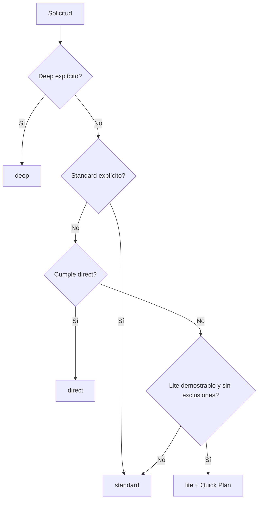
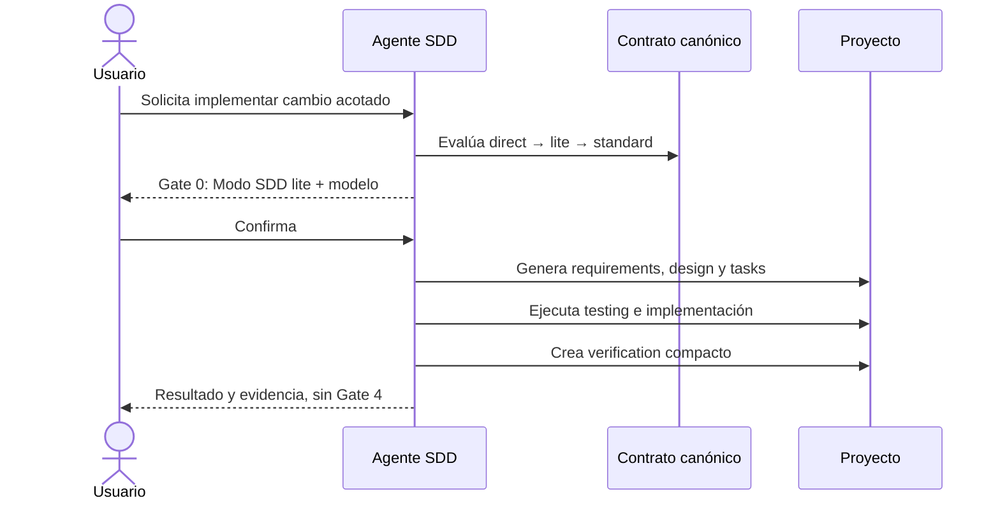

# Diseño — Modo lite de SDD

Modo de esta spec: `standard`

## Contexto y supuestos

SDD separa hoy tres profundidades (`direct`, `standard`, `deep`) y una variante
Quick Plan solicitada explícitamente. El cambio introduce `lite` entre `direct` y
`standard` y mueve Quick Plan dentro de ese modo como flujo exclusivo y obligatorio.

La fuente de verdad seguirá siendo `canonical/`; los árboles `generated/` se
producirán con `tools/render.py`. No se modifica el pipeline de render, el manifest
ni el esquema de adaptadores.

## Decisiones de diseño

| ID | Decisión |
|---|---|
| DD-01 | Las profundidades serán exactamente `direct`, `lite`, `standard` y `deep`. |
| DD-02 | Quick Plan será una capacidad exclusiva y obligatoria de `lite`; no será una profundidad ni una variante transversal. |
| DD-03 | `standard` seguirá siendo el fallback seguro y conservará su flujo interno y Gates 1–4. |
| DD-04 | `lite` tendrá Gate 0 bloqueante, omitirá Gates 1–3 y cerrará sin Gate 4. |
| DD-05 | La intención del usuario decidirá si `lite` solo planifica o también implementa. |
| DD-06 | Una implementación `lite` creará `verification.md` compacto; un plan sin implementación no lo creará. |
| DD-07 | Las specs `lite` nuevas se identificarán con `Modo SDD: lite`; no habrá migración automática de specs legacy. |
| DD-08 | Los bugfixes no triviales quedarán fuera de `lite`. |

## Modelo conceptual

SDD tratará cuatro ejes de forma independiente:

| Eje | Valores |
|---|---|
| Tipo de trabajo | feature, bugfix, exploración |
| Profundidad | direct, lite, standard, deep |
| Intención | planificar, planificar e implementar |
| Testing | sin test nuevo, caracterización/regresión, TDD focalizado, TDD estricto |

Quick Plan no será un valor de ninguno de esos ejes: será el procedimiento que se
activa cuando la profundidad resultante es `lite`.

## Selección de profundidad

Orden de precedencia:

1. `deep` explícito.
2. `standard` explícito.
3. `direct` cuando cumple todos sus límites actuales.
4. `lite` cuando se demuestran todos sus criterios y no existe exclusión.
5. `standard` como fallback ante riesgo, incompatibilidad o incertidumbre.

Una petición explícita de Quick Plan se interpreta como una solicitud de evaluar
`lite`; no fuerza el modo si sus límites no se cumplen. Las combinaciones
`direct + Quick Plan`, `standard + Quick Plan` y `deep + Quick Plan` se rechazan.

### Criterios positivos de lite

- Resultado observable claro.
- Sin decisiones funcionales relevantes pendientes.
- Alcance acotado a un componente, módulo o flujo conocido.
- Patrones existentes reutilizables.
- Varias tareas o criterios que justifican spec, pero no diseño por fases.
- Prueba o verificación viable.
- Reversibilidad sin migración compleja.

### Exclusiones de lite

- Contrato público, API o compatibilidad externa.
- Migración o cambio de esquema persistente.
- Decisión arquitectónica, subsistema nuevo o integración externa significativa.
- Coordinación relevante entre capas o módulos.
- Seguridad, privacidad, concurrencia, integridad crítica o compliance.
- Reglas funcionales ambiguas o refactor legado riesgoso.
- Bugfix no trivial.
- Ausencia de verificación viable.

## Flujo de gates

| Modo | Gate 0 | Gates 1–3 | Gate 4 |
|---|---|---|---|
| `direct` | Informativo, no bloqueante | No | No |
| `lite` | Bloqueante; muestra modo y flujo | No | No |
| `standard` | Bloqueante | Sí | Sí |
| `deep` | Bloqueante | Sí | Sí |

El Gate 0 de `lite` añadirá `Modo SDD: lite` y explicará que Quick Plan omite los
gates de fase. La confirmación permite continuar con el flujo previamente visible.

Si aparece una exclusión durante `lite`, el agente se detiene y propone
`standard`. La confirmación de reclasificación es obligatoria aunque ambos modos
recomienden el mismo nivel de modelo. Si también cambia el nivel, ambas
confirmaciones se combinan en una sola salida.

## Artefactos lite

### Planificación

Quick Plan genera en una pasada:

- `requirements.md`: comportamiento EARS y marcador `Modo SDD: lite`.
- `design.md`: contexto, solución acotada, errores y estrategia de pruebas.
- `tasks.md`: tareas trazadas, ciclo de pruebas y estado real.

No exige diagramas ni grafo de waves. Si estos son necesarios para entender una
decisión relevante, se reconsidera `standard`.

### Implementación y cierre

Cuando la intención incluye implementar:

- Se aplica `references/integrity-gate.md` antes de marcar tareas.
- Se ejecuta la estrategia de `references/testing.md`.
- Se crea `verification.md` compacto sin abrir una Fase 4 ni Gate 4.

Contenido mínimo de la verificación compacta:

- Estrategia de pruebas.
- RED o baseline observado.
- GREEN y suite final.
- Excepciones honestas.
- Matriz requisito → tarea → test/check → evidencia → estado.
- RNF declarados y aplicables; no se inventan cuotas.

## Reanudación y compatibilidad

- Las specs existentes no se reescriben ni migran.
- Una spec marcada `Modo SDD: lite` con tres archivos es un plan pendiente o
  planificado; con `verification.md` puede estar cerrada si su evidencia es válida.
- Una spec legacy de tres archivos sin marcador puede ser Quick Plan antiguo o
  `standard` incompleto; el agente pregunta antes de reanudar.
- Una petición explícita de `standard` o `deep` nunca se rebaja por encontrar poco
  alcance durante la exploración.

## Componentes y cambios

### Contrato canónico

- `canonical/skills/sdd-spec/SKILL.md`: taxonomía, selección, Quick Plan exclusivo,
  artefactos y gates.
- `canonical/agents/sdd.md`: clasificación por ejes y reglas inviolables.
- `references/model-selection.md`: modo visible en Gate 0, nivel típico de `lite`
  y confirmación de reclasificación.
- `references/testing.md`: cuatro profundidades y testing independiente.
- `references/templates.md`: plantillas compactas de lite.
- `references/integrity-gate.md`: cierre lite y evidencia durable.
- `references/quality-bar.md`: spot-check proporcional de lite sin alterar el de
  `standard`.

### Superficie pública

- Adaptadores SDD de Copilot, OpenCode, Kiro y Claude: descripción proporcional y
  no exclusivamente de cuatro fases.
- `docs/agentes/sdd.md`, `docs/agentes/README.md`, `docs/uso.md`,
  `docs/catalogo.md`, `docs/sdd-smoke.md` y `docs/mejoras.md`.

### Generación

`tools/render.py` copiará las referencias y renderizará agentes como hoy.
`tools/validate.py` verificará reproducibilidad. No requieren cambios.

## Errores y respuestas

| Situación | Respuesta |
|---|---|
| Quick Plan combinado con otro modo | Rechazar combinación y explicar exclusividad. |
| Quick Plan no elegible para lite | Proponer standard y esperar confirmación. |
| Exclusión descubierta durante lite | Detener estado pendiente y solicitar reclasificación. |
| Spec legacy ambigua | Mostrar la ruta y pedir el modo antes de continuar. |
| RED no observado | Registrar caracterización/cobertura, no TDD. |
| Verificación inviable | Escalar a standard si cambia comportamiento o riesgo. |

## Estrategia de pruebas

- Nivel: TDD focalizado sobre el contrato observable de prompts, referencias y
  artefactos generados.
- RED: ampliar primero `tools/test_sdd_contract.py` con los cuatro modos,
  exclusividad de Quick Plan, gates, artefactos, compatibilidad y propagación.
- GREEN: actualizar el contrato canónico mínimo y renderizar las cuatro plataformas.
- REFACTOR: evitar frases duplicadas; la skill conserva autoridad y las referencias
  contienen detalle bajo demanda.
- Suite: contrato SDD, recomendaciones de modelo, render/validate, integridad,
  enlaces y diff check.
- PBT: omitido; no existe un invariante algebraico ni un generador útil para este
  contrato textual.

## Requisitos no funcionales

- RNF-1 Portabilidad: las cuatro plataformas deberán reflejar el mismo contrato.
- RNF-2 Compatibilidad: specs legacy y flujo interno `standard` seguirán válidos.
- RNF-3 Auditabilidad: toda implementación lite tendrá evidencia durable.
- RNF-4 Proporcionalidad: `lite` no cargará gates ni documentos completos de
  `standard`.
- RNF-5 Mantenibilidad: la semántica común permanecerá en `canonical/`.

## Invariantes críticos

1. Quick Plan solo existe cuando `Modo SDD: lite`.
2. `standard` y `deep` nunca omiten Gates 1–4.
3. Planificar no autoriza implementar.
4. Ninguna tarea completada carece de artefacto o evidencia.
5. `generated/` nunca es fuente manual de verdad.

## Diagrama de selección

## Secuencia lite con implementación

## Excepciones al quality-bar

Ninguna. Los puntos de UI, persistencia, DI e I/O no aplican al contenido textual
del kit; se verificarán portabilidad, trazabilidad, testing y código mínimo.
