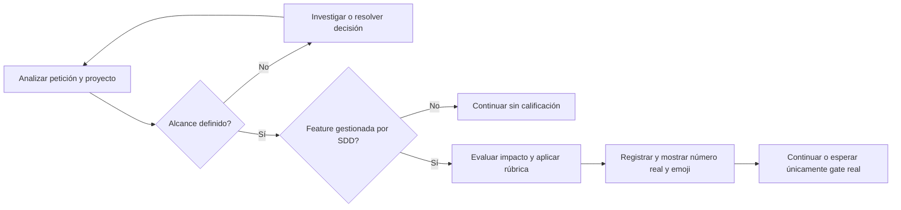

# Diseño — Nivel de feature exclusivo de SDD

Modo SDD: standard
Fase: Design
Estado: cerrado
Gate 2: aprobado por el usuario («procede»)

## Contexto y alcance

El kit distribuye prompts Markdown desde canonical mediante adapters y un render
determinista a seis plataformas. No existe un motor runtime que calcule dificultad:
SDD aplicará una rúbrica declarativa al alcance que haya investigado.

Se retira el contrato de recomendación de LLM de todas las interacciones vigentes,
incluido SDD. Se introduce una estimación ordinal de la feature completa exclusiva
del agente SDD. Las skills utilizadas desde otros agentes no habilitan la emisión.
Los campos de configuración del host como `model: inherit`, modelos de datos,
niveles de pruebas y severidades de hallazgos no forman parte de esta retirada.

## Decisiones

| ID | Decisión | Requisitos |
|----|----------|------------|
| D1 | Nueva referencia `sdd-spec/references/feature-level.md`; retirar las seis referencias model-selection, incluida SDD. | 1.1, 2.1, 3.4 |
| D2 | Rúbrica ordinal por anclas, no conversión BAJO/MEDIO/ALTO ni estimación de tiempo/modelo. | 1.1, 1.6 |
| D3 | Publicación después del análisis de alcance; deduplicación por alcance, no fase. | 1.2, 1.7, 1.8 |
| D4 | Conservar preflight técnico, gates reales, permisos y separación profundidad/testing. | 1.9, 2.4–2.7 |
| D5 | Contratos estáticos y escenarios manuales separados: no afirmar obediencia runtime a partir de tests de texto. | 3.3 |

## Rúbrica 1–10

SDD considera extensión del alcance, acoplamiento entre componentes, dificultad
técnica, impacto de fallos y esfuerzo de verificación/reversión. Usa evidencia
del proyecto: módulos afectados, contratos, integraciones, persistencia y tests.
No estima por número de archivos o líneas ni por capacidad del modelo disponible.

Selecciona el nivel más alto cuya descripción esté sustentada por la evidencia.
La rúbrica tiene anclas orientativas, no falsa precisión matemática. Si faltan
datos para conocer el alcance/impacto, investiga o pregunta antes de puntuar.

| Nivel | Ancla de dificultad e impacto |
|-------|-------------------------------|
| 1 | Cambio mínimo localizado, patrón directo, efecto y verificación inmediatos. |
| 2 | Cambio local pequeño con varios casos simples y reversión inmediata. |
| 3 | Comportamiento acotado de un componente con errores y pruebas conocidas. |
| 4 | Varios componentes de un módulo; coordinación interna limitada. |
| 5 | Feature de un módulo con integración existente y pruebas no triviales. |
| 6 | Varios módulos con patrones conocidos y dependencias controladas. |
| 7 | Cambio transversal significativo y coordinación amplia, sin factores de dificultad elevada descritos en 8–10. |
| 8 | Cambio transversal con contratos públicos, integración externa significativa o decisiones arquitectónicas relevantes. |
| 9 | Cambio de dificultad elevada con migración compleja, concurrencia, seguridad/privacidad sensible o legado riesgoso, con impacto amplio. |
| 10 | Cambio sistémico crítico: fallo o reversión puede comprometer integridad crítica, disponibilidad general o cumplimiento y requiere coordinación/verificación excepcional. |

Los factores de una fila requieren valorar su relevancia real: tocar una línea
de un contrato público no demuestra por sí solo dificultad 8. Tampoco un cambio
pequeño reduce un riesgo sistémico real. Registrar 1–3 motivos concretos junto a
la calificación permite explicar por qué se eligió esa ancla.

Formato de la línea visible, con el número real calculado:

```text
Nivel de feature: <n> <emoji>
```

- Entero 1–7 inclusive → 🟢; entero 8–9 → 🟠; entero 10 → 🔴.
- Sin cero, decimales, rangos o equivalencias a modelos.
- El color es agrupación visual, no certificación de seguridad ni autorización.
- Un nivel no selecciona automáticamente profundidad, testing o ejecutor.

## Momento de publicación y estado

| Modo | Punto de publicación |
|------|---------------------|
| direct | Tras examinar el cambio y resolver su alcance, antes de la edición; sin crear artefactos ceremoniales. |
| lite | Al concluir el análisis y definir alcance dentro de Quick Plan; incluirlo en el resumen del plan, sin pausa adicional. |
| standard | Al completar el análisis de Requirements y resolver decisiones esenciales de alcance; incluirlo en el resumen de Gate 1, sin exigir una aprobación separada del nivel. |

Gate 1 sigue aprobando requisitos, no la puntuación. Una iteración que cambie el
alcance permite recalcular después del nuevo análisis. Si Design revela impacto
material no conocido, se reevalúa y comunica el motivo en el resumen existente,
sin emitir calificaciones por fase o anticipadas para la siguiente tarea.

No se puntúan consultas, exploraciones o bugfixes automáticamente. En specs se
registra un bloque compacto en requirements: calificación, motivos y alcance
evaluado. El bloque se incorpora en las plantillas como condicional a una feature
analizada por SDD, no como marcador obligatorio para todas las specs.

Deduplicación: comparar el alcance evaluado y sus motivos con los registrados.
Al reanudar la misma spec, no repetir el nivel ya comunicado. No crear un registro
global, base de datos ni nueva infraestructura solo para controlar la emisión.



## Cambios por responsabilidad

### Fuentes compartidas

- Agente SDD y skill sdd-spec: reemplazar secciones LLM por preflight técnico y
  contrato de calificación, sin avisos de próxima fase ni cambio de modelo.
- integrity-gate: mantener marcadores, evidencia y gates; quitar niveles LLM.
- navigator-context y agent-routing: mantener disponibilidad/frescura Navigator y
  resolución de ejecutor antes de escribir; retirar obligaciones de aviso LLM.
- templates: bloque de nivel condicional en requirements, sin niveles por tarea.
- Architecture, Code Quality, Security, Data API, UI Design: retirar avisos,
  matrices y enlaces; mantener roles, límites y autorizaciones.
- Documentation Orchestrator: conservar preflight de intención, alcance,
  disponibilidad y frescura; quitar matriz de modelo, plantilla y deduplicación.
- Project Navigator: quitar avisos antes/después de procesos pesados, conservando
  permisos de bootstrap/update/export y reporte de artefactos/gaps.

### Distribución y documentación

- Limpiar las descripciones de Documentation Orchestrator en adapters de Copilot,
  OpenCode, Claude y Pi; no modificar campos de selección de modelo del host.
- Regenerar las seis plataformas del manifiesto con tools/render.py. El renderer
  reconstruye cada salida y elimina los recursos retirados. No cambiar renderer.
- Actualizar fichas, índices, documentación de uso y expectativas smoke vigentes.
- Los resultados antiguos de smokes se mantienen identificados como evidencia
  histórica, no como expectativas actuales. Specs históricas permanecen intactas.
- No reinstalar en el host: la actualización local requiere una operación aparte.

## Errores y límites

- Alcance ambiguo: preguntar por la decisión esencial; no inventar puntuación.
- Evidencia insuficiente: completar investigación; no mostrar nivel provisional.
- Cambio material: conservar el registro previo como antecedente breve y registrar
  la revisión; comunicar solo cuando se haya analizado el nuevo alcance.
- Recurso retirado aún presente en generated: fallar validación y regenerar.
- Instalación antigua: informar al cierre que el repo actualizado no actualiza
  automáticamente agentes ya cargados en el host.

## Estrategia de pruebas

- TDD focalizado del nuevo contrato declarativo: escribir checks y observar RED
  por ausencia del nuevo contrato y presencia del anterior; GREEN al modificar
  fuentes; refactor solo por duplicación real.
- Conservar test_model_recommendations.py como entrypoint compatible: invertir
  checks a ausencia de recomendaciones, exclusividad SDD y paridad generada.
  Mantener el nombre evita cambios ceremoniales en test_integrity e invocadores.
- test_sdd_contract: sustituir checks de matrices/preflight LLM por análisis antes
  de puntuación, rúbrica, límites/emoji, número real, deduplicación y separación
  modo/testing; mantener cobertura de Quick Plan, gates, routing e integridad.
- test_code_review_contract: retirar dependencias de matrices y mantener checks
  de autorización por micro-paso.
- test_retired_agents: cambiar el recurso fixture de symlink por una referencia
  realmente distribuida, preservando cobertura de seguridad.
- Validar tablas declaradas y ejemplos de límites 1, 7, 8, 9 y 10 contra el texto
  real; no inventar una función runtime de puntuación solo para probarla.
- Checkear fuente, adapters y generated por patrones específicos de avisos LLM;
  no prohibir genéricamente palabras modelo/nivel o menciones históricas.
- Regresión: documentation-core, handoff, retired-agents, integridad, validación,
  enlaces y plataformas. Registrar comandos/resultados, no solo casillas.
- Smoke manual: alcance abierto sin nivel; feature analizada con número real;
  paso de fase sin repetición; cambio material con reevaluación; especialista sin
  aviso; pausa real por autorización. No declarar estos escenarios ejecutados si
  solo se revisó su definición.
- PBT no aplica: comportamiento principal declarativo/LLM sin motor algebraico.

## RNF verificables

- RNF-1: Todas las salidas de plataformas del manifiesto coinciden con render de
  canonical/adapters; ninguna contiene los recursos model-selection retirados.
- RNF-2: Ningún prompt operativo exige emitir recomendación LLM o pausar por ella.
- RNF-3: Los gates reales, las autorizaciones de Git/remediación/export y los
  límites de cada agente conservan pruebas de regresión.
- RNF-4: No quedan enlaces operativos rotos a referencias retiradas.
- RNF-5: Cambios previos ajenos, specs históricas e instalaciones del host quedan
  fuera del diff de implementación.

## Quality bar e invariantes

Capas: canonical/adapters → render → generated; sin dependencia inversa.
DI, persistencia de aplicación, UI e hilos no aplican: no se introduce servicio,
singleton, almacenamiento o framework. Errores se reportan con salida no cero en
validadores existentes; no se añaden abstracciones anticipadas.

Invariantes: solo SDD publica; nunca antes del análisis; número real 1–10 y emoji
correcto; ninguna pausa por modelo/calificación; calificación no omite gates.

## Alcance pendiente de aprobación

Este diseño propone la rúbrica y el momento de publicación; no los considera
aprobados por la mera aprobación previa de Requirements. Implementación solo
después de Gate 2 y el plan de Tasks aprobado en Gate 3.
