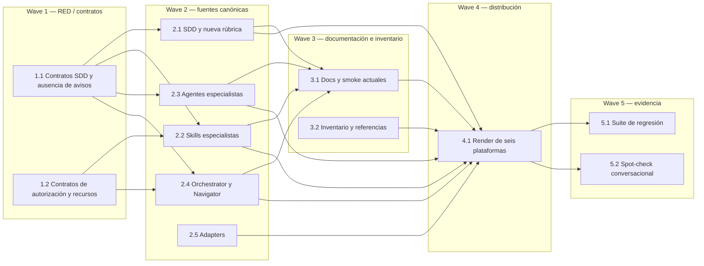

# Tareas — Nivel de feature exclusivo de SDD

Modo SDD: standard
Fase: Verification
Estado: completado
Gate 3: aprobado por el usuario («procede»)

## Plan de implementación

- [x] 1.1 [TDD focalizado] RED: checks del nuevo contrato fallaron inicialmente porque `generated/` aún distribuía matrices antiguas y no contenía `feature-level.md`; GREEN tras aplicar canonical/adapters y `python3 -B tools/render.py`. Evidencia y límites en `implementation-evidence.md` (Req 1.1–1.9, 2.1–2.7, 3.3–3.4).
- [x] 1.2 [P] Adaptar `tools/test_code_review_contract.py`, `tools/test_retired_agents.py` y checks relacionados: retiradas dependencias a matrices, reemplazado el fixture por una referencia distribuida actual y conservadas autorizaciones/seguridad de symlink (Req 2.5–2.6, 3.4).
- [x] 2.1 [TDD focalizado] Actualizar contratos SDD y referencias, crear `references/feature-level.md` con rúbrica/contrato, retirar `model-selection.md`; la emisión se limita al agente SDD (Req 1.1–1.9, 2.1–2.7, 3.1).
- [x] 2.2 [P] Retirar avisos y matrices de architecture, code-quality, data-api, security y ui-design; preservar autorizaciones y responsabilidades restantes (Req 2.1–2.7, 3.1, 3.4).
- [x] 2.3 [P] Limpiar avisos de los agentes code-review, data-api, ui-design y documentation-orchestrator; preservar preflights técnicos y decisiones reales (Req 2.1–2.7, 3.1).
- [x] 2.4 [P] Retirar recomendaciones en documentation-orchestrator y project-navigator; mantener intención, frescura, export opt-in y permisos (Req 2.1–2.7, 3.1, 3.4).
- [x] 2.5 [P] Limpiar descripciones de adapters Copilot, OpenCode, Claude, Pi y Antigravity; conservar campos de host/modelo (Req 2.1, 2.7, 3.1).
- [x] 3.1 [P] Actualizar documentación vigente y smoke docs; la evidencia antigua de recomendaciones permanece señalada como histórica (Req 1.1–1.9, 2.1–2.7, 3.2, 3.5).
- [x] 3.2 Mantener el entrypoint `test_model_recommendations.py`, invertir su contrato y revisar referencias a matrices retiradas (Req 3.3–3.4).
- [x] 4.1 Regenerar `generated/` para las seis plataformas desde canonical/adapters; no editar salidas manualmente (Req 3.1, 3.4).
- [x] 5.1 Ejecutar contratos, validadores, integridad, suites de instalación y registrar resultados en `implementation-evidence.md` (Req 3.3–3.4).
- [omitido: 5.2 smoke interactivo multi-plataforma no ejecutado en hosts instalados; los contratos estáticos y la suite no demuestran conducta runtime del modelo] (Req 1.1–1.9, 2.1–2.7, 3.3).

## Grafo de waves

## Exclusiones operativas

- No cambiar ni seleccionar el modelo del host.
- No reinstalar automáticamente los artefactos en el entorno personal.
- No alterar modificaciones previas del laboratorio ni `.security/`.
- No migrar specs o resultados históricos a la nueva calificación.
- No eliminar confirmaciones de decisiones funcionales, permisos o acciones destructivas.

Implementación autorizada por Gate 3 y completada. Verification registrada en
`verification.md`; solo resta el Gate 4.
