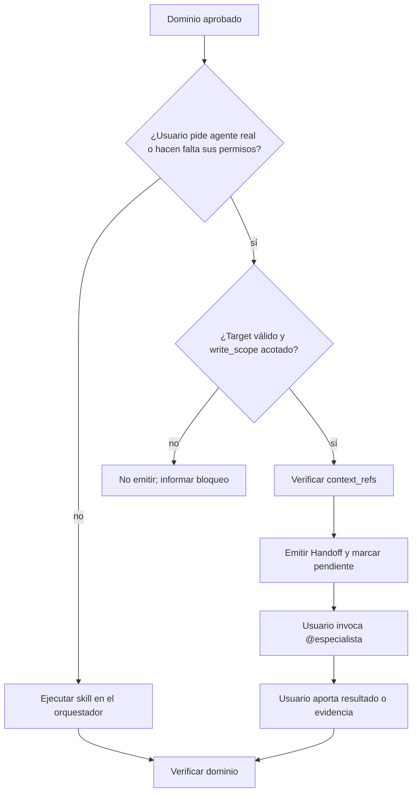
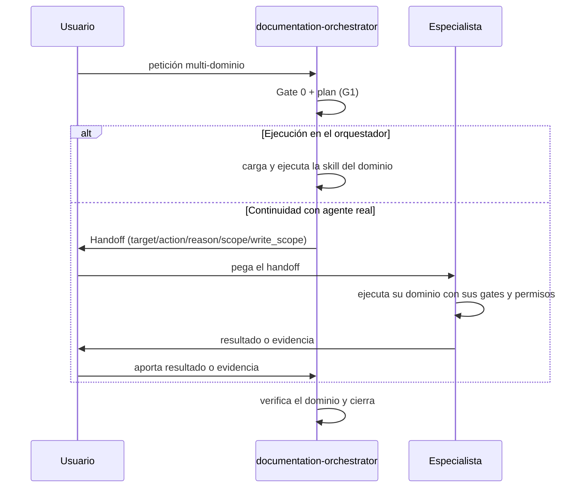

# Diseño — Orquestación con handoff canónico

Feature: `orquestacion-handoff-canonical`
Modo: `standard`

## Contexto y supuestos

- El kit es un pipeline `canonical/ + adapters/ → render.py → generated/ → install`.
  Las skills se copian como árbol completo (`shutil.copytree`), por lo que un
  archivo nuevo en `references/` se propaga a las tres plataformas **sin tocar
  `render.py`**.
- La orquestación de este incremento es **portable por texto**: el orquestador
  emite un bloque Markdown que el usuario copia o invoca como `@especialista`.
  No se introducen APIs de subagentes.
- Supuestos heredados de `requirements.md` (D1–D8): solo `documentation-orchestrator`
  emite; los especialistas no; sin carpeta nueva de delegación.

## Arquitectura (capas de cambio)

| Capa | Cambio | Archivo |
|------|--------|---------|
| Contrato | NUEVO: formato y reglas del handoff | `canonical/skills/documentation-orchestrator/references/handoff.md` |
| Procedimiento | EDITAR: instrucción mínima de emisión | `canonical/skills/documentation-orchestrator/SKILL.md` |
| Rol | EDITAR: una línea en el agente | `canonical/agents/documentation-orchestrator.md` |
| Validación | NUEVO: test de contrato | `tools/test_handoff_contract.py` |
| Validador | NUEVO: parser y reglas semánticas | `tools/handoff_contract.py` |
| CI | EDITAR: paso de ejecución | `.github/workflows/ci.yml` |
| Guía (opcional) | EDITAR: nota de uso | `docs/agentes/documentation-orchestrator.md` |

`generated/` se regenera; `validate.py` no cambia (el contrato no introduce tokens).

## Componentes / módulos

### 1. Contrato de handoff (`references/handoff.md`)

Define el bloque portable, su propósito de continuidad y la regla de una sola vía:
el orquestador ejecuta la skill **o** deriva al agente real, nunca ambas. Formato:

```markdown
## Handoff
- handoff_id: HND-20260903-001
- source: documentation-orchestrator
- target: security
- action: sync
- handoff_reason: el usuario solicita continuar con el Security Agent
- project_root: .
- scope: .security/
- context_refs:
    - .architecture/README.md
    - .data/06-sensitive-data.md
- write_scope: .security/
- requires_confirmation: true
- gate_state: [Gate0 aprobado, plan global aprobado]
- status: pending
```

Campos:

| Campo | Obligatorio | Regla |
|-------|-------------|-------|
| `handoff_id` | sí | correlación entre emisión y resultado |
| `source` | sí | agente emisor |
| `target` | sí | ∈ {`project-navigator`, `architecture`, `data-api`, `ui-design`, `code-quality`, `security`} |
| `action` | sí | ∈ {`inspect`, `bootstrap`, `sync`, `audit-documentation`} |
| `handoff_reason` | sí | por qué debe intervenir el agente especialista real |
| `project_root` | sí | raíz relativa al workspace y segura |
| `scope` | sí | carpeta(s) canónica(s) del dominio |
| `context_refs` | sí | rutas existentes, relativas al proyecto y sin `..` |
| `write_scope` | sí | `none` en lectura; si escribe, ⊆ carpeta canónica del `target` |
| `requires_confirmation` | sí | `false` solo en lectura; `true` si escribe |
| `gate_state` | no | gates del origen; nunca omite gates del especialista |
| `status` | sí | `pending` en la emisión |

### 2. Instrucción de emisión (`SKILL.md`)

- En **"Flujo tras Gate 0"**, elegir por dominio una sola vía: ejecución local de
  la skill o handoff al agente real. Tras el handoff, esperar resultado/evidencia.
- En **"Referencia bajo demanda"**, añadir la referencia al contrato.
- Sin copiar el formato completo en el prompt (H3: coste acotado).

### 3. Agente (`canonical/agents/documentation-orchestrator.md`)

Añadir la regla de una sola vía y la espera de evidencia tras el handoff.

### 4. Test de contrato (`tools/test_handoff_contract.py`)

Suite `unittest` separada del parser/validador:

- `handoff.md` existe en canonical y se genera byte-idéntico en las 3 plataformas.
- Contiene los 11 campos obligatorios de emisión y `gate_state` opcional.
- Declara los `target` válidos y las exclusiones (commit/push/tag/release,
  remediación security/quality, implementación de código, Graphify).
- `SKILL.md` referencia `references/handoff.md`, prohíbe duplicar la acción y
  sitúa la derivación antes del cierre global.

### 5. Receptores y validador semántico

- Los seis agentes documentales aceptan solo handoffs dirigidos a su ID,
  preservan gates y devuelven `Handoff Result` correlacionado.
- `tools/handoff_contract.py` parsea bloques Markdown y valida campos, acciones,
  target→scope, confirmación, rutas, symlinks, bootstrap y resultados.

## Modelo de datos

El contrato es Markdown parseable. Emisión y resultado se correlacionan por
`handoff_id`; `project_root` acota rutas y `status` representa el ciclo básico.
No hay persistencia ni carpeta `.delegation/`.

## Errores y edge cases

| Caso | Comportamiento |
|------|----------------|
| `target` no es especialista documental | no emitir |
| `write_scope` fuera de la carpeta del dominio | no emitir |
| dominio sin carpeta existente | recomendar bootstrap, no crear |
| `requires_confirmation` omitido con escritura | handoff inválido |
| solo lectura con `write_scope` distinto de `none` | handoff inválido |
| ruta absoluta, externa o con `..` | handoff inválido |
| `gate_state` pretende omitir un gate del especialista | ignorar esa aprobación; aplicar gate |
| token `{{...}}` en el contrato | rechazado por `validate.py` (ya cubierto) |

## Requisitos no funcionales (RNF)

- **RNF-1 Coste:** contrato en `references/` (bajo demanda); delta medible con
  `tools/measure_context.py` y aprobado.
- **RNF-2 Portabilidad:** bloque Markdown, sin APIs de subagentes.
- **RNF-3 Seguridad:** sin secretos; `write_scope` ⊆ carpeta del dominio.
- **RNF-4 Idempotencia:** repetir una coordinación sin cambios no produce escrituras.
- **RNF-5 Trazabilidad:** `context_refs` y `evidence` citan rutas reales.

## Estrategia de pruebas

- **Nivel:** validador semántico + tests positivos/negativos; no hay código de
  producto, pero sí código de herramienta en `tools/handoff_contract.py`.
- **Justificación:** contrato Markdown parseable con validación de campos, rutas,
  confirmación, scopes, correlación y ejemplos; integrado en CI.
- **Excepción al testing.md:** no aplica TDD focalizado porque no hay
  comportamiento observable nuevo en runtime; el "test" es el validador del contrato.

## Invariantes críticos (0)

Ninguno: sin invariante algebraico; el contrato se valida por estructura, no por
propiedad matemática.

## Excepciones al quality-bar

El cambio es de **prompts y documentación**, no de código de negocio. Citan
excepciones a los ítems que no aplican:

- Ítems 1–7 (capas, DI, singletons, I/O, errores, persistencia, RNF de código):
  **no aplican** — no se introduce código de producto.
- Ítem 8 (testing adaptativo): aplicado como validador estático (ver Estrategia).
- Ítems 9–11 (PBT, tipado, límite de diseño): **no aplican** a un contrato Markdown.
- Ítem 10 (proporcionalidad): cumplido — `design.md` ~200 líneas, 1 flowchart + 1 sequence.
- Ítem 12 (código mínimo): cumplido — validador puro + suite, sin capas anticipadas.

## Diagramas

### Flowchart — emisión del handoff



### Sequence — flujo portable entre plataformas



## Impacto de contexto final

- Agentes: +233 palabras (orquestador + seis receptores).
- Skill del orquestador: +112 palabras.
- Referencia: +742 palabras bajo demanda.

Verificado con `tools/measure_context.py`; no equivale a tokens por tarea.
