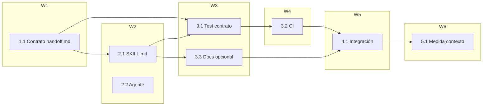

# Tareas — orquestacion-handoff-canonical

Modo `standard`. Estrategia de pruebas: **validador estático de contrato** (sin
TDD de comportamiento: no hay código de runtime nuevo; el "test" es el validador
del contrato, mismo patrón que `test_sdd_contract.py`).

## Tareas

- [x] 1.1 Crear `canonical/skills/documentation-orchestrator/references/handoff.md`:
  formato de emisión y resultado correlacionado, campos obligatorios, `gate_state`
  opcional, targets válidos y exclusiones. (Req H2, H3, H4 · RNF-2, RNF-3, RNF-5)

- [x] 2.1 [P] Editar `canonical/skills/documentation-orchestrator/SKILL.md`:
  añadir paso de emisión en "Flujo tras Gate 0" y referencia en "Referencia bajo
  demanda". Solo 2–3 líneas; sin copiar el formato completo. (Req H1, H3 · RNF-1)

- [x] 2.2 [P] Editar `canonical/agents/documentation-orchestrator.md`:
  añadir una línea de emisión de handoff en alcance/ejecución. (Req H1)

- [x] 3.1 Crear `tools/test_handoff_contract.py`:
  - `handoff.md` existe y se genera byte-idéntico en las 3 plataformas;
  - contiene campos obligatorios y opcionales;
  - declara targets válidos y exclusiones;
  - `SKILL.md` referencia `references/handoff.md`. (Req H6)
  (Depende de 1.1 y 2.1)

- [x] 3.2 Editar `.github/workflows/ci.yml`: añadir paso
  `python tools/test_handoff_contract.py`. (Req H6)
  (Depende de 3.1)

- [x] 3.3 [opcional] Editar `docs/agentes/documentation-orchestrator.md`:
  añadir nota sobre la emisión de handoff. (Req H2)

- [x] 4.1 Integración: `python tools/render.py` → `python tools/validate.py` →
  `python tools/test_handoff_contract.py` → `python tools/test_sdd_contract.py` →
  `python tools/test_integrity.py`. `validate.py` verifica la paridad con un render
  temporal; `git diff --exit-code -- generated/` aplica después de establecer un
  baseline commiteado, no durante un cambio intencional de `generated/`.
  (Req H6 · RNF-2)

- [x] 5.1 Medir contexto con `tools/measure_context.py` (antes/después) y registrar
  el delta de agentes, skills y referencias para aprobación. (Req H5 · RNF-1)

## Ajustes post-auditoría H1–H3

- [x] 6.1 Corregir la redundancia: una sola vía por acción (skill local o handoff)
  y espera de evidencia tras derivar. (Req H1 · RNF-4)
- [x] 6.2 Sustituir `mode` por `action` + `handoff_reason` y definir un vocabulario
  portable de acciones. (Req H2 · RNF-2)
- [x] 6.3 Situar la decisión de handoff dentro del flujo por dominio, antes del
  cierre global. (Req H1)
- [x] 6.4 Definir solo lectura (`write_scope: none`), rutas relativas seguras y
  no herencia de gates. (Req H2, H4 · RNF-3)
- [x] 6.5 Regenerar, validar, medir el delta final y repetir la auditoría completa.
- [x] 6.6 Añadir `handoff_id`, `project_root`, resultado correlacionado y protocolo
  receptor en los seis agentes documentales. (Req H1, H2 · RNF-2, RNF-5)
- [x] 6.7 Implementar validador semántico y casos negativos de campos, acciones,
  confirmación, rutas, symlinks, bootstrap y resultados. (Req H4, H6 · RNF-3)
- [x] 6.8 Ampliar el smoke productor–receptor y documentar que `write_scope` no es
  enforcement técnico. (Req H2, H4 · RNF-2, RNF-3)
- [x] 6.9 Endurecer parser/resultados: texto libre, tipos, symlinks de bootstrap,
  evidencia dentro del scope y validación del handoff original. (Req H4, H6 · RNF-3)

## Grafo de waves

## Secuencia por dependencias

1. `1.1` (contrato) — base.
2. `2.1` (SKILL.md) y `2.2` (agente) — en paralelo tras el contrato.
3. `3.1` (test) — necesita contrato y referencia en SKILL.md.
4. `3.2` (CI) — necesita el test; `3.3` (docs) — opcional.
5. `4.1` (integración) — render, validate y suites.
6. `5.1` (medida) — al cierre, con todos los cambios aplicados.

## Notas de integridad

- Ninguna tarea se marca `[x]` sin el artefacto en disco: el contrato creado, el
  SKILL.md editado, el test presente y pasando, el CI con el paso añadido.
- `5.1` no es opcional: es el RNF-1 del spec (coste medible y aprobado).
- Si el delta de contexto supera lo esperado, se revisa `2.1` antes de cerrar.
