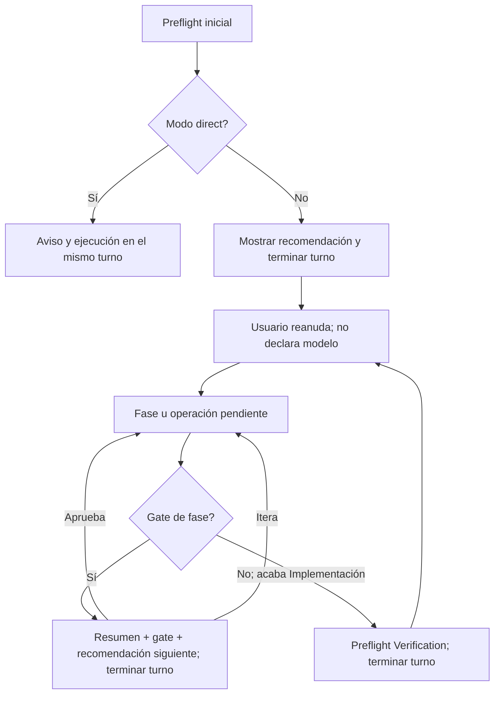

# Diseño — Pausa tras recomendaciones de modelo en el kit

Modo SDD: standard
Fase: Design
Estado: aprobada (ampliación multiagente)
Gate 2: aprobado (usuario: «adelante»)

## Enfoque

El contrato vigente instruye expresamente continuar tras el preflight en el
agente canónico, la skill y `references/model-selection.md`; documentación,
smoke y tests contractuales repiten esa política. Se cambiarán las fuentes
canónicas y se regenerarán los adaptadores, sin tocar specs históricas cerradas
ni añadir un mecanismo de elección automática de modelo.

### Estados y límites del turno

- El preflight inicial es Gate 0 informativo: la pausa es el fin de turno, no un
  gate de aprobación del nivel. «Continúa», sin dato del modelo, basta para
  reanudar. El agente no puede detectar ni cambiar el modelo activo.
- En `standard`/`deep`, los Gates 1–3 existentes son la pausa entre fases; al
  aprobar uno de ellos se inicia la siguiente fase sin un segundo aviso/turno.
- El salto Implementación → Verification no tiene gate: la recomendación de
  Verification termina el turno y la ejecución espera un nuevo mensaje.
- `lite` pausa una vez antes de Quick Plan, sin Gates 1–4; `direct` no pausa.
- Si cambia el riesgo antes de ejecutar, se recalcula y comunica la recomendación
  actualizada. Si se requiere cambiar el flujo SDD, se mantiene la aprobación
  específica de reclasificación. No se exige confirmar qué modelo eligió el usuario.

## Componentes y archivos

1. `canonical/skills/sdd-spec/SKILL.md`: especifica fin de turno en Gate 0 y
   Verification; mantiene reglas de gates y reanudación.
2. `canonical/agents/sdd.md`: evita la contradicción de mayor precedencia en el
   adaptador y delega detalles a la skill.
3. `canonical/skills/sdd-spec/references/model-selection.md`: define la secuencia
   mínima de salida y pausa por modo, sin solicitar confirmación de nivel.
4. `docs/agentes/sdd.md` y `docs/sdd-smoke.md`: explican cómo cambiar de modelo
   manualmente y reproducir la pausa con dos turnos.
5. `tools/test_sdd_contract.py`: sustituye expectativas de continuación inmediata
   por checks de pausa y conservación de gates; `tools/render.py` genera copias de
   las cuatro plataformas desde `canonical/`.

### Agentes adicionales y precedencia

Los cinco especialistas (`architecture`, `code-quality`, `data-api`, `security`,
`ui-design`) ya tienen dos rutas de aviso: tareas puntuales no bloqueantes y
operaciones pesadas con hard stop antes de herramientas. Se cambia solo la primera
para que termine el turno igual que la segunda; las reglas de nivel y riesgo siguen
en cada `references/model-selection.md`. Como los agentes deben recomendar antes de
cargar la skill, alinear las tres capas para cada especialista:

- `canonical/agents/<id>.md`: la primera respuesta anuncia el nivel y termina el
  turno para toda operación aún no confirmada; para lo pesado sigue prohibida la
  inspección previa a la respuesta, incluida la skill.
- `canonical/skills/<id>/SKILL.md`: reemplazar «sin bloquear»/«para lo puntual
  continúa» por pausa y reanudación sin modelo declarado; no omitir gates propios.
- `canonical/skills/<id>/references/model-selection.md`: marcar hard stop en las
  filas de trabajo puntual, conservando costo de preflight y no repitiendo aviso
  ante handoff ya cubierto por Documentation Orchestrator para el mismo alcance.

`documentation-orchestrator` conserva su Gate 0 y `project-navigator` su aviso
antes de procesos pesados; ambos ya terminan el turno. Revisar que «continúa»
baste y que una recomendación orquestada satisfaga solo el aviso de modelo, nunca
un gate de alcance, escritura o seguridad. El aviso final de Navigator no crea
una operación posterior a bloquear. `git-release-manager` no recomienda niveles:
mantenerlo sin un Gate 0 nuevo.

Los tests de `tools/test_model_recommendations.py` cubren los cinco especialistas,
el estado previo de Orchestrator/Navigator, la excepción de Git y paridad generada;
`tools/test_sdd_contract.py` cubre el flujo SDD. Documentar casos manuales de dos
turnos en los agentes afectados, con prueba de no duplicación en handoff.

No hay nuevos modelos de datos ni persistencia. El único estado reanudable es la
fase pendiente ya reflejada en la spec y su gate; la pausa no añade un marcador de
«modelo confirmado». La conversación determina si el usuario ha respondido al
aviso. Para una spec existente, sus marcadores de fase/gate prevalecen sobre la
existencia de archivos aislados.

En los otros agentes tampoco se persiste un estado de elección de modelo; la
respuesta de continuación reanuda el trabajo pendiente, mientras el alcance
de los gates propios permanece independiente.

## Errores y excepciones

- Si la respuesta al Gate 0 pide aclarar alcance, se aclara antes de ejecutar la
  fase; no se interpreta como aprobación de un gate inexistente.
- Si se itera un gate, la recomendación siguiente queda anulada hasta la siguiente
  transición. Si una aprobación es ambigua, se aclara solo el gate.
- Si la spec no permite determinar la fase pendiente, se pregunta qué spec/fase
  continuar, sin iniciar trabajo ni inventar un nivel.
- Si la recomendación ya fue presentada por Orchestrator para el mismo alcance
  y hubo reanudación, el especialista no repite aviso, pero conserva sus gates.
- No se actualiza retroactivamente la spec histórica de recomendación por fase.

## Pruebas y barra de calidad

### RNF de coherencia del contrato (derivados de REQ-004, REQ-012, REQ-019 y REQ-020)

- RNF-1: Ningún agente cambia el modelo del host ni exige declarar qué modelo se
  eligió para reanudar tras la pausa.
- RNF-2: Las cuatro plataformas generadas pasan `tools/validate.py` con sus
  artefactos coincidentes con las fuentes canónicas.
- RNF-3: No se incorporan gates de aprobación de nivel ni se omiten gates SDD,
  de alcance, escritura o micro-remediación existentes.
- RNF-4: Cada matriz de especialista tiene una sola recomendación previa a cada
  operación del mismo alcance, y una reanudación orquestada no la duplica.

Estrategia: TDD focalizado para las reglas de comportamiento documentadas en
contratos; observar RED en tests textuales por preflight inicial, transiciones,
Verification y avisos puntuales de los cinco especialistas; luego GREEN y suite.
Smoke manual de dos turnos comprueba conducta real tras instalar (los tests
textuales no la garantizan). Orchestrator, Navigator y Git se protegen con
contratos de no regresión, sin crear avisos adicionales.
No PBT: el flujo conversacional no tiene invariantes algebraicas relevantes.

Invariantes de aceptación:

1. Nunca se solicita declarar o confirmar el modelo elegido.
2. Solo se recomiendan `BAJO`, `MEDIO` o `ALTO` para el proceso siguiente.
3. Los Gates 1–4 conservan su propósito y no se agrega un gate de modelo.
4. `direct` permanece no bloqueante; Quick Plan sigue exclusivo de `lite`.
5. Una recomendación ya pausada para un alcance no se duplica en un handoff; las
   aprobaciones operativas del agente receptor siguen vigentes.

Quality bar: capas, DI, I/O y persistencia no aplican (solo instrucciones y tests
contractuales); no se añaden dependencias ni abstracciones productivas. En cierre,
comprobar coherencia canónico/generado, pruebas, validación del render y smoke
documental, sin afirmar que un smoke interactivo se ejecutó si no se hizo.
