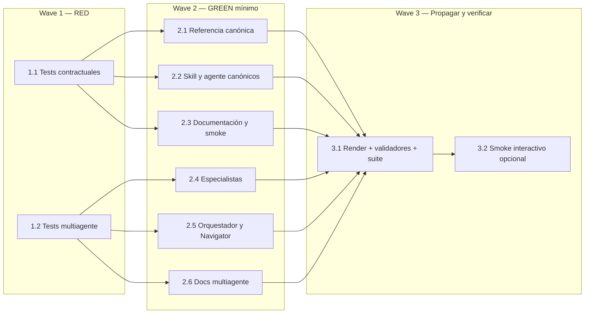

# Tareas — Pausa tras recomendaciones de modelo en el kit

Modo SDD: standard
Fase: Tasks
Estado: implementada; verificación contractual cerrada con limitación
Gate 3: aprobado (usuario: «continua»)

- [x] 1.1 [TDD focalizado] Actualizar tests contractuales para exigir fin de turno tras preflight inicial en `standard`/`deep` y `lite`, reanudación sin confirmación del modelo, no pausa en `direct`, gates actuales en transiciones y pausa antes de Verification; ejecutar y observar RED por las expectativas contradictorias actuales (Req 001–013).
- [x] 1.2 [TDD focalizado] Ampliar `tools/test_model_recommendations.py` para comprobar la pausa inicial también en trabajo puntual de los cinco especialistas, reanudación sin declarar modelo, hard stop pesado, handoff sin aviso duplicado, avisos existentes de Orchestrator/Navigator, avisos finales y excepción Git; observar RED pertinente (Req 014–020).
- [x] 2.1 Actualizar la referencia canónica de selección de LLM para describir pausa/reanudación, preservar gates, y dejar claro que no se pide confirmar ni se cambia el modelo (Req 001–012).
- [x] 2.2 Actualizar las instrucciones canónicas de la skill y el agente SDD para alinear Gate 0, transiciones entre fases, Verification y Quick Plan con el nuevo contrato, sin contradicciones (Req 001–012).
- [x] 2.3 Actualizar `docs/agentes/sdd.md` y `docs/sdd-smoke.md` con instrucciones y escenarios de dos turnos: pausa y cambio manual opcional; reanudación simple; transición aprobada por gate; Verification y excepciones `direct`/`lite` (Req 001–013).
- [x] 2.4 [P] Actualizar agentes, skills y matrices canónicas de Architecture, Code Quality, Data & API, Security y UI Design: pausa después de cualquier aviso inicial, conserva nivel, gates y handoff sin repetir aviso (Req 014, 015, 017, 019).
- [x] 2.5 [P] Verificar/ajustar Documentation Orchestrator y Project Navigator: pausa y continuación simple sin confirmar modelo, no repetir aviso orquestado, conservar avisos finales y gates; mantener Git Release Manager sin aviso nuevo (Req 016–019).
- [x] 2.6 [P] Actualizar documentación y escenarios manuales de los agentes adicionales para reflejar la pausa tanto en trabajo ligero como pesado, y el handoff sin duplicación (Req 014–020).
- [x] 3.1 Regenerar artefactos de plataformas a partir de fuentes canónicas y ejecutar tests contractuales de SDD y modelo, `tools/validate.py` y comprobaciones de consistencia para Copilot, OpenCode, Kiro y Claude; observar GREEN y registrar evidencia (Req 013, 020).
- [omitido: 3.2 smoke interactivo requiere instalación y prueba conversacional por plataforma; no se infiere de pruebas contractuales] [opcional] Ejecutar smoke interactivo de agentes disponibles en la plataforma, incluyendo cambio manual de modelo entre turnos, y documentar límites/plataforma; no inferirlo a partir de tests textuales (Req 001–020).

## Grafo de waves

- Estrategia: TDD focalizado para el comportamiento de pausa; cambios documentales
  GREEN mínimo sin abstraer el contrato en una implementación ajena al alcance.
- `[P]` solo habilita documentación/skills independientes después del RED; integrar
  y comprobar la coherencia del conjunto antes de renderizar.
- [omitido: PBT no aplica; no hay invariante algebraica]
- [omitido: cambios de lógica de negocio, capas de producto, persistencia o UI no
  aplican al alcance de instrucciones y artefactos del agente]
