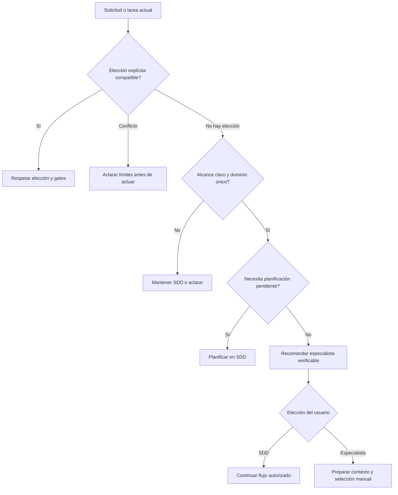

# Diseño — Recomendación de agente por dominio

Modo SDD: standard
Fase: Design
Estado: aprobada
Gate 2: aprobado
Intención: solo planificación

Aprobación: el usuario respondió «procede» después de la presentación de Gate 2.
Actualización de intención posterior: el usuario autorizó implementar mediante
«implementa la spec» tras aprobar el plan; no cambió el diseño aprobado.
Tras los smoke R04/R10, el usuario autorizó «procede con eso»: se añadió refuerzo
contractual de lista cerrada y parada al elegir especialista, sin ampliar el alcance
de implementación ni cambiar el contrato de handoff. Evidencia en
[correction-evidence.md](correction-evidence.md); la eficacia conversacional final
queda pendiente por HTTP 403 al reintentar.

## 1. Contexto y decisiones

Este kit distribuye instrucciones, no un servicio runtime de clasificación.
La selección será una política del prompt SDD, evaluada por el agente con evidencia
de la solicitud y contexto mínimo. No se creará un clasificador Python, un catálogo
duplicado, infraestructura de delegación ni llamadas específicas de un host.

Fuentes inspeccionadas:

- `canonical/agents/sdd.md`: contexto selectivo y autoridad de `sdd-spec`.
- `canonical/skills/sdd-spec/SKILL.md`: preflight, fases y gates vigentes del kit.
- `canonical/agents/ui-design.md:25-49`: límites visuales y recomendación de SDD.
- `canonical/agents/data-api.md:25-52`: límites de datos y recomendación de SDD.
- `canonical/manifest.json`: agentes y seis plataformas compatibles.
- `.architecture/README.md:15-40`: fuentes canónicas, render y snapshots legados.
- `docs/desarrollo.md:39-56`: referencias bajo demanda y tokens de plataforma.
- `canonical/skills/documentation-orchestrator/references/handoff.md:116-134`:
  contrato documental que excluye implementación de código.

Las fuentes del repositorio ya usan avisos de modelo no bloqueantes. La instalación
de `sdd-spec` usada en esta sesión conserva la pausa antigua: este diseño no cambia
ninguna de esas políticas. La nueva elección de ejecutor es una decisión de alcance,
no una confirmación de modelo ni un gate SDD adicional.

## 2. Superficie prevista de cambio

| Superficie | Responsabilidad futura |
|---|---|
| `canonical/agents/sdd.md` | Regla breve de evaluación del ejecutor y remisión a la skill. |
| `canonical/skills/sdd-spec/SKILL.md` | Entrada compacta a la política y aplicación en tareas especializadas. |
| `canonical/skills/sdd-spec/references/agent-routing.md` (nuevo) | Criterios, precedencias, respuesta y contexto manual. |
| `tools/test_sdd_contract.py` | Comprobar contrato, enlaces, límites y ausencia de delegación automática. |
| `docs/` | Explicar elección manual y escenarios de evaluación; reutilizar guía/smoke SDD existente. |
| `generated/` | Propagación por renderer existente, nunca edición manual. |

No se modifican los límites ni gates de los especialistas, el contrato de handoff,
el catálogo del manifest ni los adaptadores salvo necesidad demostrada en Tasks.
Los identificadores `ui-design` y `data-api` son IDs del kit; `@` no se presentará
como comando universal. La selección se hace en la interfaz del host disponible.

## 3. Algoritmo de decisión (política, no código runtime)

Orden de precedencia:

1. Respetar agente o continuidad con SDD explícitamente elegidos por el usuario.
   Si la selección contradice límites de dominio, explicar y pedir corrección.
2. Revisar la solicitud y, cuando sea necesario, solo contexto relevante para
   determinar responsabilidades; no deducir por palabras como «pantalla» o «JSON».
3. Si falta evidencia, pedir la aclaración esencial o mantener SDD sin recomendar
   ejecución especializada incierta. No implementar un alcance todavía ambiguo.
4. Separar pertenencia de dominio de necesidad de planificación. Los disparadores
   de REQ-008/009 mantienen planificación SDD, aunque el dominio sea único.
5. Si el alcance ejecutable actual cabe íntegramente en un especialista y está
   aclarado/planificado según sus reglas, recomendar selección manual.
6. Si es mixto o ajeno a ambos especialistas, conservar SDD; no ofrecer un
   especialista para la solicitud completa. Una tarea existente acotada sí puede
   evaluarse separadamente sin inventar nuevas tareas para justificar el cambio.

| Estado de la actividad | Resultado |
|---|---|
| Solo visual, clara y acotada, sin disparadores SDD | Recomendar `ui-design`. |
| Solo datos, clara y acotada, sin disparadores SDD | Recomendar `data-api`. |
| Solo un dominio, pero necesita requisitos/diseño | Planificar con SDD primero. |
| Tarea especializada de spec aprobada, autorizada y dentro de límites | Recomendar especialista para esa tarea; preservar spec. |
| Varios dominios o candidato no verificable | Mantener SDD; aclarar si hace falta. |
| Selección explícita compatible | Respetarla sin nueva elección redundante. |

### Integración con el flujo

La evaluación inicial barata puede compartir mensaje con el preflight; no exige
exploración pesada antes de él. La comprobación detallada ocurre después del
preflight aplicable y antes de editar artefactos o ejecutar la actividad candidata.
Una recomendación fundamentada espera la elección de ejecutor antes de realizar
esa actividad. Esto no aprueba ni reemplaza un gate pendiente.

«Sigue aquí» conserva SDD y su autorización actual; si hay un gate pendiente,
solo se avanza cuando el usuario lo apruebe. «Seleccionaré data-api» produce
contexto manual y detiene la ejecución de esa misma actividad en SDD.
La elección no amplía permisos ni vuelve ejecutable una tarea bloqueada.

## 4. Respuesta y contexto manual

Respuesta compacta: actividad evaluada, ID recomendado, motivo basado en
responsabilidades y evidencia disponible, límites y pregunta «¿Quieres seleccionar
manualmente este agente o seguir con SDD?». Si hay gate pendiente, indicar que
la elección no lo aprueba. No inventar archivos, líneas ni agentes instalados.

El resumen para el especialista llevará el título **Contexto para selección manual**,
no `## Handoff`. Contenido:

- Objetivo, alcance autorizado y exclusiones.
- ID del candidato y motivo de selección.
- Rutas relativas verificadas y contexto mínimo; sin secretos, PII innecesaria ni
  volcado íntegro de documentación.
- Ruta completa de spec y requisitos/tareas si existen; sin inventarlos si no hay spec.
- Decisiones aprobadas, fase, gate pendiente y restricciones de ejecución.
- Preguntas abiertas y criterios de aceptación/verificación aplicables.

Es un mensaje copiable, no un nuevo archivo obligatorio ni una prueba de entrega.
El receptor verifica contexto, límites y sus gates. No se afirma que el host haya
cambiado de agente ni que la tarea esté completada por haber preparado el resumen.

La deduplicación usa el historial de la sesión: alcance, candidato y decisión del
usuario. No necesita persistencia nueva. Si falta historial, no asumir una elección
anterior; ante cambio relevante de alcance/riesgo, reevaluar y explicar el cambio.

## 5. Invariantes y manejo de errores

1. Una recomendación nunca cambia agente ni invoca herramientas de delegación.
2. Ningún especialista recibe como propio un alcance fuera de sus límites.
3. Selección de ejecutor no aprueba gates, cambia profundidad ni amplía autorización.
4. La misma decisión explícita no provoca recomendaciones repetidas sin cambio relevante.
5. Contexto manual no declara entrega, ejecución o cierre sin evidencia real.

Candidato ausente/no verificable: mantener SDD y explicar que no se comprobó su
disponibilidad. Ambigüedad: aclarar o planificar, sin edición insegura. Cruce de
dominios: mantener coordinación SDD. Contexto histórico insuficiente: solicitar
datos necesarios antes de afirmar aprobaciones. Restricciones del host: mantener
la ruta manual, sin suponer soporte de `@` ni de subagentes.

## 6. Estrategia de pruebas y trazabilidad

Para una futura implementación: **TDD focalizado contractual**, con el harness
Python ya existente. RED: observar ausencia de la referencia/política o reglas
requeridas, no un fallo incidental. GREEN: contenido canónico mínimo correcto y
render. REFACTOR: solo si se demuestra duplicación o claridad mejorable.

No se agregará un clasificador artificial para simular la decisión del LLM.
Las pruebas estáticas comprueban el contrato y la propagación, no prueban por sí
solas el comportamiento conversacional. Este requiere evaluación manual reproducible:
solicitud, host, respuesta observada, ruta esperada y resultado por escenario.

| Escenario / comprobación | Ruta esperada y cobertura |
|---|---|
| Color de botón, sin cambiar eventos/datos | `ui-design`; REQ-001–003, 007, 012–014. |
| Ajuste de serialización interna con requisitos conocidos, sin cambiar contrato público/esquema | `data-api`; REQ-001–002, 004, 007, 012–014. |
| Pantalla más endpoint | Mantener SDD; REQ-005, 018. |
| «Mejora cómo manejo los datos» sin alcance | Aclarar/mantener SDD; REQ-006, 009. |
| Rediseño ambiguo de varias pantallas | Planificar SDD; REQ-008. |
| Migración, contrato o compatibilidad afectados | Planificar SDD; REQ-009. |
| Tarea visual de spec con gate pendiente | No eludir gate; REQ-010–011, 018. |
| Usuario elige seguir aquí, mismo alcance | No repetir recomendación; REQ-015. |
| Usuario elige especialista | Resumen manual, sin invocación; REQ-014, 016. |
| Especialista explícito compatible/incompatible | Respetar/pedir corrección; REQ-017. |
| Candidato no verificable | No afirmar disponibilidad; REQ-007. |
| Referencia y reglas presentes en fuentes y seis plataformas | Contrato/render; REQ-019–020. |

Comandos previstos, no ejecutados en esta fase:
`python3 -B tools/test_sdd_contract.py`, `python3 -B tools/test_handoff_contract.py`,
`python3 -B tools/test_model_recommendations.py`, `python3 -B tools/test_links.py`,
`python3 -B tools/render.py`, `python3 -B tools/validate.py` y `git diff --check`.
Render irá antes de validar paridad. La guía smoke registrará también rechazo de la
recomendación y la conservación del gate; no instalará herramientas por su cuenta.

**PBT:** no aplica; no hay propiedad algebraica ni motor determinista de clasificación.
Sin nuevas dependencias. Esta fase solo planifica: no declara RED/GREEN observado.

## 7. Quality bar y RNF

Separación de capas: política en skill, entrada breve en agente, adaptación/render
existentes. DI, singletons, hilo UI, Result tipado y persistencia de aplicación:
no aplican a contenido declarativo; no se añade I/O runtime ni almacenamiento nuevo.
Se mantienen errores del renderer/validador existentes y no se editan salidas a mano.

RNF a verificar en una futura implementación:

- **Portabilidad:** misma política en las seis plataformas del manifest, sin API de subagentes.
- **Seguridad:** contexto mínimo, sin secretos, sin ampliación de permisos ni gates omitidos.
- **Coste de contexto:** regla breve y referencia bajo demanda; medir delta con
  `tools/measure_context.py`, sin imponer un presupuesto numérico no aprobado.
- **Trazabilidad:** escenarios vinculados a requisitos y spec/gates conservados.

## 8. Límite de esta entrega

Gates 1 y 2 están aprobados; el siguiente artefacto es `tasks.md`.
La entrega original fue solo planificación. Después de Gate 3, la solicitud explícita
«implementa la spec» autorizó ejecutar el plan; no aprueba Verification ni Gate 4.

### Ajuste autorizado tras R01

El usuario aprobó diagnóstico/corrección mediante «procede». Sin cambiar alcance,
se refuerza una condición visible antes de escribir: cargar skill y política,
resolver ejecutor y no confundir abrir SDD con rechazo explícito del especialista.
No se añaden hooks ni aislamiento técnico. Evidencia y límites en
[correction-evidence.md](correction-evidence.md); Gate 4 sigue pendiente.
