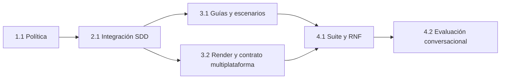

# Tareas — Recomendación de agente por dominio

Modo SDD: standard
Fase: Verification
Estado: suite formal completa — refuerzo adicional propagado; runtime posterior bloqueado
Gate 3: aprobado
Gate 4: pendiente
Intención: implementación
Implementación: autorizada por «implementa la spec»; refuerzos posteriores autorizados

Aprobación: el usuario respondió «procede» después de la presentación de Gate 3.
Esta aprobación valida el plan; no incluye una solicitud explícita de implementar.

## Condiciones y continuidad

El plan fue aprobado en una entrega de solo planificación. Posteriormente el usuario
autorizó implementar mediante «implementa la spec», luego corregir el hallazgo R01,
y reanudó Verification con «continúa». Se conservan Gates 1–3 aprobados y todo cambio
ajeno. Gate 4 sigue pendiente.

Antes de una futura implementación, revisar el working tree y preservar cambios
ajenos; obtener baseline de los checks previstos y medir contexto. Registrar comandos
y resultados sin atribuir fallos preexistentes a esta feature. No modificar la política
de avisos de modelo, permisos del host, límites de especialistas ni handoff documental.

Estados futuros: `[ ]` → en progreso → `[x]` solo con artefacto y evidencia real.
Cada tarea de contrato usa RED → GREEN mínimo correcto → REFACTOR solo justificado.
Las pruebas estáticas no se presentarán como evidencia de decisiones conversacionales.

## Wave 1 — Política canónica

- [x] **1.1 [TDD focalizado contractual] Definir la política de recomendación.**
  (REQ-001, REQ-002, REQ-003, REQ-004, REQ-005, REQ-006, REQ-007, REQ-008,
  REQ-009, REQ-012, REQ-013, REQ-014, REQ-015, REQ-016, REQ-017, REQ-018, REQ-020)
  - RED: ampliar `tools/test_sdd_contract.py` para comprobar la referencia,
    candidatos, límites, precedencias, elección manual, deduplicación y contexto
    transferible; observar fallos por ausencia del contrato requerido.
  - GREEN: crear `canonical/skills/sdd-spec/references/agent-routing.md` con la
    política del diseño, sin clasificador runtime ni llamadas de delegación.
  - Cubrir elección explícita compatible/conflictiva, candidato no verificable,
    alcance mixto/ambiguo, SDD por riesgo y contexto sin título `## Handoff`.
  - REFACTOR: reducir duplicación solo si existe, sin catálogo ni dependencias nuevos.
  - Evidencia requerida: referencia real, pruebas nuevas ejecutadas y RED/GREEN
    observado; revisión de coherencia con límites reales de ambos especialistas.

## Wave 2 — Integración SDD

- [x] **2.1 [TDD focalizado contractual] Integrar evaluación y continuidad en SDD.**
  (REQ-001, REQ-007, REQ-008, REQ-009, REQ-010, REQ-011, REQ-012, REQ-013,
  REQ-014, REQ-015, REQ-016, REQ-017, REQ-018, REQ-020)
  - Depende de 1.1.
  - RED: comprobar entrada breve en agente/skill, referencia bajo demanda y
    conservación de spec, autorización y gates ante recomendación de tarea.
  - GREEN: actualizar `canonical/agents/sdd.md` y
    `canonical/skills/sdd-spec/SKILL.md` con el punto de evaluación inicial y la
    reevaluación de tareas acotadas; no duplicar la política completa en el prompt.
  - Distinguir elección de ejecutor de aprobación de un gate y de avisos de modelo;
    no ejecutar la actividad candidata mientras falte elección esencial.
  - REFACTOR solo si aporta claridad sin alterar los gates ni otras políticas.
  - Evidencia requerida: RED/GREEN de integración, diffs canónicos y regresión del
    contrato SDD existente; sin cambios en los agentes especialistas.

## Wave 3 — Documentación y distribución

- [x] **3.1 [P] Documentar selección manual y protocolo de evaluación.**
  (REQ-003, REQ-004, REQ-005, REQ-006, REQ-007, REQ-008, REQ-009, REQ-010,
  REQ-011, REQ-012, REQ-013, REQ-014, REQ-015, REQ-016, REQ-017, REQ-018, REQ-020)
  - Depende de 2.1.
  - Actualizar `docs/agentes/sdd.md` y `docs/sdd-smoke.md` con ejemplos de
    recomendación, rechazo, selección explícita y contexto copiable.
  - Incluir los escenarios de Design §6, resultados esperados y campos para registrar
    host/versión, prompt, respuesta observada, resultado y bloqueos.
  - Explicar que `@` es notación del kit, no comando universal ni garantía de agente
    instalado; selección manual no aprueba gates ni acredita entrega.
  - Verificación: checks de enlaces/documentación y revisión de escenarios; sin TDD
    nuevo ceremonial para redacción ya cubierta por checks contractuales.
  - Evidencia requerida: guías actualizadas y enlaces válidos; resultados runtime
    pendientes hasta ejecución real de 4.2.

- [x] **3.2 [P] [TDD focalizado contractual] Propagar y verificar el contrato.**
  (REQ-002, REQ-014, REQ-019, REQ-020)
  - Depende de 2.1; puede ejecutarse en paralelo con 3.1, sin editar sus guías.
  - RED: ampliar comprobaciones para la referencia y la integración renderizadas en
    las seis plataformas de `canonical/manifest.json`, antes de regenerar salidas.
  - GREEN: ejecutar `python3 -B tools/render.py`, después los tests contractuales y
    `python3 -B tools/validate.py`; revisar diffs de `generated/`.
  - No editar `generated/` a mano ni añadir IDs/tokens nuevos sin necesidad.
    Si un adaptador requiere cambios, detenerse y justificar el ajuste antes de editar.
  - REFACTOR solo ante duplicación real en los checks.
  - Evidencia requerida: RED/GREEN, seis destinos revisados, paridad/reproducibilidad
    verificadas y ausencia de invocación automática en las nuevas reglas.

## Wave 4 — Verificación futura y evidencia

- [x] **4.1 Ejecutar suite y autoauditoría de los RNF declarados.**
  - Reejecución: `tools/test_sdd_contract.py` 465/465; `test_handoff_contract.py`
    34/34; `test_model_recommendations.py` 437/437; `test_links.py` 4/4;
    `check_links.py` 71 archivos; `validate.py` 10 skills/6 agentes/6 plataformas;
    `measure_context.py` y `git diff --check` registrados en verification.md.
  (REQ-007, REQ-011, REQ-014, REQ-018, REQ-019, REQ-020)
  - Depende de 3.1 y 3.2. Corresponde a Verification, no a un gate nuevo.
  - Ejecutar secuencialmente y conservar resultados:
    `python3 -B tools/test_sdd_contract.py`,
    `python3 -B tools/test_handoff_contract.py`,
    `python3 -B tools/test_model_recommendations.py`,
    `python3 -B tools/test_links.py`, `python3 -B tools/validate.py` y
    `git diff --check`.
  - Medir delta con `python3 -B tools/measure_context.py`; revisar portabilidad,
    seguridad del contexto manual, coste de contexto y trazabilidad.
  - Crear `verification.md` con matriz requisito → tarea → test/evidencia;
    distinguir pruebas contractuales aprobadas de escenarios runtime pendientes.
  - Evidencia requerida: comandos/resultados, comparación con baseline y spot-check
    de quality bar; no marcar tareas de implementación completas sin artefacto.

- [ ] **4.2 Ejecutar evaluación conversacional en un host disponible.**
  - Resultados históricos: R01 corregido PASS; R02/R03/R05/R08/R09/R10 incompatible
    PASS; R04 FAIL; R06/R07/R11 bloqueados; R12 parcial. R10 implementación vía
    data-api tuvo intento edit bloqueado.
  - Tras corrección de whitelist/stop-package, retries R04/R06/R07/R10/R11 recibieron
    HTTP 403 antes de respuesta; eficacia conversacional de ese refuerzo no verificada.
  - Evidencia: [followup-smoke.md](followup-smoke.md),
    [runtime-smoke.md](runtime-smoke.md), [correction-evidence.md](correction-evidence.md).
    No cambiar perfil global, proveedor/modelo ni copiar credenciales.
  (REQ-001, REQ-003, REQ-004, REQ-005, REQ-006, REQ-007, REQ-008, REQ-009,
  REQ-010, REQ-011, REQ-012, REQ-013, REQ-014, REQ-015, REQ-016, REQ-017,
  REQ-018, REQ-020)
  - Depende de 4.1; registrar en la misma matriz, sin ejecución concurrente del
    mismo escenario ni modificaciones concurrentes de `verification.md`.
  - Evaluar los doce escenarios de Design §6, incluyendo elección de seguir con
    SDD sin repetición, gate pendiente y selección manual con contexto correcto.
  - Registrar evidencia real y si el kit probado está actualizado. No cambiar
    instalaciones/configuración del usuario sin autorización específica.
  - Si el host no está disponible, mantener la tarea pendiente/bloqueada con motivo;
    no sustituir resultados conversacionales por búsquedas de texto.
  - Evidencia requerida: host/versión, prompts y respuestas sanitizadas, ruta
    esperada/observada y resultados. Preparar Gate 4 solo con huecos explícitos.

## Dependencias

3.1 y 3.2 son paralelizables por trabajar sobre archivos distintos. Los cambios en
`tools/test_sdd_contract.py` de 1.1, 2.1 y 3.2 se ejecutan en orden, no en paralelo.

## Cobertura de requisitos

| Requisito | Tareas principales |
|---|---|
| REQ-001 | 1.1, 2.1, 4.2 |
| REQ-002 | 1.1, 3.2 |
| REQ-003 | 1.1, 3.1, 4.2 |
| REQ-004 | 1.1, 3.1, 4.2 |
| REQ-005 | 1.1, 3.1, 4.2 |
| REQ-006 | 1.1, 3.1, 4.2 |
| REQ-007 | 1.1, 2.1, 4.1, 4.2 |
| REQ-008 | 1.1, 2.1, 3.1, 4.2 |
| REQ-009 | 1.1, 2.1, 3.1, 4.2 |
| REQ-010 | 2.1, 3.1, 4.2 |
| REQ-011 | 2.1, 3.1, 4.1, 4.2 |
| REQ-012 | 1.1, 2.1, 3.1, 4.2 |
| REQ-013 | 1.1, 2.1, 3.1, 4.2 |
| REQ-014 | 1.1, 2.1, 3.1, 3.2, 4.1, 4.2 |
| REQ-015 | 1.1, 2.1, 3.1, 4.2 |
| REQ-016 | 1.1, 2.1, 3.1, 4.2 |
| REQ-017 | 1.1, 2.1, 3.1, 4.2 |
| REQ-018 | 1.1, 2.1, 3.1, 4.1, 4.2 |
| REQ-019 | 3.2, 4.1 |
| REQ-020 | 1.1, 2.1, 3.1, 3.2, 4.1, 4.2 |

PBT: no previsto, sin propiedad algebraica aplicable. No se añaden dependencias,
instalaciones, commits ni acciones de release como parte de este plan.

## Corrección autorizada tras R01

- [x] **5.1 [Regresión contractual] Reforzar condición previa a escritura.**
  (REQ-001, REQ-003, REQ-012, REQ-013, REQ-015, REQ-017, REQ-020)
  - Autorizada por «procede» a diagnóstico/corrección y reanudación del preflight.
  - RED contractual 0/15 → GREEN 66/66; propagación 30/42 → 108/108 acumulado.
  - Agente, skill, referencia, test de condición y 18 assets generados reales.
  - R01 repetido sin indicar ruta esperada: carga skill/referencia, recomienda
    ui-design, espera elección y no intenta editar. No implica PASS de todos los casos.
  - Evidencia: [correction-evidence.md](correction-evidence.md).

- [x] **5.2 [Regresión contractual] Restringir whitelist v1 y parar tras elegir especialista.**
  (REQ-002, REQ-006, REQ-013, REQ-014, REQ-016, REQ-020)
  - Autorizada por «procede con eso» tras los hallazgos R04/R10.
  - No enumerar otros agentes; al elegir explícitamente al especialista, preparar
    contexto copiable y detener implementación local, incluso si el prompt inicial
    incluía implementar.
  - RED/GREEN focal **91/91**, suite SDD 505/505 y propagación estática a seis
    plataformas. Reintentos runtime bloqueados por HTTP 403 antes de respuesta; no
    se atribuye PASS conversacional a esta corrección.
  - Evidencia: [correction-evidence.md](correction-evidence.md).

- [x] **5.2 [Regresión contractual] Cerrar whitelist v1 y parar al elegir especialista.**
  (REQ-002, REQ-006, REQ-013, REQ-014, REQ-016, REQ-020)
  - Autorizada por «procede con eso» tras hallazgos R04/R10.
  - No enumerar otros agentes; al elegir especialista preparar contexto y detener
    SDD aunque el prompt original incluya implementación. Para reanudar debe haber
    nueva elección explícita de ejecutar en SDD.
  - 91/91 focal, suite SDD 505/505, propagación estática a seis plataformas.
    Reintentos runtime HTTP 403 antes de respuesta; no marcar eficacia runtime.
  - Evidencia: [correction-evidence.md](correction-evidence.md).

## Gate 3

Gate 3 fue aprobado para planificación; posteriormente «implementa la spec» autorizó
ejecutar el plan. Los `[x]` de 1.1, 2.1, 3.1 y 3.2 remiten a artefactos y resultados
reales en [implementation-evidence.md](implementation-evidence.md), no a la aprobación.
Verification se reanudó. Suite 505/505 y refuerzos 5.1/5.2 completados; retries
conversacionales tras 5.2 bloqueados por HTTP 403. Gate 4 pendiente de smoke runtime
posterior o aceptación explícita de esa limitación.
