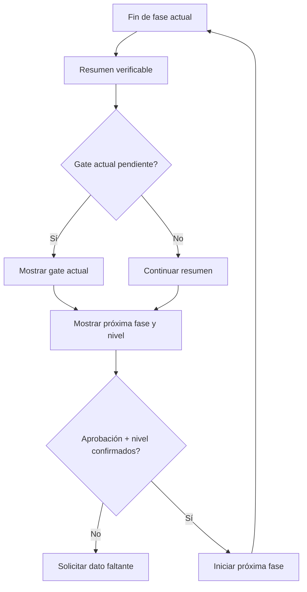
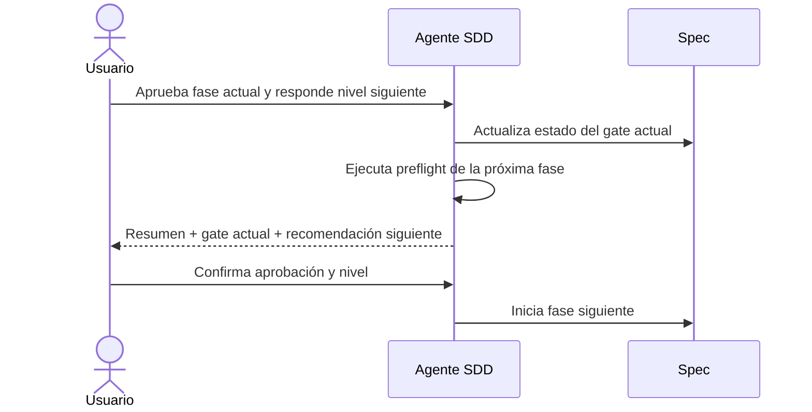

# Diseño — Recomendación de modelo por próxima fase

Modo SDD: standard
Fase: Design
Estado: aprobada
Gate 2: aprobado

## Contexto y supuestos

El contrato actual presenta en el Gate 0 un nivel global y un perfil orientativo
de todas las fases pendientes. La confirmación se conserva para todo el flujo y
no se repite por fase. Este diseño reemplaza esa salida por una recomendación del
único proceso que está a punto de comenzar.

La fuente de verdad seguirá siendo `canonical/`. Los artefactos `generated/` se
regenerarán con `tools/render.py`. No se añadirá un parser ni una lógica ejecutable:
la selección y la interacción se expresarán en la skill, el agente, las referencias
y las pruebas contractuales.

La propia modificación se implementa en `standard`, porque altera el contrato de
interacción SDD y se propaga a cuatro plataformas.

## Decisiones de diseño

| ID | Decisión |
|---|---|
| DD-01 | El preflight inicial mostrará solo la próxima fase, no un modelo global ni una lista de fases futuras. |
| DD-02 | En una transición, el mismo mensaje contendrá resumen de la fase actual, gate actual y recomendación de la próxima fase. |
| DD-03 | Una respuesta podrá aprobar la fase actual y confirmar el nivel de la siguiente. |
| DD-04 | Los gates SDD siguen siendo Gates 1–4; los preflights posteriores son checkpoints de capacidad, no gates nuevos. |
| DD-05 | El agente recomendará niveles genéricos (`BAJO`, `MEDIO`, `ALTO`), nunca modelos o proveedores. |
| DD-06 | `direct` conserva su aviso breve; `lite` conserva un único preflight para Quick Plan. |
| DD-07 | `standard` y `deep` reciben una recomendación al iniciar Requirements, Design, Tasks, Implementación y Verification. |
| DD-08 | Después de Verification solo se muestra Gate 4; no se recomienda un nivel para el cierre. |
| DD-09 | Los marcadores de fase y gate permiten determinar la próxima operación al reanudar una spec nueva. |
| DD-10 | Specs legacy sin marcadores suficientes requieren aclaración y no se migran automáticamente. |

## Modelo conceptual

Tipo de trabajo, profundidad, intención, proceso próximo, nivel recomendado y gate
son ejes separados. Un gate valida una fase; un preflight recomienda capacidad para
la siguiente. Ninguno selecciona ni cambia el modelo del host.

## Determinación de la próxima fase

Para una spec nueva, el próximo proceso es Requirements. Para una spec nueva de
`lite`, el próximo proceso es Quick Plan.

Para `standard` y `deep`, el agente usará los marcadores de estado de los artefactos
nuevos:

| Estado observable | Próxima operación | Gate relacionado |
|---|---|---|
| No existe `requirements.md`/`bugfix.md` | Requirements | Gate 1 al finalizar |
| Requirements existe y Gate 1 está pendiente | Iterar o aprobar Requirements | Gate 1 |
| Gate 1 aprobado y no existe `design.md` | Design | Gate 2 al finalizar |
| Design existe y Gate 2 está pendiente | Iterar o aprobar Design | Gate 2 |
| Gate 2 aprobado y no existe `tasks.md` | Tasks | Gate 3 al finalizar |
| Tasks existe y Gate 3 está pendiente | Iterar o aprobar Tasks | Gate 3 |
| Gate 3 aprobado y hay tareas abiertas | Implementación | Sin gate nuevo por tarea |
| Todas las tareas completadas y no existe `verification.md` | Verification | Gate 4 al finalizar |
| Verification existe y Gate 4 está pendiente | Cierre o corrección de huecos | Gate 4 |
| Gate 4 aprobado y estado cerrado | Spec cerrada | Ninguno |

Los artefactos nuevos declararán, en su encabezado, el modo, la fase y el estado
del gate que les corresponde. La reanudación no inferirá aprobación solo por la
existencia del archivo.

Marcadores mínimos:

```markdown
Modo SDD: standard
Fase: Requirements
Estado: en progreso
Gate 1: pendiente
```

Tras la aprobación del usuario, el agente actualizará el marcador antes de crear
la siguiente fase. Para `lite`, `requirements.md` mantiene `Modo SDD: lite` y la
operación Quick Plan no expone sus pasos internos como fases independientes.

## Salida inicial

El Gate 0 inicial tendrá esta forma:

```text
## Preflight SDD

Trabajo: feature
Modo SDD: standard
Alcance: <ruta o spec>
Complejidad: <baja|media|alta>
Próximo proceso: Requirements
Modelo recomendado para Requirements: MEDIO
Motivos:
- <razón verificable>
- <razón verificable>

Antes de iniciar Requirements:
- responde “listo” si usarás el nivel recomendado;
- responde “continúa con el actual” si mantendrás tu nivel.
```

No contendrá `Fases pendientes`, perfil de todas las fases ni un nivel global
separado del proceso próximo.

## Salida en transición

Cuando una fase termine y exista un gate pendiente, el mensaje será:

```text
## Resumen de Requirements

- <resultado verificable>
- <casos cubiertos>
- <huecos o supuestos>

## Gate 1 — Requirements

¿Apruebas los requisitos o quieres iterarlos?

## Próximo proceso, condicionado a la aprobación

Design
Modelo recomendado para Design: ALTO
Motivos:
- <razón verificable>

Si apruebas Requirements, responde por ejemplo:
- “apruebo y usaré el nivel recomendado”;
- “apruebo y continúo con el nivel actual”;
- “quiero iterar los requisitos”.
```

La recomendación se muestra para que el usuario pueda decidir, pero no autoriza
Design mientras Requirements no esté aprobado y el nivel siguiente no esté
confirmado.

Después de Implementación no existe un gate de aprobación de esa fase. El mensaje
contendrá el resumen de implementación y el preflight de Verification; la suite no
se ejecutará hasta que el usuario confirme el nivel de Verification.

Después de Verification solo se mostrará el resultado, la evidencia y Gate 4.

## Confirmación y respuestas ambiguas

El agente interpretará como confirmación de transición solo una respuesta que
contenga ambas decisiones:

- aprobación de la fase actual; y
- nivel recomendado aceptado o decisión explícita de mantener el nivel actual.

Si el usuario responde únicamente `apruebo`, `adelante` o `continúa` en una
transición, el agente no iniciará la siguiente fase y pedirá la parte faltante.
Si solicita iterar, descartará la recomendación condicionada y conservará la fase
actual como pendiente.

Un cambio manual de nivel no implica que el agente cambie el modelo del host. El
usuario deberá seleccionar el modelo en la herramienta y confirmar con el nivel
recomendado o con el nivel actual.

## Niveles por proceso

La referencia conserva niveles base orientativos: Requirements, Design y
Verification `MEDIO`; Tasks `BAJO`; Implementación y Quick Plan `MEDIO`. Los
factores del alcance pueden elevar el nivel o provocar reclasificación de modo.

## Comportamiento por modo

| Modo | Preflight inicial | Preflights posteriores | Gates de fase |
|---|---|---|---|
| `direct` | Aviso breve `BAJO`, no bloqueante | Ninguno | Ninguno |
| `lite` | Quick Plan (`MEDIO` habitual), bloqueante | Ninguno para sus pasos internos | Ninguno; conserva Quick Plan |
| `standard` | Solo Requirements | Uno por próxima fase | Gates 1–4 actuales |
| `deep` | Solo Requirements | Uno por próxima fase | Gates 1–4 actuales |

Si `lite` escala a `standard`, el siguiente preflight muestra el nuevo modo, la
próxima fase y el nivel de esa fase. Solicita confirmación del cambio de flujo
aunque el nivel genérico coincida.

## Compatibilidad y errores

No se reescriben specs cerradas ni se migran specs legacy sin marcadores; las rutas
planas y agrupadas siguen siendo válidas. Si no se determina la próxima fase, falta
la aprobación o falta el nivel, se pide aclaración. Un cambio de alcance recalcula
el preflight y un cambio de política de gates exige confirmación aunque el nivel
coincida. Tras Verification solo aparece Gate 4.

## Estrategia de pruebas

- Nivel: TDD focalizado sobre el contrato observable de mensajes, estado y
  artefactos generados.
- RED: añadir checks de salida inicial, transición, respuesta conjunta, estado,
  `lite`, `direct`, Gate 4 y compatibilidad antes de actualizar el contrato.
- GREEN: actualizar la skill, el agente, la referencia de modelo y las plantillas
  con el mínimo contenido que satisfaga los checks.
- REFACTOR: centralizar el lenguaje de preflight y no repetir perfiles globales en
  documentos de usuario.
- Verificación manual: ejecutar los escenarios de transición en al menos una
  plataforma; registrar si una plataforma no puede probarse interactivamente.
- PBT: omitido; no hay invariante algebraico útil para mensajes y estados textuales.

## Requisitos no funcionales

- RNF-1 Claridad: nunca mezclar recomendación de fase con aprobación de gate.
- RNF-2 Control: no iniciar la siguiente fase sin aprobación y nivel confirmados.
- RNF-3 Proporcionalidad: no aumentar interacciones de `direct` ni de Quick Plan.
- RNF-4 Reanudación: los marcadores permiten identificar la próxima operación sin
  inferir aprobaciones por mera existencia de archivos.
- RNF-5 Portabilidad: el contrato visible es igual en las cuatro plataformas.

## Invariantes críticos

1. El preflight visible contiene una sola próxima fase.
2. La recomendación nunca se presenta como recomendación de un gate.
3. `standard` y `deep` no empiezan la fase siguiente sin las dos confirmaciones.
4. `lite` no expone recomendaciones para sus pasos internos.
5. Gate 4 no recibe una recomendación de fase inexistente.

## Diagrama de transición



## Secuencia de transición



## Excepciones al quality-bar

Ninguna; se conserva el quality bar y no se añaden dependencias.
