# Tareas — Recomendación de modelo por próxima fase

Modo SDD: standard
Fase: Tasks
Estado: cerrada
Gate 3: aprobado
Estrategia: TDD focalizado sobre el contrato observable de mensajes, estado y
artefactos generados.

## 1. Contrato de preflight inicial

- [x] 1.1 [TDD focalizado] Añadir checks para que la salida inicial muestre solo
  `Próximo proceso` y `Modelo recomendado para <fase>`, sin `Fases pendientes`,
  perfil global ni nivel separado; observar RED, actualizar
  `references/model-selection.md` y la skill, observar GREEN y refactorizar el
  formato común. (REQ-001–REQ-007, REQ-036–REQ-039)
- [x] 1.2 [TDD focalizado] Añadir checks para niveles por proceso y recomendación
  genérica sin nombres de modelos/proveedores; observar RED, actualizar la matriz
  de selección y confirmar GREEN. (REQ-004–REQ-005, REQ-029–REQ-031,
  REQ-041)

## 2. Estado y determinación de fase

- [x] 2.1 [TDD focalizado] Añadir checks para determinar la próxima fase a partir de
  marcadores de fase y gate, incluyendo spec nueva, continuación y cierre; observar
  RED, actualizar `references/templates.md` y las reglas de reanudación, confirmar
  GREEN y simplificar duplicaciones. (REQ-001, REQ-006–REQ-007, REQ-032–REQ-035)
- [x] 2.2 [TDD focalizado] Añadir checks para marcadores `Modo SDD`, `Fase`,
  `Estado` y gate pendiente/aprobado; observar RED, actualizar plantillas y
  `integrity-gate.md`, confirmar GREEN. (REQ-007, REQ-032–REQ-034)

## 3. Transición y confirmación de usuario

- [x] 3.1 [TDD focalizado] Añadir checks para el mensaje combinado de resumen,
  aprobación de la fase actual y recomendación condicionada de la fase siguiente;
  observar RED, actualizar `SKILL.md` y `agents/sdd.md`, confirmar GREEN y
  refactorizar el lenguaje de transición. (REQ-008–REQ-011, REQ-016–REQ-020,
  REQ-036–REQ-039)
- [x] 3.2 [TDD focalizado] Añadir checks para respuestas ambiguas, aprobación sin
  nivel, iteración y confirmación de nivel recomendado o actual; observar RED,
  implementar las respuestas mínimas y confirmar GREEN. (REQ-012–REQ-013,
  REQ-019–REQ-020)
- [x] 3.3 [TDD focalizado] Añadir checks para recalcular por cambio de alcance o
  riesgo, exigir confirmación de reclasificación aunque el nivel no cambie y no
  iniciar con una recomendación obsoleta; observar RED, actualizar contrato e
  integrity gate, confirmar GREEN. (REQ-025, REQ-027–REQ-031)
- [x] 3.4 [TDD focalizado] Añadir checks para la transición sin gate posterior a
  Implementación y el cierre de Verification mostrando únicamente Gate 4; observar
  RED, actualizar la skill y confirmar GREEN. (REQ-014–REQ-018)

## 4. Compatibilidad por modo

- [x] 4.1 [TDD focalizado] Añadir checks para que `direct` mantenga el aviso
  no bloqueante y `lite` recomiende una sola vez para Quick Plan sin exponer pasos
  internos; observar RED, ajustar el contrato de modos y confirmar GREEN.
  (REQ-021–REQ-024)
- [x] 4.2 [TDD focalizado] Añadir checks para que `standard` y `deep` recomienden
  Requirements, Design, Tasks, Implementación y Verification al iniciar cada fase,
  manteniendo Gates 1–4; observar RED, actualizar la skill y confirmar GREEN.
  (REQ-015, REQ-023–REQ-026)
- [x] 4.3 [P] Actualizar la descripción del agente y la documentación de uso para
  separar preflight, fase y gate, sin presentar la recomendación como selección del
  modelo del host. (REQ-004–REQ-005, REQ-016, REQ-036–REQ-041)
- [x] 4.4 [P] Actualizar `docs/sdd-smoke.md` con escenarios de preflight inicial,
  transiciones, respuestas ambiguas, reclasificación y cierre; registrar la
  interacción de cada fase. (REQ-008–REQ-014, REQ-027–REQ-034, REQ-038)

## 5. Render y validación

- [x] 5.1 Regenerar `generated/{copilot,opencode,kiro,claude}` exclusivamente con
  `python3 tools/render.py` y revisar que todas las plataformas expongan el mismo
  formato de preflight. (REQ-040–REQ-041)
- [x] 5.2 Ejecutar el contrato SDD y corregir divergencias de paridad sin relajar
  los criterios aprobados. (REQ-001–REQ-041)
- [x] 5.3 [P] Ejecutar recomendaciones de modelo, validación, integridad, enlaces,
  medición de contexto y `git diff --check`; conservar comandos y resultados.
  (REQ-036–REQ-041)
- [x] 5.4 Revisar el diff final para confirmar que no aparece el perfil global inicial,
  no se crean gates nuevos, `standard`/`deep` mantienen Gates 1–4 y el cambio
  concurrente de `README.md` permanece fuera del alcance. (REQ-015–REQ-018,
  REQ-033, REQ-040–REQ-041)

## 6. Verificación y cierre

- [x] 6.1 Crear `verification.md` con RED/GREEN, suites, matriz requisito → tarea →
  evidencia y self-check de RNF. (REQ-001–REQ-041)
- [x] 6.2 Aplicar integrity gate, declarar cualquier smoke interactivo no ejecutado
  y solicitar Gate 4 sin tareas huérfanas. (REQ-012–REQ-014, REQ-027–REQ-035)

- [omitido: PBT no aplica; el contrato de interacción no contiene un invariante algebraico]

## Cobertura de requisitos

| Requisitos | Tareas |
|---|---|
| REQ-001–REQ-007 | 1.1, 1.2, 2.1, 2.2 |
| REQ-008–REQ-014 | 3.1–3.4, 4.4 |
| REQ-015–REQ-020 | 3.1, 3.4, 4.2, 5.4 |
| REQ-021–REQ-026 | 4.1, 4.2 |
| REQ-027–REQ-031 | 3.3, 5.4 |
| REQ-032–REQ-035 | 2.1, 2.2, 3.3, 6.2 |
| REQ-036–REQ-041 | 1.1, 1.2, 3.1, 4.3, 4.4, 5.1–5.4, 6.1 |

## Grafo de waves

```mermaid
flowchart LR
    W1[Wave 1: 1.1–1.2 preflight] --> W2[Wave 2: 2.1–2.2 estado]
    W2 --> W3[Wave 3: 3.1–3.2 transición]
    W3 --> W4[Wave 4: 3.3–3.4 recalculo y cierre]
    W4 --> W5[Wave 5: 4.1–4.2 modos]
    W5 --> W6[Wave 6: 4.3 + 4.4 docs y smoke]
    W6 --> W7[Wave 7: 5.1 render]
    W7 --> W8[Wave 8: 5.2–5.4 validación]
    W8 --> W9[Wave 9: 6.1–6.2 cierre]
```

