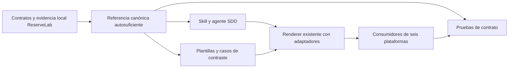

# Diseño — Rúbrica de esfuerzo SDD anclada a ReserveLab

> Archivo histórico de la implementación inicial. El diseño vigente de la
> compactación está en `design.md`; este archivo no requiere lectura rutinaria.

- **Modo SDD:** standard
- **Fase:** Design
- **Estado:** aprobado; implementación y Verification realizadas, cierre pendiente
- **Gate 1:** aprobado por el usuario («procede»)
- **Gate 2:** aprobado por el usuario («procede» tras presentación de Design)
- **Gate 3:** aprobado por el usuario («procede» tras presentación de Tasks)
- **Gate 4:** pendiente
- **Próxima operación:** aprobación de cierre

## 1. Contexto y decisión principal

El kit distribuye instrucciones, no un servicio de estimación. La rúbrica sigue
siendo un contrato Markdown que aplica SDD razonando sobre la spec y código real.
No se introduce un scorer, suma ponderada, clasificador por palabras clave ni una
función de presentación que los agentes no ejecutarían. Se reutilizan renderer,
adaptadores, validadores y suites Python existentes.

La referencia `canonical/skills/sdd-spec/references/feature-level.md` mantiene su
ruta para preservar enlaces y descubrimiento. Se redefine su contenido como
«Esfuerzo previsto del LLM»; skill, agente y plantillas delegan en ella, sin copiar
otra escala ni mantener una salida alternativa `Nivel de feature` activa.

El alcance permanece en SDD: no es trabajo exclusivamente UI o datos/APIs.
No se crean carpetas de documentación de dominio ni se modifican políticas de
preflight, modelos, gates, routing, testing o elegibilidad de lite. La diferencia
entre la versión instalada y la canónica queda fuera de esta feature.



## 2. Comparación ordinal reproducible

La referencia prescribe esta secuencia, sin cálculo aritmético:

1. Delimitar comportamiento solicitado y regresiones, separándolo del proyecto
   completo y del trabajo de construir el evaluador/laboratorio.
2. Inventariar garantías proporcionadas, reutilizadas, pendientes y desconocidas.
   Un scaffold solo reduce esfuerzo cuando resuelve realmente una responsabilidad;
   un stub, interfaz o nombre de método no equivale a una solución integrada.
3. Contrastar las diez dimensiones de R02 con los perfiles del laboratorio;
   seleccionar el perfil de esfuerzo conjunto más comparable. No usar automáticamente
   el máximo de una señal aislada ni acumular puntos por dimensiones presentes.
4. Justificar la nota con 2–4 factores dominantes y los supuestos materiales.
   Entre referentes, explicitar qué falta o qué se añade respecto a ambos; esto
   permite reproducir la comparación, no exige identidad de tecnología/dominio.
5. Considerar `10+` solo si las garantías pendientes y sus interacciones exceden
   materialmente X13. Mayor riesgo o volumen por sí solos no demuestran superioridad.

| Nota | Referente | Descriptor y discriminante |
|---|---|---|
| 1 | F01 | Transformación local sin I/O; formato exacto y validación de campos. |
| 2 | F02 | Varios predicados y límites combinados; validar incluso datos descartados, orden estable. |
| 3 | F03 | Reglas dependientes y aritmética exacta; redondeos separados, orden de ajustes y límites. |
| 4 | F04 | Normalización con agrupación/conflictos; no mutación e idempotencia por valor. |
| 5 | F05–F06 | Efecto y registro transaccionales, rollback/reinicio, conflictos/reintentos; esquema e inicialización ya correctos. |
| 6 | F07 | Estados reserve/cancel bajo procesos concurrentes; escasez, carreras, un solo consumo/reintegro y resultados seriales. |
| 7 | F08–F09 | Recuperación de entrega con dedup durable o convergencia/versiones/tombstones; construir schedules acotados y comprobar reinicios. |
| 8 | F10 | Coordinar saga durable y compensación multirrecurso en ventanas intent/effect/ack; participantes, locks, schema y helpers proporcionados. |
| 9 | Entre F10 y X13 | Construir más coordinación/infraestructura transversal y regresión que F10 proporcionado, pero sin toda la combinación offline, autorización, sesión, migración y recuperación de X13. |
| 10 | X13 | Implementar la combinación completa de integración local/remota offline, autoridad, permisos/aislamiento, generaciones, claims/fencing, migración y recuperación sobre legado. |

Los referentes 5 y 7 agrupan perfiles cercanos sin afirmar igualdad experimental.
En particular F05 incluye concurrencia de creadores y F06 reintentos concurrentes:
no son casos sin concurrencia por tener nota verde. F08 proporciona un receiver y
solo exige un dispatcher sin leases. F09 trata note/tags, no inventario ni pagos.
F10 no exige construir desde cero participantes o locking. X13 proporciona puertos,
IPC, reloj y fixtures, pero no la coordinación completa ni su lógica autoritativa.

El 9 es un descriptor interpolado, no una nueva prueba real F11/F12. Las diferencias
respecto a X13 deben describirse explícitamente; no basta «muy complejo».

## 3. Salida, registro y compatibilidad

La nota visible es exactamente uno de `1 🟢` … `7 🟢`, `8 🟠`, `9 🟠`, `10 🔴`
o `10+ 🔴`. Se incluye en el bloque único:

```text
Esfuerzo previsto del LLM: <nota e icono>
Referente del laboratorio: <prueba o rango comparable>
Justificación: <2–4 factores concretos>
Supuestos relevantes: <infraestructura reutilizada e incertidumbres materiales>
```

Para `10+`, Justificación identifica qué garantías/interacciones exceden X13; los
supuestos no pueden ocultar que esa coordinación ya estuviera resuelta. Se prohíben
0, decimales, rangos como nota, 11/12/13 y otros enteros mayores de 10 como scoring.
Los nombres `X13` y los rangos históricos pueden aparecer como evidencia, no nota.

Se conserva la política de emisión: solo agente SDD, feature completa y alcance
definido; direct antes de editar, lite al cerrar Quick Plan, standard junto a Gate 1.
No hay puntuación provisional, nota por fase/tarea ni gate adicional. Ante cambios
materiales se actualizan evaluación y supuestos tras reanalizar el nuevo alcance.

No se necesita nuevo DTO/JSON público: hoy no existe un campo numérico de scoring
en el kit. La referencia documentará que, si un consumidor lo almacena, el entero
debe permanecer 1–10 y el indicador de superar X13 ser separado; `10+` se representa
conceptualmente con valor 10 e indicador verdadero. No se migra ni cambia el
`difficulty_rank` histórico del laboratorio y no se altera evidencia anterior.

## 4. Casos de contraste y evidencia histórica

La referencia incluirá una tabla de casos identificables, con columnas Caso, Nota,
Referente, Justificación y Supuestos. Son ejemplos normativos para inspección y
checks, no muestras experimentales ni un dataset para un scorer automático:

| Caso | Nota esperada | Razón discriminante |
|---|---|---|
| F01-base | 1 🟢 | Función de formato y validación sin I/O ni mutación. |
| F10-scaffold | 8 🟠 | Tres métodos; participantes, locks, esquema y helpers correctos reutilizados. |
| F10-sin-scaffold | 9 🟠 | Mismo comportamiento de saga; construir participantes, ledgers, locking y pruebas de coordinación desde cero, sin añadir el conjunto X13. |
| X13-base | 10 🔴 | Alcance candidato del contrato X13, excluyendo construir C12/evaluador. |
| X13-ampliado | 10+ 🔴 | X13 más saga multirrecurso de efectos externos y compensaciones no proporcionadas; probar fallos/recuperación combinados con permisos, migración y sesiones. |
| F07-verde-standard | 6 🟢 | Nota verde; concurrencia e integridad siguen excluyendo lite. |

F10-sin-scaffold y X13-ampliado son contrastes sintéticos explícitamente etiquetados,
no ejercicios existentes o evaluados. El par F10 ilustra reducción razonada: se
mantiene el comportamiento funcional y cambia lo que ya está resuelto.

La referencia conserva el matiz de evidencia: Luna/MAX aprobó 10/11 familias y C12
válido, falló creación administrativa `admin_create` de C08. La aceptación fue
suplementaria post-hoc y acotada; no prueba éxito completo, equivalencia de costos
con F10 ni frontera universal. C12 mide circuito, no suma un punto funcional.

Los descriptores y contexto suficiente quedan en la referencia distribuida. Se
citan las rutas de procedencia como texto; no se añaden enlaces Markdown rotos
a `.agent-lab` ni se requiere que esa carpeta esté instalada para aplicar la rúbrica.

## 5. Cambios y trazabilidad

| Cambio | Archivos | Requisitos |
|---|---|---|
| Rúbrica, escala, protocolo, casos y procedencia | `canonical/skills/sdd-spec/references/feature-level.md` | R01–R18, R21–R22 |
| Delegación y nuevo bloque visible, sin duplicar rúbrica | `canonical/skills/sdd-spec/SKILL.md`, `canonical/agents/sdd.md` | R12–R14, R16–R17, R19 |
| Registro de cuatro campos standard/lite | `canonical/skills/sdd-spec/references/templates.md` | R12–R15, R19 |
| Contratos positivos/negativos y paridad | `tools/test_sdd_contract.py`, `tools/test_model_recommendations.py` | R06–R22 |
| Uso activo y escenarios manuales | `docs/catalogo.md`, `docs/uso.md`, `docs/agentes/sdd.md`, `docs/agentes/README.md`, `docs/sdd-smoke.md`, `docs/model-recommendations-smoke.md` | R12–R14, R16–R19, R22 |
| Render existente para seis plataformas | `generated/*/skills/sdd-spec/`, agentes SDD según adaptador | R19–R21 |

No cambian manifest, adapters, renderer, instaladores ni CI: `.github/workflows/ci.yml`
ya ejecuta ambas suites. Se amplían en ellas los checks de la rúbrica, sin agregar
un script huérfano que CI no ejecute. Specs anteriores y snapshots legados no se
reescriben para borrar su formato histórico.

## 6. Estrategia de pruebas y límites de automatización

TDD focalizado para el contrato nuevo/modificado, regresión para políticas intactas:

1. RED: actualizar checks antes del contenido canónico y observar fallos concretos
   por anclas ausentes, formato anterior, falta de `10+`, casos o consumidores.
2. GREEN: implementar referencia/delegación/plantillas, actualizar docs y regenerar
   con `python3 -B tools/render.py`; confirmar suites verdes.
3. REFACTOR: solo helpers locales de pruebas para extraer secciones/tablas y evitar
   duplicación real. No añadir dependencias o abstracciones de producción.

Las pruebas leerán las tablas y casos por su sección/ID, no buscarán una nota en
cualquier lugar del documento. Verificarán notas y referentes de F01/F10/X13,
descriptores presentes para 1–10, ejemplos de todos los enteros y `10+`, cuatro
campos del bloque, factores/supuestos de los contrastes y separación de lite.
Los motivos se contrastarán con obligaciones discriminantes: infraestructura
proporcionada frente a construida; superioridad por saga/compensación adicional;
concurrencia e integridad no habilitan lite. No se usará longitud para validar razones.

Checks negativos sobre copias en memoria detectarán cambios como F01=2, X13=9,
F10-scaffold=10, `11 🔴` en lugar de `10+ 🔴`, emoji incorrecto y pérdida del contraste
de reutilización. Los helpers de inspección solo sirven al harness documental;
no calculan la dificultad de una spec ni se distribuyen como motor runtime.

Se actualizará el detector de emisión no-SDD para reconocer la nueva etiqueta.
Los checks existentes seguirán protegiendo exclusividad SDD, gates, modos, ausencia
de selección de modelo activa y paridad byte a byte de la referencia en seis hosts.
`validate.py` verificará también reproducibilidad completa de los consumidores.

La revisión manual de `docs/sdd-smoke.md` contendrá prompts/casos y criterios de
aceptación para razonamiento, no resultados inventados. Los tests documentales
prueban reglas distribuidas y detectan deriva, pero no demuestran que un LLM razone
siempre correctamente. No se harán llamadas de modelos ni nuevas campañas ReserveLab.

Suite prevista: ambos tests de contrato, `tools/validate.py`, `tools/check_links.py`,
`tools/test_integrity.py` y `git diff --check`. Se inspeccionará el diff generado
para confirmar que solo cambia el consumidor SDD previsto y no otros agentes.

## 7. Invariantes y quality bar

1. F01=1 y X13=10; los rangos históricos permanecen intactos.
2. La nota es 1–10 o `10+`, con icono correcto; `10+` exige superioridad explicada.
3. Nota verde no altera exclusiones de lite ni autoriza implementar o cruzar gates.
4. Canonical define la rúbrica y generated la refleja mediante render reproducible.
5. Cambios locales ajenos, laboratorio histórico y configuración global no se tocan.

RNF verificables: **RNF-1**, autosuficiencia sin laboratorio local instalado;
**RNF-2**, paridad en seis plataformas; **RNF-3**, ausencia de políticas nuevas de
lite/modelos/gates; **RNF-4**, preservación de historia y cambios ajenos;
**RNF-5**, pruebas sin red, modelos o nuevas dependencias, compatibles con Python 3.10.

Quality bar: separación canonical/adapters/generated y reutilización de tooling;
sin I/O de UI, nueva persistencia, singletons, capas de negocio ni DI nueva porque
no hay componente runtime que los necesite. Helpers de pruebas pequeños y tipados,
sin catches vacíos. No aplica PBT: la puntuación es una decisión ordinal, no una
propiedad algebraica; enumerar salidas válidas basta para el contrato de presentación.
No se marca cumplimiento antes de ejecutar checks y obtener evidencia.
