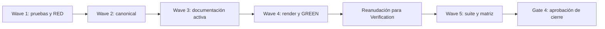

# Tareas — Rúbrica de esfuerzo SDD anclada a ReserveLab

> Plan de la implementación inicial. La compactación tiene un plan vigente en `tasks.md`.

- **Modo SDD:** standard
- **Fase:** Tasks
- **Estado:** Verification completada; pendiente de aprobación de cierre
- **Gate 1:** aprobado
- **Gate 2:** aprobado por el usuario («procede»)
- **Gate 3:** aprobado por el usuario («procede» tras presentación de Tasks)
- **Gate 4:** pendiente
- **Próxima operación:** aprobación de Gate 4; no cerrar automáticamente

## Estrategia y controles

TDD focalizado del contrato documental modificado y regresión de las políticas
que deben permanecer intactas. La evidencia se registrará en
`implementation-evidence-inicial.md`; Verification de la implementación inicial está en `verification-inicial.md`.
RED/GREEN observados; tareas de implementación respaldadas por los artefactos y
comandos de `implementation-evidence-inicial.md`. Suite final de Verification
inicial ejecutada; resultados y revisión de cierre en `verification-inicial.md`.

Antes de escribir fuentes de producto, volver a revisar `git status --short` y
los diffs relevantes para preservar modificaciones concurrentes. No editar
generated manualmente, instalar globalmente, alterar `.gitignore`, contratos,
resultados o specs históricos, ni invocar modelos/Docker. Las tareas `[P]` son
independientes después de la wave previa; se ejecutarán secuencialmente en esta
sesión, sin delegación automática.

## Wave 1 — Contrato de pruebas y RED

- [x] **1.1 [TDD focalizado]** Ampliar `tools/test_sdd_contract.py` para inspeccionar
  por sección/ID la tabla ordinal, el bloque de cuatro campos y los casos de
  contraste. Cubrir F01=1, X13=10, F10-scaffold=8, todos los valores 1–10 y `10+`,
  iconos correctos, ausencia de notas fuera de escala, infraestructura reutilizada,
  caso superior a X13, independencia de lite y matiz histórico. Añadir checks
  negativos con copias en memoria para anclas/iconos erróneos, `11` como nota y
  pérdida del contraste de reutilización. Ejecutar **RED** contra las fuentes
  anteriores y registrar las causas esperadas; **GREEN** después de waves 2–4;
  **REFACTOR** solo si aparece duplicación real en los helpers de inspección.
  (Req R01–R13, R16–R18, R21–R22)
- [x] **1.2 [P] [TDD focalizado]** Actualizar los checks de consumidores y plantillas
  y el detector de emisión no-SDD en `tools/test_model_recommendations.py` para
  reconocer `Esfuerzo previsto del LLM`. Conservar controles de gates, modos,
  routing, silencio de especialistas, ausencia de selección de modelo activa y
  paridad de la referencia en seis plataformas. Observar **RED** por el formato
  anterior y/o consumidores sin actualizar; **GREEN** tras render; **REFACTOR**
  únicamente por duplicación demostrada. (Req R12–R17, R19–R22)

## Wave 2 — Fuente canónica y consumidores directos

- [x] **2.1 [TDD focalizado, continuación de 1.1]** Reescribir
  `canonical/skills/sdd-spec/references/feature-level.md` con **GREEN mínimo
  correcto**: protocolo de comparación, diez descriptores, `10+` sin cálculo,
  inventario de infraestructura, ejemplos de presentación/casos discriminantes,
  supuestos, procedencia y resultado parcial de X13. Mantener exclusividad y
  momento de emisión; explicar compatibilidad de entero e indicador separado
  sin introducir un DTO o motor de scoring. (Req R01–R18, R21)
- [x] **2.2 [TDD focalizado, continuación de 1.2]** Actualizar
  `canonical/skills/sdd-spec/SKILL.md`, `canonical/agents/sdd.md` y
  `canonical/skills/sdd-spec/references/templates.md` para delegar la rúbrica y
  emitir/registrar el bloque uniforme de cuatro campos. No duplicar otra escala
  ni modificar políticas operativas; inspeccionar diff de secciones intactas.
  (Req R12–R17, R19)

## Wave 3 — Documentación activa

- [x] **3.1 [P]** Actualizar `docs/catalogo.md`, `docs/uso.md`,
  `docs/agentes/sdd.md` y `docs/agentes/README.md`: sustituir el formato anterior
  activo, enlazar la referencia compartida y aclarar independencia de profundidad
  y resultado funcional. Conservar explicaciones de gates/modelos/routing que
  no forman parte del cambio. (Req R12–R14, R16–R19, R21)
- [x] **3.2 [P]** Actualizar `docs/sdd-smoke.md` y
  `docs/model-recommendations-smoke.md` con nuevo formato y criterios manuales
  para F01, F10 reutilizado/sin scaffold, X13, superior a X13 y verde excluido
  de lite. Identificar contrastes sintéticos y limitaciones de automatización;
  no declarar ejecuciones de modelos o resultados manuales no observados.
  (Req R03, R06–R14, R16–R18, R22)

## Wave 4 — Render, GREEN y evidencia de implementación

- [x] **4.1** Confirmar que generated no contiene cambios locales ajenos antes de
  renderizar. Ejecutar `python3 -B tools/render.py`, sin edición manual, y revisar
  que el diff afecta únicamente skill/referencia/plantillas y agente SDD de las
  seis plataformas según los adaptadores existentes. No modificar adapters,
  manifest, renderer, instaladores ni CI salvo necesidad demostrada y replanificada.
  (Req R19–R21)
- [x] **4.2 [TDD focalizado, cierre de 1.1–1.2]** Ejecutar
  `python3 -B tools/test_sdd_contract.py` y
  `python3 -B tools/test_model_recommendations.py`; confirmar **GREEN** y controles
  negativos pertinentes. Registrar comandos, resultados y limitaciones en
  `implementation-evidence-inicial.md`. Revisar artefactos antes de marcar tareas `[x]`;
  no sustituir evidencia por intención ni llamar TDD a checks sin RED observado.
  (Req R01–R22)
- [x] **4.3** Revisar estado/diff final de implementación, preservación de archivos
  ajenos y calidad proporcional. Presentar resumen y preflight de Verification;
  terminar el turno y ejecutar Verification solo al reanudar, conforme a las
  instrucciones que gobiernan esta sesión. Sin gate de aprobación adicional.
  (Req R16, R20, R22)

## Wave 5 — Verification al reanudar y Gate 4

- [x] **5.1** Validar `[x]` contra artefactos/evidencia y ejecutar suites finales:
  `python3 -B tools/test_sdd_contract.py`,
  `python3 -B tools/test_model_recommendations.py`,
  `python3 -B tools/validate.py`, `python3 -B tools/check_links.py`,
  `python3 -B tools/test_integrity.py` y `git diff --check`. Separar cualquier fallo
  preexistente/ajeno de los propios; no corregirlo fuera de alcance silenciosamente.
  (Req R01–R22)
- [x] **5.2** Crear `verification.md` con matriz R01–R22 → tarea/check/evidencia,
  revisión de cinco invariantes, RNF-1–RNF-5 y quality bar. Registrar revisión
  cualitativa de descriptores y casos sin atribuirle inferencias reales de modelos.
  Informar huecos/excepciones y presentar **Gate 4**, sin cierre automático.
  (Req R01–R22)
- [omitido: PBT — escala ordinal sin invariante algebraico; enumeración de salidas y checks negativos documentales suficientes]

## Grafo de waves

## Condiciones de finalización

Anclas y presentación cubiertas; reutilización y superioridad justificadas;
ninguna política de lite alterada; seis consumidores coherentes y reproducibles;
evidencia histórica/ajena preservada; no dependencia del laboratorio instalado;
pruebas y matriz sin afirmaciones empíricas inventadas ni requisitos huérfanos.
