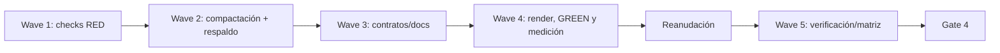

# Tareas — Compactación del contexto SDD

- **Modo SDD:** standard
- **Fase:** Tasks
- **Estado:** iteración cerrada
- **Gate 1 de esta iteración:** aprobado
- **Gate 2 de esta iteración:** aprobado
- **Gate 3 de esta iteración:** aprobado por el usuario («procede»)
- **Gate 4:** aprobado por el usuario («procede»)
- **Próxima operación:** ninguna

## Alcance operativo y estrategia

TDD focalizado para guardas de eficiencia nuevas; regresión/caracterización del
contrato ya implementado. RED/GREEN iniciales pertenecen a la implementación
anterior y no se atribuyen a esta iteración. Su evidencia se conserva en
`implementation-evidence-inicial.md`; esta iteración tendrá su propio registro.

La definición compacta seguirá autosuficiente y sus pruebas comprobarán las anclas
directamente en canonical. No crear scorer ni exigir lecturas nuevas para compensar
el contenido trasladado. Revisar `git status --short` antes de escribir producto;
preservar todos los cambios concurrentes y fuera de alcance.

## Wave 1 — RED específico de eficiencia

- [x] **C1.1 [TDD focalizado]** Adaptar `tools/test_sdd_contract.py`: comprobar
  anclas y contenido normativo en canonical, salidas compactas por rangos (no tabla
  de once líneas), hasta tres contrastes imprescindibles en la referencia; conservar
  controles negativos para F01/X13/F10/10+/lite/reutilización. Mantener ejemplos
  exhaustivos/veredicto en archivo de respaldo y verificar que los consumidores
  no ordenan leerlo. Ejecutar RED y registrar su resultado sin llamar RED a las
  regresiones previas. (Req R06–R18, R21–R26)
- [x] **C1.2 [P] [TDD focalizado]** Añadir guardas de palabras/caracteres a la suite
  existente contra baseline: agente `<1066`, skill `<2357`, rúbrica `<1774`,
  plantillas `≤863`; verificar cada fuente y que no se duplica contenido obligatorio
  en nuevas instrucciones. Los límites son conteos textuales exactos, no tokens.
  Comprobar que el baseline actual falla donde debe. (Req R23–R27)

## Wave 2 — Compactar fuentes operativas

- [x] **C2.1 [TDD focalizado, continuación C1.1–C1.2]** Compactar
  `canonical/agents/sdd.md` y `canonical/skills/sdd-spec/SKILL.md`, delegando escala,
  campos y justificación en la referencia. Mantener exclusividad, momento, no
  repetición, alcance definido, no gate adicional e independencia de profundidad/lite.
  Evitar editar reglas operativas ajenas a la calificación. (Req R14, R16–R17, R23–R24)
- [x] **C2.2 [TDD focalizado, continuación C1.1–C1.2]** Compactar
  `canonical/skills/sdd-spec/references/feature-level.md`: conservar las diez anclas,
  dimensiones relevantes, scaffold de F10, X13=10, regla `10+`, los cuatro campos,
  independencia de lite y veredicto X13 fiel. Reemplazar tabla de once formatos por
  las cuatro reglas de rango; conservar como máximo tres contrastes cortos.
  (Req R01–R18, R21, R23–R25)
- [x] **C2.3 [P]** Crear `docs/sdd-effort-examples.md` a partir del detalle retirado:
  presentaciones exhaustivas, F01/F10 sin scaffold/X13 superior/F07 y procedencia
  de contratos/resultados. Identificar sintéticos y resultado 10/11 + C12 válido.
  Marcarlo opcional; ningún agente/skill/plantilla lo exigirá para puntuar.
  (Req R08–R13, R18–R19, R22, R25)

## Wave 3 — Adaptar contratos y documentación activa

- [x] **C3.1 [P]** Modificar los checks de `tools/test_sdd_contract.py` para validar
  el contrato conciso y contrastes indispensables en canonical; validar ejemplos
  completos/procedencia en el respaldo; mantener negativos del comportamiento
  semántico, sin literales que solo protegían prosa trasladada. (Req R06–R22, R26)
- [x] **C3.2 [P]** Revisar referencias a escala en `docs/catalogo.md`, `docs/uso.md`,
  `docs/agentes/sdd.md`, `docs/agentes/README.md`, `docs/sdd-smoke.md` y
  `docs/model-recommendations-smoke.md`: evitar repetir rúbrica operativa; enlazar
  respaldo para consultas explícitas. Conservar checks manuales E01–E07 pendientes,
  sin afirmar ejecuciones nuevas. (Req R12–R19, R25)

## Wave 4 — Render, GREEN y medición

- [x] **C4.1** Ejecutar RED focalizado y registrar errores esperados. Ejecutar
  `python3 -B tools/render.py`; nunca editar generated manualmente. Revisar cambios
  solo en los cuatro consumidores SDD por cada plataforma. (Req R19–R21, R28)
- [x] **C4.2 [TDD focalizado, cierre C1.1–C1.2]** Ejecutar
  `python3 -B tools/test_sdd_contract.py` y
  `python3 -B tools/test_model_recommendations.py`; confirmar GREEN y mutantes.
  Medir los cuatro archivos comparables con mismo método y registrar palabras,
  caracteres y escenarios (agente+skill; más rúbrica; más plantillas); auditar
  lecturas obligatorias. Registrar resultados en `implementation-evidence.md`.
  (Req R01–R28)
- [x] **C4.3** Revisar diferencias canónicas y generadas, documentación y estado
  final. Informar resultados reales y presentar preflight de Verification; terminar
  turno y reanudar antes de ejecutar esa fase. Sin gate intermedio. (Req R23–R28)

## Wave 5 — Verification al reanudar

- [x] **C5.1** Tras reanudar, verificar tareas `[x]` y ejecutar suites de contrato,
  `python3 -B tools/validate.py`, `python3 -B tools/check_links.py`,
  `python3 -B tools/test_integrity.py` y `git diff --check`. Medir ahorro con el
  método de baseline; documentar delta y limitaciones, no tokens reales. (Req R01–R28)
- [x] **C5.2** Completar nueva `verification.md` para R23–R28 y regresión R01–R22;
  revisar seis RNF, cinco invariantes y quality bar. Registrar ejemplos host como
  pendientes si no se ejecutaron. Presentar Gate 4 sin cerrar automáticamente.
  (Req R01–R28)
- [omitido: PBT — no hay propiedad algebraica; formato ordinal validado por límites, anclas y casos]

## Grafo de waves

