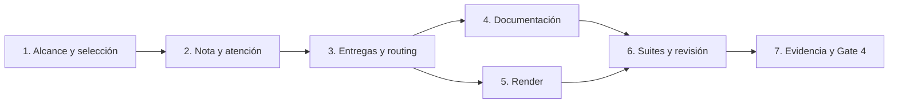

# Tareas — Alcance, calificación y selección de profundidad SDD

Modo SDD: standard
Fase: Verification
Estado: implementación y verificación automatizada completadas; Gate 4 pendiente
Gate 3: aprobado por el usuario («procede»)

Requisitos, diseño y Gate 3 aprobados. Gate 4 queda pendiente tras la verificación.
Estrategia: TDD focalizado para contrato textual; checks y revisión para documentación.
Sin dependencias nuevas, sin instalación global, commit, push ni release.

## Wave 1 — Contrato y regresiones

- [x] 1. Actualizar las pruebas del contrato SDD con casos de definición común,
  publicación antes de profundidad, elección manual y respeto a elecciones previas.
  Cubrir direct 1–3, lite 4–9 y fallback cuando no sea elegible. Observar RED por las
  reglas nuevas ausentes; implementar agente, skill y nueva referencia scope-depth.md;
  observar GREEN y refactorizar solo duplicación real.
  (Req 1.1–1.5, 3.1–3.3, 3.5–3.8, 5.1–5.3, 5.7)
  Artefactos: tools/test_sdd_contract.py, canonical/agents/sdd.md,
  canonical/skills/sdd-spec/SKILL.md, references/scope-depth.md.

- [x] 2. Añadir regresiones de nota/atención separadas, ejemplo 6 naranja con
  complicación controlable y ejemplo 6 sin garantías verificables. Observar RED;
  ajustar feature-level.md, plantillas y controles de integridad; observar GREEN.
  Conservar anclas numéricas y registro de factores/supuestos, sin prefacios ni
  referente de laboratorio en mensajes rutinarios. Mantener tratamiento de bugs.
  (Req 2.1–2.7, 3.4–3.5)
  Artefactos: tools/test_sdd_contract.py, references/feature-level.md,
  references/templates.md, references/integrity-gate.md y scope-depth.md.

- [x] 3. Añadir regresiones para división 10/10+, entrega que sigue en 10/10+ y
  garantías transversales. Observar RED; completar política de entregas; observar
  GREEN. Conservar routing manual, parada al seleccionar especialista y gates.
  Revisar referencias de testing/quality/routing y cambiar solo contradicciones.
  (Req 4.1–4.5, 5.4–5.6)
  Artefactos: tools/test_sdd_contract.py, scope-depth.md y referencias afectadas.

Las tareas 1–3 siguen RED → GREEN → REFACTOR por comportamiento, no por método.
Si una regla ya satisface un test al añadirlo, registrar caracterización y no inventar RED.

## Wave 2 — Documentación y distribuciones

- [x] 4. [P] Alinear guía SDD, smoke y ejemplos de esfuerzo; buscar otros textos
  activos afectados. Incluir casos 1/2/3 direct, 4 lite, 6 naranja lite, 10 dividido
  y caso de entrega aún 10. Distinguir pruebas reportadas por el usuario de evidencia
  automatizada o smoke real; no prometer que todo alcance podrá ser lite.
  (Req 1.3, 2.2, 3.1–3.8, 4.1–4.5, 5.1–5.7)
  Artefactos: docs/agentes/sdd.md, docs/sdd-smoke.md, docs/sdd-effort-examples.md
  y documentación de uso que requiera alineación.

- [x] 5. [P] Ejecutar tools/render.py para las seis plataformas y revisar salidas
  SDD. No editar generated a mano ni instalar los cambios en el perfil del usuario.
  (Req 2.1–2.7, 3.1–3.8, 4.1–4.5, 5.1–5.7; RNF-1)
  Artefactos: generated/{copilot,opencode,kiro,claude,pi,antigravity}/.

## Wave 3 — Verificación y cierre

- [x] 6. Ejecutar suites SDD, recomendaciones de modelo y handoff; validate.py,
  check_links.py y git diff --check. Resolver fallos atribuibles al cambio sin
  eliminar cobertura vigente. Verificar reproducibilidad y ausencia de instrucciones
  activas contradictorias; ampliar suites si el diff revela dependencias relevantes.
  (Req 1.1–5.7; RNF-1–RNF-5)
  Evidencia: comandos, resultados y artefactos revisados en verification.md.

- [x] 7. Registrar matriz requisito → tarea → evidencia y spot-check de RNF/barra
  de calidad. Distinguir tests de contrato textual de conducta LLM no ejecutada;
  no certificar smoke manual pendiente. Continuar desde implementación a verificación
  sin pausa adicional y presentar Gate 4 con límites y resultados reales.
  (Req 1.1–5.7; RNF-1–RNF-5)
  Artefacto: verification.md.

## Dependencias

## Criterio de finalización

Ninguna tarea pasa a [x] sin artefacto real y/o comando verificado. Los fallos,
excepciones y pruebas no ejecutadas se registran explícitamente. Gate 4 queda
pendiente hasta presentar evidencia, no se aprueba por ejecutar todas las tareas.
