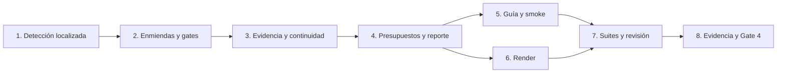

# Tareas — Continuidad de specs y contexto selectivo

Modo SDD: standard
Fase: Verification
Estado: completadas; cierre aprobado en verification.md
Gate 3: aprobado por el usuario («procede»)

Requisitos, diseño y Gate 3 aprobados. Gate 4 aprobado en verification.md.
Estrategia: TDD focalizado para contrato textual; checks para documentación/render.
La ampliación no cierra el Gate 4 de `sdd/alcance-calificacion-y-seleccion`.

## Wave 1 — Política, precedencias y evidencia

- [x] 1. Añadir regresiones de detección localizada, distinción entre implementación,
  enmienda y discrepancia; cubrir ruta explícita/spec conocida, candidatas múltiples
  y ausencia de relación sin afirmar auditoría exhaustiva. Observar RED por reglas
  ausentes; integrar entrada breve en agente/skill y crear spec-continuity.md; observar
  GREEN y eliminar solo duplicación real.
  (Req 1.1–1.6, 5.1–5.2)
  Artefactos: tools/test_sdd_contract.py, canonical/agents/sdd.md,
  canonical/skills/sdd-spec/SKILL.md, references/spec-continuity.md.

- [x] 2. Añadir regresiones de enmienda con nota baja, precedencia de modo/gates,
  IDs y dependencias; cubrir aprobación que sigue válida frente a aprobación
  invalidada. Observar RED; implementar política y enlace en scope-depth.md;
  observar GREEN. No imponer archivos de revisión a todas las specs.
  (Req 2.1–2.6)
  Artefactos: tools/test_sdd_contract.py, spec-continuity.md y scope-depth.md;
  revisar templates.md solo si los campos existentes resultan insuficientes.

- [x] 3. Añadir regresiones de evidencia histórica/pendiente de revalidación,
  spec cerrada, vigencia ambigua, conflicto código/spec, solicitudes relacionadas y
  elecciones limitadas al alcance. Incluir negativos que detecten eliminar controles.
  Observar RED; implementar reglas en política e integrity-gate.md; observar GREEN.
  Mantener pruebas previas de gates, routing, bugfix y tratamiento de specs legacy.
  (Req 3.1–3.5, 4.1–4.4, 5.3–5.4)
  Artefactos: tools/test_sdd_contract.py, spec-continuity.md, integrity-gate.md,
  scope-depth.md y referencias relacionadas solo si aparece contradicción.

RED → GREEN → REFACTOR se observa por comportamiento relevante. Si un test nuevo
ya pasa, registrarlo como caracterización, no inventar un RED.

## Wave 2 — Costo estático, documentación y distribución

- [x] 4. Verificar los presupuestos existentes sin ampliarlos: agente, skill y
  plantillas. Añadir presupuesto separado de continuidad (<1200 palabras/<9000
  caracteres). Definir reporte de contexto para cambio aislado, spec conocida,
  enmienda y candidatas múltiples, distinguiendo texto fijo de contenido de proyecto
  variable; no informar tokens ni ahorros no medidos. Compactar entradas si hace falta.
  (Req 5.1–5.6; RNF-1, RNF-5)
  Artefactos: tools/test_sdd_contract.py y reporte en verification.md.

- [x] 5. [P] Actualizar guía SDD y smoke con casos de continuidad, nota 2 que cambia
  requisito, cambio que conserva criterio, Gate 3 pendiente, cierre histórico,
  evidencia obsoleta y autoridad ambigua. Explicar lectura progresiva sin auditoría
  completa; mantener escenarios runtime explícitamente pendientes si no se ejecutan.
  (Req 1.1–5.6)
  Artefactos: docs/agentes/sdd.md, docs/sdd-smoke.md y otros textos de uso afectados.

- [x] 6. [P] Regenerar las seis distribuciones mediante tools/render.py y comprobar
  propagación de entrada y referencia canónica. No editar generated a mano, cambiar
  adaptadores innecesariamente ni instalar en el perfil real.
  (Req 1.1–5.6; RNF-4)
  Artefactos: generated/{copilot,opencode,kiro,claude,pi,antigravity}/.

## Wave 3 — Verificación y Gate 4

- [x] 7. Ejecutar suite SDD, pruebas de recomendaciones de modelo y handoff,
  validate.py, check_links.py y git diff --check. Revisar diff y búsquedas selectivas
  para instrucciones contradictorias; ejecutar integridad adicional si el impacto
  lo requiere. Corregir fallos sin retirar controles ni cambios del ajuste anterior.
  (Req 1.1–5.6; RNF-1–RNF-5)
  Evidencia: comandos, resultados y revisión en verification.md.

- [x] 8. Registrar matriz completa requisito → tarea → evidencia, RED/GREEN o
  excepciones honestas, RNF/barra de calidad y reporte de contexto. Diferenciar
  pruebas estáticas de smoke runtime. Continuar de implementación a verificación
  sin gate intermedio; presentar Gate 4 de esta ampliación sin cerrar el anterior.
  (Req 1.1–5.6; RNF-1–RNF-5)
  Artefacto: verification.md.

## Dependencias

## Integridad y límites

Cada [x] exige artefacto real o comando verificado; no marcar completado por intención.
No implementar antes de Gate 3. Sin dependencias nuevas, índices/cachés persistentes,
bootstrap automático, instalación global, commit, push, release o migración de specs.
