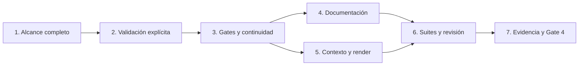

# Tareas — Presentación y validación del alcance completo

Modo SDD: standard
Fase: Verification
Estado: completadas; cierre aprobado en verification.md
Gate 3: aprobado por el usuario («procede»)

Requisitos, diseño y Gate 3 aprobados. Gate 4 aprobado en verification.md.
Estrategia: TDD focalizado para contrato textual, checks para docs y render.
Conservar cambios locales previos y evidencia histórica; no cerrar otras specs.

## Wave 1 — Contenido y aprobación

- [x] 1. Sustituir tests del resumen de 1–3 frases por regresiones de alcance
  completo: objetivo/resultado, comportamientos/reglas/condiciones, criterios,
  errores/estados/casos límite, exclusiones/restricciones/supuestos. Mantener orden
  alcance antes de nota y cobertura 10/10+. Observar RED; actualizar scope-depth.md
  y feature-level.md; observar GREEN. No convertir límites de contexto en cuotas
  que recorten la salida ni inventar requisitos funcionales.
  (Req 1.1–1.7, 2.5)
  Artefactos: tools/test_sdd_contract.py y referencias canónicas de alcance/calificación.

- [x] 2. Añadir regresiones de espera de validación, pregunta combinada, elección
  sin aceptación, aprobación vigente reutilizable y ajuste que requiere mostrar el
  conjunto completo. Observar RED; integrar entradas compactas en agente/skill y
  reglas en scope-depth.md; observar GREEN. Consultas informativas sin artefactos
  ni implementación no adquieren una aprobación ceremonial ni nota de feature.
  (Req 2.1–2.4, 2.6, 3.1–3.4)
  Artefactos: tools/test_sdd_contract.py, canonical/agents/sdd.md,
  canonical/skills/sdd-spec/SKILL.md y scope-depth.md.

- [x] 3. Añadir negativos de aprobación por modo, solo delta, falta de espera y
  confusión con Gate 1. Observar RED; alinear continuidad/integridad y flujos
  direct/lite/standard; observar GREEN. Mantener IDs, decisiones previas vigentes,
  autorización, solo planificación, gates y selección manual de especialistas.
  (Req 4.1–4.8)
  Artefactos: tools/test_sdd_contract.py, spec-continuity.md, integrity-gate.md,
  SKILL.md y política; revisar plantillas solo si existe contradicción.

Cada tarea observa RED → GREEN → REFACTOR por contrato relevante. Si una garantía
ya está cubierta al añadir el test, registrar caracterización, no inventar RED.

## Wave 2 — Coherencia y contexto

- [x] 4. [P] Actualizar guía, ejemplos y smoke con Alcance definido completo,
  aprobación conjunta, respuesta solo modo, ajustes y reanudación. Retirar reglas
  activas de 1–3 frases sin modificar evidencia histórica de pruebas previas.
  Marcar escenarios runtime nuevos como pendientes si no se ejecutan.
  (Req 1.1–4.8; RNF-5)
  Artefactos: docs/agentes/sdd.md, docs/sdd-effort-examples.md, docs/sdd-smoke.md
  y docs/uso.md u otros textos activos afectados.

- [x] 5. [P] Mantener presupuestos existentes de agente/skill/plantillas/referencias;
  compactar duplicaciones si hace falta. Medir instrucciones fijas por palabras y
  caracteres, sin prometer tokens reales o igual costo de salida completa. Regenerar
  seis distribuciones con tools/render.py y comprobar propagación/paridad.
  (Req 1.5, 4.1–4.8; RNF-2, RNF-3)
  Artefactos: tools/test_sdd_contract.py y generated de seis plataformas.

## Wave 3 — Verificación y cierre

- [x] 6. Ejecutar suite SDD, modelo/handoff, validate.py, check_links.py y
  git diff --check. Revisar diff y buscar contradicciones operativas; ampliar suites
  según impacto. Corregir fallos sin borrar controles anteriores ni cambios ajenos.
  (Req 1.1–4.8; RNF-1–RNF-5)
  Evidencia: comandos, resultados, presupuesto y revisión en verification.md.

- [x] 7. Registrar matriz de todos los requisitos, evidencia RED/GREEN o baseline,
  RNF y barra de calidad; distinguir checks estáticos de comportamiento LLM real.
  Continuar desde implementación a verificación sin pausa adicional y presentar
  Gate 4 propio, preservando cierres/pendientes de las specs anteriores.
  (Req 1.1–4.8; RNF-1–RNF-5)
  Artefacto: verification.md.

## Dependencias

## Integridad y exclusiones

Cada [x] exige artefacto real o comando verificado. Sin nuevas dependencias, índices,
caché persistente, instalación global, commit, push, bump, tag, release o migración
automática de specs. No declarar comprensión runtime por pasar tests textuales.
