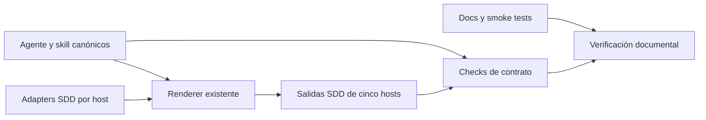

# Diseño — Simplificación del agente SDD

- Modo SDD: standard
- Fase: Design
- Estado: aprobado
- Gate 2: aprobado por el usuario mediante «procede» tras presentar el diseño
- Requisitos: `requirements.md`, Gate 1 aprobado

## Contexto y alcance

Cambio del contrato declarativo del MAS, no de una aplicación runtime. Las fuentes
canónicas gobiernan el comportamiento y los adapters su presentación por host.
No se añadirán servicios, dependencias, formatos de persistencia ni abstracciones.
El contrato de esta sesión sigue vigente hasta que se instale y recargue el kit.

## Arquitectura y responsabilidades

1. `canonical/skills/sdd-spec/SKILL.md`: autoridad para tres profundidades,
   selección proporcional, gates y compatibilidad con opciones retiradas.
2. `canonical/agents/sdd.md`: resumen operativo coherente que delega en la skill.
3. Referencias: política de testing, recomendaciones, plantillas e integridad
   alineadas; no reglas contradictorias en quality-bar.
4. `adapters/<host>/agents/sdd.json`: descripción actualizada, sin cambios de
   permisos, modelos, nombres ni suffixes específicos del host.
5. Documentación y smoke tests: ejemplos del contrato nuevo y solicitudes retiradas.
6. `tools/test_sdd_contract.py`: checks del contrato y propagación; conservar las
   comprobaciones existentes ajenas a esta simplificación.
7. `generated/`: salida derivada del renderer existente, nunca fuente editable.

No se modifica manifest, renderer, instaladores ni especialistas salvo que una
referencia activa al contrato SDD requiera una corrección textual indispensable.



## Política de profundidad (R1, R3)

- Tabla y enumeraciones de opciones: únicamente `direct`, `lite`, `standard`.
- Mantener `standard` como default y fallback por riesgo o incertidumbre.
- Mantener elegibilidad y reclasificación de `lite`, Quick Plan exclusivo, rutas,
  intención de solo planificación, Gate 0 y Gates 1–4 de `standard`.
- Retirar mandatos específicos de `deep`: glosario adicional, mayor diagramación
  y activación de PBT por modo. No trasladarlos como obligaciones de `standard`.
- Glosario o diagramas adicionales solo por necesidad concreta o petición,
  respetando proporcionalidad; no se recrea un modo pesado con otro nombre.

## Política de pruebas (R2, R3)

- Mantener tres estrategias: sin test nuevo justificado, caracterización/regresión
  y TDD focalizado. Quitar estricto de tablas, ciclos y plantillas de selección.
- TDD focalizado conserva RED → GREEN → REFACTOR por criterio observable o seam
  de riesgo; no exige un RED por cada método o incremento interno.
- Conservar baseline/caracterización, regresión por defecto, suite final,
  excepciones sin harness y prohibición de evidencia TDD retroactiva.
- PBT se decide por invariantes que lo justifiquen, no por profundidad. Mantener
  restricciones de dependencias, pruebas reales y ausencia de abstracciones
  anticipadas.

## Opciones retiradas y reanudación (R1.2, R2.2, R4)

La skill tendrá una sección explícita de compatibilidad, reutilizada por el agente
y referencias; no se simulará que estas opciones nunca existieron.

1. Detectar `deep` o TDD estricto en una solicitud o marcadores de spec histórica.
2. Informar la retirada y proponer `standard` o TDD focalizado respectivamente.
3. Esperar aceptación antes de modificar la spec o ejecutar el flujo sustituto.
   Si aparecen ambas opciones, pedir una única aceptación conjunta.
4. Tras aceptar, localizar la fase pendiente mediante estado y gates reales;
   preguntar si son ambiguos, sin considerar la aceptación como aprobación de
   Requirements, Design o Tasks.
5. En la spec retomada, registrar el acuerdo y actualizar solo los marcadores y
   decisiones vigentes necesarios. Preservar historia, artefactos y evidencias.

La aceptación es una decisión de cambio de contrato, no un gate de modelo.
El preflight de la operación pendiente se aplica según su flujo normal, sin
exigir confirmar el LLM. Rechazar la alternativa no inicia trabajo sustituto.

```mermaid
sequenceDiagram
    actor U as Usuario
    participant S as Agente SDD
    participant H as Spec histórica
    U->>S: Solicitud con opción retirada o reanudación
    S-->>U: Retirada y alternativa; solicitar aceptación
    U->>S: Aceptar alternativa
    opt Spec existente
        S->>H: Consultar estado y gates; conservar evidencia
        S->>H: Registrar transición autorizada
    end
    S-->>U: Continuar según fase y gates reales
```

## Archivos afectados (R5)

- `canonical/agents/sdd.md` y `canonical/skills/sdd-spec/SKILL.md`.
- Referencias `testing.md`, `model-selection.md`, `templates.md`,
  `quality-bar.md`; revisar `integrity-gate.md` y `navigator-context.md` para
  coherencia y editar solo si contienen reglas afectadas.
- Descripciones SDD en adapters Copilot, OpenCode, Kiro, Claude y Pi.
- `docs/agentes/sdd.md`, `docs/uso.md`, `docs/catalogo.md`, `docs/sdd-smoke.md`;
  revisar otras menciones activas y corregir únicamente las pertinentes.
- `tools/test_sdd_contract.py`, sin sobrescribir modificaciones locales previas.
- Salidas SDD y sus referencias en las cinco plataformas.

Una búsqueda final separará opciones activas de menciones legítimas de retirada.
No se aplicará un reemplazo global sobre specs, snapshots o todo el repositorio.

## Generación y protección del working tree (R5.4)

`tools/render.py:74–79` borra y recrea cada carpeta de plataforma. Con los cambios
locales presentes, no se ejecutará directamente sobre `generated/` sin comprobar
el riesgo de sobrescribir trabajo ajeno.

- Registrar el estado/diff previo de archivos afectados.
- Renderizar primero a una carpeta temporal verificada mediante `--output`.
- Comparar con `generated/`; propagar solo salidas SDD de ese render mediante un
  mecanismo de sincronización derivado, no edición manual de su contenido.
- No tocar diferencias de otros agentes/skills. Si hay modificaciones SDD
  generadas sin equivalente en fuentes, detenerse y pedir resolución.
- Verificar reproducibilidad con `tools/validate.py`. Si falla por trabajo ajeno,
  registrar el fallo y aislar su causa; no corregirlo ni atribuirlo a esta feature.

## Estrategia de pruebas y evidencia

**Estrategia: caracterización/regresión del contrato declarativo.** No se declara
TDD productivo: no cambia lógica del renderer, y los tests verifican texto,
metadatos y distribución, no ejecución autónoma del agente.

- Baseline: ejecutar contrato SDD y checks relevantes antes de editar fuentes.
- Ajustar primero expectativas afectadas para observar el rechazo del contrato
  anterior; conservar comando y fallo específico. Esto es evidencia de regresión
  del contrato, no demuestra TDD del comportamiento conversacional del agente.
- Verificar tablas con exactamente tres modos y tres estrategias admitidas;
  ausencia de `deep`/estricto en descripciones o listas de opciones activas.
- Comprobar que las secciones de retirada exigen aceptación y preservan historia;
  mantener checks de gates, rutas, Navigator y evidencia.
- Comparar referencias generadas con canonical y revisar descripciones de hosts.
- Smoke manual: petición `deep`, petición TDD estricto, ambas juntas, reanudar
  histórico y rechazar alternativa. Distinguir revisión documental de una prueba
  interactiva real; no declarar esta última ejecutada si no se realizó.

Comandos previstos: `python3 tools/test_sdd_contract.py`,
`python3 tools/test_model_recommendations.py`, `python3 tools/test_integrity.py`,
`python3 tools/test_handoff_contract.py`, `python3 tools/test_validate.py`,
`python3 tools/validate.py`, `python3 tools/check_links.py` y
`python3 tools/test_links.py`.

## Requisitos no funcionales

- RNF-1 Consistencia: los cinco hosts exponen las mismas tres profundidades y las
  referencias generadas coinciden byte a byte con sus fuentes canónicas.
- RNF-2 Reproducibilidad: la validación compara la distribución con un render de
  las fuentes actuales; todo fallo externo queda identificado, no ocultado.
- RNF-3 Preservación: el diff incremental no altera cambios ajenos ni specs
  históricas; no se instala ni modifica configuración global.
- RNF-4 Proporcionalidad: referencia de modelo conserva el límite actual de 450
  palabras y design standard el techo orientativo de 250 líneas; ninguna regla
  nueva exige documentación pesada o RED por cada incremento interno.

## Invariantes críticos

1. Solo tres profundidades disponibles; las opciones retiradas no son aliases.
2. Ningún test retroactivo se acredita como RED observado.
3. Aceptar una alternativa no equivale a aprobar otros gates pendientes.
4. Artefactos generados dependen de canonical/adapters, nunca al revés.

## Aplicación de quality-bar

Se respetan separación de responsabilidades, manejo de errores existente,
proporcionalidad y código mínimo; no se añaden capas ni mocks anticipados.
UI, DI runtime, BD, persistencia de aplicación y concurrencia no aplican a este
cambio documental. No se añaden C4/ER ni dependencias PBT para esta feature.
Se mantiene el flujo de verificación y evidencia del contrato.

## Estado y límites

Design aprobado en Gate 2. No se modificaron fuentes de producto, adapters,
generados ni tests; no se ejecutaron pruebas. El comportamiento conversacional
solo podrá afirmarse con evidencia interactiva, no por checks textuales.
