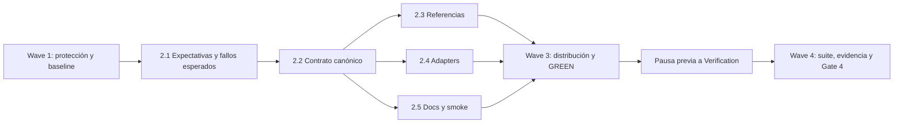

# Tareas — Simplificación del agente SDD

- Modo SDD: standard
- Fase: Tasks
- Estado: en progreso
- Gate 3: aprobado por el usuario mediante «procede» tras presentar las tareas
- Gates previos: Requirements y Design aprobados
- Estrategia: caracterización/regresión del contrato declarativo

## Wave 1 — Baseline y protección del trabajo existente

- [x] 1.1 Registrar estado y diff previo de fuentes, documentación, tests y salidas SDD; identificar cambios locales que deben preservarse. Si una salida SDD tiene cambios sin equivalente canónico, detenerse y solicitar resolución. (Req R5.4; evidencia: `git status --short`, sin cambios SDD generados huérfanos)
- [x] 1.2 Ejecutar baseline del contrato SDD y checks pertinentes de recomendaciones, integridad y handoffs. Registrar comandos, resultados y fallos preexistentes sin corregir trabajo ajeno. (Req R3.1–R3.3, R4.3–R4.4, R5.3–R5.4; evidencia: contrato 211/211, recomendaciones 141/141, integridad 391/391)

## Wave 2 — Contrato simplificado y regresiones

- [x] 2.1 Ajustar las expectativas afectadas de `tools/test_sdd_contract.py`: tres modos y tres estrategias disponibles, opciones retiradas con aceptación, no conversión silenciosa y compatibilidad histórica. Ejecutar contra fuentes anteriores y registrar fallos específicos esperados; no atribuirlos a TDD conversacional. (Req R1.1–R1.4, R2.1–R2.2, R4.1–R4.3, R5.2–R5.3; evidencia: RED 187/213 con salidas derivadas antiguas; GREEN 213/213)
- [x] 2.2 Actualizar `canonical/skills/sdd-spec/SKILL.md` y `canonical/agents/sdd.md`: retirar modos y reglas pesadas, mantener clasificación y gates, e introducir política de retirada/reanudación. La aceptación de alternativa no aprueba gates pendientes. (Req R1.1–R1.4, R2.1–R2.2, R3.1–R3.3, R3.5, R4.1–R4.4; evidencia: fuentes canónicas en disco)
- [x] 2.3 Actualizar referencias de testing, modelo, plantillas y quality-bar; revisar integridad y Navigator, modificándolos solo si el contrato afectado lo exige. Mantener RED observado, regresión, excepciones y PBT por necesidad real. (Req R2.1–R2.5, R3.1–R3.5, R4.1–R4.3, R5.1–R5.2; evidencia: referencias canónicas en disco y 213/213)
- [x] 2.4 [P] Actualizar únicamente las descripciones SDD de adapters de los cinco hosts; preservar permisos y personalizaciones. (Req R1.1, R5.1–R5.2, R5.4; evidencia: cinco `adapters/*/agents/sdd.json`)
- [x] 2.5 [P] Actualizar documentación de agente, uso, catálogo y smoke SDD; revisar menciones activas pertinentes. Incluir solicitudes retiradas por separado y juntas, histórico y rechazo de alternativa. No migrar specs ni snapshots. (Req R1.2, R2.2, R3.1–R3.5, R4.1–R4.4, R5.1–R5.2; evidencia: docs actualizados y specs históricas sin migración)

## Wave 3 — Distribución y comprobación de implementación

- [x] 3.1 Verificar carpeta temporal y renderizar con `tools/render.py --output`; comparar y sincronizar solo salidas SDD derivadas, sin editar manualmente contenido generado ni sobrescribir otras diferencias. (Req R5.1, R5.4; evidencia: render temporal y comparación sin diferencias en los cinco árboles SDD)
- [x] 3.2 Ejecutar nuevamente contrato SDD para comprobar GREEN y paridad de referencias y hosts. Si falla, corregir solo problemas atribuibles a estas tareas. (Req R1.1–R1.4, R2.1–R2.5, R3.1–R3.5, R4.1–R4.4, R5.1–R5.3; evidencia: `python3 tools/test_sdd_contract.py` 213/213)
- [x] 3.3 Revisar diff incremental, listas de opciones activas y menciones explicativas permitidas; comprobar que no se transfirió carga de `deep` a `standard`. Validar artefacto/evidencia antes de cada `[x]`. (Req R3.5, R4.2, R5.2, R5.4; evidencia: `tools/validate.py`, `test_integrity.py` 391/391 y enlaces 4/4)
- [x] 3.4 Presentar resumen de implementación y preflight de Verification; detenerse hasta que el usuario reanude. No crear un gate intermedio ni pedir confirmar el LLM. (Req R3.1; evidencia: transición comunicada en este turno; Verification aún no ejecutada)

## Wave 4 — Verification, solo después de reanudar

- [x] 4.1 Ejecutar suite final: contrato SDD, recomendaciones, integridad, handoff, pruebas del validador, validación de distribución y checks/tests de enlaces. Registrar resultados y distinguir fallos preexistentes o ajenos. (Req R3.1–R3.3, R4.3–R4.4, R5.1–R5.4; evidencia: `verification.md`, suite completa en verde)
- [x] 4.2 Revisar escenarios smoke y quality-bar. Documentar si la evidencia es revisión textual o prueba interactiva real; no afirmar comportamiento observado sin ejecutarlo. Auditar RNF-1–RNF-4 del diseño. (Req R1.2, R2.2–R2.5, R3.1–R3.5, R4.1–R4.3, R5.2–R5.4; evidencia: `verification.md`, smoke interactivo declarado pendiente)
- [x] 4.3 Crear `verification.md` con matriz por criterio, tareas, checks, paths/comandos, baseline, fallos esperados, GREEN, suite y límites. Resolver o declarar huecos; presentar Gate 4 sin cerrar automáticamente. (Req R1.1–R5.4, en sus respectivos grupos; evidencia: `verification.md`)

## Dependencias y waves

`[P]` indica paralelismo posible en archivos distintos. Los archivos con cambios
locales se editan con parches focalizados; ninguna tarea autoriza revertirlos.
Se conserva el patrón de tests existente: no se crea un framework nuevo.

## Criterio de finalización

Ninguna tarea se marca `[x]` sin artefacto o evidencia verificable. Fallos externos
no se ocultan ni justifican declarar verificación completa. No hay tareas de
instalación global, commit, push o release. Al instalar posteriormente el kit,
será necesario reiniciar el host para cargar el contrato nuevo.
