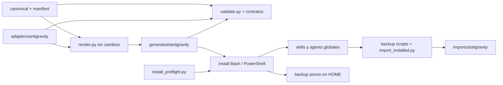

# Diseño: soporte de Google Antigravity

- **Modo SDD:** standard
- **Fase:** Design
- **Estado:** aprobado
- **Gate:** Gate 2 — aprobado por el usuario mediante «procede» tras la presentación del diseño
- **Prerrequisito:** Requirements aprobado por el usuario mediante «procede».
- **Intención:** solo planificación; no implementar en esta fase.
- **Fecha:** 2026-10-05

## 1. Decisión y límites

Añadir una distribución declarativa para **Antigravity 2.0** sin alterar los
cuerpos canónicos, el renderer ni la semántica de otras plataformas (R1–R4, R8).
No añadir wrappers runtime, plugins, hooks, agentes convertidos en skills ni
automatización de handoffs. La instalación usa el directorio personal del usuario;
las pruebas usan un HOME/USERPROFILE temporal, nunca la instalación real.

La versión de referencia certificada será la identificada en el primer smoke
completo exitoso; no se inferirá soporte de versiones posteriores sin evidencia.
Hoy no hay versión runtime verificada: no se publicará una
compatibilidad histórica deducida únicamente de la documentación. Si no hay acceso
al host, R10 queda pendiente y el soporte se describe como integración sin
certificación runtime, no como soporte completo.

## 2. Componentes y dependencias



| Componente | Cambio y responsabilidad |
|---|---|
| `canonical/manifest.json` | Añadir plataforma; conservar inventario actual (R1). |
| `adapters/antigravity/platform.json` | Tres sustituciones del host (R2, R4). |
| `adapters/antigravity/agents/*.json` | Ocho contratos filename/frontmatter y notas del host (R3–R4). |
| `tools/validate.py` | Validación específica de adapters Antigravity (R4.3). |
| `scripts/install/antigravity.{sh,ps1}` | Simulación, copia, respaldo y códigos de salida (R5–R6). |
| `scripts/backup/antigravity.{sh,ps1}` | Exportación vía importador existente (R7). |
| `tools/test_validate.py`, `tools/test_install.py`, `tools/test_integrity.py` | Extender fixtures e inventarios (R8). |
| `tools/test_antigravity_install.py` | Tests dinámicos del nuevo contrato en Bash/PowerShell y exportación (R5–R8). |
| `tools/test_antigravity_contract.py` | Checks de distribución y política de los ocho adapters (R1–R4, R8). |
| `.github/workflows/ci.yml` | Jobs de instalación por OS y contratos nuevos (R8). |
| `docs/antigravity-smoke.md` | Procedimiento y evidencia requerida del host (R10). |

No cambiar `render.py`, `install_preflight.py` ni `import_installed.py` salvo que
una prueba demuestre una incompatibilidad que requiera revisar este diseño.

## 3. Contratos de adapters

### Plataforma

```json
{
  "substitutions": {
    "{{sdd_agent}}": "sdd",
    "{{gate_instruction}}": "",
    "{{steering_paths}}": "`GEMINI.md`, `AGENTS.md`, `.agents/rules/*.md`"
  }
}
```

`sdd` es un identificador, no un comando: los contextos canónicos ya incluyen
backticks y frases como «continuar con» y «si el agente». Una instrucción
imperativa dentro de ese token rompería la gramática (R4.4).

### Agentes

Cada adapter conserva la forma existente `{filename, frontmatter, body_suffix}`:

- `filename`: exactamente `<id>.md`; `name`: exactamente el ID del manifiesto.
- `description`: string no vacío que explica el rol; SDD incluye `direct`, `lite`,
  `standard`, `Quick Plan` y excluye `deep`/`estricto`.
- `model: inherit`, `subagent: true`, `mainAgent: true`.
- `tools`: lista explícita, no vacía, sin duplicados, expandida según la tabla siguiente.
- `body_suffix`: nota breve propia del host: `@<agente>` es notación de routing
  del kit, no garantía de sintaxis nativa; seleccionar el agente mediante la UI
  comprobada. La nota no altera gates, roles ni permisos canónicos.

No declarar inicialmente `skills`, `plugins`, `mcpServers` ni
`commandExecutionPolicy`: la resolución de paths en `skills` no está suficientemente
descrita y no se sobrescribirán las políticas del usuario. Descubrimiento global
de skills + `view_file` permite cargar `SKILL.md` y referencias; debe verificarse
también en los subagentes. Si falla, detener esa aceptación y revisar el contrato,
no introducir paths absolutos de una máquina en generated.

### Herramientas por rol

Conjuntos de diseño; los JSON tendrán listas literales, sin nuevo motor de herencia:

- **L:** `view_file`, `list_dir`, `find_by_name`, `grep_search`.
- **D:** `write_to_file`, `replace_file_content`.
- **G:** `run_command`.
- **W:** `read_url_content`, `search_web`.
- **Q:** `ask_question` (las aprobaciones también pueden expresarse en el chat).

| Agente | Conjuntos | Alcance de escritura y shell según el canónico |
|---|---|---|
| architecture | L + D + G + W + Q | `.architecture/`; inspección Git, nunca refactor de producto. |
| code-review | L + D + G + W + Q | `inspect` no escribe; documentación/remediación con autorización por micro-paso. |
| data-api | L + D + G + W + Q | `.data/` y datos/APIs autorizados; no UI. |
| documentation-orchestrator | L + D + G + W + Q | Documentación/indexado autorizados; no SDD, producto, CI ni Git mutante. |
| git-release-manager | L + D + G + W + Q | Versionado/release; commit/push/tag solo con aprobación. |
| project-navigator | L + D + G + Q | Lectura por defecto; índices y exportación solo autorizados. |
| sdd | L + D + G + W + Q | Specs; producto solo con intención de implementación y gates aprobados. |
| ui-design | L + D + G + W + Q | `.design/` y UI autorizada; no APIs/negocio. |

La similitud de listas no iguala responsabilidades: shell puede eludir restricciones
de archivos; estas son instrucciones del kit más permisos heredados del host, no
sandbox por rol. No añadir `generate_image`: no es necesario para el contrato
actual. No conceder `invoke_subagent` a los ocho roles: habilitar ser invocado no
exige poder invocar hijos, y los especialistas no deben encadenar handoffs.
El smoke de delegación usa un agente padre del host con esa herramienta habilitada.

Los nombres L/D/G/W/Q están documentados en Hooks; `view_file`, `grep_search`,
`replace_file_content`, `run_command` aparecen también en ejemplos de subagentes.
Esta evidencia no demuestra el mapeo correcto en cada build (R4.1, R10).

## 4. Validación y errores

Añadir un helper específico dentro de `validate.py`, llamado desde
`validate_adapters()` solo para Antigravity. No crear una biblioteca de schemas.

- Validar filename/name exactos, description no vacía y tipos JSON reales.
- Aceptar enum de esquema `inherit|flash|pro`; comprobar la política inicial
  `inherit` y los dos flags `true` en los tests de distribución.
- Comprobar lista de tools contra el conjunto soportado **por este adapter**, no
  anunciarlo como catálogo exhaustivo de Antigravity. La constante documenta URLs.
- Rechazar tipos erróneos, strings en lugar de booleanos, tools desconocidas,
  duplicadas o vacías; validar campos opcionales si se incorporan tras revisión.
- Acumular errores con `adapters/antigravity/agents/<id>.json` y campo afectado;
  código de salida distinto de cero. Conservar fixtures genéricos de otras plataformas.

El preflight compartido comprueba presencia de archivos principales, no YAML,
hashes ni todas las referencias. La validación de fuentes y los tests de copia
completa cubren esas otras responsabilidades; no atribuirlas al preflight (R5, R8).
Durante implementación se añadió comprobación local en los instaladores de
recursos canónicos presentes en generated antes de copiar y de bytes instalados
después. Evita falsos éxitos sin modificar el preflight compartido.

## 5. Instalación, respaldo e importación

Destinos fijos bajo HOME (Bash) o USERPROFILE (PowerShell):
`~/.gemini/config/skills`, `~/.gemini/config/agents`.
Backup previo: `~/.antigravity-kit-backup/<timestamp>/{skills,agents}`.

1. Resolver Python 3 y rutas desde la ubicación del script; validar argumentos.
2. Ejecutar preflight `--platform antigravity --check-source` antes de escribir.
3. Enumerar únicamente elementos declarados por manifest/adapters, mediante Python
   estándar en el script; no copiar extras solo por encontrarlos en generated.
4. En simulación, listar operaciones y terminar sin mkdir/copia/backup.
5. Respaldar cada elemento que se sobrescribe, salvo Force; copiar skills completas
   por fusión y agentes por archivo. No usar borrado espejo ni retirar recursos propios.
6. Ejecutar `--check-installed` con ambos destinos; solo después comunicar éxito.

Bash reutiliza `set -euo pipefail`, quoting y copia con rsync/fallback cp del kit.
PowerShell usa `LiteralPath`, `ErrorActionPreference=Stop` y captura inmediata del
exit code nativo: los mensajes se envían a presentación y **no** se mezclan con
el único booleano de retorno del preflight. Tests cubren stdout + error simultáneos.
Si hay fallo de copia, conservar respaldo y comunicar fallo; no rollback automático.

Las copias por fusión preservan extras dentro de skills existentes; pueden quedar
recursos antiguos y eso se documentará. El timestamp debe evitar reutilizar una
carpeta de respaldo existente; añadir sufijo si colisiona, sin borrar backups previos.

Backup scripts delegan en `import_installed.py antigravity --skills-dir ...
--agents-dir ...`, con DryRun y propagación de exit code. El importador filtra
inventario y tolera elementos no instalados con avisos: exportación parcial no es
instalación completa. Fallos de copia se propagan; no modificar canonical.
Límite heredado: el importador no reserva timestamps únicos; exportaciones en el
mismo segundo pueden fallar o, con solo agentes, fusionarse/sobrescribirse. Se
documenta sin refactorizar ese helper compartido en esta entrega.

## 6. Pruebas y evidencia (R1–R10)

**Estrategia:** TDD focalizado en esquema e instaladores nuevos; caracterización
del render/importación y contratos reutilizados. Registrar RED por causa esperada,
GREEN y suite; no llamar TDD a tests añadidos después. Sin dependencias nuevas de
testing: conservar scripts Python stdlib del repositorio.

| Área | Evidencia prevista |
|---|---|
| R1–R3, R8.1–R8.3 | Manifest, 8/10 salidas, recursos iguales, tokens resueltos, frontmatter y render reproducible. |
| R4 | Fixtures inválidos aislados en `test_validate.py`; names/types/tools, contrato SDD, nota de routing. |
| R5–R6 | HOME temporal: completa, skill/agente ausente, dry-run poblado/vacío, Force, backup skill/agente, extras intactos, rutas con espacios, segunda ejecución. |
| R5.5 | Preflight simulado con stdout + exit 1; fallo de copia controlado; no mensaje de éxito. |
| R7 | Importación real en copia temporal del repo, filtrado de extras, DryRun y errores propagados. |
| R8.5 | Mismo harness nuevo: Bash en Linux/macOS, PowerShell en Windows; no omitir silenciosamente shell requerido. |
| R9 | Enlaces, cantidades, rutas, comandos, restauración y distinción entre productos. |
| R10 | Smoke humano con versión/OS, descubrimiento, tools usadas, skills/referencias y subagente sin historia heredada. |

El harness nuevo selecciona Bash o PowerShell según OS; fija HOME y USERPROFILE
en procesos hijos, usa timeout y nunca toca perfiles reales. En Windows prueba
los `.ps1` realmente, no solo `test_install.py` (que omite ejecución Bash allí).
CI conserva Ubuntu y añade job de este harness en macOS/Windows; incluye
Code Review y las pruebas nuevas, manteniendo Python 3.10 compatible.

**Invariantes críticos (cuatro):** salida determinista; conjunto de IDs igual al
manifest; simulación sin escrituras; extras fuera del inventario preservados.
Tests parametrizados con fixtures bastan: no añadir PBT ni Hypothesis por ser
contratos discretos de archivos/OS, no un nuevo algoritmo algebraico.

Antes de implementar, registrar baseline de la suite de Requirements y hashes de
las distribuciones existentes del working tree. Usar render temporal para evaluar
diferencias; el render final no debe introducir cambios adicionales en las cinco
distribuciones si sus fuentes no cambiaron. Si otro proceso modifica fuentes,
detenerse y reconciliar baseline sin sobrescribir trabajo ajeno.

## 7. Documentación, calidad y límites de cierre

Actualizar README y docs de catálogo, instalación, uso, arquitectura, desarrollo
y MAS sin cambiar protocolos comunes. Añadir smoke con datos observables, no
transcripciones privadas ni secretos; seleccionar agente por UI verificada y skill
por slash documentado. No atribuir `/agents` del CLI a 2.0 sin comprobación.

Quality bar: separación fuente/adapter/salida/I/O; sin framework de UI, BD,
singletons de infraestructura ni nueva DI (no aplican). Mantener helpers locales
y parámetros del harness; errores de infraestructura visibles y exit codes,
sin catch vacío. Persistencia limitada a scripts/importador ya existentes.
RNF de spot-check: reproducibilidad, no regresión, simulación sin escrituras,
preservación del usuario y evidencia multiplataforma.

Fuentes: `tools/render.py:74–115`, `tools/validate.py:58–123`,
`tools/install_preflight.py:74–137`, `tools/import_installed.py:16–56`,
`tools/test_install.py:328–374`, instaladores Claude y backup Pi PowerShell.
Referencia de herramientas: [Hooks](https://antigravity.google/docs/hooks/#supported-tools);
rutas y esquema: [Skills](https://antigravity.google/docs/skills/) y
[Subagents](https://antigravity.google/docs/subagents/).

**Gate 2 aprobado:** el usuario indicó «procede» tras la presentación de Design.
La aprobación autoriza Tasks, no implementación ni instalación en el HOME real.
No hay suite ni smoke ejecutados en esta fase; runtime y Windows son evidencias
pendientes, no capacidades certificadas.
