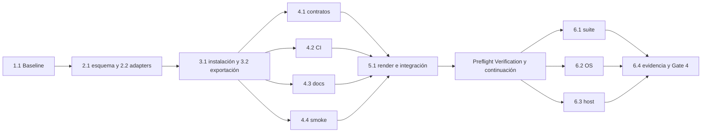

# Tareas: soporte de Google Antigravity

- **Modo SDD:** standard
- **Fase:** Verification
- **Estado:** suite local y CI Linux/macOS/Windows aprobadas; smoke runtime pendiente
- **Gate:** Gate 3 — aprobado mediante «procede» tras la solicitud de autorización de implementación
- **Prerrequisitos:** Gates 1 y 2 aprobados por el usuario.
- **Intención autorizada:** implementación y pruebas en perfiles temporales; sin commit, push ni instalación real.
- **Gate de cierre:** Gate 4 pendiente; no cerrar con requisitos obligatorios sin evidencia.
- **Fecha:** 2026-10-05

## Reglas de ejecución

- El estado de cada tarea se actualiza únicamente con evidencia; crear el plan no las completa.
- Antes de implementar, obtener aprobación de Gate 3 **y autorización de
  implementación**. La continuación previa autorizó Tasks, no cambios de producto.
- Estado por tarea: `[ ]` → en progreso → `[x]` únicamente con artefacto y evidencia
  aplicables. No completar tareas de ejecución externa con solo un workflow escrito.
- Nuevos comportamientos: RED observado por la causa esperada → GREEN mínimo
  correcto → REFACTOR solo si aporta valor. Los contratos ya satisfechos se
  registran como caracterización, no como TDD demostrado.
- No editar `generated/` manualmente, cambiar cuerpos canónicos comunes ni
  corregir cambios ajenos. No commit, push o instalación en el HOME real.
- `[P]` indica trabajo paralelizable en la misma wave con archivos separados;
  si dos tareas comparten archivos, ejecutarlas secuencialmente o con un único editor.
- Las tareas 6.x pertenecen a Verification: **no ejecutarlas automáticamente** al
  terminar Implementación. Primero presentar su preflight y esperar continuación.

## Wave 1 — Baseline y protección del working tree

- [x] **1.1 — Registrar baseline y disponibilidad de entornos.**
  (Req R8.2, R8.3, R8.5, R10.1, R10.5)
  - Releer instrucciones disponibles, manifest, adapters y fuentes relevantes.
  - Inspeccionar estado/diff sin staging; registrar hashes de fuentes relevantes y
    de las cinco distribuciones existentes para separar cambios previos de propios.
  - Ejecutar los checks existentes sin render sobre el árbol real; sustituir ese
    paso de baseline por render temporal para contrastar reproducibilidad.
  - Registrar comandos, códigos de salida y fallos preexistentes en un archivo
    de evidencia de la spec; detectar Python/Bash/PowerShell/OS y disponibilidad
    de Antigravity sin instalar herramientas ni modificar perfiles.
  - **Finalización:** baseline verificable y entornos disponibles/pendientes
    identificados. Si las fuentes cambian concurrentemente, parar y reconciliar.

## Wave 2 — Contrato de plataforma y salida generada

- [x] **2.1 — [TDD focalizado] Validar esquema Antigravity.**
  (Req R3.1, R3.2, R4.1, R4.3)
  - RED: fixtures aislados en `tools/test_validate.py` para filename/name incoherentes,
    descripción vacía, modelo inválido, booleanos como strings, tools vacías,
    duplicadas, de tipo erróneo o fuera del conjunto soportado por el adapter.
  - GREEN: helper específico llamado por `validate_adapters()` en `tools/validate.py`,
    con diagnósticos de ruta/campo y sin alterar la validación de otras plataformas.
  - Mantener `inherit|flash|pro` como enum de esquema; documentar la fuente oficial
    del conjunto de herramientas del adapter, sin llamarlo catálogo exhaustivo.
  - REFACTOR: solo helpers locales justificados por duplicación real.
  - **Finalización:** fixtures positivos/negativos y tests existentes pasan;
    evidencia RED/GREEN conservada. Dependencia: 1.1.

- [x] **2.2 — [TDD focalizado + caracterización] Incorporar inventario y adapters.**
  (Req R1.1, R1.2, R2.1–R2.3, R3.1–R3.6, R4.1, R4.2, R4.4, R4.5, R8.1, R8.2)
  - RED: añadir checks de distribución para la sexta plataforma, filenames, flags,
    `model: inherit`, tools por rol, descripción SDD y nota de routing del host.
  - GREEN: añadir `antigravity` al manifest, un `platform.json` y ocho JSON de
    agentes con las listas literales del diseño y `body_suffix` propio del host.
  - Caracterizar salida con el renderer actual hacia un directorio temporal:
    ocho agentes, diez skills, recursos completos, metadata y tokens resueltos.
  - Comprobar que `sdd` como identificador conserva la gramática y que las notas
    distinguen `@<agente>` del mecanismo nativo de selección.
  - **Finalización:** validación de adapters y checks de distribución pasan;
    el render temporal no introduce diferencias en las cinco plataformas previas.
    No modificar renderer ni generated a mano. Dependencia: 2.1.

## Wave 3 — Instalación y exportación

- [x] **3.1 — [TDD focalizado] Crear instaladores Bash y PowerShell.**
  (Req R4.5, R5.1–R5.5, R6.1–R6.5, R8.4)
  - RED: crear `tools/test_antigravity_install.py` con repo y perfiles temporales,
    selección del shell por OS, timeout y comprobación de stdout/stderr/exit code.
  - Casos: instalación completa y recursos iguales; falta skill/agente; extras en
    generated ignorados; rutas con espacios; dry-run vacío/poblado; Force;
    respaldo de skill/agente; extras/settings/reglas/credenciales ficticias intactos;
    segunda ejecución y colisión del nombre de backup.
  - Inyectar preflight que emite stdout y exit 1, y fallo de copia controlado:
    comprobar salida no cero y ausencia de anuncio de instalación completa.
  - GREEN: crear `scripts/install/antigravity.sh` y `.ps1` conforme al diseño,
    enumerando inventario y ejecutando preflight antes y después de copiar.
  - PowerShell: separar mensajes del resultado booleano y capturar exit code nativo.
    Bash: quoting, rsync/fallback cp, sin operaciones de borrado espejo.
  - REFACTOR: eliminar duplicación local sin rediseñar los otros instaladores.
  - **Finalización:** archivos y tests del shell disponible pasan; registrar por
    separado qué ejecución Windows/Linux falta. Esa falta no completa 6.2.
    Dependencia: 2.2.

- [x] **3.2 — [TDD focalizado + caracterización] Crear exportación Bash/PowerShell.**
  (Req R7.1–R7.3, R6.4, R6.5)
  - Añadir al harness pruebas de filtrado de inventario, contenido exportado,
    DryRun sin imports, preservación de canonical/adapters y errores propagados.
  - GREEN: `scripts/backup/antigravity.sh` y `.ps1` delegan en
    `tools/import_installed.py` con los destinos correctos.
  - Caracterizar tolerancia actual a elementos no instalados: avisos de exportación
    parcial, no una declaración de instalación completa.
  - **Finalización:** pruebas del shell disponible pasan en una copia temporal;
    sin cambios en importador ni fuentes comunes. Dependencia: 3.1.

## Wave 4 — Integración, CI y documentación

- [x] **4.1 — [P] Extender cobertura existente e inventarios.**
  (Req R1.1, R1.2, R3.3–R3.6, R4.2–R4.5, R8.3, R8.4)
  - Añadir rutas Antigravity a `PLATFORMS` de `tools/test_install.py` y las
    referencias necesarias a `tools/test_integrity.py`.
  - RED → GREEN para los nuevos checks de scripts/inventario y contrato por rol;
    ejecutar caracterización de SDD, Code Review, handoff, identidad MAS y modelos.
  - Conservar cualquier cambio previo del usuario en esos tests.
  - **Finalización:** los checks específicos pasan y la cobertura incluye realmente
    la sexta plataforma. Dependencia: 3.2.

- [x] **4.2 — [P] Añadir ejecución multiplataforma a CI.**
  (Req R8.3–R8.5)
  - Conservar el job Ubuntu; ejecutar el harness nuevo e incluir explícitamente
    Code Review y checks nuevos que no estén ya cubiertos.
  - Añadir ejecución del harness en macOS y Windows con Python 3.10 compatible;
    Windows ejecuta los `.ps1`, no una revisión estática que pasa sin ejecutarlos.
  - Revisar sintaxis YAML y comandos; no crear PR/push para disparar CI sin permiso.
  - **Finalización:** workflow y comandos verificados localmente donde sea posible.
    Escribir el workflow no acredita un run remoto exitoso; eso pertenece a 6.2.
    Dependencia: 3.2.

- [x] **4.3 — [P] Documentar instalación, uso y límites.**
  (Req R4.1, R4.4, R4.5, R5.1–R5.3, R6.1–R6.5, R7.1–R7.3, R9.1–R9.4)
  - Actualizar `README.md`, `docs/catalogo.md`, `docs/instalacion.md`,
    `docs/uso.md`, `docs/arquitectura-del-kit.md`, `docs/desarrollo.md` y `docs/mas.md`.
  - Incluir seis plataformas, rutas, comandos Bash/PowerShell, fuente única,
    exportación vs backup previo y restauración manual de skills **y** agentes.
  - Explicar fusión de recursos, ausencia de rollback transaccional y de sandbox
    técnico por rol; distinguir 2.0, CLI e IDE y el estado de certificación.
  - Documentar selección por mecanismo comprobado, no `@agente` o `/agents`
    atribuidos a 2.0 sin evidencia. Mantener referencias a procedimientos runtime
    pendientes como pendientes, sin inventar resultados.
  - **Finalización:** documentación coherente y enlaces locales comprobados.
    Dependencia: 3.2.

- [x] **4.4 — [P] Preparar procedimiento de smoke del host.**
  (Req R10.1–R10.5, R4.1, R4.2, R9.2, R9.3)
  - Crear `docs/antigravity-smoke.md` con campos versión, OS, superficie, fecha,
    resultado y evidencia observable, sin secretos ni transcripciones privadas.
  - Cubrir descubrimiento 8/10, carga de skill/referencia, tools declaradas,
    selección como principal e invocación por un padre habilitado del host.
  - Pasar al hijo alcance, paths y autorizaciones explícitos; comprobar que no
    hereda conversación ni salta gates. No habilitar delegación automática del kit.
  - **Finalización:** procedimiento revisado y enlazado; no equivale a ejecutar el
    smoke ni a completar R10.1–R10.4. Dependencia: 3.2.

## Wave 5 — Integración final de Implementación

- [x] **5.1 — Regenerar artefactos y revisar cambios propios.**
  (Req R1.2, R2.1–R2.3, R3.1–R3.6, R8.1–R8.4)
  - Reconciliar baseline y fuentes actuales; si otro proceso cambió canonical o
    generated, detenerse antes de sobrescribir y acordar la continuación.
  - Regenerar mediante `python3 tools/render.py`; nunca editar generated a mano.
  - Ejecutar `python3 tools/validate.py`, tests nuevos focalizados y sintaxis Bash;
    contrastar hashes de las cinco plataformas previas con el baseline reconciliado.
  - Revisar diff: solo cambios autorizados y notas/cantidades correctas.
  - **Finalización:** artefactos reales 8/10, validación y checks focalizados pasan,
    evidencia y pendientes externos documentados. Dependencias: 4.1–4.4.

**Pausa obligatoria:** resumir Implementación, anunciar Verification y terminar el
turno. No es un nuevo gate de aprobación, pero requiere continuación del usuario.

## Wave 6 — Verification, solo después de reanudar

- [x] **6.1 — Ejecutar suite completa y registrar regresiones.**
  (Req R2.3, R3.6, R4.3, R8.2–R8.4, R9.1–R9.4)
  - Ejecutar cada comando de aceptación listado abajo y registrar código de salida,
    entorno y resultado. Contrastar con baseline; distinguir fallos previos.
  - **Finalización:** todos los comandos pasan con evidencia. Si hay fallos,
    registrar resultados pero mantener la tarea pendiente; nunca declarar suite
    verde con checks omitidos. Dependencia: 5.1.

- [x] **6.2 — Obtener evidencia real Linux/macOS/Windows.** — CI 37510771502 aprobada en los tres OS
  (Req R5.3, R7.3, R8.5)
  - Ejecutar el harness nuevo en los tres OS o adjuntar logs de CI identificables;
    confirmar que Windows ejecutó instalación/exportación PowerShell.
  - **Finalización:** comandos/run, OS y resultados reales disponibles. Sin acceso
    a Windows o a CI autorizado, conservar pendiente; no simular aprobación.
    Dependencia: 5.1; puede recopilarse en paralelo con 6.1 tras la pausa.

- [ ] **6.3 — Ejecutar smoke de Antigravity o registrar bloqueo de acceso.** — bloqueo runtime registrado
  (Req R4.1, R9.2, R9.3, R10.1–R10.5)
  - Ejecutar el procedimiento de 4.4 en un entorno autorizado; no instalar en el
    HOME real sin permiso explícito adicional. Recibir evidencia del usuario si procede.
  - Registrar versión de referencia y resultados; revisar el contrato si el host
    no mapea tools o no permite acceder a skills globales.
  - **Finalización:** evidencia de R10.1–R10.4. Sin host, registrar R10.5 cumplido
    pero mantener esta tarea pendiente y no anunciar soporte completo.
    Dependencia: 5.1; puede recopilarse en paralelo con 6.1/6.2 tras la pausa.

- [ ] **6.4 — Matriz de evidencia, RNF y Gate 4.** — matriz creada; cierre bloqueado por 6.3
  (Req R1–R10)
  - Crear `verification.md` con requisito, tarea, test, evidencia y estado; auditar
    cada tarea completada contra artefactos/logs y el RED/GREEN realmente observado.
  - Spot-check de los cinco RNF del diseño: reproducibilidad, no regresión,
    simulación sin escrituras, preservación del usuario y evidencia multiplataforma.
  - Conservar huecos Windows/runtime como pendientes. No cerrar la spec como
    verificada mientras existan requisitos obligatorios sin evidencia.
  - **Finalización:** matriz completa y Gate 4 presentado con resultados reales,
    sin recomendación adicional de modelo. Dependencias: 6.1–6.3.

## Grafo de waves



## Trazabilidad completa de criterios

| Criterios | Tareas de implementación / preparación | Verificación |
|---|---|---|
| R1.1–R1.2 | 2.2, 4.1, 5.1 | 6.1, 6.4 |
| R2.1–R2.3 | 2.2, 5.1 | 6.1, 6.4 |
| R3.1–R3.6 | 2.1, 2.2, 4.1, 5.1 | 6.1, 6.3, 6.4 |
| R4.1–R4.5 | 2.1, 2.2, 3.1, 4.1, 4.3, 4.4 | 6.1, 6.3, 6.4 |
| R5.1–R5.5 | 3.1, 4.3 | 6.1, 6.2, 6.4 |
| R6.1–R6.5 | 3.1, 3.2, 4.3 | 6.1, 6.2, 6.4 |
| R7.1–R7.3 | 3.2, 4.3 | 6.1, 6.2, 6.4 |
| R8.1–R8.5 | 1.1, 2.2, 3.1, 4.1, 4.2, 5.1 | 6.1, 6.2, 6.4 |
| R9.1–R9.4 | 4.3, 4.4 | 6.1, 6.3, 6.4 |
| R10.1–R10.5 | 1.1, 4.4 (preparación, no prueba runtime) | 6.3, 6.4 |

## Comandos de aceptación en Verification

```bash
python3 tools/render.py
python3 tools/validate.py
python3 tools/test_integrity.py
python3 tools/test_validate.py
python3 tools/test_model_recommendations.py
python3 tools/test_sdd_contract.py
python3 tools/test_code_review_contract.py
python3 tools/test_handoff_contract.py
python3 tools/test_mas_identity.py
python3 tools/check_links.py
python3 tools/test_links.py
python3 tools/test_install.py
python3 tools/test_antigravity_install.py
python3 tools/test_antigravity_contract.py
```

En Windows usar el Python 3 disponible y registrar su comando exacto; no modificar
el contrato original de comandos por esa equivalencia de entorno. La ausencia de
shell o plataforma requerida es un bloqueo de evidencia, no un test aprobado.

## Gate 3

Gate 3 aprobado mediante «procede» tras presentar el plan y solicitar autorización
de implementación. Evidencia de ejecución: `implementation.md`; Verification
autorizada mediante «procede» tras el aviso de transición.

Las tareas 1.1–5.1 están respaldadas por `implementation.md`; 6.1 por los catorce
comandos exit 0 registrados en `verification.md`. 6.2 dispone de logs CI reales
Linux/macOS/Windows. 6.3–6.4 permanecen pendientes por runtime; no hay cierre de Gate 4.
