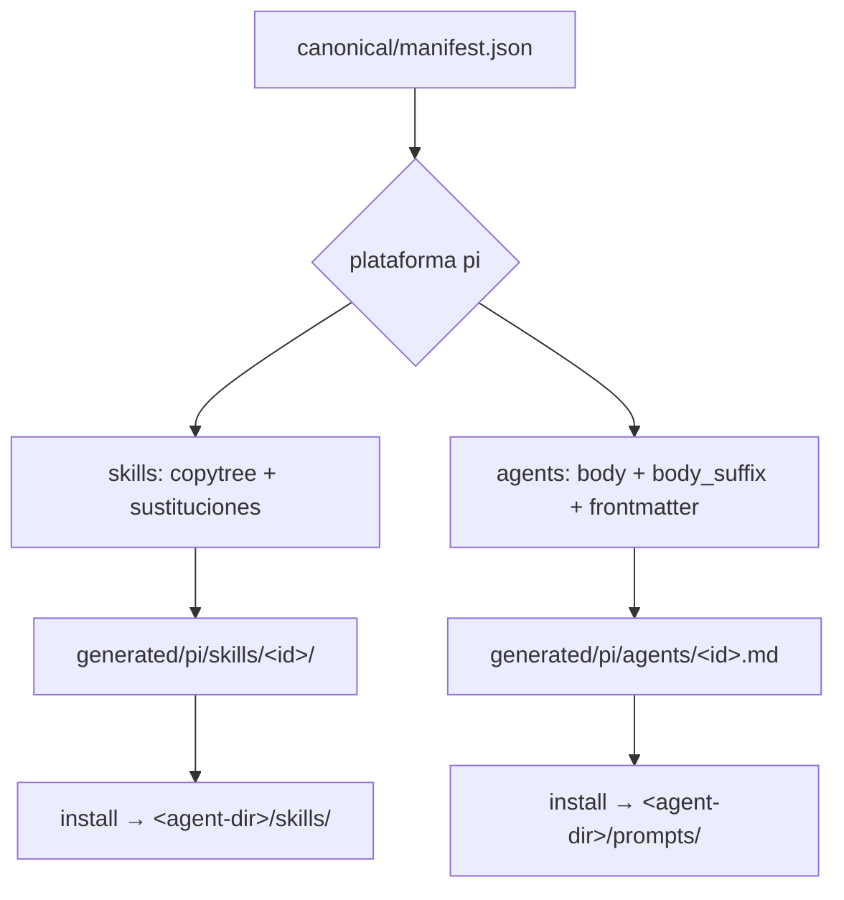
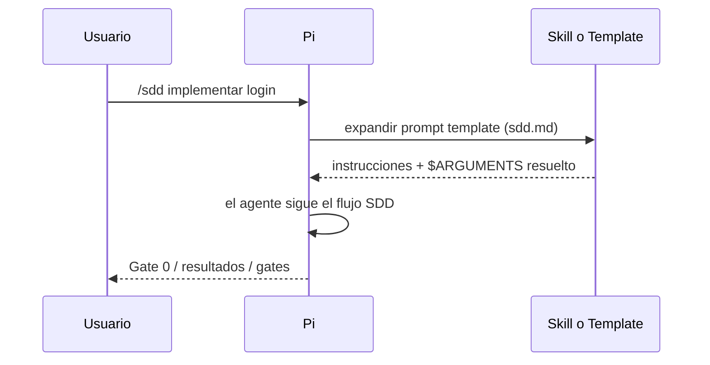

# Diseño: soporte de Pi Agent

- **Modo SDD:** standard
- **Fase:** Design
- **Estado:** aprobado
- **Gate:** Gate 2 — aprobado

## 1. Visión general

Pi se añade como quinta plataforma del pipeline existente
(`canonical` → `adapters` → `generated` → `scripts/install`). Las **skills**
se exportan como Agent Skills nativos; los **agentes** como prompt templates
invocables (`/<id>`). No se necesita código TypeScript ni extensiones Pi.

```text
canonical/ + adapters/pi/  →  render  →  generated/pi/  →  install  →  ~/.pi/agent/
  skills/<id>/SKILL.md         skills/<id>/             skills/<id>/
  agents/<id>.md               agents/<id>.md           prompts/<id>.md
```

La diferencia clave frente a las otras plataformas es que el instalador copia
`generated/pi/agents/` a `<agent-dir>/prompts/` en lugar de a un directorio
`agents/`, porque Pi expone las plantillas Markdown como comandos `/`.

## 2. Modelo de datos

### 2.1 `canonical/manifest.json`

Se añade `"pi"` a la lista `platforms`. No cambian las listas `skills` ni
`agents`.

### 2.2 `adapters/pi/platform.json`

```json
{
  "substitutions": {
    "{{sdd_agent}}": "/sdd",
    "{{gate_instruction}}": "",
    "{{steering_paths}}": "`AGENTS.md`, `CLAUDE.md`, `.pi/APPEND_SYSTEM.md`"
  }
}
```

- `{{sdd_agent}}` → `/sdd`: los agentes de Pi son comandos, no `@menciones`.
- `{{gate_instruction}}` → vacío: Pi no tiene UI de gates.
- `{{steering_paths}}`: Pi carga `AGENTS.md` / `CLAUDE.md` como context files y
  `.pi/APPEND_SYSTEM.md` como instrucciones de proyecto.

### 2.3 `adapters/pi/agents/<id>.json`

Nueve archivos, uno por agente. Campos:

| Campo | Tipo | Descripción |
|-------|------|-------------|
| `filename` | string | Nombre del template: `<id>.md` |
| `frontmatter.description` | string | Descripción visible en autocompletado de Pi |
| `frontmatter.argument-hint` | string | Pista de argumentos para el usuario |
| `body_suffix` | string | Texto añadido tras el cuerpo canónico |

Ejemplo para `sdd.json`:

```json
{
  "filename": "sdd.md",
  "frontmatter": {
    "description": "Agente SDD — Spec-Driven Development con gates y EARS",
    "argument-hint": "<tarea o feature>"
  },
  "body_suffix": "\n\n## Tarea del usuario\n\n$ARGUMENTS\n"
}
```

`$ARGUMENTS` es la sustitución nativa de Pi prompt templates: al invocar
`/sdd implementar login`, Pi reemplaza `$ARGUMENTS` por `implementar login`.

## 3. Cambios en el renderer (`tools/render.py`)

**Un único cambio**: al escribir el archivo del agente, añadir el campo opcional
`body_suffix` después del cuerpo canónico.

```python
# Antes
destination.write_text(frontmatter(adapter["frontmatter"]) + body, encoding="utf-8")

# Después
suffix = adapter.get("body_suffix", "")
destination.write_text(frontmatter(adapter["frontmatter"]) + body + suffix, encoding="utf-8")
```

Las skills se renderizan igual que en las otras plataformas: copia del árbol
completo + sustituciones en `SKILL.md`. Pi descubre las skills recursivamente
desde su directorio, así que la estructura `skills/<id>/SKILL.md` es compatible
sin cambios adicionales.

## 4. Validación (`tools/validate.py`)

Se añade una comprobación específica para Pi, similar a la de Claude
(`user-invocable: false`):

```python
elif platform == "pi":
    suffix = data.get("body_suffix", "")
    if not isinstance(suffix, str) or "$ARGUMENTS" not in suffix:
        errors.append(
            f"Adaptador Pi {adapter.relative_to(ROOT)}: 'body_suffix' debe ser "
            "string y contener '$ARGUMENTS' para recibir la tarea del usuario"
        )
```

Las comprobaciones genéricas (manifest, sustituciones, reproducibilidad,
huérfanos) ya cubren Pi automáticamente porque iteran `manifest["platforms"]`.

## 5. Instalación

### 5.1 `scripts/install/pi.sh` / `pi.ps1`

Sigue el patrón de `opencode.sh`:

| Concepto | Valor |
|----------|-------|
| Skills origen | `generated/pi/skills/` |
| Agents origen | `generated/pi/agents/` |
| Skills destino | `<agent-dir>/skills/` |
| Agents destino | `<agent-dir>/prompts/` |
| Backup raíz | `~/.pi-kit-backup/<timestamp>/` |
| `<agent-dir>` | `$PI_CODING_AGENT_DIR` o `~/.pi/agent` (Windows: `%USERPROFILE%\.pi\agent`) |

El preflight (`tools/install_preflight.py`) se reutiliza sin cambios: recibe
`--skills-dest` y `--agents-dest` como rutas, y las plantillas de Pi se
verifican igual que cualquier otro archivo de agente.

### 5.2 `scripts/backup/pi.sh` / `pi.ps1`

Llama a `tools/import_installed.py pi --skills-dir <agent-dir>/skills
--agents-dir <agent-dir>/prompts`. Copia solo artefactos del manifest a
`imports/pi/<fecha>/`.

## 6. Pruebas

| Test | Cambio |
|------|--------|
| `test_integrity.py` | Añadir `pi` a `essential_dirs` y `test_scripts_exist` |
| `test_install.py` | Añadir entrada `pi` en `PLATFORMS` con rutas relativas correctas |
| `test_validate.py` | Añadir test negativo: `body_suffix` sin `$ARGUMENTS` → error |
| `test_mas_identity.py` | Sin cambios (itera `manifest["platforms"]`) |
| `test_model_recommendations.py` | Sin cambios (itera `manifest["platforms"]`) |
| `test_handoff_contract.py` | Sin cambios (itera `manifest["platforms"]`) |

Ejecución: `python3 tools/render.py && python3 tools/validate.py` y luego los
tests. El smoke manual se documenta en la fase de verificación.

## 7. Invariantes

1. **I1** — La salida Pi no contiene tokens `{{...}}` sin resolver.
2. **I2** — Cada skill del manifest produce un directorio con `SKILL.md` válido
   (frontmatter `name` + `description`).
3. **I3** — Cada agente del manifest produce un prompt template con
   `$ARGUMENTS` en `body_suffix`.
4. **I4** — El instalador Pi nunca borra recursos que no pertenezcan al kit.
5. **I5** — Mismo `canonical/` + `adapters/pi/` ⇒ mismo `generated/pi/`
   (reproducibilidad).

## 8. Flujo de render para Pi



## 9. Secuencia de uso en Pi



## 10. Decisiones y trade-offs

| Decisión | Alternativa descartada | Razón |
|----------|----------------------|-------|
| Prompt templates para agentes | Extensión TypeScript con subagentes | Alcance acordado V1: sin extensión; los handoffs son manuales |
| `body_suffix` en adapter JSON | Token `{{pi_arguments}}` en canonical | Evita contaminar el prompt canónico con sintaxis Pi |
| Copiar agents → `prompts/` | Generar directamente en `generated/pi/prompts/` | Mantiene la estructura `generated/<platform>/{skills,agents}` consistente para preflight y tests |
| `<agent-dir>/prompts/` como destino | `.pi/prompts/` por proyecto | Alcance acordado: instalación global primero |

## 11. Supuestos y riesgos

- **Supuesto:** Pi carga las skills desde `<agent-dir>/skills/` y las plantillas
  desde `<agent-dir>/prompts/` sin configuración adicional. Verificado en la
  documentación oficial de Pi.
- **Riesgo:** Pi podría no aceptar ciertos campos de frontmatter no estándar.
  Mitigación: el frontmatter de Pi usa solo `description` y `argument-hint`,
  ambos documentados.
- **Riesgo:** `$ARGUMENTS` podría no sustituirse si el usuario no proporciona
  argumentos. Mitigación: documentar que los comandos aceptan una tarea como
  argumento; Pi expande `$ARGUMENTS` a cadena vacía si no hay argumentos.
