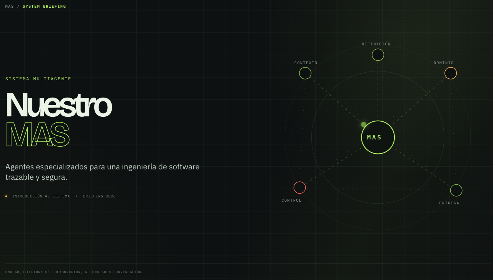

# MAS (Multi-Agent System)



Fuente versionada de **skills** y **agentes** para [GitHub Copilot](https://github.com/features/copilot),
[OpenCode](https://opencode.ai), [Kiro](https://kiro.dev),
[Claude Code](https://code.claude.com/), [Pi](https://pi.dev) y
[Google Antigravity](https://antigravity.google/).

El sistema multiagente de este kit se denomina **MAS** (*Multi-Agent System*).
Consulta la [guía de identidad y terminología](docs/mas.md) para dirigir
comentarios al sistema completo o a un agente concreto.

La lógica se mantiene **una sola vez** en `canonical/` y se renderiza por
plataforma con adaptadores declarativos. Así obtienes el mismo comportamiento
especializado en seis distribuciones, sin duplicar prompts por plataforma.
La integración inicial de Antigravity apunta a **2.0**. Los scripts cuentan con
evidencia de CI en Linux, macOS y Windows: **22/22 pruebas nativas por OS**, con
Python 3.10, en el [run 37510771502](https://github.com/furthurr/ai-agents-kit/actions/runs/37510771502).
El runtime de la aplicación (descubrimiento 6 agentes / 10 skills, UI, referencias e
`invoke_subagent`) sigue **PENDIENTE**. El inventario de distribuciones y las
pruebas con fixtures no certifican soporte completo en los seis hosts.

## Por qué existe

Un agente genérico reexplora el repo, mezcla dominios y pierde contexto entre
sesiones. Este kit aporta:

- **Especialistas con alcance fijo** (navegación, arquitectura, calidad, datos, seguridad, UI, SDD, git/release) y coordinación documental explícita.
- **Procedimientos canónicos** (skills) reutilizables y versionados.
- **Carpetas de contexto en tu proyecto** (`.navigator/`, `.architecture/`, `.quality/`, `.data/`, …) que la IA y el equipo comparten.

Más detalle: [docs/vision.md](docs/vision.md).

## Para quién

Para desarrolladores y equipos que usan asistentes de código y necesitan roles
especializados, contexto persistente del proyecto y cambios trazables. Puedes
instalar una sola plataforma y empezar con el agente del dominio que necesites.
Las carpetas de contexto se mantienen bajo petición y requieren sincronización
cuando cambian las fuentes que documentan.

El kit distribuye instrucciones y herramientas de mantenimiento; sus agentes
operan dentro del host que elijas. La compatibilidad efectiva y los permisos
dependen de ese host y de la evidencia de sus smoke tests.

## Qué incluye

| | Cantidad | Detalle |
|---|----------|---------|
| Skills | 10 | architecture, code-quality, data-api, documentation-orchestrator, git-commit, project-navigator, release-management, sdd-spec, security, ui-design |
| Agentes | 6 | code-review, data-api, documentation-orchestrator, ui-design, sdd, git-release-manager; **Documentation Orchestrator** asume arquitectura y navegación con sus skills separadas |
| Plataformas | 6 | copilot, opencode, kiro, claude, pi, antigravity |

Catálogo completo (roles, carpetas, cuándo usar cada uno):
[docs/catalogo.md](docs/catalogo.md).

## Qué agente elegir

| Necesidad | Agente |
|-----------|--------|
| Entender arquitectura, localizar módulos o actualizar contexto documental | `documentation-orchestrator` |
| Revisar calidad de código o seguridad | `code-review` |
| Trabajar APIs, contratos, DTOs o persistencia | `data-api` |
| Trabajar diseño visual, componentes o tokens | `ui-design` |
| Definir una feature, corregir un bug o implementar con trazabilidad | `sdd` |
| Preparar commits, push o una release | `git-release-manager` |

### SDD proporcional

SDD presenta el alcance funcional completo y espera su validación explícita antes
de generar artefactos o implementar. Para features, estima el esfuerzo y recomienda
una profundidad elegible; elegir solo el modo no valida el alcance.

- **`direct`**: cambio trivial, localizado y reversible; sin spec formal.
- **`lite`**: cambio acotado con garantías verificables; Quick Plan obligatorio
  (`requirements.md`, `design.md`, `tasks.md`) en una pasada, sin Gates 1–4.
- **`standard`**: requisitos, diseño, tareas y verificación con Gates 1–4.

Validar el alcance no aprueba los gates de `standard`; pedir solo planificación
no autoriza implementación. SDD conserva los acuerdos de specs relacionadas y
revalida el alcance completo si cambia. Testing, ejecutor y profundidad se
deciden por separado. Detalle: [guía SDD](docs/agentes/sdd.md) y
[ejemplos de esfuerzo](docs/sdd-effort-examples.md).

## Inicio rápido

Requisitos: **Python 3** y Bash o PowerShell.

```bash
# 1. Generar y validar artefactos
python3 tools/render.py
python3 tools/validate.py

# 2. Instalar la plataforma que uses
./scripts/install/copilot.sh      # → ~/.copilot/
./scripts/install/opencode.sh     # → ~/.config/opencode/
./scripts/install/kiro.sh         # → ~/.kiro/
./scripts/install/claude.sh       # → ~/.claude/
./scripts/install/pi.sh           # → ~/.pi/agent/
./scripts/install/antigravity.sh   # → ~/.gemini/config/{skills,agents}/ (2.0)

# 3. Reinicia la herramienta que uses
```

Windows (PowerShell):

```powershell
python tools/render.py
python tools/validate.py
.\scripts\install\copilot.ps1
.\scripts\install\opencode.ps1
.\scripts\install\kiro.ps1
.\scripts\install\claude.ps1
.\scripts\install\pi.ps1
.\scripts\install\antigravity.ps1
```

Opciones: `--dry-run` / `-DryRun`, `--force` / `-Force`.
Importación segura de instalaciones locales: `scripts/backup/`.

Para actualizar agentes antiguos, revisa la [migración segura opt-in](docs/migracion-agentes.md):
`--migrate-retired-agents` exige respaldo; los archivos personalizados o inciertos
requieren pares repetibles `--approve-retired-file PATH --approve-retired-sha256 SHA`
para ligar la aprobación a ruta exacta y bytes revisados. Los destinos locales
se seleccionan con `--additional-agents-dest RUTA`; OpenCode incluye ambos hermanos
globales `agent/` y `agents/`. No retira skills ni contexto del proyecto.

Guía completa: [docs/instalacion.md](docs/instalacion.md) ·  
Uso diario: [docs/uso.md](docs/uso.md).

## Modelo del repositorio

```text
canonical/     ← edita aquí la lógica común (skills + agentes)
adapters/      ← solo diferencias por herramienta (frontmatter, permisos, tokens)
generated/     ← salida del render (NO editar a mano)
tools/         ← render.py, validate.py, measure_context.py, …
scripts/       ← install/ y backup/ (bash + PowerShell)
docs/          ← documentación ampliada
```

```text
canonical + adapters  →  render  →  generated  →  install  →  tu herramienta
```

## Documentación

| Documento | Contenido |
|-----------|-----------|
| [docs/README.md](docs/README.md) | Índice |
| [docs/vision.md](docs/vision.md) | Problema, principios, skill vs agente |
| [docs/mas.md](docs/mas.md) | Identidad de MAS y convención de mensajes |
| [docs/catalogo.md](docs/catalogo.md) | Skills, agentes y carpetas canónicas |
| [docs/agentes/README.md](docs/agentes/README.md) | Guía interna: qué hace cada agente y cómo utilizarlo |
| [docs/instalacion.md](docs/instalacion.md) | Install, destinos, backup/import |
| [docs/uso.md](docs/uso.md) | Cómo invocar y flujos recomendados |
| [docs/navigator-smoke.md](docs/navigator-smoke.md) | Smoke test reproducible del Project Navigator |
| [docs/documentation-orchestrator-smoke.md](docs/documentation-orchestrator-smoke.md) | Smoke test del orquestador documental y su preflight informativo no bloqueante |
| [docs/sdd-smoke.md](docs/sdd-smoke.md) | Smoke test de alcance completo, continuidad, gates SDD y testing adaptativo |
| [docs/sdd-effort-examples.md](docs/sdd-effort-examples.md) | Rúbrica de esfuerzo y ejemplos de profundidad SDD |
| [docs/code-review-smoke.md](docs/code-review-smoke.md) | Smoke test de revisión de calidad y seguridad |
| [docs/antigravity-smoke.md](docs/antigravity-smoke.md) | Procedimiento Antigravity 2.0; runtime pendiente |
| [docs/desarrollo.md](docs/desarrollo.md) | Contribuir y extender el kit |
| [docs/arquitectura-del-kit.md](docs/arquitectura-del-kit.md) | Pipeline técnico |
| [docs/mejoras.md](docs/mejoras.md) | Backlog priorizado y estado de madurez |

## Contribuir (resumen)

1. Edita `canonical/` y/o `adapters/`.
2. Ejecuta `python3 tools/render.py` y `python3 tools/validate.py`.
3. Revisa `generated/` e instala en dry-run antes de probar en serio.

Nunca commits de secretos. Detalle: [docs/desarrollo.md](docs/desarrollo.md).

## Autor

<a href="https://furthurr.github.io/" target="_blank" rel="noopener noreferrer">Pedro G. V. @furthurr</a>

- **GitHub:** https://github.com/furthurr
- **Email:** pedrogvas@gmail.com

## Licencia

MIT
