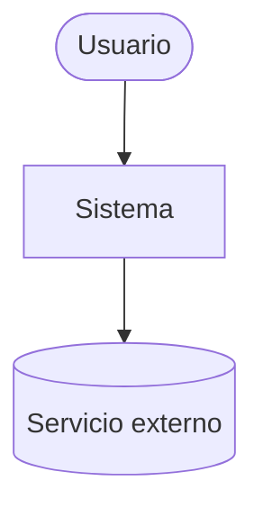

# Referencias — architecture

## Plantillas

### `README.md`
```markdown
# Arquitectura — <Proyecto>

Documentación canónica de la arquitectura. Léela antes de trabajar el proyecto.

## Estado de sincronización
- Tecnología detectada: <...>
- Modo: <lite | full>
- Último commit documentado: `<hash>` (o fecha si no hay git)
- Última actualización: <YYYY-MM-DD>

## Contexto para IA (resumen denso)
- Qué es el sistema: <1-3 frases>
- Estilo/patrón arquitectónico: <p. ej. Clean + modular + MVVM>
- Módulos/capas y sus límites: <...>
- Dónde vive cada cosa: <mapa carpeta→responsabilidad>
- Decisiones clave: <enlaces a ADRs>
- Reglas de dependencia: <quién puede depender de quién>

## Índice
<enlaces a las secciones o, en lite, contenido inline>
```

### Diagrama C4 Contexto (Mermaid)
````markdown

````

### ADR — `decisions/0001-titulo.md`
```markdown
# ADR 0001: <título de la decisión>

- Estado: Propuesta | Aceptada | Supersedida por ADR-XXXX
- Fecha: <YYYY-MM-DD>

## Contexto
<qué problema/fuerzas motivan la decisión>

## Decisión
<lo que se decide hacer>

## Alternativas consideradas
- <opción A> — por qué no
- <opción B> — por qué no

## Consecuencias
- Positivas: <...>
- Negativas / trade-offs: <...>
```

### `arch-tech-debt.md`
```markdown
# Deuda técnica de arquitectura

Ordenada de mayor a menor severidad. Trabaja de arriba hacia abajo.

## 🔴 Crítica
| # | Hallazgo | Ubicación (archivo:línea) | Impacto | Esfuerzo | Recomendación |
|---|----------|---------------------------|---------|----------|---------------|

## 🟠 Alta
| # | Hallazgo | Ubicación | Impacto | Esfuerzo | Recomendación |
|---|----------|-----------|---------|----------|---------------|

## 🟡 Media
| # | Hallazgo | Ubicación | Impacto | Esfuerzo | Recomendación |
|---|----------|-----------|---------|----------|---------------|

## 🟢 Baja
| # | Hallazgo | Ubicación | Impacto | Esfuerzo | Recomendación |
|---|----------|-----------|---------|----------|---------------|
```

## Criterios para clasificar deuda técnica

- **🔴 Crítica:** dependencias cíclicas entre módulos, violación de límites de
  capa (p. ej. UI accede directo a datos/red), acoplamiento que bloquea cambios,
  puntos únicos de fallo, secretos en el código.
- **🟠 Alta:** capas difusas, God-objects/módulos, lógica duplicada entre
  módulos, ausencia de inversión de dependencias donde hace falta.
- **🟡 Media:** inconsistencias de patrón entre features, nombres/paquetes poco
  claros, decisiones sin ADR.
- **🟢 Baja:** mejoras menores de organización, documentación faltante.

Cada hallazgo indica **impacto** y **esfuerzo** estimado.

