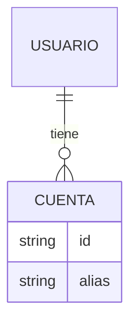

# Referencias — data-api

## Plantillas

### `README.md`
```markdown
# Datos & API — <Proyecto>

Documentación canónica de la capa de datos/APIs. Léela antes de tocar datos.

## Estado de sincronización
- Tecnología detectada: <...>
- Modo: <lite | full>
- ¿BD interna?: <sí (motor) | no>
- Último commit documentado: `<hash>` (o fecha si no hay git)
- Última actualización: <YYYY-MM-DD>

## Contexto para IA (resumen denso)
- Qué consume/expone: <APIs y su propósito, en 1-3 frases>
- Auth: <tipo de token / esquema>
- Modelos/DTOs clave: <...>
- Fuentes de datos: <red, BD interna, caché, DataStore…>
- Convenciones: <errores/estados, paginación, timeouts, reintentos, versionado>
- Campos sensibles/PII: <existencia y dónde; sin valores>

## Índice
<enlaces a las secciones o, en lite, contenido inline>
```

### Endpoint (catálogo)
```markdown
### <Nombre> — `<MÉTODO> {baseUrl}/ruta`
- Propósito: <...>
- Auth: <tipo de token / ninguno>
- Request: <params / body> (campos, tipos, requeridos)
- Response 200: <modelo/DTO> — enlace a modelo
- Errores: 400 <...> · 401 <...> · 404 <...> · timeout <...>
- Fuente de verdad: `archivo:línea`
```

### Modelo / DTO
```markdown
### <Modelo>
| Campo | Tipo | Requerido | Sensible/PII | Notas |
|-------|------|-----------|--------------|-------|
Fuente de verdad: `archivo:línea`
```

### Diagrama ER (Mermaid, solo si hay BD interna)
````markdown

````

### Campos sensibles / PII
```markdown
| Campo | Dónde aparece | Sensibilidad | Cifrado | Almacenamiento | Notas |
|-------|---------------|--------------|---------|----------------|-------|
```
> Documenta la existencia; **nunca** transcribas valores, tokens ni certificados.

### `data-tech-debt.md`
```markdown
# Deuda técnica de datos/APIs

Ordenada de mayor a menor severidad. Trabaja de arriba hacia abajo.

## 🔴 Crítica
| # | Hallazgo | Ubicación (archivo:línea) | Impacto | Esfuerzo | Recomendación |
|---|----------|---------------------------|---------|----------|---------------|

## 🟠 Alta
| # | Hallazgo | Ubicación | Impacto | Esfuerzo | Recomendación |
|---|----------|-----------|---------|----------|---------------|

## 🟡 Media
| # | Hallazgo | Ubicación | Impacto | Esfuerzo | Recomendación |
|---|----------|-----------|---------|----------|---------------|

## 🟢 Baja
| # | Hallazgo | Ubicación | Impacto | Esfuerzo | Recomendación |
|---|----------|-----------|---------|----------|---------------|
```

## Criterios para clasificar deuda técnica

- **🔴 Crítica:** secretos/tokens/dominios reales en el código; PII sin cifrar o
  logueada; ausencia de manejo de errores/timeouts en red; deserialización
  insegura; falta de validación en límites del sistema.
- **🟠 Alta:** DTOs acoplados a la UI, modelos sin mapeo a dominio, respuestas sin
  tipado, endpoints hardcodeados, sin manejo de nulos/opcionales.
- **🟡 Media:** convenciones inconsistentes (paginación, nombres), versionado de
  API poco claro, contratos sin documentar.
- **🟢 Baja:** documentación faltante, oportunidades menores de refactor.

Cada hallazgo indica **impacto** y **esfuerzo** estimado.

