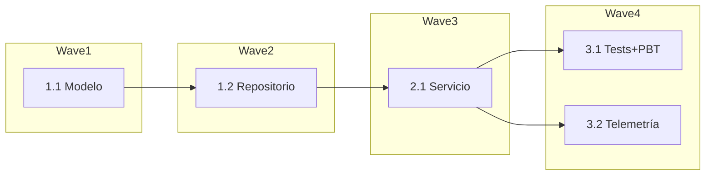

# Plantillas SDD

## requirements.md

```markdown
# Requisitos — <feature>

## Historia 1: <título>
Como <rol> quiero <objetivo> para <beneficio>.

### Criterios (EARS)
- Req 1.1: CUANDO <condición> EL SISTEMA DEBERÁ <comportamiento>
- Req 1.2: SI <error> ENTONCES EL SISTEMA DEBERÁ <manejo>

## Supuestos
- <supuesto explícito>
```

## tasks.md (con trazabilidad y waves)

```markdown
# Tareas — <feature>

- [ ] 1.1 Crear modelo de datos (Req 1.1)
- [ ] 1.2 [P] Implementar repositorio (Req 1.1)
- [ ] 2.1 Servicio de dominio (Req 1.1, 1.2)
- [ ] 3.1 [P] Tests unitarios + PBT (Req 1.1, 1.2)
- [ ] 3.2 [opcional] Telemetría
```

## Grafo de waves

Las **waves** agrupan tareas paralelas (`[P]`). Cada wave espera a la anterior.



## verification.md

```markdown
# Verificación — <feature>

| Requisito | Tarea(s) | Test(s) | Estado |
|-----------|----------|---------|--------|
| Req 1.1   | 1.1, 1.2 | `NombreTest` | ✅ Cubierto |
| Req 1.2   | 2.1      | `NombreTest` | ✅ Cubierto |
```

## bugfix.md

```markdown
# Bugfix — <descripción breve>

## Comportamiento actual (defecto)
- CUANDO <condición> EL SISTEMA <comportamiento incorrecto>

## Comportamiento esperado
- CUANDO <condición> EL SISTEMA DEBERÁ <comportamiento correcto>

## Comportamiento inalterado (anti-regresión)
- EL SISTEMA DEBERÁ SEGUIR <comportamiento que no debe cambiar>

## Supuestos
- <supuesto explícito>
```
