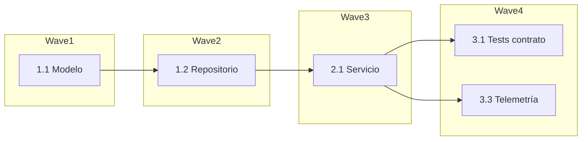

# Plantillas SDD

## requirements.md

```markdown
# Requisitos — <feature>

Modo SDD: standard
Fase: Requirements
Estado: en progreso
Gate 1: pendiente

## Historia 1: <título>
Como <rol> quiero <objetivo> para <beneficio>.

### Criterios (EARS)
- Req 1.1: CUANDO <condición> EL SISTEMA DEBERÁ <comportamiento>
- Req 1.2: SI <error> ENTONCES EL SISTEMA DEBERÁ <manejo>

## Supuestos
- <supuesto explícito>
```

## design.md (standard)

```markdown
# Diseño — <feature>

Modo SDD: standard
Fase: Design
Estado: en progreso
Gate 2: pendiente

## Contexto y supuestos
## Arquitectura (capas)
## Componentes / módulos
## Modelo de datos (si aplica)
## Errores
## Requisitos no funcionales (RNF)
- RNF-1: <medible y verificable; se audita en Fase 4>
## Estrategia de pruebas
- Nivel: <sin test nuevo | caracterización/regresión | TDD focalizado | TDD estricto>
- Justificación / excepción: <por qué>
## Invariantes críticos (0–5, opcionales)
## Excepciones al quality-bar (si las hay)
## Diagramas (flowchart + sequence)
```

## Artefactos lite

Quick Plan usa estas versiones compactas en una pasada. El marcador de modo es
obligatorio y una petición de solo planificación no crea evidencia de implementación.

### requirements.md (lite)

```markdown
# Requisitos — <feature>

Modo SDD: lite

## Historia 1: <título>
Como <rol> quiero <objetivo> para <beneficio>.

### Criterios (EARS)
- Req 1.1: CUANDO <condición> EL SISTEMA DEBERÁ <comportamiento>
```

### design.md (lite)

```markdown
# Diseño — <feature>

Modo SDD: lite

## Contexto y alcance
## Solución acotada
## Errores y límites
## Estrategia de pruebas
- Nivel: <nivel>
- Justificación / excepción: <por qué>
```

### tasks.md (lite)

```markdown
# Tareas — <feature>

Modo SDD: lite
Fase: Quick Plan
Estado: en progreso

- [ ] 1.1 [TDD focalizado] RED → GREEN mínimo → REFACTOR si aporta valor (Req 1.1)
```

## tasks.md (con trazabilidad y waves)

```markdown
# Tareas — <feature>

Modo SDD: standard
Fase: Tasks
Estado: pendiente de Gate 3
Gate 3: pendiente

- [ ] 1.1 Crear modelo de datos (Req 1.1)
- [ ] 1.2 [P] Implementar repositorio (Req 1.1)
- [ ] 2.1 [TDD focalizado] Servicio de dominio: RED del comportamiento → GREEN mínimo → REFACTOR si aporta valor (Req 1.1, 1.2)
- [ ] 3.1 [P] Tests complementarios de integración/contrato (Req 1.1, 1.2)
- [ ] 3.2 [opcional] PBT de invariantes algebraicos (Req 1.1)
- [ ] 3.3 [opcional] Telemetría
- [omitido: PBT no aplica; sin invariante algebraico]
```

## Grafo de waves

Las **waves** agrupan tareas paralelas (`[P]`). Cada wave espera a la anterior.


```mermaid
flowchart LR
    subgraph Wave1
      T11[1.1 Modelo]
    end
    subgraph Wave2
      T12[1.2 Repositorio]
    end
    subgraph Wave3
      T21[2.1 Servicio]
    end
    subgraph Wave4
      T31[3.1 Tests contrato]
      T32[3.3 Telemetría]
    end
    T11 --> T12 --> T21 --> T31
    T21 --> T32
```

## verification.md

```markdown
# Verificación — <feature>

Modo SDD: standard
Fase: Verification
Estado: en progreso
Gate 4: pendiente

## Ciclo de pruebas
- Estrategia: <nivel>
- RED o baseline: <test/comando + resultado observado>
- GREEN / suite: <comando + resultado>
- Excepciones: <ninguna o razón>

| Requisito | Tarea(s) | Test(s) | Evidencia (path o cmd) | Estado |
|-----------|----------|---------|------------------------|--------|
| Req 1.1   | 1.1, 1.2 | `NombreTest` | `src/...` / `npm test` | ✅ |
| Req 1.2   | 2.1      | `NombreTest` | `tests/...` | ✅ |

## Self-check RNF (3–5 críticos del spec)
Los RNF salen de la sección homónima de `design.md`. Si no están declarados allí,
no los inventes en esta fase: decláralo como hueco.

| RNF | Evidencia (búsqueda / path) | Estado |
|-----|----------------------------|--------|
| RNF-1 persistencia encapsulada | `rg "localStorage" src/ui` → 0 en UI | ✅/❌ |
| RNF-2 errores tipados | path del Result/error type | ✅/❌ |
```

## verification.md (lite)

Solo se crea después de implementar; no abre Fase 4 ni Gate 4.

```markdown
# Verificación — <feature>

Modo SDD: lite

## Ciclo de pruebas
- Estrategia: <nivel>
- RED o baseline: <comando + resultado observado>
- GREEN: <comando + resultado>
- Suite final: <comando + resultado>
- Excepciones: <ninguna o razón>

| Requisito | Tarea | Test/check | Evidencia (path o cmd) | Estado |
|-----------|-------|------------|--------------------------|--------|
| Req 1.1 | 1.1 | `NombreTest` | `tests/...` / `cmd` | ✅ |
```

## bugfix.md

```markdown
# Bugfix — <descripción breve>

Modo SDD: standard
Fase: Requirements
Estado: en progreso
Gate 1: pendiente

## Comportamiento actual (defecto)
- CUANDO <condición> EL SISTEMA <comportamiento incorrecto>

## Comportamiento esperado
- CUANDO <condición> EL SISTEMA DEBERÁ <comportamiento correcto>

## Comportamiento inalterado (anti-regresión)
- EL SISTEMA DEBERÁ SEGUIR <comportamiento que no debe cambiar>

## Supuestos
- <supuesto explícito>
```
