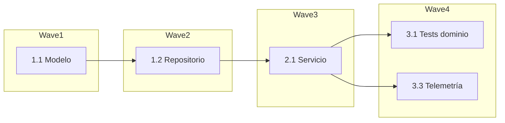

# Plantillas SDD

## requirements.md

```markdown
# Requisitos — <feature>

## Historia 1: <título>
Como <rol> quiero <objetivo> para <beneficio>.

### Criterios (EARS)
- Req 1.1: CUANDO <condición> EL SISTEMA DEBERÁ <comportamiento>
- Req 1.2: SI <error> ENTONCES EL SISTEMA DEBERÁ <manejo>

## Supuestos
- <supuesto explícito>
```

## design.md (standard)

```markdown
# Diseño — <feature>

## Contexto y supuestos
## Arquitectura (capas)
## Componentes / módulos
## Modelo de datos (si aplica)
## Errores
## Estrategia de pruebas
## Invariantes críticos (0–5, opcionales)
## Excepciones al quality-bar (si las hay)
## Diagramas (flowchart + sequence)
```

## tasks.md (con trazabilidad y waves)

```markdown
# Tareas — <feature>

- [ ] 1.1 Crear modelo de datos (Req 1.1)
- [ ] 1.2 [P] Implementar repositorio (Req 1.1)
- [ ] 2.1 Servicio de dominio (Req 1.1, 1.2)
- [ ] 3.1 [P] Tests unitarios de dominio (Req 1.1, 1.2)
- [ ] 3.2 [opcional] PBT de invariantes algebraicos (Req 1.1)
- [ ] 3.3 [opcional] Telemetría
- [omitido: PBT no aplica; sin invariante algebraico]
```

## Grafo de waves

Las **waves** agrupan tareas paralelas (`[P]`). Cada wave espera a la anterior.


```mermaid
flowchart LR
    subgraph Wave1
      T11[1.1 Modelo]
    end
    subgraph Wave2
      T12[1.2 Repositorio]
    end
    subgraph Wave3
      T21[2.1 Servicio]
    end
    subgraph Wave4
      T31[3.1 Tests dominio]
      T32[3.3 Telemetría]
    end
    T11 --> T12 --> T21 --> T31
    T21 --> T32
```

## verification.md

```markdown
# Verificación — <feature>

| Requisito | Tarea(s) | Test(s) | Evidencia (path o cmd) | Estado |
|-----------|----------|---------|------------------------|--------|
| Req 1.1   | 1.1, 1.2 | `NombreTest` | `src/...` / `npm test` | ✅ |
| Req 1.2   | 2.1      | `NombreTest` | `tests/...` | ✅ |

## Self-check RNF (3–5 críticos del spec)

| RNF | Evidencia (búsqueda / path) | Estado |
|-----|----------------------------|--------|
| RNF-x persistencia encapsulada | `rg "localStorage" src/ui` → 0 en UI | ✅/❌ |
| RNF-y errores tipados | path del Result/error type | ✅/❌ |
```

## bugfix.md

```markdown
# Bugfix — <descripción breve>

## Comportamiento actual (defecto)
- CUANDO <condición> EL SISTEMA <comportamiento incorrecto>

## Comportamiento esperado
- CUANDO <condición> EL SISTEMA DEBERÁ <comportamiento correcto>

## Comportamiento inalterado (anti-regresión)
- EL SISTEMA DEBERÁ SEGUIR <comportamiento que no debe cambiar>

## Supuestos
- <supuesto explícito>
```
