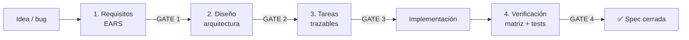
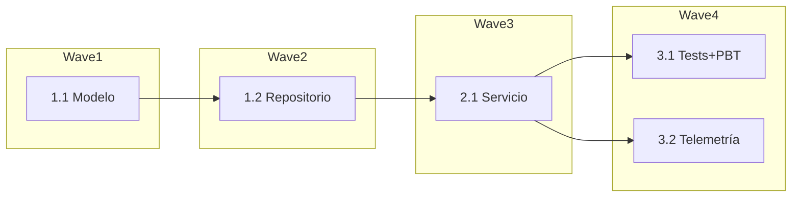

# Skill: SDD Spec (Spec-Driven Development)

Esta skill encapsula el **flujo de 4 fases** del SDD para producir
especificaciones de alta calidad y trazables. Complementa al agente @sdd y funciona con cualquier agente de opencode.

> **Fuente única de verdad:** esta skill es la referencia canónica de la notación
> EARS (incl. sus extensiones propias) y de las reglas de calidad. Si el agente
> `@sdd` y esta skill divergen, **manda esta skill**.

## Inicio rápido

**¿Qué es SDD?** Es una forma de construir software donde *primero se acuerda el
QUÉ y el PORQUÉ* (requisitos y diseño) y *solo después el CÓMO* (código). Avanzas
en 4 fases y en cada una pides aprobación antes de continuar (gates). Así evitas
retrabajo, dejas todo trazable y mantienes al humano al mando.

### Flujo de un vistazo



### Cómo empezar en 4 pasos

1. **Lanza el flujo.** Selecciona el agente `@sdd` (o deja que opencode cargue
    esta skill por relevancia) y describe
   tu feature/bug en una frase. Ej.: *"Quiero login con biometría"*.
2. **Aprueba por fases.** La skill te muestra un resumen y se detiene en cada gate.
   Responde *"apruebo"* o pide cambios (*"cambia el Req 2"*). Nada avanza sin tu sí.
3. **Implementa por tareas.** Tras aprobar `tasks.md`, se ejecutan una a una (o en
   waves), actualizando su estado y corriendo los tests.
4. **Cierra con verificación.** En la Fase 4 revisas la matriz Requisito→Tarea→Test
   y das la spec por cerrada solo si todo está cubierto.

### Frases para empezar

| Si quieres… | Escribe algo como… |
|-------------|--------------------|
| Una feature nueva | *"SDD: quiero <feature>"* |
| Corregir un bug | *"SDD bugfix: <descripción del defecto>"* |
| Ir rápido sin gates | *"SDD quick plan: <feature bien entendida>"* |
| Continuar una spec | *"Continúa la spec de `<nombre-feature>`"* |

> Consejo: si es tu primera vez, empieza con una feature pequeña para ver los 4
> gates en acción antes de aplicarlo a algo grande.

## Cuándo usar esta skill

- Planificar una **feature** nueva de forma estructurada.
- Escribir **requisitos** en notación EARS.
- Diseñar **arquitectura** a partir de requisitos.
- Desglosar el diseño en **tareas** trazables.
- Corregir un **bug** con prevención de regresiones (bugfix).

## Estructura de una spec

Crea los artefactos en `.sdd/specs/<nombre-feature>/`:

| Archivo | Fase | Contenido |
|---------|------|-----------|
| `requirements.md` (o `bugfix.md`) | 1 | Historias + criterios EARS |
| `design.md` | 2 | Arquitectura, modelos, diagramas, pruebas |
| `tasks.md` | 3 | Tareas discretas, trazadas y secuenciadas |
| `verification.md` | 4 | Matriz de trazabilidad + cierre |

## Flujo con gates (regla central)

> **No avances de fase sin la aprobación explícita del usuario.** El gate se
> implementa de forma natural: **termina tu turno con la pregunta y espera** la respuesta del
> usuario. Excepción: Quick Plan (sin gates).

### Fase 1 — Requirements
1. Lee el steering si existe (`AGENTS.md`, `.sdd/steering/*.md`). Detecta
   primero el dominio de la petición y lee, **best-effort**, solo su `README.md`
   de contexto (`.architecture/`, `.design/`, `.data/`, `.security/` o
   `.quality/`). Abre documentos adicionales únicamente si el requisito los
   necesita. Si falta la carpeta **del dominio** que toca la feature, recomienda
   cambiar al agente especialista; si el usuario sigue en SDD, no la crees y
   captura lo imprescindible solo en el `design.md`.
2. Descompón en historias de usuario.
3. Criterios en **EARS**:
   - `CUANDO <condición> EL SISTEMA DEBERÁ <comportamiento>`
   - `SI <error> ENTONCES EL SISTEMA DEBERÁ <manejo>`
   - `MIENTRAS <estado> EL SISTEMA DEBERÁ <comportamiento>`
   - `EL SISTEMA DEBERÁ <siempre activo>`
4. Cubre edge cases y errores; declara supuestos.
5. **GATE 1**: "¿Apruebas los requisitos o quieres iterarlos?"

### Fase 2 — Design
1. Lee el código existente (búsqueda en el codebase) y el steering (stack, estructura).
   Reutiliza lo ya documentado en `.architecture/`, `.design/` y `.data/` cuando
   el requisito toque ese dominio, en vez de reinventarlo.
2. Arquitectura, componentes, modelos de datos, interfaces/endpoints.
3. Diagramas Mermaid (flowchart + sequence), manejo de errores, estrategia de
   pruebas.
4. Deriva **propiedades** (PBT) desde los requisitos EARS.
5. **GATE 2**: "¿Apruebas el diseño o quieres ajustarlo?"

### Fase 3 — Tasks
1. Tareas discretas, numeradas, **trazadas a requisitos** `(Req X)`.
2. Secuencia por dependencias; marca `[P]` y `[opcional]`.
3. Incluye grafo de **waves**.
4. **GATE 3**: "¿Apruebo el plan y empiezo a implementar?"

### Implementación
- Una tarea a la vez o "todas" en waves.
- Actualiza estados en `tasks.md` (`[ ]` → 🔵 → `[x]`).
- Escribe tests (incl. PBT cuando apliquen); corrige fallos antes de seguir.
- Si la carpeta canónica del dominio **ya existe** y creas algo
  **relevante/reutilizable** (componente, DTO, endpoint…), documéntalo ahí
  cargando la skill del especialista (`ui-design`, `data-api`, …) y su formato,
  para que no se desactualice. Omite lo trivial; nunca escribas secretos.

### Fase 4 — Verificación y cierre
Prerrequisito: todas las tareas en `[x]`.
1. Ejecuta la suite completa de tests y confirma que pasa.
2. Construye `verification.md` con la **matriz de trazabilidad**:

   | Requisito | Tarea(s) | Test(s) | Estado |
   |-----------|----------|---------|--------|
   | Req 1     | 1.1, 1.2 | `NombreTest` | ✅ Cubierto |

3. Marca huecos (requisitos sin tarea/test) y propón acción.
4. **GATE 4**: "¿Cierro la spec o cubrimos los huecos pendientes?" No cierres
   con requisitos sin cubrir.

## Variante Bugfix

`bugfix.md` con tres bloques EARS:
- Actual (defecto): `CUANDO <...> EL SISTEMA <incorrecto>`
- Esperado: `CUANDO <...> EL SISTEMA DEBERÁ <correcto>`
- Inalterado: `CUANDO <...> EL SISTEMA DEBERÁ SEGUIR <...>`

Diseño con causa raíz + propiedades (confirma bug, valida fix, previene
regresión). Tareas con tests basados en propiedades.

## Variante Quick Plan

Genera los 3 artefactos (requirements, design, tasks) en una pasada **sin gates**,
tras hacer las preguntas aclaratorias por adelantado y **omitiendo la Fase 4 de
verificación**. Úsala solo en features bien entendidas.

## Pruebas y PBT (property-based testing)

El **stack concreto de pruebas lo define el steering** del proyecto; úsalo
siempre que exista. Si el steering no lo especifica, aplica estos valores por
defecto según la tecnología detectada:

| Tecnología | Unitarias | PBT | Async / otros |
|------------|-----------|-----|----------------|
| Android / Kotlin | JUnit + MockK | Kotest (`property`) | Turbine (Flows), Compose UI Test |
| Backend JVM | JUnit 5 | jqwik / Kotest | — |
| JS / TS | Jest / Vitest | fast-check | — |

- Deriva las **propiedades** desde los requisitos EARS (una propiedad por
  comportamiento invariante).
- Si el proyecto no tiene aún soporte de PBT, propón añadir la dependencia como
  primera tarea antes de escribir las propiedades.

## Notación EARS — referencia rápida

| Patrón | Forma | Origen |
|--------|-------|--------|
| Ubicuo | `EL SISTEMA DEBERÁ <r>` | EARS estándar |
| Evento | `CUANDO <t> EL SISTEMA DEBERÁ <r>` | EARS estándar |
| Estado | `MIENTRAS <s> EL SISTEMA DEBERÁ <r>` | EARS estándar |
| Error | `SI <c> ENTONCES EL SISTEMA DEBERÁ <r>` | EARS estándar |
| Opcional | `DONDE <f> EL SISTEMA DEBERÁ <r>` | EARS estándar |
| Anti-regresión | `EL SISTEMA DEBERÁ SEGUIR <r>` | **Extensión propia** |

> **Extensiones propias (no EARS canónico):**
> 1. Los criterios se escriben en **español** (traducción de las palabras clave:
>    WHEN→CUANDO, WHILE→MIENTRAS, IF/THEN→SI/ENTONCES, WHERE→DONDE,
>    SHALL→DEBERÁ). El EARS formal es en inglés; esta localización es una
>    convención propia y no es compatible con linters de EARS en inglés.
> 2. El patrón **Anti-regresión** (`EL SISTEMA DEBERÁ SEGUIR <r>`) no existe en
>    EARS estándar; se añade para la variante Bugfix como garantía de no
>    regresión.

## Reglas de calidad

- **Proporcionalidad:** si la tarea es trivial (cambiar un icono, color, texto,
  renombrar), hazla directa sin las 4 fases ni recomendar crear carpetas; para UI
  pura, el UI Design Agent puede ser más directo.
- Un requisito = un comportamiento **testable**. Sin "rápido/fácil/robusto".
- Sujeto siempre **"EL SISTEMA"**.
- Detalles de implementación → en `design.md`, no en `requirements.md`.
- Cada requisito debe tener **≥1 tarea** que lo cubra.
- Respeta el **steering** (stack y estructura del proyecto).
- No cierres la spec (Fase 4) hasta que cada requisito tenga tarea y test.

## Ejemplos

### Plantilla mínima de spec

`requirements.md`
```markdown
# Requisitos — <feature>

## Historia 1: <título>
Como <rol> quiero <objetivo> para <beneficio>.

### Criterios (EARS)
- Req 1.1: CUANDO <condición> EL SISTEMA DEBERÁ <comportamiento>
- Req 1.2: SI <error> ENTONCES EL SISTEMA DEBERÁ <manejo>

## Supuestos
- <supuesto explícito>
```

`tasks.md` (con trazabilidad y waves)
```markdown
# Tareas — <feature>

- [ ] 1.1 Crear modelo de datos (Req 1.1)
- [ ] 1.2 [P] Implementar repositorio (Req 1.1)
- [ ] 2.1 Servicio de dominio (Req 1.1, 1.2)
- [ ] 3.1 [P] Tests unitarios + PBT (Req 1.1, 1.2)
- [ ] 3.2 [opcional] Telemetría
```

### Grafo de waves

Las **waves** agrupan tareas que pueden ejecutarse en paralelo (`[P]`) una vez
resueltas sus dependencias. Cada wave espera a que termine la anterior.


